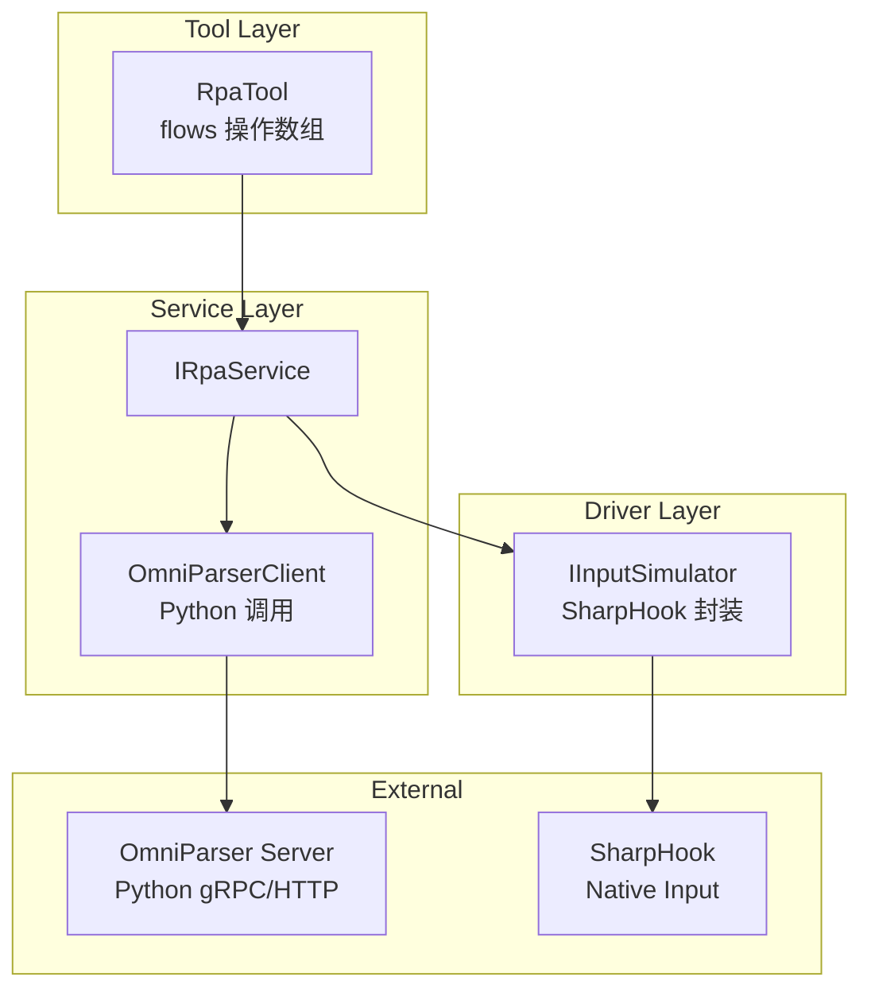
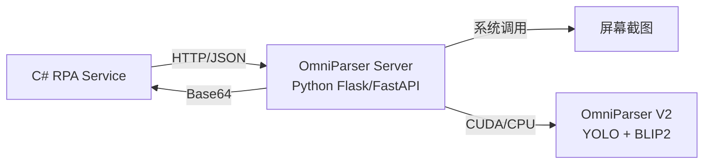
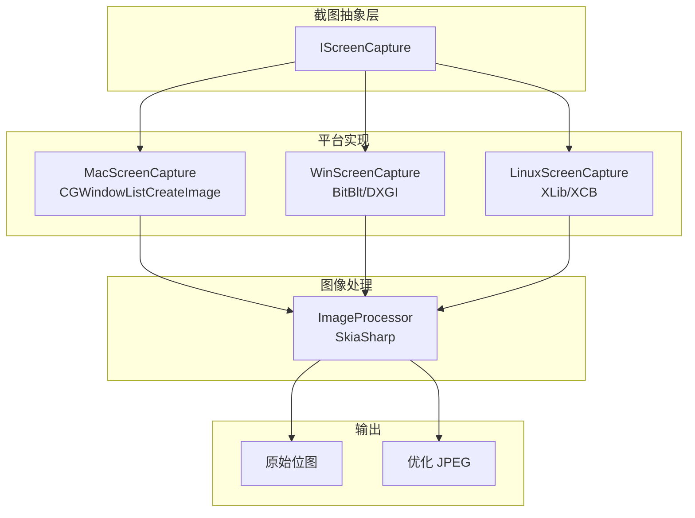
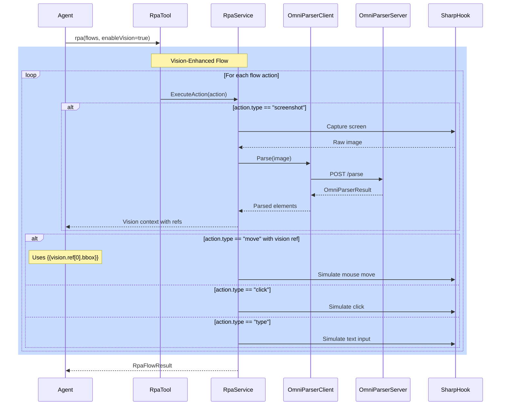

# RPA Tool 设计方案

## 概述

设计一个 `rpa` 工具，支持接收操作流程数组（`flows`），结合 OmniParser 解析结果执行桌面自动化任务。

## 核心架构




## 数据模型

### 1. 操作类型枚举

```csharp
namespace NanoBot.Core.Tools.Rpa;

public enum RpaActionType
{
    Move,           // 移动鼠标
    Click,          // 点击（默认左键）
    DoubleClick,    // 双击
    RightClick,     // 右键
    Drag,           // 拖拽
    Type,           // 输入文本
    Press,          // 按键
    Hotkey,         // 组合键
    Wait,           // 等待
    Screenshot,     // 截图（用于 OmniParser 分析）
    Scroll          // 滚轮滚动
}
```

### 2. 操作单元

```csharp
namespace NanoBot.Core.Tools.Rpa;

public abstract class RpaAction
{
    public RpaActionType Type { get; init; }
    public int? DelayAfterMs { get; init; }  // 执行后延迟
}

public class MoveAction : RpaAction
{
    public int X { get; init; }
    public int Y { get; init; }
    public int? DurationMs { get; init; }  // 移动动画时长
}

public class ClickAction : RpaAction
{
    public int? X { get; init; }           // 空则当前鼠标位置
    public int? Y { get; init; }
    public MouseButton Button { get; init; } = MouseButton.Left;
}

public class TypeAction : RpaAction
{
    public string Text { get; init; }      // 支持 UTF-16/emoji
}

public class PressAction : RpaAction
{
    public KeyCode Key { get; init; }      // 按键码
}

public class HotkeyAction : RpaAction
{
    public KeyCode[] Keys { get; init; }   // 组合键
}

public class WaitAction : RpaAction
{
    public int DurationMs { get; init; }
}

public class ScreenshotAction : RpaAction
{
    public string OutputRef { get; init; } // 输出引用名
}

public class DragAction : RpaAction
{
    public int FromX { get; init; }
    public int FromY { get; init; }
    public int ToX { get; init; }
    public int ToY { get; init; }
    public int? DurationMs { get; init; }
}

public class ScrollAction : RpaAction
{
    public int DeltaX { get; init; }
    public int DeltaY { get; init; }
}
```

### 3. 操作流程请求

```csharp
namespace NanoBot.Core.Tools.Rpa;

public class RpaFlowRequest
{
    /// <summary>操作流程数组</summary>
    public RpaAction[] Flows { get; init; } = [];
    
    /// <summary>是否启用 OmniParser 分析</summary>
    public bool EnableVision { get; init; }
    
    /// <summary>截图保存路径（调试用）</summary>
    public string? ScreenshotPath { get; init; }
}

public class RpaFlowResult
{
    public bool Success { get; init; }
    public string? Error { get; init; }
    public int CompletedSteps { get; init; }
    public Dictionary<string, string>? VisionResults { get; init; }  // OmniParser 结果
}
```

## 接口设计

### IRpaService

```csharp
namespace NanoBot.Core.Tools.Rpa;

public interface IRpaService
{
    /// <summary>执行操作流程</summary>
    Task<RpaFlowResult> ExecuteFlowAsync(RpaFlowRequest request, CancellationToken ct = default);
    
    /// <summary>执行单个操作</summary>
    Task ExecuteActionAsync(RpaAction action, CancellationToken ct = default);
    
    /// <summary>获取屏幕尺寸</summary>
    Task<(int Width, int Height)> GetScreenSizeAsync();
    
    /// <summary>获取当前鼠标位置</summary>
    Task<(int X, int Y)> GetCursorPositionAsync();
    
    /// <summary>截图并调用 OmniParser 分析</summary>
    Task<OmniParserResult> AnalyzeScreenAsync(CancellationToken ct = default);
}
```

### IInputSimulator

```csharp
namespace NanoBot.Core.Tools.Rpa;

public interface IInputSimulator
{
    Task MoveMouseAsync(int x, int y, int? durationMs = null);
    Task ClickAsync(MouseButton button = MouseButton.Left);
    Task DoubleClickAsync(MouseButton button = MouseButton.Left);
    Task RightClickAsync();
    Task DragAsync(int fromX, int fromY, int toX, int toY, int? durationMs = null);
    Task TypeTextAsync(string text);
    Task PressKeyAsync(KeyCode key);
    Task PressHotkeyAsync(params KeyCode[] keys);
    Task ScrollAsync(int deltaX, int deltaY);
}

public enum MouseButton
{
    Left, Middle, Right
}

public enum KeyCode
{
    Enter, Escape, Tab, Backspace,
    Ctrl, Alt, Shift, Win,
    A, B, C, /* ... Z */,
    F1, F2, /* ... F12 */,
    // ...
}
```

## 工具定义

### RpaTool 签名

```csharp
namespace NanoBot.Tools.BuiltIn;

// 工具名: rpa
// 参数: flows (操作数组)
AITool CreateRpaTool(IRpaService rpaService);
```

### LLM 调用示例

```json
{
  "tool": "rpa",
  "arguments": {
    "flows": [
      { "type": "move", "x": 100, "y": 200, "delayAfterMs": 100 },
      { "type": "click" },
      { "type": "wait", "durationMs": 500 },
      { "type": "type", "text": "Hello World" },
      { "type": "click", "x": 500, "y": 300 }
    ]
  }
}
```

### OmniParser 集成示例

```json
{
  "tool": "rpa",
  "arguments": {
    "flows": [
      { "type": "screenshot", "outputRef": "desktop" },
      { "type": "move", "x": "{{vision.desktop[0].bbox[0]}}", "y": "{{vision.desktop[0].bbox[1]}}" },
      { "type": "click" }
    ],
    "enableVision": true,
    "visionPrompt": "找到桌面上的回收站图标"
  }
}
```

## 服务实现

### NanoBot.Core

- `NanoBot.Core/Tools/Rpa/RpaModels.cs` - 数据模型
- `NanoBot.Core/Tools/Rpa/IRpaService.cs` - 服务接口
- `NanoBot.Core/Tools/Rpa/IInputSimulator.cs` - 输入模拟接口

## OmniParser 集成设计

### 1. 为什么需要 OmniParser 服务进程

OmniParser 是 Python 库，需要通过子进程调用。本方案采用 **HTTP 服务模式**：




### 2. OmniParser 服务部署

OmniParser 服务作为 NanoBot 的子组件部署：

```bash
# 部署目录结构
~/.nbot/
├── config.json
├── workspace/
└── omniparser/           # OmniParser 虚拟环境
    ├── venv/
    ├── weights/           # 模型权重
    │   ├── icon_detect/
    │   └── icon_caption_florence/
    └── server.py         # HTTP 服务入口
```

### 3. OmniParser 服务 API

```python
# omniparser/server.py
from flask import Flask, request, jsonify
from omniparser import OmniParser

app = Flask(__name__)
parser = OmniParser()

@app.route('/parse', methods=['POST'])
def parse_screen():
    """
    POST /parse
    Body: { "image": "base64_encoded_image" }
    Returns: OmniParserResult
    """
    image_data = request.json['image']
    result = parser.parse(image_data)
    return jsonify(result)

@app.route('/health', methods=['GET'])
def health():
    return jsonify({"status": "ok"})

if __name__ == '__main__':
    app.run(host='127.0.0.1', port=18999)
```

### 4. C# OmniParser 客户端

```csharp
namespace NanoBot.Infrastructure.Tools.Rpa;

public interface IOmniParserClient : IAsyncDisposable
{
    /// <summary>检测服务是否可用</summary>
    Task<bool> IsAvailableAsync(CancellationToken ct = default);
    
    /// <summary>解析屏幕截图</summary>
    Task<OmniParserResult> ParseAsync(byte[] screenshot, CancellationToken ct = default);
}

public class OmniParserResult
{
    public string? AnnotatedImage { get; init; }  // Base64 带标注图像
    public List<OmniParserElement> ParsedContent { get; init; } = [];
}

public class OmniParserElement
{
    public int[] Bbox { get; init; }      // [x1, y1, x2, y2]
    public string Label { get; init; }    // "search input field"
    public string Type { get; init; }     // "input", "button", "icon"
    public string? Text { get; init; }    // 输入框内容等
    public double Confidence { get; init; }
}
```

### 5. 服务生命周期管理

```csharp
namespace NanoBot.Infrastructure.Tools.Rpa;

public class OmniParserServiceManager : IOmniParserClient
{
    private readonly string _basePath;
    private Process? _serverProcess;
    private HttpClient? _httpClient;
    
    public async Task StartAsync(CancellationToken ct = default)
    {
        // 1. 检查 Python 环境
        // 2. 创建虚拟环境 (venv)
        // 3. 安装依赖
        // 4. 下载模型权重
        // 5. 启动 server.py
        
        var venvPython = Path.Combine(_basePath, "venv", "bin", "python");
        var serverScript = Path.Combine(_basePath, "server.py");
        
        _serverProcess = new Process
        {
            StartInfo = new ProcessStartInfo
            {
                FileName = venvPython,
                Arguments = $"\"{serverScript}\"",
                UseShellExecute = false,
                RedirectStandardOutput = true,
                RedirectStandardError = true
            }
        };
        _serverProcess.Start();
        
        // 等待服务就绪
        await WaitForHealthCheckAsync(ct);
    }
    
    public async Task StopAsync()
    {
        _serverProcess?.Kill();
        _serverProcess?.Dispose();
    }
}
```

### NanoBot.Tools

- `NanoBot.Tools/BuiltIn/RpaTools.cs` - RpaTool 创建

## 截图服务设计

### 1. 跨平台截图架构




### 2. 截图接口

```csharp
namespace NanoBot.Core.Tools.Rpa;

public interface IScreenCapture
{
    /// <summary>截取指定区域的屏幕</summary>
    Task<byte[]> CaptureAsync(
        int x = 0,
        int y = 0,
        int? width = null,
        int? height = null,
        CancellationToken ct = default);

    /// <summary>截取主屏幕</summary>
    Task<byte[]> CapturePrimaryScreenAsync(CancellationToken ct = default);

    /// <summary>获取屏幕尺寸</summary>
    (int Width, int Height) GetScreenSize();

    /// <summary>获取所有屏幕信息</summary>
    IReadOnlyList<ScreenInfo> GetAllScreens();
}

public record ScreenInfo(
    string Name,
    int Index,
    int X,
    int Y,
    int Width,
    int Height,
    float ScaleFactor);
```

### 3. macOS 实现

```csharp
namespace NanoBot.Infrastructure.Tools.Rpa.Mac;

public class MacScreenCapture : IScreenCapture
{
    public async Task<byte[]> CaptureAsync(
        int x = 0,
        int y = 0,
        int? width = null,
        int? height = null,
        CancellationToken ct = default)
    {
        return await Task.Run(() =>
        {
            var screenSize = GetScreenSize();
            var w = width ?? screenSize.Width;
            var h = height ?? screenSize.Height;

            // 使用 CGWindowListCreateImage 截取
            var image = CGWindowListCreateImage(
                new CGRect(x, y, w, h),
                CGWindowListOption.IncludingWindow,
                CGWindowID.KCGNullWindowID,
                CGWindowImageBoundsClamp);

            // 转换为 PNG 字节数组
            return ImageToBytes(image);
        }, ct);
    }

    private byte[] ImageToBytes(CGImage image)
    {
        var width = (int)image.Width;
        var height = (int)image.Height;
        var bytesPerPixel = 4;
        var bytesPerRow = width * bytesPerPixel;

        var colorSpace = CGColorSpace.CreateDeviceRGB();
        var bitmapInfo = CGBitmapInfo.ByteOrder32Big | CGBitmapInfo.PremultipliedLast;

        using var context = new CGBitmapContext(
            null, width, height, 8, bytesPerRow,
            colorSpace, bitmapInfo);

        context.Draw(new CGPoint(0, 0), image);

        // 复制像素数据
        var pixels = new byte[width * height * bytesPerPixel];
        Marshal.Copy(context.Data, pixels, 0, pixels.Length);

        // 使用 SkiaSharp 转换为 PNG
        using var skBitmap = new SKBitmap(width, height);
        using var skCanvas = new SKCanvas(skBitmap);

        unsafe
        {
            fixed (byte* ptr = pixels)
            {
                var span = new Span<byte>(ptr, pixels.Length);
                // BGRA -> RGBA
                for (int i = 0; i < span.Length; i += 4)
                {
                    (span[i], span[i + 2]) = (span[i + 2], span[i]);
                }
            }
        }

        using var ms = new MemoryStream();
        using var skImage = SKImage.FromBitmap(skBitmap);
        skImage.Encode(SKEncodedImageFormat.Png, 100).SaveTo(ms);
        return ms.ToArray();
    }
}
```

### 4. Windows 实现

```csharp
namespace NanoBot.Infrastructure.Tools.Rpa.Win;

public class WinScreenCapture : IScreenCapture
{
    [DllImport("user32.dll")]
    private static extern IntPtr GetDC(IntPtr hwnd);

    [DllImport("user32.dll")]
    private static extern int ReleaseDC(IntPtr hwnd, IntPtr hdc);

    [DllImport("gdi32.dll")]
    private static extern bool BitBlt(
        IntPtr hdcDest, int xDest, int yDest, int wDest, int hDest,
        IntPtr hdcSrc, int xSrc, int ySrc, int rop);

    [DllImport("gdi32.dll")]
    private static extern IntPtr CreateCompatibleDC(IntPtr hdc);

    [DllImport("gdi32.dll")]
    private static extern IntPtr CreateCompatibleBitmap(IntPtr hdc, int w, int h);

    [DllImport("gdi32.dll")]
    private static extern IntPtr SelectObject(IntPtr hdc, IntPtr hgdiobj);

    [DllImport("gdi32.dll")]
    private static extern bool DeleteDC(IntPtr hdc);

    [DllImport("gdi32.dll")]
    private static extern bool DeleteObject(IntPtr hObject);

    private const int SRCCOPY = 0x00CC0020;

    public async Task<byte[]> CaptureAsync(
        int x = 0,
        int y = 0,
        int? width = null,
        int? height = null,
        CancellationToken ct = default)
    {
        return await Task.Run(() =>
        {
            var screenSize = GetScreenSize();
            var w = width ?? screenSize.Width;
            var h = height ?? screenSize.Height;

            var hdcScreen = GetDC(IntPtr.Zero);
            var hdcMem = CreateCompatibleDC(hdcScreen);
            var hBitmap = CreateCompatibleBitmap(hdcScreen, w, h);
            var hOld = SelectObject(hdcMem, hBitmap);

            BitBlt(hdcMem, 0, 0, w, h, hdcScreen, x, y, SRCCOPY);

            SelectObject(hdcMem, hOld);

            // 使用 SkiaSharp 处理位图
            var result = ConvertBitmapToPng(hBitmap);

            DeleteObject(hBitmap);
            DeleteDC(hdcMem);
            ReleaseDC(IntPtr.Zero, hdcScreen);

            return result;
        }, ct);
    }

    private byte[] ConvertBitmapToPng(IntPtr hBitmap)
    {
        using var gdiBitmap = Image.FromHbitmap(hBitmap);
        using var ms = new MemoryStream();
        gdiBitmap.Save(ms, ImageFormat.Png);
        return ms.ToArray();
    }
}
```

### 5. 图像优化策略

OmniParser 主要识别 UI 元素和图标，对图像质量要求不高，可以大幅压缩：

```csharp
namespace NanoBot.Infrastructure.Tools.Rpa;

public class ImageOptimizer
{
    /// <summary>
    /// 优化截图以减少 OmniParser 处理负担
    /// </summary>
    public async Task<OptimizedImage> OptimizeForOmniParserAsync(
        byte[] rawImage,
        OmniParserOptimizationOptions? options = null,
        CancellationToken ct = default)
    {
        options ??= OmniParserOptimizationOptions.Default;

        return await Task.Run(() =>
        {
            using var inputStream = new MemoryStream(rawImage);
            using var original = SKBitmap.Decode(inputStream);

            var originalWidth = original.Width;
            var originalHeight = original.Height;

            // 1. 缩放到最大尺寸（OmniParser 只需要 1024px 左右）
            var maxDimension = options.MaxDimension;
            var scale = Math.Min(1.0f,
                (float)maxDimension / Math.Max(originalWidth, originalHeight));

            var newWidth = (int)(originalWidth * scale);
            var newHeight = (int)(originalHeight * scale);

            using var resized = original.Resize(
                new SKImageInfo(newWidth, newHeight),
                SKFilterQuality.Medium);

            // 2. 转换为 JPEG 并设置质量
            using var outputStream = new MemoryStream();
            using var image = SKImage.FromBitmap(resized);
            var quality = options.JpegQuality;

            image.Encode(SKEncodedImageFormat.Jpeg, quality).SaveTo(outputStream);
            var optimizedBytes = outputStream.ToArray();

            return new OptimizedImage
            {
                Data = optimizedBytes,
                Width = newWidth,
                Height = newHeight,
                OriginalWidth = originalWidth,
                OriginalHeight = originalHeight,
                SizeBytes = optimizedBytes.Length,
                CompressionRatio = (float)rawImage.Length / optimizedBytes.Length,
                Base64 = Convert.ToBase64String(optimizedBytes)
            };
        }, ct);
    }
}

public class OmniParserOptimizationOptions
{
    public int MaxDimension { get; set; } = 1024;    // 最大边长
    public int JpegQuality { get; set; } = 70;        // JPEG 质量 0-100
    public bool StripMetadata { get; set; } = true;   // 移除元数据

    public static OmniParserOptimizationOptions Default => new()
    {
        MaxDimension = 1024,
        JpegQuality = 70,
        StripMetadata = true
    };

    /// <summary>快速模式 - 最小化延迟</summary>
    public static OmniParserOptimizationOptions Fast => new()
    {
        MaxDimension = 800,
        JpegQuality = 60
    };

    /// <summary>质量模式 - 保留更多细节</summary>
    public static OmniParserOptimizationOptions Quality => new()
    {
        MaxDimension = 1280,
        JpegQuality = 85
    };
}

public class OptimizedImage
{
    public byte[] Data { get; init; } = [];
    public int Width { get; init; }
    public int Height { get; init; }
    public int OriginalWidth { get; init; }
    public int OriginalHeight { get; init; }
    public int SizeBytes { get; init; }
    public float CompressionRatio { get; init; }
    public string Base64 { get; init; } = "";

    public string Summary => $"Optimized: {OriginalWidth}x{OriginalHeight} -> {Width}x{Height}, " +
                             $"Size: {SizeBytes / 1024}KB (ratio: {CompressionRatio:F1}x)";
}
```

### 6. 截图优化效果预估


| 原始截图                 | 优化后                       | 压缩比  | 适用场景   |
| -------------------- | ------------------------- | ---- | ------ |
| 1920x1080 PNG (~2MB) | 1024x576 JPEG 70% (~80KB) | 25x  | 日常使用   |
| 2560x1440 PNG (~4MB) | 1024x576 JPEG 70% (~80KB) | 50x  | 高分辨率屏幕 |
| 4K PNG (~15MB)       | 1024x576 JPEG 70% (~80KB) | 187x | 极高分辨率  |


**OmniParser V2 识别能力不受影响**：

- YOLO 检测器对输入尺寸不敏感（1024px 足够）
- BLIP2 图像编码器支持动态分辨率
- UI 元素（按钮、输入框、图标）具有足够对比度

### 7. 完整截图流程

```csharp
public class ScreenCaptureService : IScreenCapture
{
    private readonly IScreenCapture _platformCapture;
    private readonly ImageOptimizer _optimizer;
    private readonly OmniParserOptimizationOptions _optimizationOptions;
    private readonly ILogger<ScreenCaptureService> _logger;

    public async Task<OptimizedImage> CaptureAndOptimizeAsync(
        CancellationToken ct = default)
    {
        // 1. 平台截图
        var rawImage = await _platformCapture.CapturePrimaryScreenAsync(ct);

        // 2. 优化
        var optimized = await _optimizer.OptimizeForOmniParserAsync(
            rawImage, _optimizationOptions, ct);

        _logger.LogDebug("Screenshot: {Summary}", optimized.Summary);
        return optimized;
    }

    // 实现 IScreenCapture 接口
    public async Task<byte[]> CaptureAsync(...) =>
        await _platformCapture.CaptureAsync(...);

    public async Task<byte[]> CapturePrimaryScreenAsync(...) =>
        await _platformCapture.CapturePrimaryScreenAsync(...);

    public (int Width, int Height) GetScreenSize() =>
        _platformCapture.GetScreenSize();

    public IReadOnlyList<ScreenInfo> GetAllScreens() =>
        _platformCapture.GetAllScreens();
}
```

### 8. 平台选择工厂

```csharp
public static class ScreenCaptureFactory
{
    public static IScreenCapture Create()
    {
        if (RuntimeInformation.IsOSPlatform(OSPlatform.OSX))
            return new MacScreenCapture();

        if (RuntimeInformation.IsOSPlatform(OSPlatform.Windows))
            return new WinScreenCapture();

        if (RuntimeInformation.IsOSPlatform(OSPlatform.Linux))
            return new LinuxScreenCapture();

        throw new NotSupportedException(
            $"Platform {RuntimeInformation.OSDescription} is not supported");
    }
}
```

## Onboard 集成设计

### 1. 配置模型

```csharp
namespace NanoBot.Core.Configuration;

// AgentConfig.cs 新增字段
public class AgentConfig
{
    // ...existing fields...

    /// <summary>RPA 工具配置</summary>
    public RpaToolsConfig Rpa { get; set; } = new();
}

public class RpaToolsConfig
{
    /// <summary>启用 RPA 工具</summary>
    public bool Enabled { get; set; } = false;

    /// <summary>OmniParser 安装路径</summary>
    public string? InstallPath { get; set; }

    /// <summary>服务端口</summary>
    public int ServicePort { get; set; } = 18999;

    /// <summary>自动启动服务</summary>
    public bool AutoStartService { get; set; } = true;
}
```

### 2. Onboard 命令新增安装选项

参考 `InstallPlaywrightBrowsersAsync` 的模式，新增 OmniParser 安装：

```csharp
// OnboardCommand.cs 新增字段和方法
public class OnboardCommand : ICliCommand
{
    private readonly Option<bool> _skipOmniParserOption = new(
        name: "--skip-omniparser",
        description: "Skip OmniParser (RPA vision) installation"
    );

    public Command CreateCommand()
    {
        // ... existing options ...

        command.AddOption(_skipOmniParserOption);

        command.SetHandler(async (context) =>
        {
            // ... existing handler ...
            var skipOmniParser = context.ParseResult.GetValueForOption(_skipOmniParserOption);
            // ... pass to ExecuteOnboardAsync ...
        });
    }

    private async Task ExecuteOnboardAsync(
        // ... existing params ...,
        bool skipOmniParser,
        CancellationToken cancellationToken)
    {
        // ... existing logic ...

        // After browser tools setup
        if (!skipOmniParser)
        {
            Console.WriteLine();
            await InstallOmniParserAsync(config, configPath, nonInteractive, cancellationToken);
        }
    }

    private async Task<bool> InstallOmniParserAsync(
        AgentConfig config,
        string configPath,
        bool nonInteractive,
        CancellationToken ct)
    {
        Console.WriteLine("\n=== RPA Vision Setup (OmniParser) ===\n");
        Console.WriteLine("OmniParser provides AI-powered screen parsing for RPA tools.");
        Console.WriteLine("Requirements: Python 3.10+, ~4GB disk space for models");

        // 1. 检查 Python 环境
        var pythonVersion = await GetPythonVersionAsync(ct);
        if (string.IsNullOrEmpty(pythonVersion))
        {
            Console.WriteLine("Python not found.");
            if (nonInteractive)
            {
                config.Rpa = new RpaToolsConfig { Enabled = false };
                await ConfigurationLoader.SaveAsync(configPath, config, ct);
                return false;
            }

            Console.Write("Install Python via Homebrew? [Y/n]: ");
            var response = Console.ReadLine()?.Trim().ToLowerInvariant();
            if (response == "n")
            {
                config.Rpa = new RpaToolsConfig { Enabled = false };
                return false;
            }

            // 调用 Homebrew 安装 Python
            await InstallPythonViaHomebrewAsync(ct);
            pythonVersion = await GetPythonVersionAsync(ct);
        }

        Console.WriteLine($"✓ Python {pythonVersion} found");

        // 2. 创建 OmniParser 目录
        var omniparserPath = Path.Combine(GetConfigDir(configPath), "omniparser");
        Directory.CreateDirectory(omniparserPath);

        // 3. 检查是否已安装
        var venvPath = Path.Combine(omniparserPath, "venv");
        if (Directory.Exists(venvPath))
        {
            Console.WriteLine("✓ OmniParser already installed");
            config.Rpa = new RpaToolsConfig
            {
                Enabled = true,
                InstallPath = omniparserPath,
                ServicePort = 18999,
                AutoStartService = true
            };
            await ConfigurationLoader.SaveAsync(configPath, config, ct);
            return true;
        }

        // 4. 创建虚拟环境并安装依赖
        Console.WriteLine("Creating Python virtual environment...");
        await RunCommandAsync("python3 -m venv \"" + venvPath + "\"", omniparserPath, ct);

        Console.WriteLine("Installing OmniParser dependencies...");
        var pipPath = Path.Combine(venvPath, "bin", "pip");
        await RunCommandAsync("\"" + pipPath + "\" install -r requirements.txt", omniparserPath, ct);

        // 5. 下载模型权重
        Console.WriteLine("Downloading OmniParser V2 models...");
        var pythonPath = Path.Combine(venvPath, "bin", "python");
        await RunCommandAsync("\"" + pythonPath + "\" -m omniparser download-weights", omniparserPath, ct);

        // 6. 配置完成
        config.Rpa = new RpaToolsConfig
        {
            Enabled = true,
            InstallPath = omniparserPath,
            ServicePort = 18999,
            AutoStartService = true
        };
        await ConfigurationLoader.SaveAsync(configPath, config, ct);
        Console.WriteLine("✓ OmniParser installed successfully");
        return true;
    }
}
```

### 3. 工具注册与条件加载

```csharp
// ToolProvider.cs
public static async Task<IReadOnlyList<AITool>> CreateDefaultToolsAsync(
    IServiceProvider services,
    string? allowedDir = null,
    string? defaultChannel = null,
    string? defaultChatId = null,
    CancellationToken cancellationToken = default)
{
    var tools = new List<AITool>();
    var config = services.GetService<AgentConfig>();

    // ... existing tools (file, shell, web, message, cron, spawn) ...

    // Browser 工具
    if (config?.Browser?.Enabled == true)
    {
        var browserService = services.GetService<IBrowserService>();
        if (browserService != null)
        {
            tools.Add(BuiltIn.BrowserTools.CreateBrowserTool(browserService));
        }
    }

    // RPA 工具 - 仅在配置启用时添加
    if (config?.Rpa?.Enabled == true)
    {
        var rpaService = services.GetService<IRpaService>();
        if (rpaService != null)
        {
            tools.Add(BuiltIn.RpaTools.CreateRpaTool(rpaService));
        }
    }

    // MCP 工具
    if (mcpClient != null && mcpClient.ConnectedServers.Count > 0)
    {
        var mcpTools = await mcpClient.GetAllAIToolsAsync(cancellationToken);
        tools.AddRange(mcpTools);
    }

    return tools;
}
```

### 4. 服务状态检测

```csharp
// AgentRuntime 或 Startup 时调用
public class RpaHealthChecker
{
    private readonly IRpaService? _rpaService;
    private readonly IOmniParserClient? _omniParserClient;

    public async Task<RpaHealthStatus> CheckAsync(CancellationToken ct)
    {
        var status = new RpaHealthStatus();

        // SharpHook 能力检测
        try
        {
            if (_rpaService != null)
            {
                var screenSize = await _rpaService.GetScreenSizeAsync();
                status.SharpHookAvailable = true;
                status.ScreenSize = screenSize;
            }
        }
        catch (Exception ex)
        {
            status.SharpHookError = ex.Message;
        }

        // OmniParser 服务检测
        if (_omniParserClient != null)
        {
            status.OmniParserAvailable = await _omniParserClient.IsAvailableAsync(ct);
        }

        return status;
    }
}

public record RpaHealthStatus
{
    public bool SharpHookAvailable { get; init; }
    public bool OmniParserAvailable { get; init; }
    public (int Width, int Height)? ScreenSize { get; init; }
    public string? SharpHookError { get; init; }

    public string StatusDescription => (SharpHookAvailable, OmniParserAvailable) switch
    {
        (true, true) => "Full RPA with Vision",
        (true, false) => "Basic RPA (OmniParser unavailable)",
        (false, _) => "RPA Unavailable"
    };
}
```

## 协同工作流程

### 完整执行流程




### LLM 视角的工作流

1. **Agent 接收任务**: "打开记事本，输入 Hello World，然后关闭"
2. **Agent 规划流程**:

```json
   {
     "flows": [
       { "type": "hotkey", "keys": ["Win", "r"] },
       { "type": "wait", "durationMs": 500 },
       { "type": "type", "text": "notepad" },
       { "type": "press", "key": "Enter" },
       { "type": "wait", "durationMs": 1000 },
       { "type": "type", "text": "Hello World" }
     ]
   }
   

```

1. **Vision-Enhanced 模式** (当 Agent 不确定元素位置时):

```json
   {
     "flows": [
       { "type": "screenshot", "outputRef": "desktop" },
       { "type": "move", "x": "{{vision.ui[2].bbox[0]}}", "y": "{{vision.ui[2].bbox[1]}}", "delayAfterMs": 100 },
       { "type": "click" }
     ],
     "enableVision": true
   }
   

```

## 关键设计决策


| 决策点           | 方案                     | 理由                           |
| ------------- | ---------------------- | ---------------------------- |
| 操作数组 vs 链式调用  | 数组 (`flows`)           | 支持批量执行、原子性、回滚能力              |
| OmniParser 集成 | 服务内嵌                   | 减少工具调用开销，支持引用变量              |
| 移动动画          | 可选 duration            | 某些场景需要自然移动，某些需要瞬移            |
| 错误处理          | 继续执行 + 结果报告            | 部分成功也有价值                     |
| 文本输入          | SharpHook 的 `SendKeys` | 完整 UTF-16 支持                 |
| 截图实现          | SkiaSharp + 平台 API     | 跨平台图像处理库                     |
| 图像优化          | 缩放 + JPEG 压缩           | 减少 OmniParser 压力，25-187x 压缩比 |
| 截图分辨率         | 最大 1024px 边长           | OmniParser V2 YOLO 足够，不影响识别  |


## 依赖项

```xml
<!-- SharpHook - 鼠标/键盘模拟 -->
<PackageReference Include="SharpHook" Version="7.1.1" />
<PackageReference Include="SharpHook.Reactive" Version="7.1.1" />

<!-- SkiaSharp - 跨平台图像处理 -->
<PackageReference Include="SkiaSharp" Version="3.116.1" />

<!-- P/Invoke 平台调用 (Windows) -->
<!-- 依赖 System.Drawing.Common 或直接 P/Invoke -->
```

### 平台特定依赖


| 平台      | 依赖                      | 说明        |
| ------- | ----------------------- | --------- |
| macOS   | `using CoreGraphics;`   | 系统框架      |
| Windows | `System.Drawing.Common` | GDI+ 位图处理 |
| Linux   | `System.Drawing.Common` | GDI+ 位图处理 |


### SkiaSharp vs System.Drawing


| 特性   | SkiaSharp | System.Drawing |
| ---- | --------- | -------------- |
| 跨平台  | ✅ 完整      | ⚠️ 部分支持        |
| 性能   | ✅ 优秀      | ✅ 良好           |
| 内存   | ✅ 低       | ⚠️ 较高          |
| 许可证  | MIT       | MIT            |
| 依赖大小 | ~10MB     | ~2MB           |


**选择 SkiaSharp**：更好的跨平台支持和性能，适合高频截图场景。

## 文件清单

```
src/
├── NanoBot.Core/
│   └── Tools/Rpa/
│       ├── RpaModels.cs           # 数据模型
│       ├── IRpaService.cs          # 服务接口
│       ├── IInputSimulator.cs      # 输入模拟接口
│       └── IScreenCapture.cs      # 截图接口
├── NanoBot.Infrastructure/
│   ├── Tools/Rpa/
│   │   ├── SharpHookInputSimulator.cs
│   │   ├── RpaService.cs
│   │   ├── OmniParserClient.cs
│   │   ├── OmniParserServiceManager.cs  # 服务生命周期管理
│   │   ├── ScreenCaptureService.cs     # 截图服务
│   │   ├── ImageOptimizer.cs           # 图像优化
│   │   ├── Mac/
│   │   │   └── MacScreenCapture.cs    # macOS 截图实现
│   │   ├── Win/
│   │   │   └── WinScreenCapture.cs    # Windows 截图实现
│   │   └── Linux/
│   │       └── LinuxScreenCapture.cs  # Linux 截图实现
│   └── Services/
│       └── HomebrewInstaller.cs    # Homebrew 安装器（复用）
├── NanoBot.Tools/
│   ├── BuiltIn/
│   │   └── RpaTools.cs
│   └── Resources/
│       └── omniparser/
│           ├── server.py               # HTTP 服务入口
│           └── requirements.txt         # Python 依赖
└── NanoBot.Cli/
    └── Commands/
        └── OnboardCommand.cs       # 新增 OmniParser 安装
```

### 嵌入式 OmniParser Server

OmniParser 的 Python 服务脚本作为嵌入式资源打包：

```
NanoBot.Tools/
└── Resources/
    └── omniparser/
        ├── server.py               # HTTP 服务入口
        └── requirements.txt         # Python 依赖
```

安装时复制到 `~/.nbot/omniparser/` 目录。

### 服务启动流程

```csharp
// IRpaService 实现中
public class RpaService : IRpaService
{
    private readonly IOmniParserClient? _omniParserClient;
    private readonly IInputSimulator _inputSimulator;
    private readonly RpaToolsConfig _config;

    public async Task StartAsync(CancellationToken ct)
    {
        // 仅在 OmniParser 可用且配置了自动启动时
        if (_config.AutoStartService && _omniParserClient != null)
        {
            await _omniParserClient.StartAsync(ct);
        }
    }

    public async Task StopAsync()
    {
        if (_omniParserClient != null)
        {
            await _omniParserClient.StopAsync();
        }
    }
}
```

