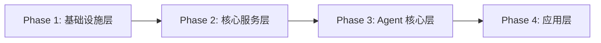
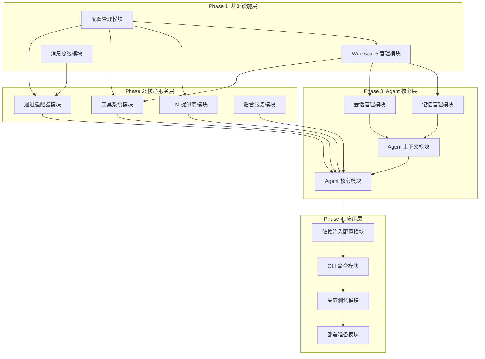

# NanoBot.Net 实现计划

本文档是 NanoBot.Net 项目的实现计划索引，定义了项目的实施阶段、任务清单和依赖关系。

## 项目概述

NanoBot.Net 是一个基于 .NET 的 AI Agent 框架，从 Python 版本的 nanobot 项目移植而来。项目采用分层架构设计，支持多通道消息接入、多 LLM 提供商、工具调用和记忆管理等功能。

## 相关方案文档

| 文档 | 描述 |
|------|------|
| [Configuration.md](../solutions/Configuration.md) | 配置管理层设计 |
| [Infrastructure.md](../solutions/Infrastructure.md) | 基础设施层设计 |
| [Providers.md](../solutions/Providers.md) | 提供商层设计 |
| [Tools.md](../solutions/Tools.md) | 工具层设计 |
| [Channels.md](../solutions/Channels.md) | 通道层设计 |
| [Agent-Core.md](../solutions/Agent-Core.md) | Agent 核心层设计 |
| [CLI.md](../solutions/CLI.md) | CLI 命令层设计 |
| [Testing.md](../solutions/Testing.md) | 测试方案设计 |
| [Overview.md](../solutions/Overview.md) | 解决方案概览与目录结构 |

## 项目目录结构概览

项目采用标准的 .NET 解决方案结构，详细目录结构设计请参考 [Overview.md](../solutions/Overview.md#项目目录结构)。

### 核心项目

| 项目 | 职责 | 命名空间 |
|------|------|----------|
| NanoBot.Core | 核心接口和抽象 | `NanoBot.Core.*` |
| NanoBot.Infrastructure | 基础设施实现 | `NanoBot.Infrastructure.*` |
| NanoBot.Providers | LLM 提供商实现 | `NanoBot.Providers.*` |
| NanoBot.Tools | 工具实现 | `NanoBot.Tools.*` |
| NanoBot.Channels | 通道实现 | `NanoBot.Channels.*` |
| NanoBot.Agent | Agent 核心实现 | `NanoBot.Agent.*` |
| NanoBot.Cli | CLI 命令行 | `NanoBot.Cli` |

### 目录层级

```
NanoBot.Net/
├── src/                    # 源代码
│   ├── NanoBot.Core/       # 核心抽象层
│   ├── NanoBot.Infrastructure/  # 基础设施
│   ├── NanoBot.Providers/  # LLM 提供商
│   ├── NanoBot.Tools/      # 工具实现
│   ├── NanoBot.Channels/   # 通道实现
│   ├── NanoBot.Agent/      # Agent 核心
│   └── NanoBot.Cli/        # CLI 入口
├── tests/                  # 测试项目
├── doc.ai/                 # AI 辅助文档
│   ├── solutions/          # 方案设计
│   └── plans/              # 实现计划
├── docs/                   # 用户文档
└── samples/                # 示例项目
```

### 命名规范

- **文件夹**: PascalCase（如 `Agents/`、`Channels/`）
- **命名空间**: `NanoBot.{项目}.{模块}`（如 `NanoBot.Core.Agents`）
- **测试项目**: `{项目名}.Tests`（如 `NanoBot.Core.Tests`）
- **测试文件**: `{类名}Tests.cs`（如 `AgentTests.cs`）

## 实施阶段

项目分为 4 个顺序阶段，每个阶段必须在上一阶段完成后才能开始。



### Phase 1: 基础设施层

**目标**: 建立稳定可靠的基础设施层，提供配置管理、文件系统操作和消息路由能力。

**任务清单**:
- 配置管理模块（12 任务）- 并行度高
- Workspace 管理模块（6 任务）- 依赖配置管理
- 消息总线模块（5 任务）- 无依赖

**详细计划**: [Phase1-Infrastructure.md](./Phase1-Infrastructure.md)

---

### Phase 2: 核心服务层

**目标**: 实现 LLM 对接、工具执行、多通道消息处理和后台服务调度。

**任务清单**:
- LLM 提供商模块（12 任务）- 依赖配置管理
- 工具系统模块（17 任务）- 依赖配置管理和 Workspace
- 通道适配器模块（11 任务）- 依赖配置管理和消息总线
- 后台服务模块（13 任务）- 依赖基础设施层

**详细计划**: [Phase2-Core-Services.md](./Phase2-Core-Services.md)

---

### Phase 3: Agent 核心层

**目标**: 实现 Agent 运行时，支持多轮对话、工具调用循环、记忆持久化和会话管理。

**任务清单**:
- 记忆管理模块（5 任务）- 依赖 Workspace
- 会话管理模块（6 任务）- 依赖 Workspace
- Agent 上下文模块（7 任务）- 依赖记忆和会话
- Agent 核心模块（10 任务）- 依赖所有前置模块

**详细计划**: [Phase3-Agent-Core.md](./Phase3-Agent-Core.md)

---

### Phase 4: 应用层

**目标**: 实现应用入口，支持命令行交互和 Gateway 服务模式，完成测试和部署。

**任务清单**:
- 依赖注入配置模块（10 任务）- 依赖所有核心模块
- CLI 命令模块（12 任务）- 依赖 DI 配置
- 集成测试模块（7 任务）- 依赖所有模块
- 部署准备模块（6 任务）- 依赖集成测试

**详细计划**: [Phase4-Application.md](./Phase4-Application.md)

---

## 任务统计

| 阶段 | 任务清单数 | 任务总数 | 并行任务数 |
|------|-----------|----------|-----------|
| Phase 1 | 3 | 23 | 18 |
| Phase 2 | 4 | 53 | 42 |
| Phase 3 | 4 | 28 | 18 |
| Phase 4 | 4 | 35 | 26 |
| **总计** | **15** | **139** | **104** |

## 依赖关系图



## 风险评估

| 风险类别 | 风险描述 | 影响程度 | 缓解措施 |
|----------|----------|----------|----------|
| 技术风险 | LLM API 变更导致兼容性问题 | 高 | 抽象提供商接口，隔离 API 差异 |
| 技术风险 | 通道连接不稳定 | 中 | 实现重连机制，完善错误处理 |
| 安全风险 | 工具执行越权 | 高 | 严格路径检查，命令黑名单 |
| 性能风险 | 消息队列溢出 | 中 | 实现背压机制，限制队列大小 |
| 进度风险 | 任务依赖阻塞 | 中 | 合理安排并行任务，提前识别阻塞点 |

## 成功标准

### 功能标准

- 支持至少 5 个 LLM 提供商
- 支持至少 3 个消息通道
- 所有内置工具可用
- Agent 循环正常运行
- 记忆和会话持久化正常

### 质量标准

- 单元测试覆盖率 >= 75%
- 所有单元测试通过
- 所有集成测试通过
- 代码审查通过
- Docker 部署验证通过

### 性能标准

- 消息处理延迟 < 1s
- 工具执行超时可配置
- 内存占用合理

## 执行建议

### 开发流程

1. 按阶段顺序执行，确保前置依赖完成
2. 同一任务清单内的任务可并行开发
3. 每完成一个任务清单，进行集成验证
4. 每完成一个阶段，进行阶段评审

### 协作建议

1. 每个任务清单可分配给不同的开发者
2. 使用分支策略管理并行开发
3. 定期同步进度，识别阻塞点
4. 代码审查确保质量

### 测试策略

1. 开发过程中编写单元测试
2. 每个模块完成后进行模块测试
3. 每个阶段完成后进行集成测试
4. 项目完成后进行端到端测试

## 文档更新记录

| 日期 | 版本 | 更新内容 |
|------|------|----------|
| 2026-02-17 | 1.0 | 初始版本 |
