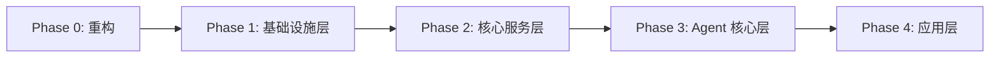
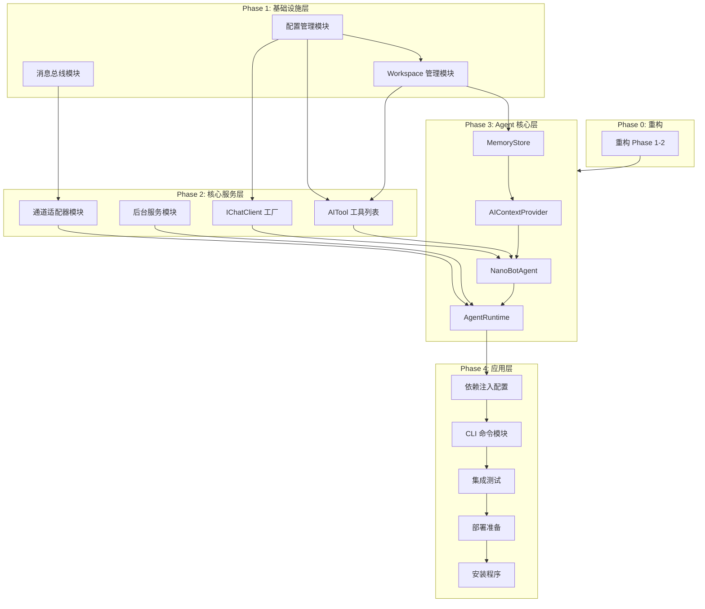

# NanoBot.Net 实现计划

本文档是 NanoBot.Net 项目的实现计划索引，定义了项目的实施阶段、任务清单和依赖关系。

## 项目概述

NanoBot.Net 是一个基于 .NET 的 AI Agent 框架，从 Python 版本的 nanobot 项目移植而来。项目**基于 Microsoft.Agents.AI 框架实现**，充分利用框架提供的 Agent、工具、会话管理等核心能力，避免重复造轮子。

## 核心框架

本项目基于 **Microsoft.Agents.AI** 框架构建，直接使用以下框架类型：

| 框架类型 | 用途 |
|----------|------|
| `ChatClientAgent` | Agent 实现 |
| `IChatClient` | LLM 客户端抽象 |
| `AITool`/`AIFunction` | 工具定义 |
| `AIContextProvider` | 上下文注入 |
| `AIAgentBuilder` | 中间件管道 |
| `AgentSession`/`AgentThread` | 会话管理 |

## 相关方案文档

| 文档 | 描述 |
|------|------|
| [Overview.md](../solutions/Overview.md) | 解决方案概览与框架集成策略 |
| [Configuration.md](../solutions/Configuration.md) | 配置管理层设计 |
| [Infrastructure.md](../solutions/Infrastructure.md) | 基础设施层设计 |
| [Providers.md](../solutions/Providers.md) | 提供商层设计（使用 IChatClient） |
| [Tools.md](../solutions/Tools.md) | 工具层设计（使用 AITool） |
| [Channels.md](../solutions/Channels.md) | 通道层设计 |
| [Agent-Core.md](../solutions/Agent-Core.md) | Agent 核心层设计（使用 ChatClientAgent） |
| [CLI.md](../solutions/CLI.md) | CLI 命令层设计 |
| [Testing.md](../solutions/Testing.md) | 测试方案设计 |
| [Installation.md](../solutions/Installation.md) | 安装程序设计 |

## 实施阶段

项目分为 4 个顺序阶段，每个阶段必须在上一阶段完成后才能开始。

### Phase 0: Phase 1-2 重构

**目标**: 对已完成的 Phase 1 和 Phase 2 进行重构，消除重复造轮子的代码，迁移到 Microsoft.Agents.AI 框架。

**任务清单**:
- 移除重复的 LLM 抽象（5 任务）
- 移除重复的工具抽象（4 任务）
- 确认保留 nanobot 特有功能（4 任务）
- 优化 MCP 客户端（1 任务）

**详细计划**: [Phase1-2-Refactoring.md](./Phase1-2-Refactoring.md)

---

### Phase 1: 基础设施层

**目标**: 建立稳定可靠的基础设施层，提供配置管理、文件系统操作和消息路由能力。

**状态**: ✅ 已完成（需重构）

**任务清单**:
- 配置管理模块（12 任务）- ✅ 已完成
- Workspace 管理模块（6 任务）- 待开始
- 消息总线模块（5 任务）- ✅ 已完成

**详细计划**: [Phase1-Infrastructure.md](./Phase1-Infrastructure.md)

---

### Phase 2: 核心服务层

**目标**: 实现 LLM 对接、工具执行、多通道消息处理和后台服务调度。

**状态**: ✅ 已完成（需重构）

**任务清单**:
- LLM 提供商模块（12 任务）- ✅ 已完成（需重构为 IChatClient）
- 工具系统模块（17 任务）- ✅ 已完成（需重构为 AITool）
- 通道适配器模块（11 任务）- ✅ 已完成
- 后台服务模块（13 任务）- ✅ 已完成

**详细计划**: [Phase2-Core-Services.md](./Phase2-Core-Services.md)

---

### Phase 3: Agent 核心层

**目标**: 基于 Microsoft.Agents.AI 实现 Agent 运行时，支持多轮对话、工具调用循环、记忆持久化和会话管理。

**状态**: ✅ 已完成

**任务清单**:
- Provider 模块（5 任务）- ✅ 已完成
- 记忆管理模块（4 任务）- ✅ 已完成
- Agent 工厂模块（4 任务）- ✅ 已完成
- Agent 运行时模块（4 任务）- ✅ 已完成

**详细计划**: [Phase3-Agent-Core.md](./Phase3-Agent-Core.md)

---

### Phase 4: 应用层

**目标**: 实现应用入口，支持命令行交互和 Gateway 服务模式，完成测试、部署和安装程序。

**状态**: 🔄 进行中

**任务清单**:
- 依赖注入配置模块（9 任务）- ✅ 已完成
- CLI 命令模块（11 任务）- ✅ 已完成
- 集成测试模块（5 任务）- 待开始
- 部署准备模块（5 任务）- 待开始
- 安装程序模块（8 任务）- 待开始

**详细计划**: [Phase4-Application.md](./Phase4-Application.md)

---

## 任务统计

| 阶段 | 任务清单数 | 任务总数 | 状态 |
|------|-----------|----------|------|
| Phase 0: 重构 | 4 | 14 | 待开始 |
| Phase 1: 基础设施层 | 3 | 23 | ✅ 已完成（需重构） |
| Phase 2: 核心服务层 | 4 | 53 | ✅ 已完成（需重构） |
| Phase 3: Agent 核心层 | 4 | 17 | ✅ 已完成 |
| Phase 4: 应用层 | 5 | 38 | 🔄 进行中（CLI 命令模块已完成） |
| **总计** | **20** | **145** | - |

## 依赖关系图

## 框架集成策略

### 直接使用框架类型

| nanobot 模块 | Microsoft.Agents.AI 对应 | NanoBot.Net 实现 |
|--------------|--------------------------|-----------------|
| agent/loop | `ChatClientAgent` | 直接使用 |
| providers | `IChatClient` | 使用工厂创建 |
| agent/tools | `AITool`/`AIFunction` | 使用 `AIFunctionFactory` |
| agent/context | `AIContextProvider` | 实现自定义 Provider |
| 会话管理 | `AgentSession`/`AgentThread` | 直接使用 |

### 自定义实现（框架无对应功能）

| 功能 | 说明 |
|------|------|
| `IMessageBus` | 多通道消息路由 |
| `IChannel` | 通道适配器 |
| `ICronService` | 定时任务调度 |
| `IHeartbeatService` | 心跳服务 |
| `ISkillsLoader` | Skills 加载 |
| `IWorkspaceManager` | 工作空间管理 |
| `IMcpClient` | MCP 客户端 |

## 风险评估

| 风险类别 | 风险描述 | 影响程度 | 缓解措施 |
|----------|----------|----------|----------|
| 技术风险 | 框架 API 变更 | 高 | 使用稳定版本，关注更新日志 |
| 技术风险 | 通道连接不稳定 | 中 | 实现重连机制，完善错误处理 |
| 安全风险 | 工具执行越权 | 高 | 严格路径检查，命令黑名单 |
| 性能风险 | 消息队列溢出 | 中 | 实现背压机制，限制队列大小 |
| 进度风险 | 重构工作量超预期 | 中 | 渐进式迁移，保留原有测试 |

## 成功标准

### 功能标准

- 支持至少 5 个 LLM 提供商（通过 IChatClient）
- 支持至少 3 个消息通道
- 所有内置工具可用（通过 AITool）
- Agent 循环正常运行（通过 ChatClientAgent）
- 记忆和会话持久化正常

### 质量标准

- 单元测试覆盖率 >= 75%
- 所有单元测试通过
- 所有集成测试通过
- 代码审查通过
- Docker 部署验证通过

### 性能标准

- 消息处理延迟 < 1s
- 工具执行超时可配置
- 内存占用合理

## 执行建议

### 开发流程

1. 先执行 Phase 0 重构，消除重复代码
2. 按阶段顺序执行，确保前置依赖完成
3. 同一任务清单内的任务可并行开发
4. 每完成一个任务清单，进行集成验证
5. 每完成一个阶段，进行阶段评审

### 协作建议

1. 每个任务清单可分配给不同的开发者
2. 使用分支策略管理并行开发
3. 定期同步进度，识别阻塞点
4. 代码审查确保质量

### 测试策略

1. 开发过程中编写单元测试
2. 每个模块完成后进行模块测试
3. 每个阶段完成后进行集成测试
4. 项目完成后进行端到端测试

## 文档更新记录

| 日期 | 版本 | 更新内容 |
|------|------|----------|
| 2026-02-17 | 1.0 | 初始版本 |
| 2026-02-18 | 2.0 | 基于 Microsoft.Agents.AI 重构，添加 Phase 0 重构计划 |
