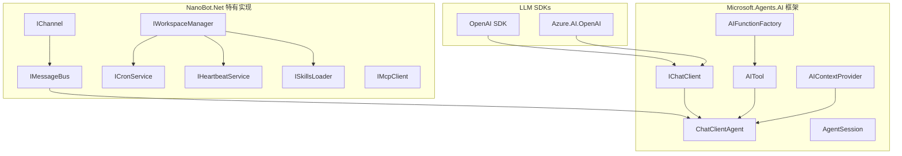

# Phase 1-2 重构计划：迁移到 Microsoft.Agents.AI

本计划针对已完成的 Phase 1 和 Phase 2 进行重构，以充分利用 Microsoft.Agents.AI 框架，消除重复造轮子的代码。

## 重构背景

### 问题分析

经过对 Microsoft.Agents.AI 框架的深入研究，发现 Phase 1 和 Phase 2 的实现存在以下问题：

| 已实现模块 | Microsoft.Agents.AI 已提供 | 问题 |
|-----------|---------------------------|------|
| `ILLMProvider` 接口 | `IChatClient` 抽象 | ❌ 重复定义 |
| `OpenAIProvider` 等 | 官方 SDK + `AsAIAgent()` | ❌ 重复实现 |
| `ITool` 接口 | `AITool`/`AIFunction` | ❌ 重复定义 |
| `ToolRegistry` | `List<AITool>` + `AIFunctionFactory` | ❌ 重复实现 |
| `LLMRequest`/`LLMResponse` | `ChatMessage`/`ChatResponse` | ❌ 重复定义 |
| `ToolDefinition`/`ToolCall` | 框架内置类型 | ❌ 重复定义 |

### 重构目标

1. **移除重复抽象**：删除自定义的 `ILLMProvider`、`ITool` 等接口
2. **使用框架类型**：直接使用 `IChatClient`、`AITool`、`AIFunctionFactory`
3. **保留特有功能**：保留 nanobot 特有的消息总线、通道、Cron、Heartbeat 等
4. **减少代码量**：预计减少约 1500+ 行重复代码

---

## 重构任务清单

### 任务清单：移除重复的 LLM 抽象

> **优先级**: 高
> **预估工作量**: 2-3 天

#### Task R1.1: 添加 Microsoft.Agents.AI 包引用

**描述**: 在项目中添加 Microsoft.Agents.AI 相关包引用。

**交付物**:
- 更新 `NanoBot.Core.csproj` 添加 `Microsoft.Agents.AI.Abstractions`
- 更新 `NanoBot.Providers.csproj` 添加 `Microsoft.Agents.AI.OpenAI`

**完成标准**:
- 包引用正确
- 项目可编译

---

#### Task R1.2: 删除重复的 LLM 类型

**描述**: 删除自定义的 LLM 类型，使用框架提供的类型。

**需要删除的文件**:
- `NanoBot.Core/Providers/LLMRequest.cs`
- `NanoBot.Core/Providers/LLMResponse.cs`
- `NanoBot.Core/Providers/LLMChunk.cs`
- `NanoBot.Core/Providers/UsageInfo.cs`
- `NanoBot.Core/Providers/ModelInfo.cs`
- `NanoBot.Core/Providers/ILLMProvider.cs`
- `NanoBot.Core/Providers/IProviderRegistry.cs`

**需要保留的文件**:
- `NanoBot.Core/Configuration/Models/LlmConfig.cs` (配置类保留)

**完成标准**:
- 重复类型已删除
- 使用 `Microsoft.Extensions.AI` 的 `ChatMessage`、`ChatResponse` 等

---

#### Task R1.3: 重构 ProviderRegistry

**描述**: 将 `ProviderRegistry` 重构为 `IChatClient` 工厂。

**交付物**:
- 重命名 `ProviderRegistry` 为 `ChatClientFactory`
- 实现 `IChatClientFactory` 接口
- 使用官方 SDK 创建 `IChatClient`

**完成标准**:
- 返回 `IChatClient` 而非 `ILLMProvider`
- 支持 OpenAI、Azure OpenAI、Anthropic 等

---

#### Task R1.4: 删除重复的 Provider 实现

**描述**: 删除自定义的 Provider 实现，使用官方 SDK。

**需要删除的文件**:
- `NanoBot.Providers/OpenAIProvider.cs`
- `NanoBot.Providers/OpenRouterProvider.cs`
- `NanoBot.Providers/AnthropicProvider.cs`
- `NanoBot.Providers/OllamaProvider.cs`
- `NanoBot.Providers/DeepSeekProvider.cs`
- `NanoBot.Providers/GroqProvider.cs`
- `NanoBot.Providers/MoonshotProvider.cs`
- `NanoBot.Providers/ZhipuProvider.cs`
- `NanoBot.Providers/OpenAICompatibleProvider.cs`

**替代方案**:
```csharp
// 使用官方 SDK
var client = new OpenAIClient(apiKey).GetChatClient("gpt-4o");
var agent = client.AsAIAgent(instructions: "...");
```

**完成标准**:
- Provider 实现已删除
- 使用官方 SDK 或 `OpenAICompatibleClient`

---

#### Task R1.5: 更新测试用例

**描述**: 更新 Provider 相关的测试用例。

**交付物**:
- 更新 `NanoBot.Providers.Tests`
- 测试 `ChatClientFactory`
- 测试 `AsAIAgent()` 扩展

**完成标准**:
- 所有测试通过
- 测试覆盖率 >= 70%

---

### 任务清单：移除重复的工具抽象

> **优先级**: 高
> **预估工作量**: 2-3 天

#### Task R2.1: 删除重复的工具类型

**描述**: 删除自定义的工具类型，使用框架提供的类型。

**需要删除的文件**:
- `NanoBot.Core/Tools/ITool.cs`
- `NanoBot.Core/Tools/IToolRegistry.cs`
- `NanoBot.Core/Tools/ToolResult.cs`
- `NanoBot.Core/Tools/ValidationResult.cs`
- `NanoBot.Core/Tools/IToolContext.cs`
- `NanoBot.Tools/ToolBase.cs`
- `NanoBot.Tools/ToolRegistry.cs`

**替代方案**:
```csharp
// 使用 AIFunctionFactory
AITool tool = AIFunctionFactory.Create(
    (string path) => File.ReadAllText(path),
    new() { Name = "read_file", Description = "..." });
```

**完成标准**:
- 重复类型已删除
- 使用 `AITool`、`AIFunction`

---

#### Task R2.2: 重构内置工具

**描述**: 将内置工具重构为使用 `AIFunctionFactory`。

**需要重构的文件**:
- `NanoBot.Tools/FileSystem/ReadFileTool.cs` → `FileTools.CreateReadFileTool()`
- `NanoBot.Tools/FileSystem/WriteFileTool.cs` → `FileTools.CreateWriteFileTool()`
- `NanoBot.Tools/FileSystem/EditFileTool.cs` → `FileTools.CreateEditFileTool()`
- `NanoBot.Tools/FileSystem/ListDirTool.cs` → `FileTools.CreateListDirTool()`
- `NanoBot.Tools/Shell/ExecTool.cs` → `ShellTools.CreateExecTool()`
- `NanoBot.Tools/Web/WebSearchTool.cs` → `WebTools.CreateWebSearchTool()`
- `NanoBot.Tools/Web/WebFetchTool.cs` → `WebTools.CreateWebFetchTool()`
- `NanoBot.Tools/Messaging/MessageTool.cs` → `MessageTools.CreateMessageTool()`
- `NanoBot.Tools/Agent/SpawnTool.cs` → `SpawnTools.CreateSpawnTool()`
- `NanoBot.Tools/Scheduling/CronTool.cs` → `CronTools.CreateCronTool()`

**完成标准**:
- 工具返回 `AITool` 类型
- 使用 `AIFunctionFactory.Create()`

---

#### Task R2.3: 更新工具注册方式

**描述**: 更新工具的 DI 注册方式。

**交付物**:
- 更新 `ServiceCollectionExtensions`
- 注册 `IReadOnlyList<AITool>`

**完成标准**:
- 工具以 `AITool` 列表形式注册
- 支持动态添加工具

---

#### Task R2.4: 更新测试用例

**描述**: 更新工具相关的测试用例。

**交付物**:
- 更新 `NanoBot.Tools.Tests`
- 测试工具创建方法

**完成标准**:
- 所有测试通过
- 测试覆盖率 >= 70%

---

### 任务清单：保留 nanobot 特有功能

> **优先级**: 中
> **预估工作量**: 1-2 天

#### Task R3.1: 保留消息总线

**描述**: 确认消息总线功能保留。

**保留的文件**:
- `NanoBot.Core/Bus/IMessageBus.cs`
- `NanoBot.Core/Bus/InboundMessage.cs`
- `NanoBot.Core/Bus/OutboundMessage.cs`
- `NanoBot.Infrastructure/Bus/MessageBus.cs`

**原因**: 框架无此功能，是 nanobot 特有的多通道消息路由机制。

---

#### Task R3.2: 保留通道适配器

**描述**: 确认通道适配器功能保留。

**保留的文件**:
- `NanoBot.Core/Channels/IChannel.cs`
- `NanoBot.Core/Channels/IChannelManager.cs`
- `NanoBot.Channels/` 下所有通道实现

**原因**: 框架无此功能，是 nanobot 特有的多平台接入机制。

---

#### Task R3.3: 保留后台服务

**描述**: 确认后台服务功能保留。

**保留的文件**:
- `NanoBot.Core/Scheduling/ICronService.cs`
- `NanoBot.Core/Heartbeat/IHeartbeatService.cs`
- `NanoBot.Core/Skills/ISkillsLoader.cs`
- `NanoBot.Core/Subagent/ISubagentManager.cs`
- 对应的实现文件

**原因**: 框架无此功能，是 nanobot 特有的定时任务、心跳、技能加载机制。

---

#### Task R3.4: 保留 Workspace 管理

**描述**: 确认 Workspace 管理功能保留。

**保留的文件**:
- `NanoBot.Core/Workspace/IWorkspaceManager.cs`
- `NanoBot.Core/Workspace/IBootstrapLoader.cs`
- `NanoBot.Infrastructure/Workspace/WorkspaceManager.cs`
- `NanoBot.Infrastructure/Workspace/BootstrapLoader.cs`

**原因**: 框架无此功能，是 nanobot 特有的工作空间隔离机制。

---

### 任务清单：MCP 客户端保留

> **优先级**: 中
> **预估工作量**: 1 天

#### Task R4.1: 保留 MCP 客户端

**描述**: 确认 MCP 客户端功能保留。

**保留的文件**:
- `NanoBot.Core/Mcp/IMcpClient.cs`
- `NanoBot.Tools/Mcp/McpClient.cs`

**原因**: Microsoft.Agents.AI 的 .NET 版本暂无 MCP 支持（Python 版有）。

**优化方向**:
- 将 MCP 工具转换为 `AITool` 类型
- 使用 `AIFunctionFactory` 包装 MCP 工具调用

---

## 重构后的架构

### 依赖关系



### 代码量对比

| 模块 | 重构前 | 重构后 | 减少 |
|------|--------|--------|------|
| Providers | ~800 行 | ~150 行 | **~650 行** |
| Tools | ~600 行 | ~350 行 | **~250 行** |
| LLM 类型 | ~300 行 | 0 行 | **~300 行** |
| 工具类型 | ~200 行 | 0 行 | **~200 行** |
| **总计** | ~1900 行 | ~500 行 | **~1400 行** |

---

## 风险评估

| 风险 | 影响 | 概率 | 缓解措施 |
|------|------|------|----------|
| API 不兼容 | 高 | 中 | 创建适配层，渐进式迁移 |
| 测试覆盖不足 | 中 | 中 | 优先更新测试，确保覆盖率 |
| 功能缺失 | 高 | 低 | 保留特有功能，仅移除重复部分 |
| 性能差异 | 低 | 低 | 进行性能测试对比 |

---

## 成功标准

- [x] 所有重复的 LLM 抽象已移除
- [x] 所有重复的工具抽象已移除
- [x] 使用 `IChatClient` 和 `AITool`
- [x] nanobot 特有功能保留完整
- [x] 所有测试通过
- [x] 代码量减少约 1400 行

---

## 执行顺序

1. **阶段一**：移除 LLM 抽象（R1.1 - R1.5）
2. **阶段二**：移除工具抽象（R2.1 - R2.4）
3. **阶段三**：确认保留功能（R3.1 - R3.4）
4. **阶段四**：优化 MCP 客户端（R4.1）
5. **阶段五**：集成测试和验证

---

*相关文档*:
- [Phase 1: 基础设施层](./Phase1-Infrastructure.md)
- [Phase 2: 核心服务层](./Phase2-Core-Services.md)
- [解决方案概览](../solutions/Overview.md)
