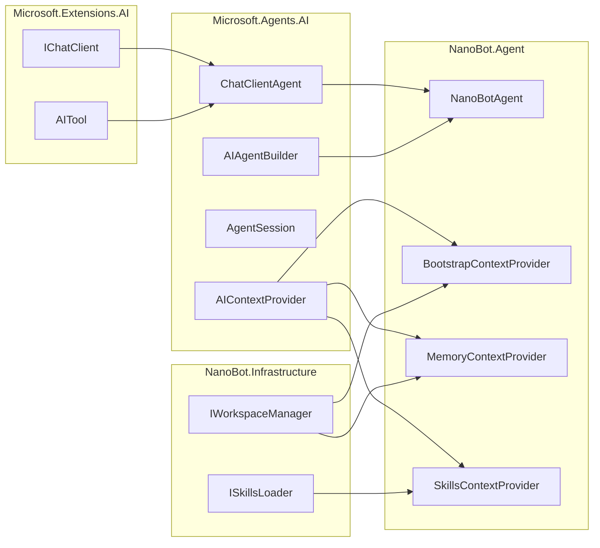

# Agent 核心设计

本文档定义 NanoBot.Net 的 Agent 核心实现。

**核心原则**：直接使用 `ChatClientAgent` 和 `AIAgentBuilder`，**不重新实现 Agent 循环**。

---

## 设计原则

### 为什么不需要自定义 Agent 基类

Microsoft.Agents.AI 框架已经提供了完整的 Agent 实现：

1. **`ChatClientAgent`**：基于 `IChatClient` 的 Agent 实现
2. **`AIAgentBuilder`**：用于构建 Agent 管道
3. **`AgentSession`**：会话状态管理
4. **`AIContextProvider`**：上下文注入机制

NanoBot.Net 只需：
- 使用 `ChatClientAgent` 作为 Agent 基础
- 通过 `AIContextProvider` 注入 nanobot 特有上下文
- 使用 `AIAgentBuilder` 添加中间件

---

## 框架提供的 Agent 类型

### ChatClientAgent

```csharp
using Microsoft.Agents.AI;

// 从 IChatClient 创建 Agent
ChatClientAgent agent = chatClient.AsAIAgent(
    name: "NanoBot",
    instructions: "You are a helpful assistant.",
    tools: myTools);

// 运行 Agent
var response = await agent.RunAsync("Hello!");

// 流式运行
await foreach (var update in agent.RunStreamingAsync("Tell me a story"))
{
    Console.Write(update.Text);
}
```

### AIAgentBuilder

```csharp
// 使用 Builder 模式添加中间件
var agent = chatClient.AsAIAgent(tools: tools)
    .AsBuilder()
    .UseLogging(logger)
    .UseRateLimiting(rateLimiter)
    .UseFunctionInvocation()  // 自动处理工具调用
    .Build();
```

---

## NanoBot Agent 实现

### 使用 ChatClientAgent

```csharp
namespace NanoBot.Agent;

public class NanoBotAgent
{
    private readonly ChatClientAgent _innerAgent;
    private readonly IWorkspaceManager _workspace;
    private readonly ISkillsLoader _skillsLoader;
    private readonly IMcpClient _mcpClient;
    
    public NanoBotAgent(
        IChatClient chatClient,
        IWorkspaceManager workspace,
        ISkillsLoader skillsLoader,
        IMcpClient mcpClient,
        IEnumerable<AIContextProvider> contextProviders,
        IReadOnlyList<AITool> tools)
    {
        _workspace = workspace;
        _skillsLoader = skillsLoader;
        _mcpClient = mcpClient;
        
        var allTools = tools.ToList();
        
        _innerAgent = chatClient
            .AsAIAgent(
                name: "NanoBot",
                instructions: BuildInstructionsAsync,
                tools: allTools,
                contextProviders: contextProviders.ToList())
            .AsBuilder()
            .UseFunctionInvocation()
            .Build();
    }
    
    public async Task<AgentRunResponse> RunAsync(
        string input,
        AgentThread? thread = null,
        CancellationToken cancellationToken = default)
    {
        return await _innerAgent.RunAsync(input, thread, cancellationToken);
    }
    
    public async IAsyncEnumerable<AgentRunResponseUpdate> RunStreamingAsync(
        string input,
        AgentThread? thread = null,
        [EnumeratorCancellation] CancellationToken cancellationToken = default)
    {
        await foreach (var update in _innerAgent.RunStreamingAsync(input, thread, cancellationToken))
        {
            yield return update;
        }
    }
    
    private async Task<string> BuildInstructionsAsync()
    {
        var sb = new StringBuilder();
        
        // 加载 AGENTS.md
        var agentsPath = _workspace.GetFilePath("AGENTS.md");
        if (File.Exists(agentsPath))
        {
            sb.AppendLine("## Agent Configuration");
            sb.AppendLine(await File.ReadAllTextAsync(agentsPath));
            sb.AppendLine();
        }
        
        // 加载 SOUL.md
        var soulPath = _workspace.GetFilePath("SOUL.md");
        if (File.Exists(soulPath))
        {
            sb.AppendLine("## Personality");
            sb.AppendLine(await File.ReadAllTextAsync(soulPath));
            sb.AppendLine();
        }
        
        // 加载 Skills
        var skills = await _skillsLoader.LoadSkillsAsync();
        if (skills.Any())
        {
            sb.AppendLine("## Available Skills");
            foreach (var skill in skills)
            {
                sb.AppendLine($"- {skill.Name}: {skill.Description}");
            }
            sb.AppendLine();
        }
        
        return sb.ToString();
    }
}
```

---

## 上下文提供者

### 实现 AIContextProvider

框架的 `AIContextProvider` 用于动态注入上下文：

```csharp
namespace NanoBot.Agent.Context;

public class BootstrapContextProvider : AIContextProvider
{
    private readonly IWorkspaceManager _workspace;
    
    public BootstrapContextProvider(IWorkspaceManager workspace)
    {
        _workspace = workspace;
    }
    
    protected override async Task<AIContext> GetContextAsync(
        InvokingContext context,
        CancellationToken cancellationToken)
    {
        var aiContext = new AIContext();
        
        // 加载 bootstrap 文件
        var bootstrapFiles = new[] { "AGENTS.md", "SOUL.md", "MEMORY.md" };
        
        foreach (var file in bootstrapFiles)
        {
            var path = _workspace.GetFilePath(file);
            if (File.Exists(path))
            {
                var content = await File.ReadAllTextAsync(path, cancellationToken);
                aiContext.AdditionalData[$"bootstrap_{file.ToLower()}"] = content;
            }
        }
        
        return aiContext;
    }
}

public class MemoryContextProvider : AIContextProvider
{
    private readonly IWorkspaceManager _workspace;
    
    public MemoryContextProvider(IWorkspaceManager workspace)
    {
        _workspace = workspace;
    }
    
    protected override async Task<AIContext> GetContextAsync(
        InvokingContext context,
        CancellationToken cancellationToken)
    {
        var memoryPath = _workspace.GetFilePath("MEMORY.md");
        if (!File.Exists(memoryPath))
            return new AIContext();
        
        var content = await File.ReadAllTextAsync(memoryPath, cancellationToken);
        
        return new AIContext
        {
            AdditionalData = new Dictionary<string, object>
            {
                ["memory"] = content
            }
        };
    }
}

public class HistoryContextProvider : AIContextProvider
{
    private readonly IWorkspaceManager _workspace;
    private readonly int _maxHistoryEntries;
    
    public HistoryContextProvider(IWorkspaceManager workspace, int maxHistoryEntries = 100)
    {
        _workspace = workspace;
        _maxHistoryEntries = maxHistoryEntries;
    }
    
    protected override async Task<AIContext> GetContextAsync(
        InvokingContext context,
        CancellationToken cancellationToken)
    {
        var historyPath = _workspace.GetFilePath("HISTORY.md");
        if (!File.Exists(historyPath))
            return new AIContext();
        
        var lines = await File.ReadAllLinesAsync(historyPath, cancellationToken);
        var recentLines = lines.TakeLast(_maxHistoryEntries);
        
        return new AIContext
        {
            AdditionalData = new Dictionary<string, object>
            {
                ["history"] = string.Join("\n", recentLines)
            }
        };
    }
}

public class SkillsContextProvider : AIContextProvider
{
    private readonly ISkillsLoader _skillsLoader;
    
    public SkillsContextProvider(ISkillsLoader skillsLoader)
    {
        _skillsLoader = skillsLoader;
    }
    
    protected override async Task<AIContext> GetContextAsync(
        InvokingContext context,
        CancellationToken cancellationToken)
    {
        var skills = await _skillsLoader.LoadSkillsAsync(cancellationToken);
        
        var sb = new StringBuilder();
        sb.AppendLine("## Available Skills");
        
        foreach (var skill in skills)
        {
            sb.AppendLine($"### {skill.Name}");
            sb.AppendLine(skill.Content);
            sb.AppendLine();
        }
        
        return new AIContext
        {
            AdditionalData = new Dictionary<string, object>
            {
                ["skills"] = sb.ToString()
            }
        };
    }
}
```

---

## 会话管理

### 使用 AgentSession

框架提供 `AgentSession` 管理会话状态：

```csharp
// 框架自动管理会话
var response = await agent.RunAsync(
    "Hello!",
    thread: null,  // 框架自动创建新会话
    cancellationToken: ct);

// 使用现有会话
var thread = new InMemoryAgentThread();
await agent.RunAsync("First message", thread, ct);
await agent.RunAsync("Second message", thread, ct);  // 保持上下文
```

### 自定义会话存储

```csharp
public class FileBackedAgentThread : AgentThread
{
    private readonly string _filePath;
    private readonly List<ChatMessage> _messages = new();
    
    public FileBackedAgentThread(string filePath)
    {
        _filePath = filePath;
        LoadMessages();
    }
    
    public override IReadOnlyList<ChatMessage> Messages => _messages;
    
    public override async Task AddMessageAsync(ChatMessage message, CancellationToken ct = default)
    {
        _messages.Add(message);
        await SaveMessagesAsync(ct);
    }
    
    private void LoadMessages()
    {
        if (File.Exists(_filePath))
        {
            var json = File.ReadAllText(_filePath);
            _messages.AddRange(JsonSerializer.Deserialize<List<ChatMessage>>(json) ?? []);
        }
    }
    
    private async Task SaveMessagesAsync(CancellationToken ct)
    {
        var json = JsonSerializer.Serialize(_messages);
        await File.WriteAllTextAsync(_filePath, json, ct);
    }
}
```

---

## 中间件

### 使用 AIAgentBuilder 添加中间件

```csharp
public static class AgentMiddlewareExtensions
{
    public static AIAgentBuilder UseLogging(this AIAgentBuilder builder, ILogger logger)
    {
        return builder.Use(async (agent, context, next, ct) =>
        {
            logger.LogInformation("Agent run started: {Input}", context.Input);
            
            var response = await next(context, ct);
            
            logger.LogInformation("Agent run completed: {Response}", response.Text?[..Math.Min(100, response.Text.Length)]);
            
            return response;
        });
    }
    
    public static AIAgentBuilder UseRateLimiting(this AIAgentBuilder builder, RateLimiter limiter)
    {
        return builder.Use(async (agent, context, next, ct) =>
        {
            using var lease = await limiter.AcquireAsync(ct);
            if (!lease.IsAcquired)
                throw new RateLimitExceededException();
            
            return await next(context, ct);
        });
    }
    
    public static AIAgentBuilder UseMemoryUpdate(this AIAgentBuilder builder, IWorkspaceManager workspace)
    {
        return builder.Use(async (agent, context, next, ct) =>
        {
            var response = await next(context, ct);
            
            // 更新 HISTORY.md
            var historyPath = workspace.GetFilePath("HISTORY.md");
            var entry = $"[{DateTime.UtcNow:yyyy-MM-dd HH:mm:ss}] User: {context.Input}\nAssistant: {response.Text}\n\n";
            await File.AppendAllTextAsync(historyPath, entry, ct);
            
            return response;
        });
    }
}
```

---

## 子 Agent 管理

### spawn 工具实现

```csharp
public static AITool CreateSpawnTool(
    IChatClient chatClient,
    IWorkspaceManager workspace,
    ISkillsLoader skillsLoader,
    ILogger logger)
{
    return AIFunctionFactory.Create(
        async (string task, string? label = null) =>
        {
            var subAgentName = label ?? $"subagent_{Guid.NewGuid():N}";
            
            // 创建子 Agent
            var subAgent = chatClient.AsAIAgent(
                name: subAgentName,
                instructions: $"You are a specialized agent. Task: {task}",
                tools: CreateSubAgentTools(workspace));
            
            logger.LogInformation("Spawning sub-agent: {Name} for task: {Task}", subAgentName, task);
            
            var response = await subAgent.RunAsync(task);
            
            return $"Sub-agent {subAgentName} completed:\n{response.Text}";
        },
        new AIFunctionFactoryOptions
        {
            Name = "spawn",
            Description = "Create a sub-agent to handle a specific task."
        });
}
```

---

## DI 注册

```csharp
public static class ServiceCollectionExtensions
{
    public static IServiceCollection AddNanoBotAgent(this IServiceCollection services)
    {
        // 注册上下文提供者
        services.AddSingleton<AIContextProvider, BootstrapContextProvider>();
        services.AddSingleton<AIContextProvider, MemoryContextProvider>();
        services.AddSingleton<AIContextProvider, HistoryContextProvider>();
        services.AddSingleton<AIContextProvider, SkillsContextProvider>();
        
        // 注册 Agent
        services.AddSingleton<NanoBotAgent>();
        
        return services;
    }
}
```

---

## 依赖关系



---

## 实现要点

### 1. 不要重新实现 Agent 循环

❌ **错误做法**：
```csharp
public class MyAgent
{
    public async Task RunAsync()
    {
        while (true)
        {
            var response = await _llm.CompleteAsync(messages);
            if (response.ToolCalls.Any())
            {
                foreach (var call in response.ToolCalls)
                {
                    var result = await ExecuteToolAsync(call);
                    messages.Add(result);
                }
                continue;
            }
            break;
        }
    }
}
```

✅ **正确做法**：
```csharp
// 框架自动处理工具调用循环
var agent = chatClient.AsAIAgent(tools: tools);
var response = await agent.RunAsync(input);
```

### 2. 使用 AIContextProvider 注入上下文

```csharp
public class MyContextProvider : AIContextProvider
{
    protected override async Task<AIContext> GetContextAsync(
        InvokingContext context,
        CancellationToken cancellationToken)
    {
        // 动态加载上下文
        return new AIContext { ... };
    }
}
```

### 3. 使用 AIAgentBuilder 添加中间件

```csharp
var agent = chatClient
    .AsAIAgent(tools: tools)
    .AsBuilder()
    .UseLogging(logger)
    .UseRateLimiting(limiter)
    .UseMemoryUpdate(workspace)
    .Build();
```

---

## 总结

| 传统做法 | NanoBot.Net 做法 |
|----------|-----------------|
| 定义 `IAgent` 接口 | 直接使用 `ChatClientAgent` |
| 实现 Agent 循环 | 框架自动处理 |
| 自定义会话管理 | 使用 `AgentSession` |
| 手动注入上下文 | 使用 `AIContextProvider` |
| 自定义中间件系统 | 使用 `AIAgentBuilder` |

**核心收益**：
- 减少约 800+ 行代码
- 框架自动处理工具调用循环
- 内置会话管理
- 标准化的中间件管道

---

*返回 [概览文档](./Overview.md)*
