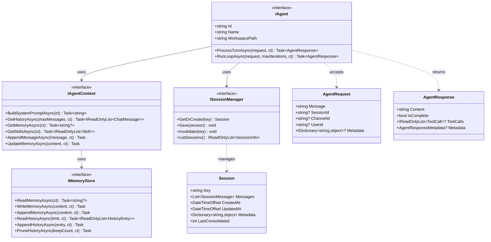
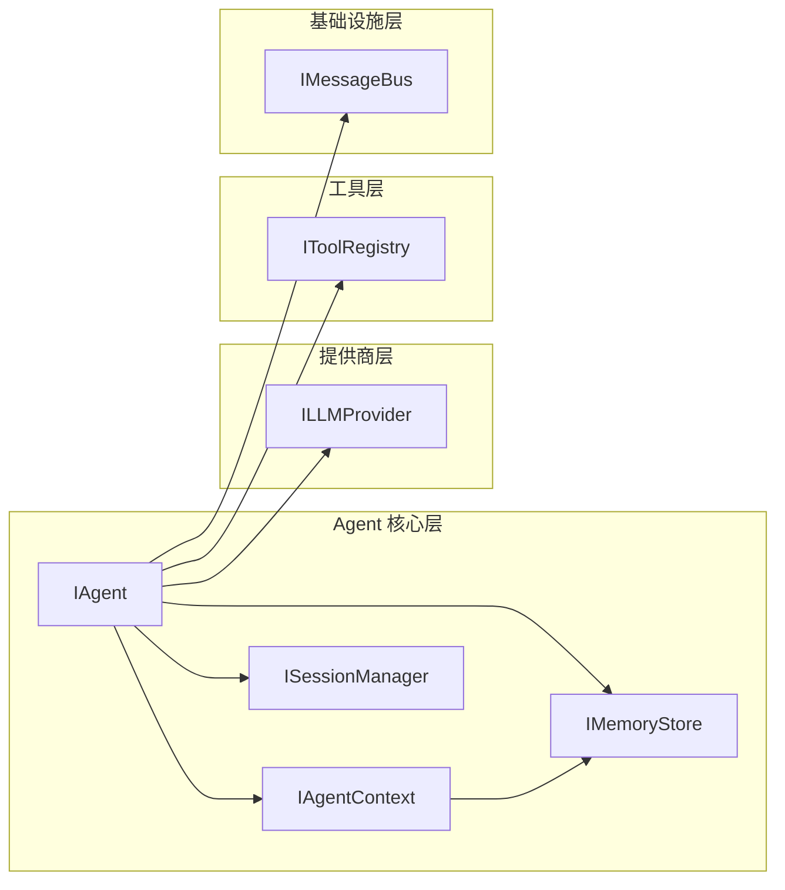

# Agent 核心层设计

本文档定义 NanoBot.Net 的 Agent 核心层接口设计，对应 nanobot 的 agent/loop.py、agent/context.py、agent/memory.py 和 session/manager.py。

**依赖关系**：Agent 核心层依赖于基础设施层（Bus、Config）和提供商层（LLMProvider）。

---

## 模块概览

| 模块 | 接口 | 对应原文件 | 职责 |
|------|------|-----------|------|
| Agent | `IAgent` | `nanobot/agent/loop.py` | Agent 循环逻辑 |
| Context | `IAgentContext` | `nanobot/agent/context.py` | 上下文构建 |
| Memory | `IMemoryStore` | `nanobot/agent/memory.py` | 记忆存储 |
| Session | `ISessionManager` | `nanobot/session/manager.py` | 会话管理 |

---

## IAgent 接口

Agent 核心接口，对应 nanobot/agent/loop.py 的 Agent 类，基于 Microsoft.Agents.AI 的 IAgent 模式设计。

```csharp
namespace NanoBot.Core.Agents;

/// <summary>
/// Agent 核心接口
/// </summary>
public interface IAgent
{
    /// <summary>Agent 唯一标识</summary>
    string Id { get; }

    /// <summary>Agent 名称</summary>
    string Name { get; }

    /// <summary>Workspace 路径</summary>
    string WorkspacePath { get; }

    /// <summary>处理单轮对话</summary>
    Task<AgentResponse> ProcessTurnAsync(
        AgentRequest request,
        CancellationToken cancellationToken = default);

    /// <summary>执行 Agent 循环（多轮工具调用）</summary>
    Task<AgentResponse> RunLoopAsync(
        AgentRequest request,
        int maxIterations = 50,
        CancellationToken cancellationToken = default);
}
```

### AgentRequest

```csharp
namespace NanoBot.Core.Agents;

/// <summary>Agent 请求</summary>
public record AgentRequest
{
    /// <summary>用户消息内容</summary>
    public required string Message { get; init; }

    /// <summary>会话标识</summary>
    public string? SessionId { get; init; }

    /// <summary>通道标识</summary>
    public string? ChannelId { get; init; }

    /// <summary>用户标识</summary>
    public string? UserId { get; init; }

    /// <summary>附加元数据</summary>
    public IDictionary<string, object>? Metadata { get; init; }
}
```

### AgentResponse

```csharp
namespace NanoBot.Core.Agents;

/// <summary>Agent 响应</summary>
public record AgentResponse
{
    /// <summary>响应内容</summary>
    public required string Content { get; init; }

    /// <summary>是否完成（无更多工具调用）</summary>
    public bool IsComplete { get; init; }

    /// <summary>工具调用列表</summary>
    public IReadOnlyList<ToolCall>? ToolCalls { get; init; }

    /// <summary>响应元数据</summary>
    public AgentResponseMetadata? Metadata { get; init; }
}

/// <summary>Agent 响应元数据</summary>
public record AgentResponseMetadata
{
    public string? Model { get; init; }
    public int? InputTokens { get; init; }
    public int? OutputTokens { get; init; }
    public TimeSpan Duration { get; init; }
    public int Iterations { get; init; }
}
```

---

## IAgentContext 接口

Agent 上下文接口，对应 nanobot/agent/context.py，负责构建发送给 LLM 的完整上下文。

```csharp
namespace NanoBot.Core.Agents;

/// <summary>
/// Agent 上下文接口
/// </summary>
public interface IAgentContext
{
    /// <summary>构建系统提示词</summary>
    Task<string> BuildSystemPromptAsync(CancellationToken cancellationToken = default);

    /// <summary>获取对话历史</summary>
    Task<IReadOnlyList<ChatMessage>> GetHistoryAsync(
        int maxMessages = 100,
        CancellationToken cancellationToken = default);

    /// <summary>获取记忆内容</summary>
    Task<string?> GetMemoryAsync(CancellationToken cancellationToken = default);

    /// <summary>获取已加载的 Skills</summary>
    Task<IReadOnlyList<Skill>> GetSkillsAsync(CancellationToken cancellationToken = default);

    /// <summary>追加消息到历史</summary>
    Task AppendMessageAsync(ChatMessage message, CancellationToken cancellationToken = default);

    /// <summary>更新记忆</summary>
    Task UpdateMemoryAsync(string content, CancellationToken cancellationToken = default);
}
```

### ChatMessage

```csharp
namespace NanoBot.Core.Agents;

/// <summary>聊天消息</summary>
public record ChatMessage
{
    /// <summary>角色：system、user、assistant、tool</summary>
    public required string Role { get; init; }

    /// <summary>消息内容</summary>
    public string? Content { get; init; }

    /// <summary>工具调用列表（assistant 角色）</summary>
    public IReadOnlyList<ToolCall>? ToolCalls { get; init; }

    /// <summary>工具调用 ID（tool 角色）</summary>
    public string? ToolCallId { get; init; }

    /// <summary>工具名称（tool 角色）</summary>
    public string? ToolName { get; init; }
}
```

### ToolCall

```csharp
namespace NanoBot.Core.Agents;

/// <summary>工具调用</summary>
public record ToolCall
{
    /// <summary>调用 ID</summary>
    public required string Id { get; init; }

    /// <summary>工具名称</summary>
    public required string Name { get; init; }

    /// <summary>调用参数（JSON）</summary>
    public required JsonElement Arguments { get; init; }
}
```

---

## IMemoryStore 接口

记忆存储接口，对应 nanobot/agent/memory.py，管理 MEMORY.md 和 HISTORY.md 的读写。

```csharp
namespace NanoBot.Core.Memory;

/// <summary>
/// 记忆存储接口
/// </summary>
public interface IMemoryStore
{
    /// <summary>读取记忆内容</summary>
    Task<string?> ReadMemoryAsync(CancellationToken cancellationToken = default);

    /// <summary>写入记忆内容</summary>
    Task WriteMemoryAsync(string content, CancellationToken cancellationToken = default);

    /// <summary>追加记忆内容</summary>
    Task AppendMemoryAsync(string content, CancellationToken cancellationToken = default);

    /// <summary>读取历史记录</summary>
    Task<IReadOnlyList<HistoryEntry>> ReadHistoryAsync(
        int limit = 100,
        CancellationToken cancellationToken = default);

    /// <summary>追加历史记录</summary>
    Task AppendHistoryAsync(HistoryEntry entry, CancellationToken cancellationToken = default);

    /// <summary>清理过期历史</summary>
    Task PruneHistoryAsync(int keepCount, CancellationToken cancellationToken = default);
}
```

### HistoryEntry

```csharp
namespace NanoBot.Core.Memory;

/// <summary>历史记录条目</summary>
public record HistoryEntry
{
    /// <summary>时间戳</summary>
    public required DateTimeOffset Timestamp { get; init; }

    /// <summary>角色</summary>
    public required string Role { get; init; }

    /// <summary>内容</summary>
    public required string Content { get; init; }

    /// <summary>工具名称（可选）</summary>
    public string? ToolName { get; init; }

    /// <summary>工具结果（可选）</summary>
    public string? ToolResult { get; init; }
}
```

---

## ISessionManager 接口

会话管理器接口，对应 nanobot/session/manager.py，管理对话会话的持久化和缓存。

```csharp
namespace NanoBot.Core.Sessions;

/// <summary>
/// 会话管理器接口
/// </summary>
public interface ISessionManager
{
    /// <summary>获取或创建会话</summary>
    Session GetOrCreate(string key);

    /// <summary>保存会话</summary>
    void Save(Session session);

    /// <summary>使缓存失效</summary>
    void Invalidate(string key);

    /// <summary>列出所有会话</summary>
    IReadOnlyList<SessionInfo> ListSessions();
}
```

### Session

```csharp
namespace NanoBot.Core.Sessions;

/// <summary>
/// 会话，存储对话历史，以 JSONL 格式持久化
/// </summary>
public class Session
{
    /// <summary>会话键（格式：channel:chat_id）</summary>
    public string Key { get; init; } = "";

    /// <summary>消息列表（追加式，用于 LLM 缓存效率）</summary>
    public List<SessionMessage> Messages { get; init; } = new();

    /// <summary>创建时间</summary>
    public DateTimeOffset CreatedAt { get; init; } = DateTimeOffset.Now;

    /// <summary>更新时间</summary>
    public DateTimeOffset UpdatedAt { get; set; } = DateTimeOffset.Now;

    /// <summary>元数据</summary>
    public Dictionary<string, object> Metadata { get; init; } = new();

    /// <summary>已合并的消息数量</summary>
    public int LastConsolidated { get; set; } = 0;
}
```

### SessionMessage

```csharp
namespace NanoBot.Core.Sessions;

/// <summary>会话消息</summary>
public record SessionMessage
{
    /// <summary>角色</summary>
    public string Role { get; init; } = "";

    /// <summary>内容</summary>
    public string Content { get; init; } = "";

    /// <summary>时间戳</summary>
    public DateTimeOffset Timestamp { get; init; }

    /// <summary>使用的工具列表</summary>
    public IReadOnlyList<string> ToolsUsed { get; init; } = Array.Empty<string>();
}
```

### SessionInfo

```csharp
namespace NanoBot.Core.Sessions;

/// <summary>会话信息</summary>
public record SessionInfo
{
    /// <summary>会话键</summary>
    public string Key { get; init; } = "";

    /// <summary>创建时间</summary>
    public DateTimeOffset CreatedAt { get; init; }

    /// <summary>更新时间</summary>
    public DateTimeOffset UpdatedAt { get; init; }

    /// <summary>持久化路径</summary>
    public string Path { get; init; } = "";
}
```

---

## 类图



---

## 依赖关系



---

## 实现要点

### Workspace 结构

Workspace 是 Agent 的核心工作目录，包含以下结构：

```
workspace/
├── AGENTS.md          # Agent 指令和说明
├── SOUL.md            # Agent 个性、价值观和沟通风格
├── TOOLS.md           # 工具文档和使用说明
├── USER.md            # 用户配置文件（偏好、上下文等）
├── HEARTBEAT.md       # 心跳任务列表（定期任务）
├── memory/
│   ├── MEMORY.md      # 长期记忆（重要事实、偏好、上下文）
│   └── HISTORY.md     # 历史记录（可 grep 搜索的事件日志）
├── skills/            # 自定义 Skills 目录
│   └── {skill-name}/
│       ├── SKILL.md   # Skill 定义文件（必填）
│       ├── scripts/   # 可执行脚本（可选）
│       ├── references/ # 参考文档（可选）
│       └── assets/    # 资源文件（可选）
└── sessions/          # 会话持久化存储
    └── {channel}:{chat_id}.jsonl
```

### Agent 循环

1. 从 MessageBus 消费入站消息
2. 通过 IAgentContext 构建完整上下文：
   - 加载 bootstrap 文件（AGENTS.md, SOUL.md, USER.md, TOOLS.md）
   - 从 IMemoryStore 获取记忆内容（MEMORY.md）
   - 从 ISessionManager 获取对话历史
   - 从 ISkillsLoader 加载 Skills
3. 调用 ILLMProvider 获取响应
4. 如果有工具调用，执行工具并追加结果到历史
5. 重复步骤 3-4 直到无工具调用或达到最大迭代次数
6. 通过 MessageBus 发布出站消息

### 上下文构建

1. **核心身份**：包含当前时间、运行时环境、workspace 路径
2. **Bootstrap 文件**：按顺序加载 AGENTS.md, SOUL.md, USER.md, TOOLS.md
3. **记忆内容**：从 workspace/memory/MEMORY.md 读取长期记忆
4. **对话历史**：从 ISessionManager 获取历史消息
5. **Skills**：从 ISkillsLoader 加载 Skills（渐进式加载）
   - 始终加载的 Skills（always=true）：包含完整内容，显示在 "Active Skills" 部分
   - 可用 Skills：仅显示 XML 摘要（name, description, available, location），Agent 需使用 read_file 工具加载完整内容
   - SkillsSummary 格式：
     ```xml
     <skills>
       <skill available="true">
         <name>github</name>
         <description>Interact with GitHub using gh CLI</description>
         <location>/path/to/skills/github/SKILL.md</location>
       </skill>
       <skill available="false">
         <name>summarize</name>
         <description>Summarize URLs, files, and YouTube videos</description>
         <location>/path/to/skills/summarize/SKILL.md</location>
         <requires>CLI: summarize</requires>
       </skill>
     </skills>
     ```
6. **会话信息**：当前 channel 和 chat_id

### 记忆管理

1. **MEMORY.md**：长期记忆，存储重要信息
   - 用户偏好、位置、习惯
   - 项目上下文、技术决策
   - 工具和服务使用记录
2. **HISTORY.md**：历史交互记录，可 grep 搜索
   - 时间戳、角色、内容
   - 使用的工具列表
3. **记忆合并**：
   - 当会话消息超过 memory_window 时触发
   - 使用 LLM 总结旧消息并更新 MEMORY.md 和 HISTORY.md
   - 保留最近一半消息在会话中

### 会话管理

1. 以 JSONL 格式持久化会话到 workspace/sessions/
2. 内存缓存提高访问效率
3. 支持会话列表、清理、导出
4. 会话键格式：`{channel}:{chat_id}`
5. `/new` 命令：清空当前会话并触发记忆合并

### 工具限制

1. **文件工具**：可限制在 workspace 目录内访问
2. **Shell 工具**：可限制在 workspace 目录内执行
3. **安全配置**：通过 `SecurityConfig.RestrictToWorkspace` 控制

---

*返回 [概览文档](./NanoBot.Net-Overview.md)*
