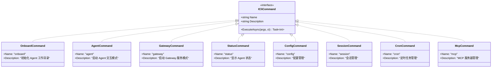
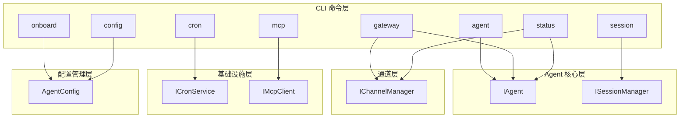

# CLI 命令层设计

本文档定义 NanoBot.Net 的 CLI 命令层设计，对应 nanobot 的 cli/commands.py。

**依赖关系**：CLI 命令层是应用入口，依赖于所有其他层。

---

## 模块概览

| 模块 | 对应原文件 | 职责 |
|------|-----------|------|
| ICliCommand | - | CLI 命令接口 |
| 命令实现 | `nanobot/cli/commands.py` | 各命令实现 |

---

## ICliCommand 接口

CLI 命令接口，基于 `System.CommandLine` 设计。

```csharp
namespace NanoBot.Cli.Commands;

/// <summary>
/// CLI 命令接口
/// </summary>
public interface ICliCommand
{
    /// <summary>命令名称</summary>
    string Name { get; }

    /// <summary>命令描述</summary>
    string Description { get; }

    /// <summary>执行命令</summary>
    Task<int> ExecuteAsync(string[] args, CancellationToken cancellationToken = default);
}
```

---

## 支持的 CLI 命令清单

| 命令 | 功能描述 | 主要参数 |
|------|----------|----------|
| **onboard** | 初始化 Agent 工作目录 | `--dir`, `--name` |
| **agent** | 启动 Agent 交互模式 | `--config`, `--channel` |
| **gateway** | 启动 Gateway 服务模式 | `--port`, `--channels` |
| **status** | 显示 Agent 状态 | `--json` |
| **config** | 配置管理 | `--set`, `--get`, `--list` |
| **session** | 会话管理 | `--list`, `--clear`, `--export` |
| **cron** | 定时任务管理 | `--list`, `--add`, `--remove` |
| **mcp** | MCP 服务器管理 | `--list`, `--connect`, `--disconnect` |

---

## 命令详细设计

### onboard 命令

初始化 Agent 工作目录，创建必要的文件和目录结构。

```csharp
namespace NanoBot.Cli.Commands;

/// <summary>
/// onboard 命令：初始化 Agent 工作目录
/// </summary>
public class OnboardCommand : ICliCommand
{
    public string Name => "onboard";
    public string Description => "初始化 Agent 工作目录";

    public Task<int> ExecuteAsync(string[] args, CancellationToken cancellationToken = default);
}
```

**参数**：
| 参数 | 类型 | 说明 |
|------|------|------|
| `--dir` | string | 工作目录路径，默认为当前目录 |
| `--name` | string | Agent 名称，默认为 "NanoBot" |

**执行流程**：
1. 创建工作目录
2. 创建配置文件 `config.json`
3. 创建记忆文件 `MEMORY.md`
4. 创建历史文件 `HISTORY.md`
5. 创建 Skills 目录 `skills/`

---

### agent 命令

启动 Agent 交互模式，在终端中与 Agent 进行对话。

```csharp
namespace NanoBot.Cli.Commands;

/// <summary>
/// agent 命令：启动 Agent 交互模式
/// </summary>
public class AgentCommand : ICliCommand
{
    public string Name => "agent";
    public string Description => "启动 Agent 交互模式";

    public Task<int> ExecuteAsync(string[] args, CancellationToken cancellationToken = default);
}
```

**参数**：
| 参数 | 类型 | 说明 |
|------|------|------|
| `--config` | string | 配置文件路径，默认为 `config.json` |
| `--channel` | string | 指定通道类型（如 telegram、discord） |

**执行流程**：
1. 加载配置文件
2. 初始化依赖注入容器
3. 注册所有服务
4. 启动 Agent 循环
5. 监听用户输入
6. 处理消息并输出响应

---

### gateway 命令

启动 Gateway 服务模式，监听多个通道的消息。

```csharp
namespace NanoBot.Cli.Commands;

/// <summary>
/// gateway 命令：启动 Gateway 服务模式
/// </summary>
public class GatewayCommand : ICliCommand
{
    public string Name => "gateway";
    public string Description => "启动 Gateway 服务模式";

    public Task<int> ExecuteAsync(string[] args, CancellationToken cancellationToken = default);
}
```

**参数**：
| 参数 | 类型 | 说明 |
|------|------|------|
| `--config` | string | 配置文件路径 |
| `--port` | int | HTTP 服务端口，默认为 8080 |
| `--channels` | string[] | 启用的通道列表 |

**执行流程**：
1. 加载配置文件
2. 初始化依赖注入容器
3. 启动所有启用的通道
4. 启动 Agent 循环
5. 启动 HTTP 健康检查端点
6. 等待关闭信号

---

### status 命令

显示 Agent 当前状态。

```csharp
namespace NanoBot.Cli.Commands;

/// <summary>
/// status 命令：显示 Agent 状态
/// </summary>
public class StatusCommand : ICliCommand
{
    public string Name => "status";
    public string Description => "显示 Agent 状态";

    public Task<int> ExecuteAsync(string[] args, CancellationToken cancellationToken = default);
}
```

**参数**：
| 参数 | 类型 | 说明 |
|------|------|------|
| `--json` | bool | 以 JSON 格式输出 |
| `--config` | string | 配置文件路径 |

**输出内容**：
- Agent 名称和工作目录
- 通道状态
- 会话数量
- 定时任务数量
- MCP 服务器状态

---

### config 命令

配置管理命令，用于查看和修改配置。

```csharp
namespace NanoBot.Cli.Commands;

/// <summary>
/// config 命令：配置管理
/// </summary>
public class ConfigCommand : ICliCommand
{
    public string Name => "config";
    public string Description => "配置管理";

    public Task<int> ExecuteAsync(string[] args, CancellationToken cancellationToken = default);
}
```

**参数**：
| 参数 | 类型 | 说明 |
|------|------|------|
| `--list` | bool | 列出所有配置 |
| `--get` | string | 获取指定配置项 |
| `--set` | string[] | 设置配置项（格式：key=value） |
| `--config` | string | 配置文件路径 |

---

### session 命令

会话管理命令，用于查看和管理对话会话。

```csharp
namespace NanoBot.Cli.Commands;

/// <summary>
/// session 命令：会话管理
/// </summary>
public class SessionCommand : ICliCommand
{
    public string Name => "session";
    public string Description => "会话管理";

    public Task<int> ExecuteAsync(string[] args, CancellationToken cancellationToken = default);
}
```

**参数**：
| 参数 | 类型 | 说明 |
|------|------|------|
| `--list` | bool | 列出所有会话 |
| `--clear` | string | 清除指定会话 |
| `--clear-all` | bool | 清除所有会话 |
| `--export` | string | 导出会话到文件 |
| `--config` | string | 配置文件路径 |

---

### cron 命令

定时任务管理命令。

```csharp
namespace NanoBot.Cli.Commands;

/// <summary>
/// cron 命令：定时任务管理
/// </summary>
public class CronCommand : ICliCommand
{
    public string Name => "cron";
    public string Description => "定时任务管理";

    public Task<int> ExecuteAsync(string[] args, CancellationToken cancellationToken = default);
}
```

**参数**：
| 参数 | 类型 | 说明 |
|------|------|------|
| `--list` | bool | 列出所有定时任务 |
| `--add` | string | 添加定时任务 |
| `--remove` | string | 移除定时任务 |
| `--enable` | string | 启用定时任务 |
| `--disable` | string | 禁用定时任务 |
| `--run` | string | 立即执行定时任务 |
| `--config` | string | 配置文件路径 |

---

### mcp 命令

MCP 服务器管理命令。

```csharp
namespace NanoBot.Cli.Commands;

/// <summary>
/// mcp 命令：MCP 服务器管理
/// </summary>
public class McpCommand : ICliCommand
{
    public string Name => "mcp";
    public string Description => "MCP 服务器管理";

    public Task<int> ExecuteAsync(string[] args, CancellationToken cancellationToken = default);
}
```

**参数**：
| 参数 | 类型 | 说明 |
|------|------|------|
| `--list` | bool | 列出所有 MCP 服务器 |
| `--tools` | bool | 列出所有可用工具 |
| `--connect` | string | 连接到 MCP 服务器 |
| `--disconnect` | string | 断开 MCP 服务器连接 |
| `--config` | string | 配置文件路径 |

---

## 命令注册

```csharp
namespace NanoBot.Cli;

/// <summary>
/// CLI 命令注册器
/// </summary>
public static class CommandRegistry
{
    public static IReadOnlyList<ICliCommand> GetCommands()
    {
        return new ICliCommand[]
        {
            new OnboardCommand(),
            new AgentCommand(),
            new GatewayCommand(),
            new StatusCommand(),
            new ConfigCommand(),
            new SessionCommand(),
            new CronCommand(),
            new McpCommand()
        };
    }
}
```

---

## 程序入口

```csharp
namespace NanoBot.Cli;

/// <summary>
/// CLI 程序入口
/// </summary>
public static class Program
{
    public static async Task<int> Main(string[] args)
    {
        var commands = CommandRegistry.GetCommands();
        var rootCommand = new RootCommand("NanoBot.Net - AI Agent CLI");

        foreach (var command in commands)
        {
            var cmd = new Command(command.Name, command.Description);
            cmd.SetHandler(async () =>
            {
                return await command.ExecuteAsync(args);
            });
            rootCommand.AddCommand(cmd);
        }

        return await rootCommand.InvokeAsync(args);
    }
}
```

---

## 类图



---

## 依赖关系



---

## 实现要点

### 命令行解析

1. 使用 `System.CommandLine` 库
2. 支持子命令和参数
3. 自动生成帮助信息

### 依赖注入

1. 每个命令通过 DI 获取所需服务
2. 支持服务生命周期管理

### 错误处理

1. 友好的错误信息输出
2. 适当的退出码
3. 异常日志记录

### 交互模式

1. 支持 REPL 模式
2. 支持多行输入
3. 支持命令历史

---

*返回 [概览文档](./NanoBot.Net-Overview.md)*
