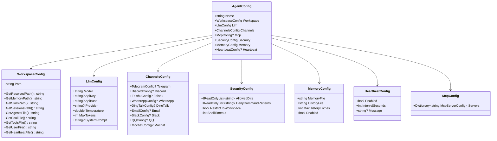

# 配置管理层设计

本文档定义 NanoBot.Net 的配置管理层设计，对应 nanobot 的 config/schema.py。

**依赖关系**：配置管理层是所有其他层的基础，提供统一的配置加载和管理能力。

---

## 模块概览

| 模块 | 对应原文件 | 职责 |
|------|-----------|------|
| AgentConfig | `nanobot/config/schema.py` | 根配置 |
| WorkspaceConfig | `nanobot/config/schema.py` | Workspace 配置 |
| LlmConfig | `nanobot/config/schema.py` | LLM 配置 |
| ChannelsConfig | `nanobot/config/schema.py` | 通道配置集合 |
| SecurityConfig | `nanobot/config/schema.py` | 安全配置 |
| MemoryConfig | `nanobot/config/schema.py` | 记忆配置 |
| HeartbeatConfig | `nanobot/config/schema.py` | 心跳配置 |
| McpConfig | `nanobot/config/schema.py` | MCP 配置 |

---

## AgentConfig 根配置

```csharp
namespace NanoBot.Core.Configuration;

/// <summary>
/// Agent 根配置，对应 nanobot/config/schema.py 的 AgentConfig
/// </summary>
public class AgentConfig
{
    /// <summary>Agent 名称</summary>
    public string Name { get; set; } = "NanoBot";

    /// <summary>Workspace 配置</summary>
    public WorkspaceConfig Workspace { get; set; } = new();

    /// <summary>LLM 模型配置</summary>
    public LlmConfig Llm { get; set; } = new();

    /// <summary>通道配置</summary>
    public ChannelsConfig Channels { get; set; } = new();

    /// <summary>MCP 配置</summary>
    public McpConfig? Mcp { get; set; }

    /// <summary>安全配置</summary>
    public SecurityConfig Security { get; set; } = new();

    /// <summary>记忆配置</summary>
    public MemoryConfig Memory { get; set; } = new();

    /// <summary>心跳配置</summary>
    public HeartbeatConfig? Heartbeat { get; set; }
}
```

---

## WorkspaceConfig Workspace 配置

```csharp
namespace NanoBot.Core.Configuration;

/// <summary>
/// Workspace 配置，对应 nanobot/config/schema.py 的 AgentDefaults.workspace
/// </summary>
public class WorkspaceConfig
{
    /// <summary>Workspace 路径（支持 ~ 展开）</summary>
    public string Path { get; set; } = "~/.nanobot/workspace";

    /// <summary>获取展开后的绝对路径</summary>
    public string GetResolvedPath()
    {
        string path = Path;
        if (path.StartsWith("~/"))
        {
            var home = Environment.GetFolderPath(Environment.SpecialFolder.UserProfile);
            path = Path.Combine(home, path[2..]);
        }
        return Path.GetFullPath(path);
    }

    /// <summary>获取 Memory 目录路径</summary>
    public string GetMemoryPath() => Path.Combine(GetResolvedPath(), "memory");

    /// <summary>获取 Skills 目录路径</summary>
    public string GetSkillsPath() => Path.Combine(GetResolvedPath(), "skills");

    /// <summary>获取 Sessions 目录路径</summary>
    public string GetSessionsPath() => Path.Combine(GetResolvedPath(), "sessions");

    /// <summary>获取 AGENTS.md 文件路径</summary>
    public string GetAgentsFile() => Path.Combine(GetResolvedPath(), "AGENTS.md");

    /// <summary>获取 SOUL.md 文件路径</summary>
    public string GetSoulFile() => Path.Combine(GetResolvedPath(), "SOUL.md");

    /// <summary>获取 TOOLS.md 文件路径</summary>
    public string GetToolsFile() => Path.Combine(GetResolvedPath(), "TOOLS.md");

    /// <summary>获取 USER.md 文件路径</summary>
    public string GetUserFile() => Path.Combine(GetResolvedPath(), "USER.md");

    /// <summary>获取 HEARTBEAT.md 文件路径</summary>
    public string GetHeartbeatFile() => Path.Combine(GetResolvedPath(), "HEARTBEAT.md");
}
```

---

## LlmConfig LLM 配置

```csharp
namespace NanoBot.Core.Configuration;

/// <summary>
/// LLM 配置
/// </summary>
public class LlmConfig
{
    /// <summary>模型名称</summary>
    public string Model { get; set; } = "";

    /// <summary>API 密钥</summary>
    public string? ApiKey { get; set; }

    /// <summary>API Base URL</summary>
    public string? ApiBase { get; set; }

    /// <summary>提供商名称</summary>
    public string? Provider { get; set; }

    /// <summary>温度参数</summary>
    public double Temperature { get; set; } = 0.7;

    /// <summary>最大 Token 数</summary>
    public int MaxTokens { get; set; } = 4096;

    /// <summary>系统提示词</summary>
    public string? SystemPrompt { get; set; }
}
```

---

## ChannelsConfig 通道配置集合

```csharp
namespace NanoBot.Core.Configuration;

/// <summary>
/// 通道配置集合
/// </summary>
public class ChannelsConfig
{
    public TelegramConfig? Telegram { get; set; }
    public DiscordConfig? Discord { get; set; }
    public FeishuConfig? Feishu { get; set; }
    public WhatsAppConfig? WhatsApp { get; set; }
    public DingTalkConfig? DingTalk { get; set; }
    public EmailConfig? Email { get; set; }
    public SlackConfig? Slack { get; set; }
    public QQConfig? QQ { get; set; }
    public MochatConfig? Mochat { get; set; }
}
```

---

## SecurityConfig 安全配置

```csharp
namespace NanoBot.Core.Configuration;

/// <summary>
/// 安全配置
/// </summary>
public class SecurityConfig
{
    /// <summary>允许访问的目录列表</summary>
    public IReadOnlyList<string> AllowedDirs { get; set; } = Array.Empty<string>();

    /// <summary>禁止执行的命令模式</summary>
    public IReadOnlyList<string> DenyCommandPatterns { get; set; } = Array.Empty<string>();

    /// <summary>是否限制在工作目录</summary>
    public bool RestrictToWorkspace { get; set; } = true;

    /// <summary>Shell 命令超时（秒）</summary>
    public int ShellTimeout { get; set; } = 60;
}
```

---

## MemoryConfig 记忆配置

```csharp
namespace NanoBot.Core.Configuration;

/// <summary>
/// 记忆配置
/// </summary>
public class MemoryConfig
{
    /// <summary>记忆文件路径</summary>
    public string MemoryFile { get; set; } = "MEMORY.md";

    /// <summary>历史文件路径</summary>
    public string HistoryFile { get; set; } = "HISTORY.md";

    /// <summary>最大历史条数</summary>
    public int MaxHistoryEntries { get; set; } = 500;

    /// <summary>是否启用记忆</summary>
    public bool Enabled { get; set; } = true;
}
```

---

## HeartbeatConfig 心跳配置

```csharp
namespace NanoBot.Core.Configuration;

/// <summary>
/// 心跳配置
/// </summary>
public class HeartbeatConfig
{
    /// <summary>是否启用</summary>
    public bool Enabled { get; set; }

    /// <summary>间隔秒数</summary>
    public int IntervalSeconds { get; set; } = 300;

    /// <summary>心跳消息</summary>
    public string? Message { get; set; }
}
```

---

## McpConfig MCP 配置

```csharp
namespace NanoBot.Core.Configuration;

/// <summary>
/// MCP 配置
/// </summary>
public class McpConfig
{
    /// <summary>MCP 服务器配置字典</summary>
    public Dictionary<string, McpServerConfig> Servers { get; set; } = new();
}
```

---

## 通道配置类

### TelegramConfig

```csharp
namespace NanoBot.Core.Configuration;

/// <summary>Telegram 通道配置</summary>
public class TelegramConfig
{
    public bool Enabled { get; set; }
    public string Token { get; set; } = "";  // Bot Token from @BotFather
    public IReadOnlyList<string> AllowFrom { get; set; } = Array.Empty<string>();
    public string? Proxy { get; set; }  // HTTP/SOCKS5 proxy URL
}
```

### DiscordConfig

```csharp
/// <summary>Discord 通道配置</summary>
public class DiscordConfig
{
    public bool Enabled { get; set; }
    public string Token { get; set; } = "";  // Bot token
    public IReadOnlyList<string> AllowFrom { get; set; } = Array.Empty<string>();
    public string GatewayUrl { get; set; } = "wss://gateway.discord.gg/?v=10&encoding=json";
    public int Intents { get; set; } = 37377;
}
```

### FeishuConfig

```csharp
/// <summary>飞书通道配置</summary>
public class FeishuConfig
{
    public bool Enabled { get; set; }
    public string AppId { get; set; } = "";
    public string AppSecret { get; set; } = "";
    public string EncryptKey { get; set; } = "";
    public string VerificationToken { get; set; } = "";
    public IReadOnlyList<string> AllowFrom { get; set; } = Array.Empty<string>();
}
```

### WhatsAppConfig

```csharp
/// <summary>WhatsApp 通道配置</summary>
public class WhatsAppConfig
{
    public bool Enabled { get; set; }
    public string BridgeUrl { get; set; } = "ws://localhost:3001";
    public string BridgeToken { get; set; } = "";
    public IReadOnlyList<string> AllowFrom { get; set; } = Array.Empty<string>();
}
```

### DingTalkConfig

```csharp
/// <summary>钉钉通道配置</summary>
public class DingTalkConfig
{
    public bool Enabled { get; set; }
    public string ClientId { get; set; } = "";  // AppKey
    public string ClientSecret { get; set; } = "";  // AppSecret
    public IReadOnlyList<string> AllowFrom { get; set; } = Array.Empty<string>();
}
```

### EmailConfig

```csharp
/// <summary>Email 通道配置</summary>
public class EmailConfig
{
    public bool Enabled { get; set; }
    public bool ConsentGranted { get; set; }  // 邮箱访问授权

    // IMAP（接收）
    public string ImapHost { get; set; } = "";
    public int ImapPort { get; set; } = 993;
    public string ImapUsername { get; set; } = "";
    public string ImapPassword { get; set; } = "";
    public string ImapMailbox { get; set; } = "INBOX";
    public bool ImapUseSsl { get; set; } = true;

    // SMTP（发送）
    public string SmtpHost { get; set; } = "";
    public int SmtpPort { get; set; } = 587;
    public string SmtpUsername { get; set; } = "";
    public string SmtpPassword { get; set; } = "";
    public bool SmtpUseTls { get; set; } = true;
    public string FromAddress { get; set; } = "";

    // 行为配置
    public bool AutoReplyEnabled { get; set; } = true;
    public int PollIntervalSeconds { get; set; } = 30;
    public bool MarkSeen { get; set; } = true;
    public int MaxBodyChars { get; set; } = 12000;
    public IReadOnlyList<string> AllowFrom { get; set; } = Array.Empty<string>();
}
```

### SlackConfig

```csharp
/// <summary>Slack 通道配置</summary>
public class SlackConfig
{
    public bool Enabled { get; set; }
    public string Mode { get; set; } = "socket";
    public string BotToken { get; set; } = "";  // xoxb-...
    public string AppToken { get; set; } = "";  // xapp-...
    public string GroupPolicy { get; set; } = "mention";  // mention, open, allowlist
    public IReadOnlyList<string> GroupAllowFrom { get; set; } = Array.Empty<string>();
    public SlackDmConfig Dm { get; set; } = new();
}

public class SlackDmConfig
{
    public bool Enabled { get; set; } = true;
    public string Policy { get; set; } = "open";  // open, allowlist
    public IReadOnlyList<string> AllowFrom { get; set; } = Array.Empty<string>();
}
```

### QQConfig

```csharp
/// <summary>QQ 通道配置</summary>
public class QQConfig
{
    public bool Enabled { get; set; }
    public string AppId { get; set; } = "";  // 机器人 ID
    public string Secret { get; set; } = "";  // 机器人密钥
    public IReadOnlyList<string> AllowFrom { get; set; } = Array.Empty<string>();
}
```

### MochatConfig

```csharp
/// <summary>Mochat 通道配置</summary>
public class MochatConfig
{
    public bool Enabled { get; set; }
    public string BaseUrl { get; set; } = "https://mochat.io";
    public string SocketUrl { get; set; } = "";
    public string SocketPath { get; set; } = "/socket.io";
    public string ClawToken { get; set; } = "";
    public string AgentUserId { get; set; } = "";
    public IReadOnlyList<string> Sessions { get; set; } = Array.Empty<string>();
    public IReadOnlyList<string> Panels { get; set; } = Array.Empty<string>();
    public IReadOnlyList<string> AllowFrom { get; set; } = Array.Empty<string>();
    public MochatMentionConfig Mention { get; set; } = new();
    public string ReplyDelayMode { get; set; } = "non-mention";
    public int ReplyDelayMs { get; set; } = 120000;
}

public class MochatMentionConfig
{
    public bool RequireInGroups { get; set; }
}
```

---

## 配置文件示例

```json
{
  "name": "NanoBot",
  "workspace": {
    "path": "~/.nanobot/workspace"
  },
  "llm": {
    "model": "anthropic/claude-3.5-sonnet",
    "provider": "openrouter",
    "apiKey": "${OPENROUTER_API_KEY}",
    "temperature": 0.7,
    "maxTokens": 4096
  },
  "channels": {
    "telegram": {
      "enabled": true,
      "token": "${TELEGRAM_BOT_TOKEN}",
      "allowFrom": []
    },
    "discord": {
      "enabled": false,
      "token": "${DISCORD_BOT_TOKEN}",
      "allowFrom": []
    }
  },
  "security": {
    "allowedDirs": [],
    "denyCommandPatterns": [
      "rm -rf /",
      "sudo"
    ],
    "restrictToWorkspace": true,
    "shellTimeout": 60
  },
  "memory": {
    "memoryFile": "MEMORY.md",
    "historyFile": "HISTORY.md",
    "maxHistoryEntries": 500,
    "enabled": true
  },
  "mcp": {
    "servers": {
      "filesystem": {
        "command": "mcp-filesystem",
        "args": ["--root", "~/.nanobot/workspace"]
      }
    }
  }
}
```

---

## 类图



---

## 配置加载

使用 `Microsoft.Extensions.Configuration` 支持多种配置源：

```csharp
var configuration = new ConfigurationBuilder()
    .SetBasePath(Directory.GetCurrentDirectory())
    .AddJsonFile("config.json", optional: false, reloadOnChange: true)
    .AddEnvironmentVariables()
    .Build();

var config = configuration.Get<AgentConfig>();
```

### 环境变量支持

- 支持 `${VAR_NAME}` 语法引用环境变量
- 支持环境变量覆盖配置值
- 敏感信息（API Key 等）优先从环境变量读取

---

## 实现要点

### 配置验证

1. 必填字段验证
2. 格式验证（URL、路径等）
3. 逻辑验证（依赖关系）

### 配置热重载

1. 监听配置文件变更
2. 触发配置变更事件
3. 组件响应配置变更

### 安全性

1. 敏感信息不从配置文件明文读取
2. 支持环境变量注入
3. 支持密钥管理服务集成

---

*返回 [概览文档](./NanoBot.Net-Overview.md)*
