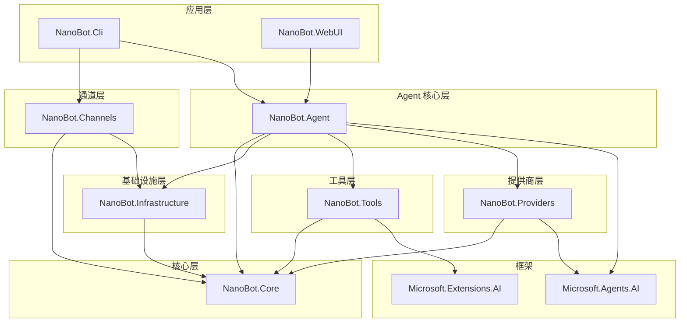

# NanoBot.Net 功能清单

本文档整理了 NanoBot.Net 的完整功能清单，按项目和模块进行划分。

---

## 状态标识说明

| 状态 | 标识 | 说明 |
|------|------|------|
| 已完成 | ✅ | 功能开发完成并可用 |
| 开发中 | 🚧 | 正在开发中 |
| 计划中 | 📋 | 规划中尚未开始 |
| 优化中 | 🔧 | 存在但需要优化改进 |
| 已弃用 | ⚠️ | 不推荐使用，可能在未来移除 |
| 已删除 | ❌ | 已从项目中移除 |

---

## 项目总览

| 项目 | 命名空间 | 简介 |
|------|----------|------|
| **NanoBot.Core** | `NanoBot.Core.*` | 核心抽象层，定义所有接口和配置模型，基于 Microsoft.Agents.AI 框架构建，提供通道、消息总线、记忆、会话、Cron、心跳、Skills 等核心抽象 |
| **NanoBot.Infrastructure** | `NanoBot.Infrastructure.*` | 基础设施实现层，实现核心抽象接口，提供 WorkspaceManager、MessageBus、CronService、HeartbeatService、SkillsLoader、MemoryStore、BrowserService 等服务 |
| **NanoBot.Providers** | `NanoBot.Providers.*` | LLM 提供商层，基于框架的 IChatClient 封装多提供商支持，包含 ChatClientFactory、SanitizingChatClient 等客户端包装器 |
| **NanoBot.Tools** | `NanoBot.Tools.*` | 工具实现层，基于框架的 AIFunctionFactory 创建内置工具，提供文件读写、Shell 执行、Web 搜索、MCP 客户端、Browser 自动化等能力 |
| **NanoBot.Channels** | `NanoBot.Channels.*` | 通道实现层，实现多平台消息接入，支持 Telegram、Discord、飞书、Email、Slack、WhatsApp、钉钉、QQ、Mochat 等通道 |
| **NanoBot.Agent** | `NanoBot.Agent.*` | Agent 核心实现层，基于框架的 ChatClientAgent 构建，提供 AgentRuntime、上下文提供者、会话管理、工具调用等核心逻辑 |
| **NanoBot.Cli** | `NanoBot.Cli` | 命令行入口层，基于 System.CommandLine 构建，提供 onboard、agent、gateway、status、config、session、cron、mcp、channels、provider、webui 等命令 |
| **NanoBot.WebUI** | `NanoBot.WebUI` | Web 用户界面层，基于 Blazor Server 构建，提供聊天、配置管理、Profile 管理等可视化功能，支持 SignalR 实时通信 |

---

## 1. NanoBot.Core（核心抽象层）

### 1.1 常量定义

| 类名 | 功能描述 | 状态 |
|------|----------|------|
| `AgentConstants` | Agent 常量定义 | ✅ |

### 1.2 配置模型（Configuration）

| 类名 | 功能描述 | 状态 |
|------|----------|------|
| `AgentConfig` | 根配置，包含所有配置子项 | ✅ |
| `WorkspaceConfig` | Workspace 路径配置 | ✅ |
| `LlmConfig` | LLM 模型配置（模型、API Key、温度等） | ✅ |
| `ChannelsConfig` | 通道配置集合 | ✅ |
| `SecurityConfig` | 安全配置（目录限制、命令拦截等） | ✅ |
| `MemoryConfig` | 记忆配置（记忆文件、历史条数等） | ✅ |
| `HeartbeatConfig` | 心跳配置（启用、间隔、消息） | ✅ |
| `McpConfig` | MCP 服务器配置 | ✅ |
| `WebUIConfig` | WebUI 配置 | ✅ |

### 1.3 通道抽象（Channels）

| 类名/接口 | 功能描述 | 状态 |
|------------|----------|------|
| `IChannel` | 通道接口 | ✅ |
| `IChannelManager` | 通道管理器接口 | ✅ |
| `InboundMessage` | 入站消息数据结构 | ✅ |
| `OutboundMessage` | 出站消息数据结构 | ✅ |
| `ChannelStatus` | 通道状态 | ✅ |

### 1.4 消息总线（Bus）

| 类名/接口 | 功能描述 | 状态 |
|------------|----------|------|
| `IMessageBus` | 消息总线接口 | ✅ |
| `InboundMessage` | 入站消息 | ✅ |
| `OutboundMessage` | 出站消息 | ✅ |
| `BusMessage` | 总线消息基类 | ❌ 已删除 |
| `BusMessageType` | 消息类型枚举 | ❌ 已删除 |

### 1.5 记忆存储（Memory）

| 类名/接口 | 功能描述 | 状态 |
|------------|----------|------|
| `IMemoryStore` | 记忆存储接口 | ✅ |

### 1.6 会话管理（Sessions）

| 类名/接口 | 功能描述 | 状态 |
|------------|----------|------|
| `ISessionManager` | 会话管理器接口 | ✅ |
| `IMessageStore` | 消息存储接口 | ✅ |

### 1.7 工作空间（Workspace）

| 类名/接口 | 功能描述 | 状态 |
|------------|----------|------|
| `IWorkspaceManager` | 工作空间管理器接口 | ✅ |
| `IBootstrapLoader` | 引导文件加载器接口 | ✅ |
| `BootstrapFile` | 引导文件枚举 | ✅ |

### 1.8 定时任务（Cron）

| 类名/接口 | 功能描述 | 状态 |
|------------|----------|------|
| `ICronService` | 定时任务服务接口 | ✅ |
| `CronJob` | 定时任务模型 | ✅ |
| `CronJobDefinition` | 定时任务定义 | ✅ |
| `CronJobState` | 定时任务状态 | ✅ |
| `CronSchedule` | Cron 表达式解析 | ✅ |
| `CronServiceStatus` | 服务状态 | ✅ |

### 1.9 心跳服务（Heartbeat）

| 类名/接口 | 功能描述 | 状态 |
|------------|----------|------|
| `IHeartbeatService` | 心跳服务接口 | ✅ |
| `HeartbeatDefinition` | 心跳定义 | ✅ |
| `HeartbeatJob` | 心跳任务模型 | ✅ |
| `HeartbeatStatus` | 心跳状态 | ✅ |

### 1.10 技能系统（Skills）

| 类名/接口 | 功能描述 | 状态 |
|------------|----------|------|
| `ISkillsLoader` | 技能加载器接口 | ✅ |
| `ISkillsProvider` | 技能加载和访问能力 | ✅ |
| `ISkillsMetadataProvider` | 技能元数据和需求检查 | ✅ |
| `Skill` | 技能数据模型 | ✅ |
| `SkillMetadata` | 技能元数据 | ✅ |
| `SkillSummary` | 技能摘要 | ✅ |
| `SkillsChangedEventArgs` | 技能变更事件 | ✅ |

### 1.11 子代理（Subagents）

| 类名/接口 | 功能描述 | 状态 |
|------------|----------|------|
| `ISubagentManager` | 子代理管理器接口 | ✅ |
| `SubagentInfo` | 子代理信息模型 | ✅ |
| `SubagentResult` | 子代理结果 | ✅ |
| `SubagentStatus` | 子代理状态 | ✅ |
| `SubagentCompletedEventArgs` | 完成事件 | ✅ |

### 1.12 MCP 支持

| 类名/接口 | 功能描述 | 状态 |
|------------|----------|------|
| `IMcpClient` | MCP 客户端接口 | ✅ |

### 1.13 存储服务

| 类名/接口 | 功能描述 | 状态 |
|------------|----------|------|
| `IFileStorageService` | 文件存储服务接口（含会话目录删除） | ✅ |

### 1.14 Browser 工具

| 类名/接口 | 功能描述 | 状态 |
|------------|----------|------|
| `IBrowserService` | 浏览器服务接口 | ✅ |
| `BrowserToolRequest` | 浏览器工具请求 | ✅ |
| `BrowserToolResponse` | 浏览器工具响应 | ✅ |
| `BrowserActionRequest` | 浏览器操作请求 | ✅ |
| `BrowserTabInfo` | 浏览器标签页信息 | ✅ |

### 1.15 RPA 工具

| 类名/接口 | 功能描述 | 状态 |
|------------|----------|------|
| `IRpaService` | RPA 服务接口 | ✅ |
| `IRpaExecutor` | RPA 流程执行器 | ✅ |
| `IRpaHealthProvider` | RPA 健康状态提供 | ✅ |
| `IScreenAnalyzer` | 屏幕分析接口 | ✅ |

### 1.16 定时任务（Jobs）

| 类名/接口 | 功能描述 | 状态 |
|------------|----------|------|
| `ScheduledJob` | 定时任务基类 | ✅ |

---

## 2. NanoBot.Infrastructure（基础设施实现）

### 2.1 工作空间（Workspace）

| 类名 | 功能描述 | 状态 |
|------|----------|------|
| `WorkspaceManager` | 工作空间管理器实现 | ✅ |
| `BootstrapLoader` | 引导文件加载器实现 | ✅ |

### 2.2 消息总线（Bus）

| 类名 | 功能描述 | 状态 |
|------|----------|------|
| `MessageBus` | 基于 `Channel<T>` 的消息总线实现 | ✅ |

### 2.3 定时任务（Cron）

| 类名 | 功能描述 | 状态 |
|------|----------|------|
| `CronService` | Cron 定时任务服务实现 | ✅ |

### 2.4 心跳服务（Heartbeat）

| 类名 | 功能描述 | 状态 |
|------|----------|------|
| `HeartbeatService` | 心跳服务实现 | ✅ |

### 2.5 技能加载（Skills）

| 类名 | 功能描述 | 状态 |
|------|----------|------|
| `SkillsLoader` | 技能加载器实现 | ✅ |

### 2.6 子代理管理（Subagents）

| 类名 | 功能描述 | 状态 |
|------|----------|------|
| `SubagentManager` | 子代理管理器实现 | ✅ |

### 2.7 资源加载（Resources）

| 类名 | 功能描述 | 状态 |
|------|----------|------|
| `EmbeddedResourceLoader` | 嵌入式资源加载器 | ✅ |
| `IEmbeddedResourceLoader` | 资源加载器接口 | ✅ |

### 2.8 记忆存储（Memory）

| 类名 | 功能描述 | 状态 |
|------|----------|------|
| `MemoryStore` | 记忆存储实现 | ✅ |
| `MemoryConsolidator` | 记忆整合器 | ✅ |

### 2.9 存储服务（Storage）

| 类名 | 功能描述 | 状态 |
|------|----------|------|
| `FileStorageService` | 文件存储服务实现（含会话目录删除） | ✅ |

### 2.10 浏览器服务（Browser）

| 类名 | 功能描述 | 状态 |
|------|----------|------|
| `BrowserService` | 浏览器服务实现（统一接口） | ✅ |
| `BrowserRefSnapshot` | 浏览器引用快照 | ✅ |

### 2.11 扩展方法

| 类名 | 功能描述 | 状态 |
|------|----------|------|
| `ServiceCollectionExtensions` | DI 扩展方法 | ✅ |

---

## 3. NanoBot.Providers（LLM 提供商）

### 3.1 提供商工厂

| 类名 | 功能描述 | 状态 |
|------|----------|------|
| `ChatClientFactory` | ChatClient 工厂 | ✅ |

### 3.2 客户端包装

| 类名 | 功能描述 | 状态 |
|------|----------|------|
| `SanitizingChatClient` | 消息清理客户端 | ✅ |
| `InterimTextRetryChatClient` | 临时文本重试客户端 | ✅ |

### 3.3 扩展方法

| 类名 | 功能描述 | 状态 |
|------|----------|------|
| `ServiceCollectionExtensions` | DI 扩展方法 | ✅ |

---

## 4. NanoBot.Tools（工具实现）

### 4.1 工具提供器

| 类名 | 功能描述 | 状态 |
|------|----------|------|
| `ToolProvider` | 工具提供器 | ✅ |

### 4.2 文件系统工具（Filesystem）

| 工具名称 | 功能描述 | 状态 |
|----------|----------|------|
| `read_file` | 读取文件内容，支持行范围 | ✅ |
| `write_file` | 写入文件内容，自动创建父目录 | ✅ |
| `edit_file` | 编辑文件，替换指定文本 | ✅ |
| `list_dir` | 列出目录内容，支持递归 | ✅ |

### 4.3 Shell 工具

| 工具名称 | 功能描述 | 状态 |
|----------|----------|------|
| `exec` | 执行 Shell 命令，支持超时和工作目录 | ✅ |

### 4.4 Web 工具

| 工具名称 | 功能描述 | 状态 |
|----------|----------|------|
| `web_search` | 网页搜索（使用 Brave Search API） | ✅ |
| `web_fetch` | 获取网页内容，提取正文 | ✅ |

### 4.5 消息工具

| 工具名称 | 功能描述 | 状态 |
|----------|----------|------|
| `message` | 发送消息到指定通道 | ✅ |

### 4.6 Spawn 工具

| 工具名称 | 功能描述 | 状态 |
|----------|----------|------|
| `spawn` | 创建子 Agent | ✅ |

### 4.7 Cron 工具

| 工具名称 | 功能描述 | 状态 |
|----------|----------|------|
| `cron` | 管理定时任务 | ✅ |

### 4.8 Browser 工具

| 工具名称 | 功能描述 | 状态 |
|----------|----------|------|
| `browser_navigate` | 浏览器导航 | ✅ |
| `browser_click` | 浏览器点击 | ✅ |
| `browser_type` | 浏览器输入 | ✅ |
| `browser_screenshot` | 浏览器截图 | ✅ |
| `browser_get_content` | 获取页面内容 | ✅ |

### 4.9 MCP 客户端

| 类名 | 功能描述 | 状态 |
|------|----------|------|
| `McpClient` | MCP 客户端实现 | ✅ |
| `IMcpClient` | MCP 客户端接口 | ✅ |

### 4.10 扩展方法

| 类名 | 功能描述 | 状态 |
|------|----------|------|
| `ServiceCollectionExtensions` | DI 扩展方法 | ✅ |

---

## 5. NanoBot.Channels（通道实现）

### 5.1 通道管理器

| 类名 | 功能描述 | 状态 |
|------|----------|------|
| `ChannelManager` | 通道管理器实现 | ✅ |
| `ChannelBase` | 通道基类 | ✅ |

### 5.2 通道实现

| 通道 | 功能描述 | 状态 |
|------|----------|------|
| `TelegramChannel` | Telegram 机器人通道 | ✅ |
| `DiscordChannel` | Discord 机器人通道 | ✅ |
| `FeishuChannel` | 飞书通道 | ✅ |
| `EmailChannel` | Email 通道（IMAP/SMTP） | ✅ |
| `SlackChannel` | Slack 通道 | ✅ |
| `WhatsAppChannel` | WhatsApp 通道（通过 Bridge） | ✅ |
| `DingTalkChannel` | 钉钉通道 | ✅ |
| `QQChannel` | QQ 机器人通道 | ✅ |
| `MochatChannel` | Mochat 平台通道 | ✅ |

### 5.3 扩展方法

| 类名 | 功能描述 | 状态 |
|------|----------|------|
| `ServiceCollectionExtensions` | DI 扩展方法 | ✅ |

---

## 6. NanoBot.Agent（Agent 核心实现）

### 6.1 Agent 运行时

| 类名 | 功能描述 | 状态 |
|------|----------|------|
| `AgentRuntime` | Agent 运行时核心 | ✅ |
| `NanoBotAgentFactory` | Agent 工厂 | ✅ |
| `BusProgressReporter` | 总线进度报告器 | ✅ |
| `IProgressReporter` | 进度报告器接口 | ✅ |
| `ToolHintFormatter` | 工具提示格式化器 | ✅ |

### 6.2 服务类

| 类名 | 功能描述 | 状态 |
|------|----------|------|
| `MessageProcessor` | 非流式消息处理 | ✅ |
| `StreamingProcessor` | 流式消息处理 | ✅ |
| `MemoryConsolidationService` | 记忆整合服务 | ✅ |
| `SessionTitleManager` | 会话标题管理 | ✅ |
| `ImageContentProcessor` | 图片内容处理 | ✅ |
| `AgentExtensions` | ChatClientAgent 扩展方法 | ✅ |

### 6.3 记忆存储

| 类名 | 功能描述 | 状态 |
|------|----------|------|
| `SessionManager` | 会话管理器实现 | ✅ |

### 6.3 上下文提供者

| 类名 | 功能描述 | 状态 |
|------|----------|------|
| `FileBackedChatHistoryProvider` | 基于文件的历史记录提供者 | ✅ |
| `CompositeChatHistoryProvider` | 组合历史记录提供者 | ✅ |
| `MemoryConsolidationChatHistoryProvider` | 记忆整合历史提供者 | ✅ |
| `BootstrapContextProvider` | 引导文件上下文提供者 | ✅ |
| `MemoryContextProvider` | 记忆上下文提供者 | ✅ |
| `MemoryConsolidationContextProvider` | 记忆整合上下文提供者 | ✅ |
| `SkillsContextProvider` | 技能上下文提供者 | ✅ |

### 6.4 工具

| 类名 | 功能描述 | 状态 |
|------|----------|------|
| `SpawnTool` | Spawn 工具实现 | ✅ |

### 6.5 扩展方法

| 类名 | 功能描述 | 状态 |
|------|----------|------|
| `ServiceCollectionExtensions` | DI 扩展方法 | ✅ |
| `AgentSessionExtensions` | AgentSession 扩展 | ✅ |

---

## 7. NanoBot.Cli（命令行入口）

### 7.1 命令实现

| 命令 | 功能描述 | 状态 |
|------|----------|------|
| `OnboardCommand` | 初始化工作目录 | ✅ |
| `AgentCommand` | 启动 Agent 交互模式 | ✅ |
| `GatewayCommand` | 启动 Gateway 服务模式 | ✅ |
| `StatusCommand` | 显示 Agent 状态 | ✅ |
| `ConfigCommand` | 配置管理 | ✅ |
| `SessionCommand` | 会话管理 | ✅ |
| `CronCommand` | 定时任务管理 | ✅ |
| `McpCommand` | MCP 服务器管理 | ✅ |
| `ChannelsCommand` | 通道管理 | ✅ |
| `ProviderCommand` | 提供商管理 | ✅ |
| `WebUICommand` | 启动 WebUI | ✅ |

### 7.2 核心组件

| 类名 | 功能描述 | 状态 |
|------|----------|------|
| `ICliCommand` | CLI 命令接口 | ✅ |
| `NanoBotCommandBase` | CLI 命令基类 | ✅ |
| `CliCommandContext` | CLI 命令上下文 | ✅ |
| `Program` | 程序入口 | ✅ |
| `LlmProfileConfigService` | LLM 配置文件服务 | ✅ |

### 7.3 扩展方法

| 类名 | 功能描述 | 状态 |
|------|----------|------|
| `ServiceCollectionExtensions` | DI 扩展方法 | ✅ |

---

## 8. NanoBot.WebUI（Web 用户界面）

### 8.1 页面组件

| 类名 | 功能描述 | 状态 |
|------|----------|------|
| `Chat` | 聊天页面 | ✅ |
| `Home` | 首页 | ✅ |
| `Config` | 配置页面 | ✅ |
| `ConfigProfiles` | 配置 profile 列表 | ✅ |
| `ConfigProfileEdit` | 配置 profile 编辑 | ✅ |
| `ConfigProfileNew` | 配置 profile 新建 | ✅ |
| `Settings` | 设置页面 | ✅ |
| `Weather` | 天气示例页面 | ✅ |
| `Counter` | 计数器示例 | ✅ |
| `Error` | 错误页面 | ✅ |

### 8.2 布局组件

| 类名 | 功能描述 | 状态 |
|------|----------|------|
| `MainLayout` | 主布局 | ✅ |
| `NavMenu` | 导航菜单（含会话历史、删除、重命名） | ✅ |

### 8.3 共享组件

| 类名 | 功能描述 | 状态 |
|------|----------|------|
| `MarkdownRenderer` | Markdown 渲染器 | ✅ |
| `EnhancedMarkdownRenderer` | 增强版 Markdown 渲染器 | 📋 |
| `AddProfileDialog` | 添加 Profile 对话框 | ✅ |
| `ConfirmDialog` | 确认删除对话框 | ✅ |
| `RenameDialog` | 会话重命名对话框 | ✅ |
| `PasswordDialog` | 会话密码设置对话框 | 📋 |
| `ExpirationDialog` | 会话过期设置对话框 | 📋 |
| `MessageActions` | 消息操作菜单 | 📋 |
| `DragDropZone` | 拖拽上传区域组件 | 📋 |
| `MessagePartComponent` | 消息 Part 分发器 | ✅ |
| `TextPartComponent` | 文本 Part 渲染组件 | ✅ |
| `ToolPartComponent` | 工具调用可视化组件 | ✅ |
| `FilePartComponent` | 文件 Part 渲染组件 | ✅ |
| `ReasoningPartComponent` | 推理过程展示组件 | ✅ |
| `TokenUsageDisplay` | Token 使用统计展示 | 📋 |

### 8.4 消息格式增强（Part 系统）

> 基于 [20260310-message-format-enhancement.md](../plans/archive/update/20260310-message-format-enhancement.md) 计划实现

| 类名/接口 | 功能描述 | 状态 |
|-----------|----------|------|
| `MessageWithParts` | 支持 Part 的消息模型 | ✅ |
| `MessagePart` | Part 抽象基类 | ✅ |
| `TextPart` | 文本 Part | ✅ |
| `ToolPart` | 工具调用 Part（含状态） | ✅ |
| `FilePart` | 文件附件 Part | ✅ |
| `ReasoningPart` | 推理过程 Part | ✅ |
| `MessageMetadata` | 消息元数据（Token/成本/模型） | ✅ |
| `ToolState` | 工具状态抽象基类 | ✅ |
| `PendingToolState` | 等待执行状态 | ✅ |
| `RunningToolState` | 执行中状态（支持实时元数据） | ✅ |
| `CompletedToolState` | 执行完成状态 | ✅ |
| `ErrorToolState` | 执行错误状态 | ✅ |
| `TokenUsage` | Token 使用统计 | ✅ |
| `CostInfo` | 成本信息 | ✅ |
| `ModelInfo` | 模型信息 | ✅ |

### 8.5 消息转换器

| 类名 | 功能描述 | 状态 |
|------|----------|------|
| `MessageAdapter` | MessageWithParts 与 Inbound/Outbound 消息转换 | ✅ |
| `MessagePartConverter` | MessagePart 与 ChatMessage 转换器 | 🚧 |
| `ToolExecutionTracker` | 工具执行追踪器（IProgress 支持） | ✅ |

### 8.6 服务类

| 类名 | 功能描述 | 状态 |
|------|----------|------|
| `ConfigPaths` | 统一配置路径 | ✅ |
| `ChannelFormattingService` | 通道格式化服务 | ✅ |
| `ChannelConfigRenderer` | 通道配置渲染器 | ✅ |
| `ChatFormattingService` | 聊天格式化服务 | ✅ |
| `SessionMessageParser` | 会话消息解析器 | ✅ |

### 8.7 共享组件

| 类名 | 功能描述 | 状态 |
|------|----------|------|
| `ChatMessage` | 聊天消息模型 | ✅ |
| `ChatToolExecution` | 工具执行模型 | ✅ |
| `MessagePartsRenderer` | Parts 交错渲染组件 | ✅ |

### 8.9 服务

| 类名 | 功能描述 | 状态 |
|------|----------|------|
| `AgentService` | Agent 服务 | ✅ |
| `IAgentService` | Agent 服务接口 | ✅ |
| `SessionService` | 会话服务（含持久化、标题管理） | ✅ |
| `ISessionService` | 会话服务接口 | ✅ |
| `AuthService` | 认证服务 | ✅ |
| `IAuthService` | 认证服务接口 | ✅ |
| `SharedSessionState` | 共享会话状态（实时同步） | 📋 |
| `SessionProtectionService` | 会话密码保护服务 | 📋 |
| `ExpirationCleanupService` | 会话过期清理服务 | 📋 |
| `KeyboardShortcutService` | 键盘快捷键服务 | 📋 |
| `DragDropService` | 拖拽上传服务 | 📋 |
| `MessagePartService` | 消息 Part 管理服务 | 📋 |
| `ToolStatusService` | 工具状态跟踪服务 | 📋 |
| `StreamingMessageService` | 流式消息处理服务 | 📋 |

### 8.10 SignalR Hub

| 类名 | 功能描述 | 状态 |
|------|----------|------|
| `ChatHub` | 聊天 Hub（基础实现） | ✅ |
| `ChatHub` | 聊天 Hub（实时同步扩展） | 📋 |
| `HubConnectionService` | SignalR 连接管理服务 | 📋 |
| `PartSyncHub` | Part 同步 Hub（流式更新） | 📋 |

### 8.11 控制器

| 类名 | 功能描述 | 状态 |
|------|----------|------|
| `FilesController` | 文件控制器 | ✅ |

### 8.11 WebUI 功能对比（基于 OpenCode 对比分析）

> **说明**: 本章节基于 [20250310-webui-comparison.md](../reports/update/20250310-webui-comparison.md) 对比报告整理，详细列出 NanoBot.Net WebUI 与 OpenCode WebUI 的功能差距。

#### 8.11.0 功能实现优先级速查

| 优先级 | 功能 | 当前状态 | 计划实现时间 |
|--------|------|----------|--------------|
| **P0 (重大差距)** | 消息分享 | ❌ 缺失 | Q2 2026 |
| **P0 (重大差距)** | 实时同步 | ❌ 缺失 | Q2 2026 |
| **P0 (重大差距)** | 分享控制 | ❌ 缺失 | Q2 2026 |
| **P1 (重要差距)** | 密码保护 | ❌ 缺失 | Q2 2026 |
| **P1 (重要差距)** | 过期时间 | ❌ 缺失 | Q2 2026 |
| **P1 (重要差距)** | 快捷键 | ❌ 缺失 | Q2 2026 |
| **P1 (重要差距)** | 拖拽上传 | ❌ 缺失 | Q2 2026 |
| **P1 (重要差距)** | 会话搜索 | ❌ 缺失 | Q3 2026 |
| **P2 (一般差距)** | 消息搜索 | ❌ 缺失 | Q3 2026 |
| **P2 (一般差距)** | 消息导出 | ❌ 缺失 | Q3 2026 |
| **P2 (一般差距)** | 自定义域名 | ❌ 缺失 | Q4 2026 |
| **P2 (一般差距)** | 配置导入导出 | ❌ 缺失 | Q3 2026 |
| **P3 (可选功能)** | 会话标签 | ❌ 缺失 | 待定 |
| **P3 (可选功能)** | 会话归档 | ❌ 缺失 | 待定 |
| **P3 (可选功能)** | 消息分支 | ❌ 缺失 | 待定 |
| **优化项** | 设置持久化 | ⚠️ 部分实现 | Q2 2026 |
| **优化项** | 代码高亮 | 🔧 需增强 | Q2 2026 |

**详细实现方案**: 参见 [20250310-webui-enhancement-plan.md](../plans/archive/update/20250310-webui-enhancement-plan.md)

#### 8.11.1 会话管理功能

| 功能 | NanoBot.Net 状态 | OpenCode 状态 | 差距分析 |
|------|------------------|---------------|----------|
| 会话列表 | ✅ 基础实现 | ✅ 完整实现 | OpenCode 有更丰富的元数据 |
| 会话创建 | ✅ 支持 | ✅ 支持 | 功能相当 |
| 会话重命名 | ✅ 支持 | ✅ 支持 | 功能相当 |
| 会话删除 | ✅ 支持 | ✅ 支持 | 功能相当 |
| 会话搜索 | ❌ 缺失 | ✅ 支持 | **需要实现** |
| 会话标签 | ❌ 缺失 | ✅ 支持 | **需要实现** |
| 会话归档 | ❌ 缺失 | ✅ 支持 | **需要实现** |

#### 8.11.2 聊天界面功能

| 功能 | NanoBot.Net 状态 | OpenCode 状态 | 差距分析 |
|------|------------------|---------------|----------|
| 流式输出 | ✅ SignalR 实现 | ✅ WebSocket 实现 | 技术不同，体验相当 |
| 消息历史 | ✅ 支持 | ✅ 支持 | 功能相当 |
| 工具调用可视化 | ✅ 新增功能 | ✅ 完整实现 | OpenCode 更详细 |
| 代码高亮 | ✅ MudBlazor 内置 | ✅ Shiki | OpenCode 语法支持更全面 |
| 消息复制 | ✅ 基础实现 | ✅ 多格式复制 | OpenCode 支持富文本复制 |
| 消息分享 | ❌ 缺失 | ✅ 核心功能 | **重大差距** |
| 消息导出 | ❌ 缺失 | ✅ 支持 | **需要实现** |
| 消息搜索 | ❌ 缺失 | ✅ 支持 | **需要实现** |
| 消息分支 | ❌ 缺失 | ✅ 支持 | **需要实现** |

#### 8.11.2.1 消息格式增强（Part 系统）

> 参考 [20260310-message-format-enhancement.md](../plans/archive/update/20260310-message-format-enhancement.md)

| 功能 | NanoBot.Net 状态 | OpenCode 状态 | 差距分析 |
|------|------------------|---------------|----------|
| Part 系统架构 | 📋 计划中 | ✅ 完整实现 | **需要实现** |
| 文本 Part | 📋 计划中 | ✅ 支持 | **需要实现** |
| 工具调用 Part | 📋 计划中 | ✅ 支持状态跟踪 | **需要实现** |
| 工具结果 Part | 📋 计划中 | ✅ 支持 | **需要实现** |
| 图片 Part | 📋 计划中 | ✅ 支持 | **需要实现** |
| 推理过程 Part | 📋 计划中 | ✅ 支持 | **需要实现** |
| Token 使用统计 | 📋 计划中 | ✅ 支持 | **需要实现** |
| 成本计算 | 📋 计划中 | ✅ 支持 | **需要实现** |
| 模型信息显示 | 📋 计划中 | ✅ 支持 | **需要实现** |
| 流式 Part 更新 | 📋 计划中 | ✅ 支持 | **需要实现** |

#### 8.11.3 分享功能（OpenCode 核心优势）

| 功能 | NanoBot.Net 状态 | OpenCode 状态 | 差距分析 |
|------|------------------|---------------|----------|
| 公开链接分享 | ❌ 完全缺失 | ✅ 核心功能 | **重大差距** |
| 实时同步 | ❌ 缺失 | ✅ WebSocket 实时 | **重大差距** |
| 分享控制 | ❌ 缺失 | ✅ 手动/自动/关闭 | **重大差距** |
| 自定义域名 | ❌ 缺失 | ✅ 支持 | **需要实现** |
| 密码保护 | ❌ 缺失 | ✅ 支持 | **需要实现** |
| 过期时间 | ❌ 缺失 | ✅ 支持 | **需要实现** |

#### 8.11.4 用户体验功能

| 功能 | NanoBot.Net 状态 | OpenCode 状态 | 差距分析 |
|------|------------------|---------------|----------|
| 响应式设计 | ✅ MudBlazor 响应式 | ✅ 完全响应式 | OpenCode 更精细 |
| 暗色主题 | ✅ 默认暗色 | ✅ 多主题切换 | OpenCode 选择更多 |
| 快捷键 | ❌ 缺失 | ✅ 丰富的快捷键 | **需要实现** |
| 拖拽上传 | ❌ 缺失 | ✅ 支持 | **需要实现** |
| 进度指示 | ✅ 基础实现 | ✅ 详细进度 | OpenCode 更详细 |
| 错误处理 | ✅ 友好错误页 | ✅ 优雅错误处理 | OpenCode 更优雅 |

#### 8.11.5 配置管理功能

| 功能 | NanoBot.Net 状态 | OpenCode 状态 | 差距分析 |
|------|------------------|---------------|----------|
| 模型配置 | ✅ 完整实现 | ✅ 支持 | 功能相当 |
| 渠道配置 | ✅ 正在完善 | ✅ 支持 | NanoBot.Net 更适合中文环境 |
| 设置持久化 | ⚠️ 部分实现 | ✅ 完整支持 | **需要完善** |
| 配置验证 | ✅ 基础验证 | ✅ 完整验证 | OpenCode 更严格 |
| 配置导入导出 | ❌ 缺失 | ✅ 支持 | **需要实现** |

---

## 9. templates/（嵌入式模板资源）

| 文件 | 功能描述 | 状态 |
|------|----------|------|
| `AGENTS.md` | Agent 指令模板 | ✅ |
| `SOUL.md` | Agent 个性模板 | ✅ |
| `TOOLS.md` | 工具文档模板 | ✅ |
| `USER.md` | 用户配置模板 | ✅ |
| `HEARTBEAT.md` | 心跳任务模板 | ✅ |
| `memory/MEMORY.md` | 记忆模板 | ✅ |

---

## 10. skills/（内置技能）

| 目录 | 功能描述 | 状态 |
|------|----------|------|
| `github/` | GitHub 技能 | ✅ |
| `weather/` | 天气技能 | ✅ |
| `summarize/` | 总结技能 | ✅ |
| `tmux/` | Tmux 技能 | ✅ |
| `skill-creator/` | 技能创建器 | ✅ |
| `memory/` | 记忆技能（always=true） | ✅ |
| `cron/` | 定时任务技能 | ✅ |

---

## 11. tests/（测试项目）

### 11.1 单元测试

| 项目 | 覆盖范围 | 状态 |
|------|----------|------|
| `NanoBot.Core.Tests` | 核心层测试 | 📋 |
| `NanoBot.Infrastructure.Tests` | 基础设施层测试 | 📋 |
| `NanoBot.Providers.Tests` | 提供商层测试 | 📋 |
| `NanoBot.Tools.Tests` | 工具层测试 | 📋 |
| `NanoBot.Channels.Tests` | 通道层测试 | 📋 |
| `NanoBot.Cli.Tests` | CLI 命令测试 | 📋 |

### 11.2 集成测试

| 项目 | 覆盖范围 | 状态 |
|------|----------|------|
| `NanoBot.Integration.Tests` | 端到端集成测试 | 📋 |

---

## 功能映射表

### 框架提供 vs 自实现

| 功能 | 来源 | 说明 | 状态 |
|------|------|------|------|
| Agent 循环 | Microsoft.Agents.AI | 使用 `ChatClientAgent` | ✅ |
| LLM 调用 | Microsoft.Agents.AI | 使用 `IChatClient` | ✅ |
| 工具系统 | Microsoft.Extensions.AI | 使用 `AITool`/`AIFunction` | ✅ |
| 会话管理 | Microsoft.Agents.AI | 使用 `AgentSession` | ✅ |
| 上下文注入 | Microsoft.Agents.AI | 使用 `AIContextProvider` | ✅ |
| 历史管理 | Microsoft.Agents.AI | 使用 `ChatHistoryProvider` | ✅ |
| 中间件 | Microsoft.Agents.AI | 使用 `AIAgentBuilder` | ✅ |
| 消息总线 | 自实现 | `MessageBus` | ✅ |
| 通道适配 | 自实现 | 各通道实现 | ✅ |
| 定时任务 | 自实现 | `CronService` | ✅ |
| 心跳服务 | 自实现 | `HeartbeatService` | ✅ |
| 工作空间 | 自实现 | `WorkspaceManager` | ✅ |
| 技能加载 | 自实现 | `SkillsLoader` | ✅ |
| MCP 客户端 | 自实现 | `McpClient` | ✅ |
| 浏览器自动化 | 自实现 | `BrowserService` + Playwright | ✅ |
| Web UI | 自实现 | Blazor WebUI | ✅ |

---

## 依赖关系

---

## 功能统计

| 状态 | 数量 |
|------|------|
| ✅ 已完成 | 185+ |
| 🚧 开发中 | 0 |
| 📋 计划中 | 40 |
| 🔧 优化中 | 2 |
| ⚠️ 已弃用 | 0 |
| ❌ 已删除 | 2 |

---

---

## Python 原项目对齐状态

> 本章节跟踪 NanoBot.Net 与 Python 原项目 (nanobot) 的功能对齐状态

### 对齐状态标识说明

|| 标识 | 说明 |
||------|------|
|| ✅ 已对齐 | 功能已实现，与 Python 原项目一致 |
|| 🔧 需优化 | 功能存在但需要增强/修复 |
|| ⚠️ 未对齐 | 功能尚未实现或缺失 |
|| ❌ 不适用 | 该功能在 .NET 版本不适用 |

### 2026-03-20 周同步 (v20260320)

> **对齐方案**: [20260320-nanobot-weekly-alignment.md](./update/20260320-nanobot-weekly-alignment.md)

#### Telegram 通道优化

|| 功能 | Python 原项目 | NanoBot.Net | 状态 |
||------|--------------|-------------|------|
|| 连接池分离 | ✅ 已实现 | ✅ 已实现 | ✅ 已对齐 |
|| 超时重试机制 | ✅ 已实现 | ✅ 已实现 | ✅ 已对齐 |
|| 远程媒体 URL | ✅ 已实现 | ✅ 已实现 | ✅ 已对齐 |

#### Cron 服务增强

|| 功能 | Python 原项目 | NanoBot.Net | 状态 |
||------|--------------|-------------|------|
|| 列表展示增强 | ✅ 已实现 | ✅ 已实现 | ✅ 已对齐 |
|| 调度时间格式化 | ✅ 已实现 | ✅ 已实现 | ✅ 已对齐 |
|| 运行状态详情 | ✅ 已实现 | ✅ 已实现 | ✅ 已对齐 |

#### Provider 层修复

|| 功能 | Python 原项目 | NanoBot.Net | 状态 |
||------|--------------|-------------|------|
|| 空 choices 处理 | ✅ 已实现 | ✅ 已实现 | ✅ 已对齐 |

#### Session 管理修复

|| 功能 | Python 原项目 | NanoBot.Net | 状态 |
||------|--------------|-------------|------|
|| 图片路径保留 | ✅ 已实现 | ✅ 已实现 | ✅ 已对齐 |

#### Subagent 验证

|| 功能 | Python 原项目 | NanoBot.Net | 状态 |
||------|--------------|-------------|------|
|| 结果消息角色 | ✅ 已实现 | ✅ 已实现 | ✅ 已对齐 |

### 对齐历史

| 日期 | 对齐功能数 | 状态 |
|------|-----------|------|
| 2026-03-20 | 7 | ✅ 已完成 |

---

*文档版本：2026-03-20*
