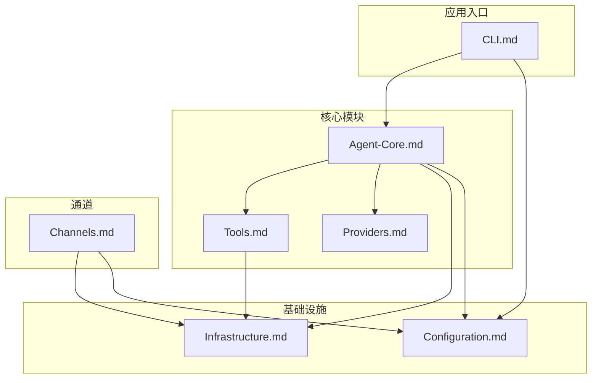

# NanoBot.Net 解决方案文档索引

本文档是 NanoBot.Net 解决方案的主索引，详细设计文档已按模块拆分以便于并行开发。

---

## 文档结构

| 文档                                  | 内容                                                                                                | 开发者     |
| ------------------------------------- | --------------------------------------------------------------------------------------------------- | ---------- |
| [Overview.md](./Overview.md)             | **概述与架构**：项目目标、技术栈、层次架构、依赖关系                                          | 架构师     |
| [Agent-Core.md](./Agent-Core.md)         | **Agent 核心层**：IAgent、IAgentContext、IMemoryStore、ISessionManager                        | 开发者 A   |
| [Tools.md](./Tools.md)                   | **工具层**：ITool、IToolRegistry、内置工具、MCP 客户端                                        | 开发者 B   |
| [Providers.md](./Providers.md)           | **提供商层**：ILLMProvider、IProviderRegistry、ProviderSpec                                   | 开发者 C   |
| [Channels.md](./Channels.md)             | **通道层**：IChannel、IChannelManager、各通道实现方案                                         | 开发者 D   |
| [Infrastructure.md](./Infrastructure.md) | **基础设施层**：IMessageBus、ICronService、IHeartbeatService、ISkillsLoader、ISubagentManager | 开发者 E   |
| [Configuration.md](./Configuration.md)   | **配置管理层**：AgentConfig、各模块配置类、安全配置                                           | 开发者 F   |
| [CLI.md](./CLI.md)                       | **CLI 命令层**：CLI 命令接口、命令清单                                                        | 开发者 G   |
| [Installation.md](./Installation.md)     | **安装程序**：Homebrew、Winget、安装脚本、发布配置                                            | DevOps     |
| [Testing.md](./Testing.md)               | **测试方案**：测试策略、测试用例设计、Mock 策略                                               | 测试工程师 |

---

## 快速导航

### 按开发阶段

**第一阶段（核心）**：

- [Agent-Core.md](./Agent-Core.md) - Agent 循环、上下文、记忆
- [Tools.md](./Tools.md) - 基础工具（文件、Shell、Web）
- [Providers.md](./Providers.md) - 至少一个 LLM 提供商
- [Configuration.md](./Configuration.md) - 配置加载
- [CLI.md](./CLI.md) - onboard、agent 命令

**第二阶段（扩展）**：

- [Channels.md](./Channels.md) - 多通道接入
- [Infrastructure.md](./Infrastructure.md) - Cron、Heartbeat、MCP
- [Installation.md](./Installation.md) - 安装与发布

---

## 模块依赖关系

---

## 接口速查

### Agent 核心层

| 接口                | 职责           |
| ------------------- | -------------- |
| `IAgent`          | Agent 循环逻辑 |
| `IAgentContext`   | 上下文构建     |
| `IMemoryStore`    | 记忆存储       |
| `ISessionManager` | 会话管理       |

### 工具层

| 接口              | 职责       |
| ----------------- | ---------- |
| `ITool`         | 工具接口   |
| `IToolRegistry` | 工具注册表 |
| `IMcpClient`    | MCP 客户端 |

### 提供商层

| 接口                  | 职责         |
| --------------------- | ------------ |
| `ILLMProvider`      | LLM 提供商   |
| `IProviderRegistry` | 提供商注册表 |

### 通道层

| 接口                | 职责       |
| ------------------- | ---------- |
| `IChannel`        | 通道接口   |
| `IChannelManager` | 通道管理器 |

### 基础设施层

| 接口                  | 职责          |
| --------------------- | ------------- |
| `IMessageBus`       | 消息总线      |
| `ICronService`      | 定时任务      |
| `IHeartbeatService` | 心跳服务      |
| `ISkillsLoader`     | Skills 加载   |
| `ISubagentManager`  | 子 Agent 管理 |

---

## 参考资源

- [Microsoft Agent Framework 官方文档](https://learn.microsoft.com/en-us/agent-framework/)
- [Microsoft Agent Framework GitHub](https://github.com/microsoft/agent-framework)
- [原 nanobot 仓库](https://github.com/HKUDS/nanobot)

---

*详细设计请查阅各模块文档。*
