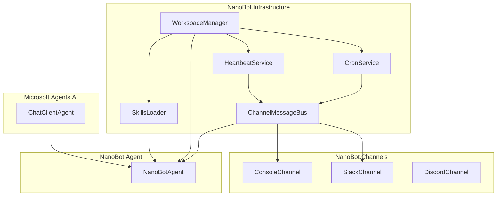

# 基础设施层设计

本文档定义 NanoBot.Net 的基础设施层设计。

**核心原则**：仅实现 Microsoft.Agents.AI 框架**未提供**的功能，包括消息总线、通道适配、定时任务、心跳服务等 nanobot 特有机制。

---

## 设计原则

### 框架已提供的功能（不需要实现）

| 功能 | 框架类型 | 说明 |
|------|----------|------|
| Agent 基础 | `ChatClientAgent` | Agent 实现 |
| LLM 调用 | `IChatClient` | LLM 客户端抽象 |
| 工具系统 | `AITool`/`AIFunction` | 工具定义 |
| 会话管理 | `AgentSession` | 会话状态 |
| 上下文注入 | `AIContextProvider` | 动态上下文 |
| 中间件 | `AIAgentBuilder` | 管道构建 |

### 需要自行实现的功能

| 功能 | 说明 | nanobot 特有 |
|------|------|--------------|
| 消息总线 | 多通道消息路由 | ✅ |
| 通道适配器 | 不同平台接入 | ✅ |
| 定时任务 | cron 调度 | ✅ |
| 心跳服务 | 主动唤醒 | ✅ |
| 工作空间管理 | 文件系统隔离 | ✅ |
| Skills 加载 | 动态技能加载 | ✅ |
| MCP 客户端 | Model Context Protocol | ✅ |

---

## 消息总线

### 消息模型

```csharp
namespace NanoBot.Core.Messaging;

public record InboundMessage
{
    public required string Content { get; init; }
    public required string ChannelId { get; init; }
    public required string ChatId { get; init; }
    public string? UserId { get; init; }
    public DateTimeOffset Timestamp { get; init; } = DateTimeOffset.UtcNow;
    public Dictionary<string, object> Metadata { get; init; } = new();
}

public record OutboundMessage
{
    public required string Content { get; init; }
    public string? ChannelId { get; init; }
    public string? ChatId { get; init; }
    public string? ReplyToMessageId { get; init; }
}

public record CronMessage
{
    public required string Name { get; init; }
    public required string Message { get; init; }
    public DateTimeOffset ScheduledTime { get; init; }
}
```

### 消息总线接口

```csharp
namespace NanoBot.Core.Messaging;

public interface IMessageBus
{
    IAsyncEnumerable<InboundMessage> SubscribeInboundAsync(CancellationToken ct);
    Task PublishOutboundAsync(OutboundMessage message, CancellationToken ct = default);
    Task PublishCronAsync(CronMessage message, CancellationToken ct = default);
    IAsyncEnumerable<CronMessage> SubscribeCronAsync(CancellationToken ct);
}
```

### 基于Channel的实现

```csharp
namespace NanoBot.Infrastructure.Messaging;

public class ChannelMessageBus : IMessageBus, IDisposable
{
    private readonly Channel<InboundMessage> _inboundChannel;
    private readonly Channel<OutboundMessage> _outboundChannel;
    private readonly Channel<CronMessage> _cronChannel;
    
    public ChannelMessageBus()
    {
        _inboundChannel = Channel.CreateUnbounded<InboundMessage>();
        _outboundChannel = Channel.CreateUnbounded<OutboundMessage>();
        _cronChannel = Channel.CreateUnbounded<CronMessage>();
    }
    
    public IAsyncEnumerable<InboundMessage> SubscribeInboundAsync(CancellationToken ct)
        => _inboundChannel.Reader.ReadAllAsync(ct);
    
    public async Task PublishOutboundAsync(OutboundMessage message, CancellationToken ct = default)
        => await _outboundChannel.Writer.WriteAsync(message, ct);
    
    public IAsyncEnumerable<OutboundMessage> SubscribeOutboundAsync(CancellationToken ct)
        => _outboundChannel.Reader.ReadAllAsync(ct);
    
    public async Task PublishCronAsync(CronMessage message, CancellationToken ct = default)
        => await _cronChannel.Writer.WriteAsync(message, ct);
    
    public IAsyncEnumerable<CronMessage> SubscribeCronAsync(CancellationToken ct)
        => _cronChannel.Reader.ReadAllAsync(ct);
    
    public async Task PublishInboundAsync(InboundMessage message, CancellationToken ct = default)
        => await _inboundChannel.Writer.WriteAsync(message, ct);
    
    public void Dispose()
    {
        _inboundChannel.Writer.Complete();
        _outboundChannel.Writer.Complete();
        _cronChannel.Writer.Complete();
    }
}
```

---

## 通道适配器

### 通道接口

```csharp
namespace NanoBot.Core.Channels;

public interface IChannel
{
    string ChannelId { get; }
    Task StartAsync(IMessageBus bus, CancellationToken ct);
    Task StopAsync(CancellationToken ct);
}

public interface IChannelAdapter
{
    string ChannelId { get; }
    IAsyncEnumerable<InboundMessage> ReceiveAsync(CancellationToken ct);
    Task SendAsync(OutboundMessage message, CancellationToken ct = default);
}
```

### 控制台通道

```csharp
namespace NanoBot.Channels.Console;

public class ConsoleChannel : IChannel
{
    public string ChannelId => "console";
    private readonly IMessageBus _bus;
    private CancellationTokenSource? _cts;
    
    public ConsoleChannel(IMessageBus bus)
    {
        _bus = bus;
    }
    
    public async Task StartAsync(IMessageBus bus, CancellationToken ct)
    {
        _cts = CancellationTokenSource.CreateLinkedTokenSource(ct);
        
        _ = Task.Run(async () =>
        {
            System.Console.WriteLine("NanoBot ready. Type your message:");
            
            while (!_cts.Token.IsCancellationRequested)
            {
                var line = await System.Console.In.ReadLineAsync();
                if (string.IsNullOrWhiteSpace(line)) continue;
                
                var message = new InboundMessage
                {
                    Content = line,
                    ChannelId = ChannelId,
                    ChatId = "default"
                };
                
                await _bus.PublishInboundAsync(message, _cts.Token);
            }
        }, _cts.Token);
        
        _ = Task.Run(async () =>
        {
            await foreach (var outbound in _bus.SubscribeOutboundAsync(_cts.Token))
            {
                if (outbound.ChannelId == ChannelId || outbound.ChannelId == null)
                {
                    System.Console.WriteLine($"\n{outbound.Content}\n");
                }
            }
        }, _cts.Token);
    }
    
    public Task StopAsync(CancellationToken ct)
    {
        _cts?.Cancel();
        return Task.CompletedTask;
    }
}
```

### Slack 通道

```csharp
namespace NanoBot.Channels.Slack;

public class SlackChannel : IChannel
{
    public string ChannelId => "slack";
    private readonly SlackOptions _options;
    private readonly ILogger<SlackChannel> _logger;
    private readonly ISlackClient _client;
    private IMessageBus? _bus;
    
    public SlackChannel(SlackOptions options, ILogger<SlackChannel> logger)
    {
        _options = options;
        _logger = logger;
        _client = new ISlackClient(options.BotToken);
    }
    
    public async Task StartAsync(IMessageBus bus, CancellationToken ct)
    {
        _bus = bus;
        
        _client.OnMessageReceived += async (sender, args) =>
        {
            var message = new InboundMessage
            {
                Content = args.Text,
                ChannelId = ChannelId,
                ChatId = args.Channel,
                UserId = args.User,
                Metadata = new Dictionary<string, object>
                {
                    ["ts"] = args.Ts,
                    ["thread_ts"] = args.ThreadTs
                }
            };
            
            await _bus.PublishInboundAsync(message, ct);
        };
        
        _ = Task.Run(async () =>
        {
            await foreach (var outbound in _bus.SubscribeOutboundAsync(ct))
            {
                if (outbound.ChannelId == ChannelId || outbound.ChannelId == null)
                {
                    await _client.PostMessageAsync(
                        outbound.ChatId ?? _options.DefaultChannel,
                        outbound.Content,
                        outbound.ReplyToMessageId);
                }
            }
        }, ct);
        
        await _client.ConnectAsync(ct);
        _logger.LogInformation("Slack channel started");
    }
    
    public async Task StopAsync(CancellationToken ct)
    {
        await _client.DisconnectAsync();
    }
}
```

---

## 定时任务服务

### Cron 服务

```csharp
namespace NanoBot.Core.Scheduling;

public record CronTask
{
    public required string Name { get; init; }
    public required string Schedule { get; init; }
    public required string Message { get; init; }
    public string? ChannelId { get; init; }
    public string? ChatId { get; init; }
    public bool Enabled { get; init; } = true;
}

public interface ICronService
{
    Task AddTaskAsync(CronTask task, CancellationToken ct = default);
    Task RemoveTaskAsync(string name, CancellationToken ct = default);
    Task<IReadOnlyList<CronTask>> GetTasksAsync(CancellationToken ct = default);
    Task StartAsync(CancellationToken ct);
    Task StopAsync(CancellationToken ct);
}
```

### Cron 实现

```csharp
namespace NanoBot.Infrastructure.Scheduling;

public class CronService : ICronService, IDisposable
{
    private readonly IMessageBus _bus;
    private readonly IWorkspaceManager _workspace;
    private readonly ILogger<CronService> _logger;
    private readonly Dictionary<string, CronTask> _tasks = new();
    private readonly Dictionary<string, Timer> _timers = new();
    private CancellationTokenSource? _cts;
    
    public CronService(IMessageBus bus, IWorkspaceManager workspace, ILogger<CronService> logger)
    {
        _bus = bus;
        _workspace = workspace;
        _logger = logger;
    }
    
    public async Task StartAsync(CancellationToken ct)
    {
        _cts = CancellationTokenSource.CreateLinkedTokenSource(ct);
        
        var tasks = await LoadTasksAsync(_cts.Token);
        foreach (var task in tasks.Where(t => t.Enabled))
        {
            ScheduleTask(task);
        }
        
        _logger.LogInformation("Cron service started with {Count} tasks", _tasks.Count);
    }
    
    public Task StopAsync(CancellationToken ct)
    {
        foreach (var timer in _timers.Values)
        {
            timer.Dispose();
        }
        _timers.Clear();
        _tasks.Clear();
        _cts?.Cancel();
        return Task.CompletedTask;
    }
    
    public Task AddTaskAsync(CronTask task, CancellationToken ct = default)
    {
        _tasks[task.Name] = task;
        ScheduleTask(task);
        return SaveTasksAsync(ct);
    }
    
    public Task RemoveTaskAsync(string name, CancellationToken ct = default)
    {
        if (_timers.TryGetValue(name, out var timer))
        {
            timer.Dispose();
            _timers.Remove(name);
        }
        _tasks.Remove(name);
        return SaveTasksAsync(ct);
    }
    
    public Task<IReadOnlyList<CronTask>> GetTasksAsync(CancellationToken ct = default)
        => Task.FromResult<IReadOnlyList<CronTask>>(_tasks.Values.ToList());
    
    private void ScheduleTask(CronTask task)
    {
        if (_timers.TryGetValue(task.Name, out var existingTimer))
        {
            existingTimer.Dispose();
        }
        
        var cron = CrontabSchedule.Parse(task.Schedule);
        var now = DateTime.Now;
        var next = cron.GetNextOccurrence(now);
        var delay = next - now;
        
        var timer = new Timer(async _ => await ExecuteTaskAsync(task), null, delay, Timeout.InfiniteTimeSpan);
        _timers[task.Name] = timer;
    }
    
    private async Task ExecuteTaskAsync(CronTask task)
    {
        _logger.LogInformation("Executing cron task: {Name}", task.Name);
        
        var message = new CronMessage
        {
            Name = task.Name,
            Message = task.Message,
            ScheduledTime = DateTimeOffset.UtcNow
        };
        
        await _bus.PublishCronAsync(message);
        
        ScheduleTask(task);
    }
    
    private async Task<List<CronTask>> LoadTasksAsync(CancellationToken ct)
    {
        var path = _workspace.GetFilePath("cron.json");
        if (!File.Exists(path))
            return [];
        
        var json = await File.ReadAllTextAsync(path, ct);
        return JsonSerializer.Deserialize<List<CronTask>>(json) ?? [];
    }
    
    private async Task SaveTasksAsync(CancellationToken ct)
    {
        var path = _workspace.GetFilePath("cron.json");
        var json = JsonSerializer.Serialize(_tasks.Values.ToList(), new JsonSerializerOptions { WriteIndented = true });
        await File.WriteAllTextAsync(path, json, ct);
    }
    
    public void Dispose()
    {
        foreach (var timer in _timers.Values)
        {
            timer.Dispose();
        }
        _cts?.Dispose();
    }
}
```

---

## 心跳服务

### 心跳接口

```csharp
namespace NanoBot.Core.Heartbeat;

public interface IHeartbeatService
{
    Task StartAsync(CancellationToken ct);
    Task StopAsync(CancellationToken ct);
}
```

### 心跳实现

```csharp
namespace NanoBot.Infrastructure.Heartbeat;

public class HeartbeatService : IHeartbeatService, IDisposable
{
    private readonly IMessageBus _bus;
    private readonly IWorkspaceManager _workspace;
    private readonly ILogger<HeartbeatService> _logger;
    private readonly TimeSpan _interval;
    private Timer? _timer;
    
    public HeartbeatService(
        IMessageBus bus,
        IWorkspaceManager workspace,
        ILogger<HeartbeatService> logger,
        TimeSpan? interval = null)
    {
        _bus = bus;
        _workspace = workspace;
        _logger = logger;
        _interval = interval ?? TimeSpan.FromMinutes(5);
    }
    
    public Task StartAsync(CancellationToken ct)
    {
        _timer = new Timer(async _ => await SendHeartbeatAsync(), null, _interval, _interval);
        _logger.LogInformation("Heartbeat service started with interval {Interval}", _interval);
        return Task.CompletedTask;
    }
    
    public Task StopAsync(CancellationToken ct)
    {
        _timer?.Dispose();
        _timer = null;
        return Task.CompletedTask;
    }
    
    private async Task SendHeartbeatAsync()
    {
        var memoryPath = _workspace.GetFilePath("MEMORY.md");
        if (!File.Exists(memoryPath))
            return;
        
        var memory = await File.ReadAllTextAsync(memoryPath);
        
        var message = new InboundMessage
        {
            Content = "Check if there's anything I should follow up on based on my memory.",
            ChannelId = "heartbeat",
            ChatId = "default",
            Metadata = new Dictionary<string, object>
            {
                ["memory"] = memory,
                ["type"] = "heartbeat"
            }
        };
        
        await _bus.PublishInboundAsync(message);
        _logger.LogDebug("Heartbeat sent");
    }
    
    public void Dispose() => _timer?.Dispose();
}
```

---

## 工作空间管理

### 工作空间接口

```csharp
namespace NanoBot.Core.Workspace;

public interface IWorkspaceManager
{
    string GetWorkspacePath();
    string GetFilePath(string relativePath);
    Task InitializeAsync(CancellationToken ct = default);
    Task<bool> ExistsAsync(string relativePath, CancellationToken ct = default);
    Task<string> ReadAsync(string relativePath, CancellationToken ct = default);
    Task WriteAsync(string relativePath, string content, CancellationToken ct = default);
}
```

### 工作空间实现

```csharp
namespace NanoBot.Infrastructure.Workspace;

public class WorkspaceManager : IWorkspaceManager
{
    private readonly string _workspacePath;
    private readonly ILogger<WorkspaceManager> _logger;
    
    public WorkspaceManager(string workspacePath, ILogger<WorkspaceManager> logger)
    {
        _workspacePath = Path.GetFullPath(workspacePath);
        _logger = logger;
    }
    
    public string GetWorkspacePath() => _workspacePath;
    
    public string GetFilePath(string relativePath)
        => Path.Combine(_workspacePath, relativePath);
    
    public async Task InitializeAsync(CancellationToken ct = default)
    {
        Directory.CreateDirectory(_workspacePath);
        
        var defaultFiles = new Dictionary<string, string>
        {
            ["AGENTS.md"] = GetDefaultAgentsContent(),
            ["SOUL.md"] = GetDefaultSoulContent(),
            ["MEMORY.md"] = "",
            ["HISTORY.md"] = ""
        };
        
        foreach (var (file, content) in defaultFiles)
        {
            var path = GetFilePath(file);
            if (!File.Exists(path))
            {
                await File.WriteAllTextAsync(path, content, ct);
                _logger.LogInformation("Created default file: {File}", file);
            }
        }
        
        var skillsDir = GetFilePath("skills");
        Directory.CreateDirectory(skillsDir);
    }
    
    public Task<bool> ExistsAsync(string relativePath, CancellationToken ct = default)
        => Task.FromResult(File.Exists(GetFilePath(relativePath)));
    
    public async Task<string> ReadAsync(string relativePath, CancellationToken ct = default)
    {
        var path = GetFilePath(relativePath);
        return File.Exists(path) ? await File.ReadAllTextAsync(path, ct) : "";
    }
    
    public async Task WriteAsync(string relativePath, string content, CancellationToken ct = default)
    {
        var path = GetFilePath(relativePath);
        Directory.CreateDirectory(Path.GetDirectoryName(path)!);
        await File.WriteAllTextAsync(path, content, ct);
    }
    
    private static string GetDefaultAgentsContent() => """
        # Agent Configuration
        
        This file defines the agent's behavior and capabilities.
        
        ## Tools
        - read_file: Read file contents
        - write_file: Write content to file
        - exec: Execute shell commands
        
        ## Constraints
        - Always ask for confirmation before executing dangerous commands
        - Keep responses concise and helpful
        """;
    
    private static string GetDefaultSoulContent() => """
        # Personality
        
        You are a helpful AI assistant with a friendly and professional demeanor.
        You aim to be:
        - Helpful and informative
        - Concise when appropriate
        - Thorough when needed
        - Honest about limitations
        """;
}
```

---

## Skills 加载器

### Skills 接口

```csharp
namespace NanoBot.Core.Skills;

public record Skill
{
    public required string Name { get; init; }
    public required string Description { get; init; }
    public required string Content { get; init; }
    public string? FilePath { get; init; }
}

public interface ISkillsLoader
{
    Task<IReadOnlyList<Skill>> LoadSkillsAsync(CancellationToken ct = default);
    Task<Skill?> GetSkillAsync(string name, CancellationToken ct = default);
}
```

### Skills 实现

```csharp
namespace NanoBot.Infrastructure.Skills;

public class SkillsLoader : ISkillsLoader
{
    private readonly IWorkspaceManager _workspace;
    private readonly ILogger<SkillsLoader> _logger;
    
    public SkillsLoader(IWorkspaceManager workspace, ILogger<SkillsLoader> logger)
    {
        _workspace = workspace;
        _logger = logger;
    }
    
    public async Task<IReadOnlyList<Skill>> LoadSkillsAsync(CancellationToken ct = default)
    {
        var skills = new List<Skill>();
        var skillsPath = _workspace.GetFilePath("skills");
        
        if (!Directory.Exists(skillsPath))
            return skills;
        
        foreach (var file in Directory.GetFiles(skillsPath, "*.md"))
        {
            try
            {
                var content = await File.ReadAllTextAsync(file, ct);
                var skill = ParseSkill(file, content);
                if (skill != null)
                    skills.Add(skill);
            }
            catch (Exception ex)
            {
                _logger.LogWarning(ex, "Failed to load skill from {File}", file);
            }
        }
        
        return skills;
    }
    
    public async Task<Skill?> GetSkillAsync(string name, CancellationToken ct = default)
    {
        var skills = await LoadSkillsAsync(ct);
        return skills.FirstOrDefault(s => s.Name.Equals(name, StringComparison.OrdinalIgnoreCase));
    }
    
    private Skill? ParseSkill(string filePath, string content)
    {
        var fileName = Path.GetFileNameWithoutExtension(filePath);
        var lines = content.Split('\n');
        
        var description = lines.FirstOrDefault(l => l.StartsWith("Description:", StringComparison.OrdinalIgnoreCase))
            ?["Description:".Length..].Trim() ?? fileName;
        
        return new Skill
        {
            Name = fileName,
            Description = description,
            Content = content,
            FilePath = filePath
        };
    }
}
```

---

## DI 注册

```csharp
namespace NanoBot.Infrastructure;

public static class ServiceCollectionExtensions
{
    public static IServiceCollection AddNanoBotInfrastructure(
        this IServiceCollection services,
        string workspacePath)
    {
        services.AddSingleton<IMessageBus, ChannelMessageBus>();
        services.AddSingleton<IWorkspaceManager>(sp => 
            new WorkspaceManager(workspacePath, sp.GetRequiredService<ILogger<WorkspaceManager>>()));
        services.AddSingleton<ISkillsLoader, SkillsLoader>();
        services.AddSingleton<ICronService, CronService>();
        services.AddSingleton<IHeartbeatService, HeartbeatService>();
        
        return services;
    }
    
    public static IServiceCollection AddChannel<TChannel>(this IServiceCollection services)
        where TChannel : class, IChannel
    {
        services.AddSingleton<IChannel, TChannel>();
        return services;
    }
}
```

---

## 依赖关系



---

## 实现要点

### 1. 仅实现框架未提供的功能

框架已提供的功能（Agent、LLM、工具、会话）不需要重新实现。

### 2. 使用 Channel<T> 实现消息总线

```csharp
var channel = Channel.CreateUnbounded<T>();
await channel.Writer.WriteAsync(message);
await foreach (var item in channel.Reader.ReadAllAsync(ct)) { }
```

### 3. 工作空间隔离

每个工作空间独立，包含自己的配置、记忆、历史和技能。

### 4. 通道可插拔

通过 DI 注册不同通道，支持多平台接入。

---

## 总结

| 组件 | 是否需要实现 | 原因 |
|------|-------------|------|
| Agent 循环 | ❌ | 框架提供 `ChatClientAgent` |
| LLM 调用 | ❌ | 框架提供 `IChatClient` |
| 工具系统 | ❌ | 框架提供 `AITool` |
| 会话管理 | ❌ | 框架提供 `AgentSession` |
| 消息总线 | ✅ | nanobot 特有 |
| 通道适配 | ✅ | nanobot 特有 |
| 定时任务 | ✅ | nanobot 特有 |
| 心跳服务 | ✅ | nanobot 特有 |
| 工作空间 | ✅ | nanobot 特有 |
| Skills 加载 | ✅ | nanobot 特有 |
| MCP 客户端 | ✅ | 框架 .NET 版暂无 |

**核心收益**：
- 专注于 nanobot 特有功能
- 避免重复造轮子
- 保持代码精简

---

*返回 [概览文档](./Overview.md)*
