# 基础设施层设计

本文档定义 NanoBot.Net 的基础设施层接口设计，对应 nanobot 的 bus/、cron/、heartbeat/、agent/skills.py 和 agent/subagent.py。

**依赖关系**：基础设施层是所有其他层的基础，提供消息路由、定时任务、心跳、Skills 加载等核心能力。

---

## 模块概览

| 模块 | 接口 | 对应原文件 | 职责 |
|------|------|-----------|------|
| Workspace 管理 | `IWorkspaceManager` | `nanobot/utils/helpers.py` | Workspace 目录管理 |
| Bootstrap 加载 | `IBootstrapLoader` | `nanobot/agent/context.py` | Bootstrap 文件加载 |
| 消息总线 | `IMessageBus` | `nanobot/bus/queue.py` | 消息路由与队列 |
| 定时任务 | `ICronService` | `nanobot/cron/service.py` | 定时任务调度 |
| 心跳服务 | `IHeartbeatService` | `nanobot/heartbeat/service.py` | 主动唤醒机制 |
| Skills 加载 | `ISkillsLoader` | `nanobot/agent/skills.py` | Skills 加载与管理 |
| Subagent 管理 | `ISubagentManager` | `nanobot/agent/subagent.py` | 子 Agent 管理 |

---

## IWorkspaceManager 接口

Workspace 管理器接口，对应 nanobot/utils/helpers.py，管理 workspace 目录结构。

```csharp
namespace NanoBot.Core.Workspace;

/// <summary>
/// Workspace 管理器接口
/// </summary>
public interface IWorkspaceManager
{
    /// <summary>获取 Workspace 根路径</summary>
    string GetWorkspacePath();

    /// <summary>获取 Memory 目录路径</summary>
    string GetMemoryPath();

    /// <summary>获取 Skills 目录路径</summary>
    string GetSkillsPath();

    /// <summary>获取 Sessions 目录路径</summary>
    string GetSessionsPath();

    /// <summary>获取 AGENTS.md 文件路径</summary>
    string GetAgentsFile();

    /// <summary>获取 SOUL.md 文件路径</summary>
    string GetSoulFile();

    /// <summary>获取 TOOLS.md 文件路径</summary>
    string GetToolsFile();

    /// <summary>获取 USER.md 文件路径</summary>
    string GetUserFile();

    /// <summary>获取 HEARTBEAT.md 文件路径</summary>
    string GetHeartbeatFile();

    /// <summary>获取 MEMORY.md 文件路径</summary>
    string GetMemoryFile();

    /// <summary>获取 HISTORY.md 文件路径</summary>
    string GetHistoryFile();

    /// <summary>初始化 Workspace 目录结构</summary>
    Task InitializeAsync(CancellationToken cancellationToken = default);

    /// <summary>确保目录存在</summary>
    void EnsureDirectory(string path);

    /// <summary>检查文件是否存在</summary>
    bool FileExists(string relativePath);

    /// <summary>读取文件内容</summary>
    Task<string?> ReadFileAsync(string relativePath, CancellationToken cancellationToken = default);

    /// <summary>写入文件内容</summary>
    Task WriteFileAsync(string relativePath, string content, CancellationToken cancellationToken = default);

    /// <summary>追加文件内容</summary>
    Task AppendFileAsync(string relativePath, string content, CancellationToken cancellationToken = default);
}
```

---

## IBootstrapLoader 接口

Bootstrap 文件加载器接口，对应 nanobot/agent/context.py，加载 workspace 中的 bootstrap 文件。

```csharp
namespace NanoBot.Core.Workspace;

/// <summary>
/// Bootstrap 文件加载器接口
/// </summary>
public interface IBootstrapLoader
{
    /// <summary>加载所有 bootstrap 文件</summary>
    Task<string> LoadAllBootstrapFilesAsync(CancellationToken cancellationToken = default);

    /// <summary>加载指定的 bootstrap 文件</summary>
    Task<string?> LoadBootstrapFileAsync(string fileName, CancellationToken cancellationToken = default);

    /// <summary>加载 AGENTS.md</summary>
    Task<string?> LoadAgentsAsync(CancellationToken cancellationToken = default);

    /// <summary>加载 SOUL.md</summary>
    Task<string?> LoadSoulAsync(CancellationToken cancellationToken = default);

    /// <summary>加载 TOOLS.md</summary>
    Task<string?> LoadToolsAsync(CancellationToken cancellationToken = default);

    /// <summary>加载 USER.md</summary>
    Task<string?> LoadUserAsync(CancellationToken cancellationToken = default);

    /// <summary>加载 HEARTBEAT.md</summary>
    Task<string?> LoadHeartbeatAsync(CancellationToken cancellationToken = default);

    /// <summary>Bootstrap 文件列表</summary>
    IReadOnlyList<string> BootstrapFiles { get; }
}
```

### BootstrapFile

```csharp
namespace NanoBot.Core.Workspace;

/// <summary>Bootstrap 文件定义</summary>
public record BootstrapFile
{
    /// <summary>文件名</summary>
    public required string FileName { get; init; }

    /// <summary>文件描述</summary>
    public required string Description { get; init; }

    /// <summary>是否必需</summary>
    public bool Required { get; init; }

    /// <summary>默认内容（如果文件不存在）</summary>
    public string? DefaultContent { get; init; }
}
```

---

## IMessageBus 接口

消息总线接口，对应 nanobot/bus/queue.py，基于 .NET Channel<T> 实现消息队列。

```csharp
namespace NanoBot.Core.Bus;

/// <summary>
/// 消息总线接口
/// </summary>
public interface IMessageBus : IDisposable
{
    /// <summary>发布入站消息（从通道到 Agent）</summary>
    ValueTask PublishInboundAsync(InboundMessage message, CancellationToken ct = default);

    /// <summary>消费入站消息（Agent 调用）</summary>
    ValueTask<InboundMessage> ConsumeInboundAsync(CancellationToken ct = default);

    /// <summary>发布出站消息（从 Agent 到通道）</summary>
    ValueTask PublishOutboundAsync(OutboundMessage message, CancellationToken ct = default);

    /// <summary>消费出站消息（Dispatcher 调用）</summary>
    ValueTask<OutboundMessage> ConsumeOutboundAsync(CancellationToken ct = default);

    /// <summary>订阅出站消息（通道注册）</summary>
    void SubscribeOutbound(string channel, Func<OutboundMessage, Task> callback);

    /// <summary>启动出站分发器</summary>
    Task StartDispatcherAsync(CancellationToken ct = default);

    /// <summary>停止消息总线</summary>
    void Stop();

    /// <summary>入站队列大小</summary>
    int InboundSize { get; }

    /// <summary>出站队列大小</summary>
    int OutboundSize { get; }
}
```

### BusMessage

```csharp
namespace NanoBot.Core.Bus;

/// <summary>总线消息</summary>
public record BusMessage
{
    /// <summary>消息 ID</summary>
    public required string Id { get; init; }

    /// <summary>消息类型</summary>
    public required BusMessageType Type { get; init; }

    /// <summary>消息内容</summary>
    public required string Content { get; init; }

    /// <summary>来源通道 ID</summary>
    public string? SourceChannelId { get; init; }

    /// <summary>目标通道 ID</summary>
    public string? TargetChannelId { get; init; }

    /// <summary>会话 ID</summary>
    public string? SessionId { get; init; }

    /// <summary>用户 ID</summary>
    public string? UserId { get; init; }

    /// <summary>时间戳</summary>
    public DateTimeOffset Timestamp { get; init; }

    /// <summary>元数据</summary>
    public IDictionary<string, object>? Metadata { get; init; }
}

public enum BusMessageType
{
    UserMessage,
    AgentResponse,
    ToolResult,
    SystemEvent
}
```

---

## ICronService 接口

定时任务服务接口，对应 nanobot/cron/service.py。

```csharp
namespace NanoBot.Core.Cron;

/// <summary>
/// 定时任务服务接口
/// </summary>
public interface ICronService
{
    /// <summary>启动服务</summary>
    Task StartAsync(CancellationToken cancellationToken = default);

    /// <summary>停止服务</summary>
    Task StopAsync(CancellationToken cancellationToken = default);

    /// <summary>添加任务</summary>
    CronJob AddJob(CronJobDefinition definition);

    /// <summary>移除任务</summary>
    bool RemoveJob(string jobId);

    /// <summary>启用/禁用任务</summary>
    CronJob? EnableJob(string jobId, bool enabled);

    /// <summary>手动执行任务</summary>
    Task<bool> RunJobAsync(string jobId, CancellationToken cancellationToken = default);

    /// <summary>列出所有任务</summary>
    IReadOnlyList<CronJob> ListJobs(bool includeDisabled = false);

    /// <summary>获取服务状态</summary>
    CronServiceStatus GetStatus();
}
```

### CronJobDefinition

```csharp
namespace NanoBot.Core.Cron;

/// <summary>定时任务定义</summary>
public record CronJobDefinition
{
    /// <summary>任务名称</summary>
    public required string Name { get; init; }

    /// <summary>调度配置</summary>
    public required CronSchedule Schedule { get; init; }

    /// <summary>要发送的消息</summary>
    public required string Message { get; init; }

    /// <summary>是否投递到 Agent</summary>
    public bool Deliver { get; init; }

    /// <summary>目标通道 ID</summary>
    public string? ChannelId { get; init; }

    /// <summary>目标用户 ID</summary>
    public string? TargetUserId { get; init; }

    /// <summary>执行后删除</summary>
    public bool DeleteAfterRun { get; init; }
}
```

### CronSchedule

```csharp
namespace NanoBot.Core.Cron;

/// <summary>定时调度</summary>
public record CronSchedule
{
    /// <summary>调度类型</summary>
    public required CronScheduleKind Kind { get; init; }

    /// <summary>一次性执行时间（毫秒时间戳）</summary>
    public long? AtMs { get; init; }

    /// <summary>间隔执行（毫秒）</summary>
    public long? EveryMs { get; init; }

    /// <summary>Cron 表达式</summary>
    public string? Expression { get; init; }

    /// <summary>时区</summary>
    public string? TimeZone { get; init; }
}

public enum CronScheduleKind
{
    At,      // 一次性执行
    Every,   // 间隔执行
    Cron     // Cron 表达式
}
```

### CronJob

```csharp
namespace NanoBot.Core.Cron;

/// <summary>定时任务</summary>
public record CronJob
{
    /// <summary>任务 ID</summary>
    public required string Id { get; init; }

    /// <summary>任务名称</summary>
    public required string Name { get; init; }

    /// <summary>调度配置</summary>
    public required CronSchedule Schedule { get; init; }

    /// <summary>要发送的消息</summary>
    public required string Message { get; init; }

    /// <summary>是否启用</summary>
    public bool Enabled { get; init; }

    /// <summary>上次执行时间</summary>
    public DateTimeOffset? LastRunAt { get; init; }

    /// <summary>下次执行时间</summary>
    public DateTimeOffset? NextRunAt { get; init; }
}
```

### CronServiceStatus

```csharp
namespace NanoBot.Core.Cron;

/// <summary>定时任务服务状态</summary>
public record CronServiceStatus
{
    public bool Running { get; init; }
    public int TotalJobs { get; init; }
    public int EnabledJobs { get; init; }
}
```

---

## IHeartbeatService 接口

心跳服务接口，对应 nanobot/heartbeat/service.py，定期唤醒 Agent 执行任务。

```csharp
namespace NanoBot.Core.Heartbeat;

/// <summary>
/// 心跳服务接口
/// </summary>
public interface IHeartbeatService
{
    /// <summary>启动服务</summary>
    Task StartAsync(CancellationToken cancellationToken = default);

    /// <summary>停止服务</summary>
    Task StopAsync(CancellationToken cancellationToken = default);

    /// <summary>添加心跳任务</summary>
    HeartbeatJob AddJob(HeartbeatDefinition definition);

    /// <summary>移除心跳任务</summary>
    bool RemoveJob(string jobId);

    /// <summary>列出所有心跳任务</summary>
    IReadOnlyList<HeartbeatJob> ListJobs();

    /// <summary>获取服务状态</summary>
    HeartbeatStatus GetStatus();
}
```

### HeartbeatDefinition

```csharp
namespace NanoBot.Core.Heartbeat;

/// <summary>心跳任务定义</summary>
public record HeartbeatDefinition
{
    /// <summary>任务名称</summary>
    public required string Name { get; init; }

    /// <summary>间隔秒数</summary>
    public required int IntervalSeconds { get; init; }

    /// <summary>要发送的消息</summary>
    public required string Message { get; init; }

    /// <summary>目标通道 ID</summary>
    public string? ChannelId { get; init; }

    /// <summary>目标聊天 ID</summary>
    public string? ChatId { get; init; }
}
```

### HeartbeatJob

```csharp
namespace NanoBot.Core.Heartbeat;

/// <summary>心跳任务</summary>
public record HeartbeatJob
{
    /// <summary>任务 ID</summary>
    public required string Id { get; init; }

    /// <summary>任务名称</summary>
    public required string Name { get; init; }

    /// <summary>间隔秒数</summary>
    public required int IntervalSeconds { get; init; }

    /// <summary>要发送的消息</summary>
    public required string Message { get; init; }

    /// <summary>上次执行时间</summary>
    public DateTimeOffset? LastRunAt { get; init; }

    /// <summary>下次执行时间</summary>
    public DateTimeOffset? NextRunAt { get; init; }

    /// <summary>是否启用</summary>
    public bool Enabled { get; init; }
}
```

### HeartbeatStatus

```csharp
namespace NanoBot.Core.Heartbeat;

/// <summary>心跳服务状态</summary>
public record HeartbeatStatus
{
    public bool Running { get; init; }
    public int ActiveJobs { get; init; }
}
```

---

## ISkillsLoader 接口

Skills 加载器接口，对应 nanobot/agent/skills.py，从目录加载 Skill 定义文件。

```csharp
namespace NanoBot.Core.Skills;

/// <summary>
/// Skills 加载器接口
/// </summary>
public interface ISkillsLoader
{
    /// <summary>从目录加载所有 Skills</summary>
    Task<IReadOnlyList<Skill>> LoadAsync(string directory, CancellationToken cancellationToken = default);

    /// <summary>获取已加载的 Skills</summary>
    IReadOnlyList<Skill> GetLoadedSkills();

    /// <summary>重新加载 Skills</summary>
    Task ReloadAsync(CancellationToken cancellationToken = default);

    /// <summary>Skills 变更事件</summary>
    event EventHandler<SkillsChangedEventArgs>? SkillsChanged;

    /// <summary>列出所有可用 Skills（可选过滤不可用的）</summary>
    IReadOnlyList<SkillSummary> ListSkills(bool filterUnavailable = true);

    /// <summary>按名称加载单个 Skill</summary>
    Task<Skill?> LoadSkillAsync(string name, CancellationToken cancellationToken = default);

    /// <summary>加载指定 Skills 用于上下文（返回格式化内容）</summary>
    Task<string> LoadSkillsForContextAsync(IReadOnlyList<string> skillNames, CancellationToken cancellationToken = default);

    /// <summary>构建 Skills 摘要（XML 格式，用于渐进式加载）</summary>
    Task<string> BuildSkillsSummaryAsync(CancellationToken cancellationToken = default);

    /// <summary>获取始终加载的 Skills（always=true）</summary>
    IReadOnlyList<string> GetAlwaysSkills();

    /// <summary>获取 Skill 元数据</summary>
    Task<SkillMetadata?> GetSkillMetadataAsync(string name, CancellationToken cancellationToken = default);

    /// <summary>检查 Skill 依赖是否满足</summary>
    bool CheckRequirements(SkillMetadata metadata);

    /// <summary>获取缺失的依赖描述</summary>
    string? GetMissingRequirements(SkillMetadata metadata);
}
```

### Skill

```csharp
namespace NanoBot.Core.Skills;

/// <summary>
/// Skill 定义
/// </summary>
public record Skill
{
    /// <summary>Skill 名称</summary>
    public required string Name { get; init; }

    /// <summary>Skill 描述</summary>
    public required string Description { get; init; }

    /// <summary>Skill 内容</summary>
    public string? Content { get; init; }

    /// <summary>来源文件路径</summary>
    public string? FilePath { get; init; }

    /// <summary>加载时间</summary>
    public DateTimeOffset LoadedAt { get; init; }
}
```

### SkillsChangedEventArgs

```csharp
namespace NanoBot.Core.Skills;

/// <summary>Skills 变更事件参数</summary>
public class SkillsChangedEventArgs : EventArgs
{
    public IReadOnlyList<Skill> Added { get; init; } = Array.Empty<Skill>();
    public IReadOnlyList<Skill> Removed { get; init; } = Array.Empty<Skill>();
    public IReadOnlyList<Skill> Modified { get; init; } = Array.Empty<Skill>();
}
```

### SkillMetadata

```csharp
namespace NanoBot.Core.Skills;

/// <summary>Skill 元数据</summary>
public record SkillMetadata
{
    /// <summary>Skill 名称（必填）</summary>
    public required string Name { get; init; }

    /// <summary>Skill 描述（必填）</summary>
    public required string Description { get; init; }

    /// <summary>主页链接（可选）</summary>
    public string? Homepage { get; init; }

    /// <summary>始终加载（可选）</summary>
    public bool Always { get; init; }

    /// <summary>nanobot 特定元数据（可选）</summary>
    public NanobotMetadata? Nanobot { get; init; }
}

/// <summary>nanobot 特定元数据</summary>
public record NanobotMetadata
{
    /// <summary>Emoji 图标</summary>
    public string? Emoji { get; init; }

    /// <summary>依赖要求</summary>
    public RequirementsMetadata? Requires { get; init; }

    /// <summary>安装说明</summary>
    public List<InstallMetadata>? Install { get; init; }
}

/// <summary>依赖要求</summary>
public record RequirementsMetadata
{
    /// <summary>需要的命令行工具</summary>
    public List<string>? Bins { get; init; }

    /// <summary>需要的环境变量</summary>
    public List<string>? Env { get; init; }
}

/// <summary>安装说明</summary>
public record InstallMetadata
{
    /// <summary>安装 ID</summary>
    public required string Id { get; init; }

    /// <summary>安装类型（brew, apt, npm 等）</summary>
    public required string Kind { get; init; }

    /// <summary>包名/公式名</summary>
    public required string Formula { get; init; }

    /// <summary>安装后提供的命令</summary>
    public List<string>? Bins { get; init; }

    /// <summary>安装标签</summary>
    public required string Label { get; init; }
}
```

### SkillSummary

```csharp
namespace NanoBot.Core.Skills;

/// <summary>Skill 摘要（用于渐进式加载）</summary>
public record SkillSummary
{
    /// <summary>Skill 名称</summary>
    public required string Name { get; init; }

    /// <summary>Skill 描述</summary>
    public required string Description { get; init; }

    /// <summary>文件路径</summary>
    public required string FilePath { get; init; }

    /// <summary>来源（workspace/builtin）</summary>
    public required string Source { get; init; }

    /// <summary>是否可用（依赖是否满足）</summary>
    public bool Available { get; init; }

    /// <summary>缺失的依赖（如果不可用）</summary>
    public string? MissingRequirements { get; init; }
}
```

---

## SkillsLoader 实现说明

### 核心功能

SkillsLoader 负责从目录加载和管理 Skills，支持以下核心功能：

1. **多源加载**：从 workspace 和 builtin 两个目录加载 Skills
2. **优先级处理**：workspace Skills 优先级高于 builtin Skills
3. **依赖检查**：检查 bins 和 env vars 是否满足
4. **渐进式加载**：支持始终加载和按需加载两种模式
5. **热重载**：监控文件系统变化，触发 SkillsChanged 事件

### Skill 目录结构

```
skills/
├── {skill-name}/
│   ├── SKILL.md (必填)
│   ├── scripts/ (可选)
│   │   └── *.py, *.sh, *.js
│   ├── references/ (可选)
│   │   └── *.md
│   └── assets/ (可选)
│       └── templates, icons, fonts
```

### SKILL.md 格式

```yaml
---
name: skill-name
description: "Skill description with usage context"
homepage: https://example.com
always: true
metadata: {"nanobot":{"emoji":"🔧","requires":{"bins":["git","docker"],"env":["API_KEY"]},"install":[{"id":"brew","kind":"brew","formula":"git","bins":["git"],"label":"Install Git (brew)"}]}}
---

# Skill Title

Skill instructions and guidance...
```

### 加载优先级

1. **Workspace Skills**：`{workspace}/skills/{skill-name}/SKILL.md`
2. **Builtin Skills**：`{builtin}/skills/{skill-name}/SKILL.md`

同名 Skill 时，workspace 优先级更高。

### 渐进式加载机制

#### Level 1: 元数据（始终加载）

- 包含：name, description, available, location
- 用途：Agent 决定何时使用哪个 Skill
- 大小：~100 tokens

#### Level 2: SKILL.md 内容（按需加载）

- 包含：完整的 Skill 指令
- 触发：Agent 决定使用该 Skill 后
- 大小：<5k tokens

#### Level 3: 资源文件（按需加载）

- 包含：scripts/, references/, assets/
- 触发：Agent 需要时通过 read_file 工具加载
- 大小：无限制（脚本可直接执行）

### SkillsSummary XML 格式

```xml
<skills>
  <skill available="true">
    <name>github</name>
    <description>Interact with GitHub using the gh CLI</description>
    <location>/path/to/skills/github/SKILL.md</location>
  </skill>
  <skill available="false">
    <name>summarize</name>
    <description>Summarize URLs, files, and YouTube videos</description>
    <location>/path/to/skills/summarize/SKILL.md</location>
    <requires>CLI: summarize</requires>
  </skill>
</skills>
```

### 依赖检查

依赖检查在以下时机执行：

1. **加载时**：检查所有 Skills 的依赖是否满足
2. **过滤时**：`list_skills(filter_unavailable: true)` 过滤掉不可用的 Skills

依赖类型：

- **bins**：检查命令是否在 PATH 中（使用 `which` 或 `where`）
- **env**：检查环境变量是否设置

### 始终加载的 Skills

标记为 `always: true` 的 Skills 会：

1. 在每次构建系统提示时自动加载完整内容
2. 包含在 "Active Skills" 部分
3. 不出现在可用 Skills 摘要中

示例：memory Skill 始终加载，因为包含核心记忆系统说明。

### 热重载机制

SkillsLoader 应监控以下变化：

1. **新增 Skill**：检测到新的 `{skill-name}/SKILL.md`
2. **删除 Skill**：检测到 Skill 目录被删除
3. **修改 Skill**：检测到 SKILL.md 内容变化
4. **依赖变化**：检测到 bins 或 env 变化

触发 `SkillsChanged` 事件，通知订阅者。

### 技能打包与分发（扩展功能）

#### .skill 文件格式

.skill 文件是一个 ZIP 压缩包，包含：

```
{skill-name}.skill
├── SKILL.md
├── scripts/
├── references/
└── assets/
```

#### 技能验证

打包前应验证：

1. YAML frontmatter 格式正确
2. name 和 description 字段存在
3. SKILL.md 文件存在
4. 目录结构符合规范
5. 引用的资源文件存在

#### 安装/卸载流程

**安装**：
1. 解压 .skill 文件到 `{workspace}/skills/{skill-name}/`
2. 验证 Skill 格式
3. 触发 SkillsChanged 事件

**卸载**：
1. 删除 `{workspace}/skills/{skill-name}/` 目录
2. 触发 SkillsChanged 事件

---

## ISubagentManager 接口

Subagent 管理器接口，对应 nanobot/agent/subagent.py，管理后台子 Agent 的创建和执行。

```csharp
namespace NanoBot.Core.Subagents;

/// <summary>
/// Subagent 管理器接口
/// </summary>
public interface ISubagentManager
{
    /// <summary>创建并启动子 Agent</summary>
    Task<SubagentResult> SpawnAsync(
        string task,
        string? label,
        string originChannel,
        string originChatId,
        CancellationToken cancellationToken = default);

    /// <summary>获取所有活跃的子 Agent</summary>
    IReadOnlyList<SubagentInfo> GetActiveSubagents();

    /// <summary>获取子 Agent 状态</summary>
    SubagentInfo? GetSubagent(string id);

    /// <summary>取消子 Agent</summary>
    bool Cancel(string id);

    /// <summary>子 Agent 完成事件</summary>
    event EventHandler<SubagentCompletedEventArgs>? SubagentCompleted;
}
```

### SubagentInfo

```csharp
namespace NanoBot.Core.Subagents;

/// <summary>子 Agent 信息</summary>
public record SubagentInfo
{
    /// <summary>子 Agent ID</summary>
    public required string Id { get; init; }

    /// <summary>任务描述</summary>
    public required string Task { get; init; }

    /// <summary>任务标签</summary>
    public string? Label { get; init; }

    /// <summary>来源通道</summary>
    public required string OriginChannel { get; init; }

    /// <summary>来源聊天 ID</summary>
    public required string OriginChatId { get; init; }

    /// <summary>状态</summary>
    public SubagentStatus Status { get; init; }

    /// <summary>开始时间</summary>
    public DateTimeOffset StartedAt { get; init; }

    /// <summary>完成时间</summary>
    public DateTimeOffset? CompletedAt { get; init; }
}
```

### SubagentStatus

```csharp
namespace NanoBot.Core.Subagents;

/// <summary>子 Agent 状态</summary>
public enum SubagentStatus
{
    Running,
    Completed,
    Failed,
    Cancelled
}
```

### SubagentResult

```csharp
namespace NanoBot.Core.Subagents;

/// <summary>子 Agent 执行结果</summary>
public record SubagentResult
{
    /// <summary>子 Agent ID</summary>
    public required string Id { get; init; }

    /// <summary>执行状态</summary>
    public required SubagentStatus Status { get; init; }

    /// <summary>输出内容</summary>
    public string? Output { get; init; }

    /// <summary>错误信息</summary>
    public string? Error { get; init; }

    /// <summary>执行时长</summary>
    public TimeSpan Duration { get; init; }
}
```

### SubagentCompletedEventArgs

```csharp
namespace NanoBot.Core.Subagents;

/// <summary>子 Agent 完成事件参数</summary>
public class SubagentCompletedEventArgs : EventArgs
{
    public required SubagentResult Result { get; init; }
    public required string OriginChannel { get; init; }
    public required string OriginChatId { get; init; }
}
```

---

## 类图

```mermaid
classDiagram
    class IWorkspaceManager {
        <<interface>>
        +GetWorkspacePath() string
        +GetMemoryPath() string
        +GetSkillsPath() string
        +GetSessionsPath() string
        +GetAgentsFile() string
        +GetSoulFile() string
        +GetToolsFile() string
        +GetUserFile() string
        +GetHeartbeatFile() string
        +GetMemoryFile() string
        +GetHistoryFile() string
        +InitializeAsync(ct) Task
        +EnsureDirectory(path) void
        +FileExists(relativePath) bool
        +ReadFileAsync(relativePath, ct) Task~string?~
        +WriteFileAsync(relativePath, content, ct) Task
        +AppendFileAsync(relativePath, content, ct) Task
    }

    class IBootstrapLoader {
        <<interface>>
        +LoadAllBootstrapFilesAsync(ct) Task~string~
        +LoadBootstrapFileAsync(fileName, ct) Task~string?~
        +LoadAgentsAsync(ct) Task~string?~
        +LoadSoulAsync(ct) Task~string?~
        +LoadToolsAsync(ct) Task~string?~
        +LoadUserAsync(ct) Task~string?~
        +LoadHeartbeatAsync(ct) Task~string?~
        +IReadOnlyList~string~ BootstrapFiles
    }

    class IMessageBus {
        <<interface>>
        +PublishInboundAsync(message, ct) ValueTask
        +ConsumeInboundAsync(ct) ValueTask~InboundMessage~
        +PublishOutboundAsync(message, ct) ValueTask
        +ConsumeOutboundAsync(ct) ValueTask~OutboundMessage~
        +SubscribeOutbound(channel, callback) void
        +StartDispatcherAsync(ct) Task
        +Stop() void
        +int InboundSize
        +int OutboundSize
    }

    class ICronService {
        <<interface>>
        +StartAsync(ct) Task
        +StopAsync(ct) Task
        +AddJob(definition) CronJob
        +RemoveJob(jobId) bool
        +EnableJob(jobId, enabled) CronJob?
        +RunJobAsync(jobId, ct) Task~bool~
        +ListJobs(includeDisabled) IReadOnlyList~CronJob~
        +GetStatus() CronServiceStatus
    }

    class IHeartbeatService {
        <<interface>>
        +StartAsync(ct) Task
        +StopAsync(ct) Task
        +AddJob(definition) HeartbeatJob
        +RemoveJob(jobId) bool
        +ListJobs() IReadOnlyList~HeartbeatJob~
        +GetStatus() HeartbeatStatus
    }

    class ISkillsLoader {
        <<interface>>
        +LoadAsync(directory, ct) Task~IReadOnlyList~Skill~~
        +GetLoadedSkills() IReadOnlyList~Skill~
        +ReloadAsync(ct) Task
        +event SkillsChanged
    }

    class ISubagentManager {
        <<interface>>
        +SpawnAsync(task, label, channel, chatId, ct) Task~SubagentResult~
        +GetActiveSubagents() IReadOnlyList~SubagentInfo~
        +GetSubagent(id) SubagentInfo?
        +Cancel(id) bool
        +event SubagentCompleted
    }

    IBootstrapLoader --> IWorkspaceManager : uses
    IMessageBus --> InboundMessage : handles
    IMessageBus --> OutboundMessage : handles
    ICronService --> CronJob : manages
    IHeartbeatService --> HeartbeatJob : manages
    ISkillsLoader --> Skill : loads
    ISubagentManager --> SubagentInfo : manages
```



---

## 依赖关系

```mermaid
graph TB
    subgraph "基础设施层"
        IWorkspaceManager[IWorkspaceManager]
        IBootstrapLoader[IBootstrapLoader]
        IMessageBus[IMessageBus]
        ICronService[ICronService]
        IHeartbeatService[IHeartbeatService]
        ISkillsLoader[ISkillsLoader]
        ISubagentManager[ISubagentManager]
    end

    subgraph "Agent 核心层"
        IAgent[IAgent]
        IAgentContext[IAgentContext]
    end

    subgraph "通道层"
        IChannel[IChannel]
    end

    subgraph "工具层"
        CronTool[CronTool]
        SpawnTool[SpawnTool]
    end

    IChannel --> IMessageBus : publishes
    IAgent --> IMessageBus : consumes
    IAgentContext --> IBootstrapLoader : uses
    IBootstrapLoader --> IWorkspaceManager : uses
    IAgent --> IWorkspaceManager : uses
    IAgentContext --> ISkillsLoader : uses
    ISkillsLoader --> IWorkspaceManager : uses
    CronTool --> ICronService
    SpawnTool --> ISubagentManager
    IHeartbeatService --> IMessageBus : triggers
    ICronService --> IMessageBus : triggers
```

---

## 实现要点

### WorkspaceManager

1. **目录结构初始化**：
```csharp
public async Task InitializeAsync(CancellationToken cancellationToken = default)
{
    var workspacePath = GetWorkspacePath();
    
    // 创建主目录
    EnsureDirectory(workspacePath);
    
    // 创建子目录
    EnsureDirectory(GetMemoryPath());
    EnsureDirectory(GetSkillsPath());
    EnsureDirectory(GetSessionsPath());
    
    // 创建默认文件（如果不存在）
    await CreateDefaultFilesAsync(cancellationToken);
}

private async Task CreateDefaultFilesAsync(CancellationToken cancellationToken)
{
    var defaultFiles = new[]
    {
        (GetAgentsFile(), DefaultAgentsContent),
        (GetSoulFile(), DefaultSoulContent),
        (GetToolsFile(), DefaultToolsContent),
        (GetUserFile(), DefaultUserContent),
        (GetHeartbeatFile(), DefaultHeartbeatContent),
        (GetMemoryFile(), ""),
        (GetHistoryFile(), "")
    };
    
    foreach (var (path, content) in defaultFiles)
    {
        if (!File.Exists(path))
        {
            await WriteFileAsync(path, content, cancellationToken);
        }
    }
}
```

2. **路径解析**：
```csharp
public string GetWorkspacePath()
{
    var path = _config.Path;
    if (path.StartsWith("~/"))
    {
        var home = Environment.GetFolderPath(Environment.SpecialFolder.UserProfile);
        path = Path.Combine(home, path[2..]);
    }
    return Path.GetFullPath(path);
}
```

3. **文件操作**：
```csharp
public async Task<string?> ReadFileAsync(string relativePath, CancellationToken cancellationToken = default)
{
    var fullPath = Path.Combine(GetWorkspacePath(), relativePath);
    if (!File.Exists(fullPath))
    {
        return null;
    }
    return await File.ReadAllTextAsync(fullPath, cancellationToken);
}

public async Task WriteFileAsync(string relativePath, string content, CancellationToken cancellationToken = default)
{
    var fullPath = Path.Combine(GetWorkspacePath(), relativePath);
    var directory = Path.GetDirectoryName(fullPath);
    if (!string.IsNullOrEmpty(directory))
    {
        Directory.CreateDirectory(directory);
    }
    await File.WriteAllTextAsync(fullPath, content, cancellationToken);
}

public async Task AppendFileAsync(string relativePath, string content, CancellationToken cancellationToken = default)
{
    var fullPath = Path.Combine(GetWorkspacePath(), relativePath);
    await File.AppendAllTextAsync(fullPath, content, cancellationToken);
}
```

### BootstrapLoader

1. **加载所有 bootstrap 文件**：
```csharp
public async Task<string> LoadAllBootstrapFilesAsync(CancellationToken cancellationToken = default)
{
    var parts = new List<string>();
    
    foreach (var fileName in BootstrapFiles)
    {
        var content = await LoadBootstrapFileAsync(fileName, cancellationToken);
        if (!string.IsNullOrEmpty(content))
        {
            parts.Add($"## {fileName}\n\n{content}");
        }
    }
    
    return string.Join("\n\n", parts);
}

public async Task<string?> LoadBootstrapFileAsync(string fileName, CancellationToken cancellationToken = default)
{
    var filePath = _workspaceManager.GetWorkspacePath();
    var fullPath = Path.Combine(filePath, fileName);
    
    if (!File.Exists(fullPath))
    {
        return null;
    }
    
    return await File.ReadAllTextAsync(fullPath, cancellationToken);
}
```

2. **Bootstrap 文件列表**：
```csharp
public IReadOnlyList<string> BootstrapFiles => new[]
{
    "AGENTS.md",
    "SOUL.md",
    "USER.md",
    "TOOLS.md"
};
```

3. **默认内容**：
```csharp
private const string DefaultAgentsContent = @"# Agent Instructions

You are a helpful AI assistant. Be concise, accurate, and friendly.

## Guidelines

- Always explain what you're doing before taking actions
- Ask for clarification when the request is ambiguous
- Use tools to help accomplish tasks
- Remember important information in your memory files

## Tools Available

You have access to:
- File operations (read, write, edit, list)
- Shell commands (exec)
- Web access (search, fetch)
- Messaging (message)
- Background tasks (spawn)

## Memory

- `memory/MEMORY.md` — long-term facts (preferences, context, relationships)
- `memory/HISTORY.md` — append-only event log, search with grep to recall past events

## Scheduled Reminders

When user asks for a reminder at a specific time, use `exec` to run:
```
nanobot cron add --name ""reminder"" --message ""Your message"" --at ""YYYY-MM-DDTHH:MM:SS"" --deliver --to ""USER_ID"" --channel ""CHANNEL""
```
Get USER_ID and CHANNEL from the current session (e.g., `8281248569` and `telegram` from `telegram:8281248569`).

**Do NOT just write reminders to MEMORY.md** — that won't trigger actual notifications.

## Heartbeat Tasks

`HEARTBEAT.md` is checked every 30 minutes. You can manage periodic tasks by editing this file:

- **Add a task**: Use `edit_file` to append new tasks to `HEARTBEAT.md`
- **Remove a task**: Use `edit_file` to remove completed or obsolete tasks
- **Rewrite tasks**: Use `write_file` to completely rewrite the task list

Task format examples:
```
- [ ] Check calendar and remind of upcoming events
- [ ] Scan inbox for urgent emails
- [ ] Check weather forecast for today
```

When the user asks you to add a recurring/periodic task, update `HEARTBEAT.md` instead of creating a one-time reminder. Keep the file small to minimize token usage.";

private const string DefaultSoulContent = @"# Soul

I am nanobot 🐈, a personal AI assistant.

## Personality

- Helpful and friendly
- Concise and to the point
- Curious and eager to learn

## Values

- Accuracy over speed
- User privacy and safety
- Transparency in actions

## Communication Style

- Be clear and direct
- Explain reasoning when helpful
- Ask clarifying questions when needed";

private const string DefaultToolsContent = @"# Available Tools

This document describes the tools available to nanobot.

## File Operations

### read_file
Read the contents of a file.
```
read_file(path: str) -> str
```

### write_file
Write content to a file (creates parent directories if needed).
```
write_file(path: str, content: str) -> str
```

### edit_file
Edit a file by replacing specific text.
```
edit_file(path: str, old_text: str, new_text: str) -> str
```

### list_dir
List contents of a directory.
```
list_dir(path: str) -> str
```

## Shell Execution

### exec
Execute a shell command and return output.
```
exec(command: str, working_dir: str = None) -> str
```

**Safety Notes:**
- Commands have a configurable timeout (default 60s)
- Dangerous commands are blocked (rm -rf, format, dd, shutdown, etc.)
- Output is truncated at 10,000 characters
- Optional `restrictToWorkspace` config to limit paths

## Web Access

### web_search
Search the web using Brave Search API.
```
web_search(query: str, count: int = 5) -> str
```

Returns search results with titles, URLs, and snippets. Requires `tools.web.search.apiKey` in config.

### web_fetch
Fetch and extract main content from a URL.
```
web_fetch(url: str, extractMode: str = ""markdown"", maxChars: int = 50000) -> str
```

**Notes:**
- Content is extracted using readability
- Supports markdown or plain text extraction
- Output is truncated at 50,000 characters by default

## Communication

### message
Send a message to the user (used internally).
```
message(content: str, channel: str = None, chat_id: str = None) -> str
```

## Background Tasks

### spawn
Spawn a subagent to handle a task in the background.
```
spawn(task: str, label: str = None) -> str
```

Use for complex or time-consuming tasks that can run independently. The subagent will complete the task and report back when done.";

private const string DefaultUserContent = @"# User Profile

Information about the user to help personalize interactions.

## Basic Information

- **Name**: (your name)
- **Timezone**: (your timezone, e.g., UTC+8)
- **Language**: (preferred language)

## Preferences

### Communication Style

- [ ] Casual
- [ ] Professional
- [ ] Technical

### Response Length

- [ ] Brief and concise
- [ ] Detailed explanations
- [ ] Adaptive based on question

### Technical Level

- [ ] Beginner
- [ ] Intermediate
- [ ] Expert

## Work Context

- **Primary Role**: (your role, e.g., developer, researcher)
- **Main Projects**: (what you're working on)
- **Tools You Use**: (IDEs, languages, frameworks)

## Topics of Interest

- 
- 
- 

## Special Instructions

(Any specific instructions for how the assistant should behave)

---
*Edit this file to customize nanobot's behavior for your needs.*";

private const string DefaultHeartbeatContent = @"# Heartbeat Tasks

This file is checked every 30 minutes by your nanobot agent.
Add tasks below that you want the agent to work on periodically.

If this file has no tasks (only headers and comments), the agent will skip the heartbeat.

## Active Tasks

<!-- Add your periodic tasks below this line -->


## Completed

<!-- Move completed tasks here or delete them -->";
```

### MessageBus

1. 使用 `System.Threading.Channels.Channel<T>` 实现队列
2. 支持多生产者、多消费者
3. 出站消息分发器轮询并调用通道回调

### CronService

#### 1. 调度机制

**核心调度循环**：
- 使用单个定时器（`System.Threading.Timer` 或 `PeriodicTimer`）实现事件循环
- 每次定时器到期时，检查并执行所有到期的任务
- 计算下一个最早的执行时间，重新设置定时器

**调度算法**：
```csharp
// 计算下一个执行时间
private long? ComputeNextRunTime(CronSchedule schedule, long nowMs)
{
    return schedule.Kind switch
    {
        CronScheduleKind.At => schedule.AtMs > nowMs ? schedule.AtMs : null,
        CronScheduleKind.Every => schedule.EveryMs > 0 ? nowMs + schedule.EveryMs : null,
        CronScheduleKind.Cron => ComputeCronNextRun(schedule.Expression, schedule.TimeZone, nowMs),
        _ => null
    };
}

// 使用 Cronos 库计算 cron 表达式的下次执行时间
private long? ComputeCronNextRun(string? expression, string? timeZone, long nowMs)
{
    if (string.IsNullOrEmpty(expression)) return null;
    
    var cronExpression = CronExpression.Parse(expression);
    var tz = string.IsNullOrEmpty(timeZone) ? TimeZoneInfo.Local : TimeZoneInfo.FindSystemTimeZoneById(timeZone);
    var now = DateTimeOffset.FromUnixTimeMilliseconds(nowMs).DateTime;
    var next = cronExpression.GetNextOccurrence(now, tz);
    return next?.ToUnixTimeMilliseconds();
}
```

#### 2. 定时器管理

**定时器重置策略**：
```csharp
private void ArmTimer()
{
    _timer?.Dispose();
    
    var nextWakeMs = GetNextWakeTime();
    if (nextWakeMs == null || !_running) return;
    
    var delayMs = Math.Max(0, nextWakeMs.Value - DateTimeOffset.UtcNow.ToUnixTimeMilliseconds());
    
    _timer = new Timer(_ =>
    {
        _ = OnTimerTickAsync();
    }, null, (int)delayMs, Timeout.Infinite);
}

private async Task OnTimerTickAsync()
{
    var nowMs = DateTimeOffset.UtcNow.ToUnixTimeMilliseconds();
    var dueJobs = _store.Jobs
        .Where(j => j.Enabled && j.State.NextRunAtMs.HasValue && nowMs >= j.State.NextRunAtMs.Value)
        .ToList();
    
    foreach (var job in dueJobs)
    {
        await ExecuteJobAsync(job);
    }
    
    SaveStore();
    ArmTimer();
}
```

#### 3. 任务执行流程

**执行步骤**：
```csharp
private async Task ExecuteJobAsync(CronJob job)
{
    var startMs = DateTimeOffset.UtcNow.ToUnixTimeMilliseconds();
    _logger.LogInformation("Executing cron job '{JobName}' ({JobId})", job.Name, job.Id);
    
    try
    {
        string? response = null;
        if (_onJobCallback != null)
        {
            response = await _onJobCallback(job);
        }
        
        job.State.LastStatus = "ok";
        job.State.LastError = null;
        _logger.LogInformation("Cron job '{JobName}' completed", job.Name);
    }
    catch (Exception ex)
    {
        job.State.LastStatus = "error";
        job.State.LastError = ex.Message;
        _logger.LogError(ex, "Cron job '{JobName}' failed", job.Name);
    }
    
    job.State.LastRunAtMs = startMs;
    job.UpdatedAtMs = DateTimeOffset.UtcNow.ToUnixTimeMilliseconds();
    
    // 处理一次性任务
    if (job.Schedule.Kind == CronScheduleKind.At)
    {
        if (job.DeleteAfterRun)
        {
            _store.Jobs = _store.Jobs.Where(j => j.Id != job.Id).ToList();
        }
        else
        {
            job.Enabled = false;
            job.State.NextRunAtMs = null;
        }
    }
    else
    {
        // 计算下次执行时间
        job.State.NextRunAtMs = ComputeNextRunTime(job.Schedule, DateTimeOffset.UtcNow.ToUnixTimeMilliseconds());
    }
}
```

#### 4. 持久化存储

**存储格式**：
```csharp
private void SaveStore()
{
    _storePath.Directory?.Create();
    
    var data = new
    {
        version = _store.Version,
        jobs = _store.Jobs.Select(j => new
        {
            id = j.Id,
            name = j.Name,
            enabled = j.Enabled,
            schedule = new
            {
                kind = j.Schedule.Kind.ToString().ToLower(),
                atMs = j.Schedule.AtMs,
                everyMs = j.Schedule.EveryMs,
                expr = j.Schedule.Expression,
                tz = j.Schedule.TimeZone
            },
            payload = new
            {
                kind = "agent_turn",
                message = j.Message,
                deliver = j.Deliver,
                channel = j.ChannelId,
                to = j.TargetUserId
            },
            state = new
            {
                nextRunAtMs = j.State.NextRunAtMs,
                lastRunAtMs = j.State.LastRunAtMs,
                lastStatus = j.State.LastStatus,
                lastError = j.State.LastError
            },
            createdAtMs = j.CreatedAtMs,
            updatedAtMs = j.UpdatedAtMs,
            deleteAfterRun = j.DeleteAfterRun
        })
    };
    
    var json = JsonSerializer.Serialize(data, _jsonOptions);
    File.WriteAllText(_storePath, json);
}
```

**加载逻辑**：
```csharp
private CronStore LoadStore()
{
    if (_store != null) return _store;
    
    if (!_storePath.Exists)
    {
        _store = new CronStore();
        return _store;
    }
    
    try
    {
        var json = File.ReadAllText(_storePath);
        var data = JsonSerializer.Deserialize<JsonElement>(json);
        
        var jobs = data.GetProperty("jobs").EnumerateArray().Select(j => new CronJob
        {
            Id = j.GetProperty("id").GetString()!,
            Name = j.GetProperty("name").GetString()!,
            Enabled = j.GetProperty("enabled").GetBoolean(),
            Schedule = ParseSchedule(j.GetProperty("schedule")),
            Message = j.GetProperty("payload").GetProperty("message").GetString()!,
            Deliver = j.GetProperty("payload").GetProperty("deliver").GetBoolean(),
            ChannelId = j.GetProperty("payload").TryGetProperty("channel", out var ch) ? ch.GetString() : null,
            TargetUserId = j.GetProperty("payload").TryGetProperty("to", out var to) ? to.GetString() : null,
            State = ParseJobState(j.GetProperty("state")),
            CreatedAtMs = j.TryGetProperty("createdAtMs", out var ca) ? ca.GetInt64() : 0,
            UpdatedAtMs = j.TryGetProperty("updatedAtMs", out var ua) ? ua.GetInt64() : 0,
            DeleteAfterRun = j.TryGetProperty("deleteAfterRun", out var dar) ? dar.GetBoolean() : false
        }).ToList();
        
        _store = new CronStore { Jobs = jobs };
    }
    catch (Exception ex)
    {
        _logger.LogWarning(ex, "Failed to load cron store, starting fresh");
        _store = new CronStore();
    }
    
    return _store;
}
```

#### 5. 启动与停止

**启动流程**：
```csharp
public async Task StartAsync(CancellationToken cancellationToken = default)
{
    if (_running) return;
    
    _running = true;
    _cancellationToken = cancellationToken;
    
    LoadStore();
    RecomputeNextRuns();
    SaveStore();
    ArmTimer();
    
    _logger.LogInformation("Cron service started with {JobCount} jobs", _store.Jobs.Count);
}
```

**停止流程**：
```csharp
public Task StopAsync(CancellationToken cancellationToken = default)
{
    if (!_running) return Task.CompletedTask;
    
    _running = false;
    _timer?.Dispose();
    _timer = null;
    
    _logger.LogInformation("Cron service stopped");
    return Task.CompletedTask;
}
```

#### 6. 依赖库

**推荐使用 Cronos**：
```xml
<PackageReference Include="Cronos" Version="0.8.4" />
```

**Cronos 使用示例**：
```csharp
using Cronos;

// 解析 cron 表达式
var cron = CronExpression.Parse("0 9 * * *");  // 每天 9:00
var next = cron.GetNextOccurrence(DateTime.Now, TimeZoneInfo.Local);
```

#### 7. 线程安全

**并发控制**：
```csharp
private readonly SemaphoreSlim _lock = new(1, 1);

public CronJob AddJob(CronJobDefinition definition)
{
    _lock.Wait();
    try
    {
        // 添加任务逻辑
        SaveStore();
        ArmTimer();
        return job;
    }
    finally
    {
        _lock.Release();
    }
}
```

#### 8. 与 Agent 集成

**回调机制**：
```csharp
// 在 CronService 构造时传入回调
public CronService(
    Path storePath,
    Func<CronJob, Task<string?>>? onJob = null)
{
    _onJobCallback = onJob;
}

// 在 Agent 中注册回调
_cronService = new CronService(cronStorePath, async job =>
{
    // 将 cron 消息发送到消息总线
    var message = new InboundMessage
    {
        Content = job.Message,
        ChannelId = job.ChannelId,
        UserId = job.TargetUserId,
        Metadata = new Dictionary<string, object>
        {
            ["cron_job_id"] = job.Id,
            ["cron_job_name"] = job.Name
        }
    };
    
    await _messageBus.PublishInboundAsync(message);
    
    return job.Deliver ? "Delivered" : null;
});
```

### HeartbeatService

1. 定时触发 Agent 执行
2. 支持多任务并行
3. 可配置间隔

### SkillsLoader

1. 从指定目录加载 .md 文件
2. 解析 Skill 名称和描述
3. 支持热重载

### SubagentManager

1. 创建独立的 Agent 实例
2. 后台执行任务
3. 完成后通知主 Agent

---

*返回 [概览文档](./NanoBot.Net-Overview.md)*
