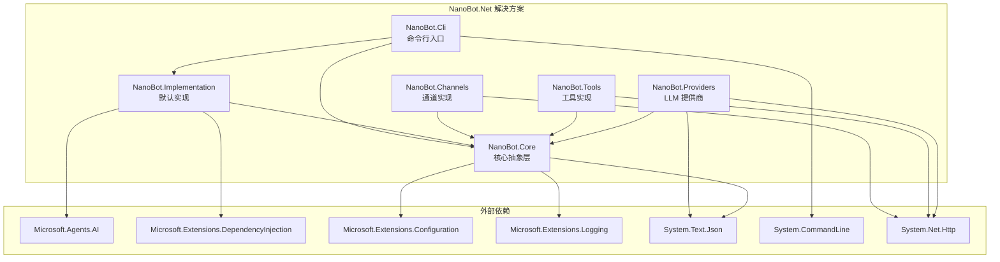
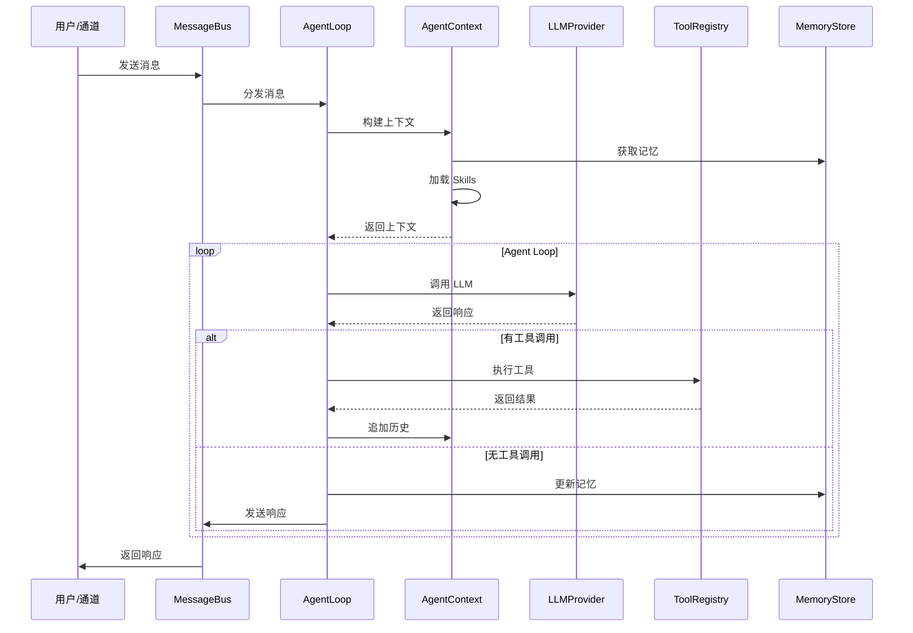

# NanoBot.Net 解决方案概览

本文档定义 **NanoBot.Net** 的 .NET 移植方案，仅包含对 [nanobot](https://github.com/HKUDS/nanobot) 的移植内容。LightRAG、FastCode 等均不纳入本方案，若需使用则作为外部服务另行调用。

**核心框架**：本方案基于 **Microsoft.Agents.AI** 框架进行设计，**直接使用框架提供的核心抽象**，避免重复造轮子。

参考文档：
- 本仓库 [README.md](../../README.md)
- [Temp/nanobot/README.md](../../Temp/nanobot/README.md)
- [Microsoft Agent Framework 官方文档](https://learn.microsoft.com/en-us/agent-framework/)
- [Microsoft.Agents.AI API 文档](https://learn.microsoft.com/en-us/dotnet/api/microsoft.agents.ai)

---

## 概述与目标

### NanoBot.Net 的定位

NanoBot.Net 是 [nanobot](https://github.com/HKUDS/nanobot) 的 **.NET 移植**：在保持 nanobot 核心设计（约 4,000 行哲学）的前提下，用 C# 重写并做必要的 .NET 优化与扩展，作为 .NET 生态中的 **Agent 核心**，适用于基于 .NET 的 AIAgent 产品。

### 本方案目标

- 明确 NanoBot.Net 的 .NET 移植版**技术栈**。
- 明确 **nanobot** 能力在移植中的**完整保留**（原有能力一项不少）。
- **充分利用 Microsoft.Agents.AI 框架**，避免重复造轮子，保持代码精简。
- 在能力描述上**不超出当前已实现范围**；未实现部分仅作技术栈与扩展说明，不视为已具备能力。

---

## Microsoft.Agents.AI 框架核心能力

Microsoft.Agents.AI 框架提供了完整的 Agent 开发基础设施，NanoBot.Net 应**直接使用**而非重新实现：

### 框架提供的核心组件

| 组件 | 框架类型 | 说明 | NanoBot.Net 使用方式 |
|------|----------|------|---------------------|
| **Agent 基类** | `AIAgent` | Agent 抽象基类，提供 RunAsync/RunStreamingAsync | 继承或使用 `ChatClientAgent` |
| **ChatClient** | `IChatClient` | LLM 调用抽象，支持 OpenAI/Azure/Anthropic 等 | 直接使用，无需自定义 Provider 抽象 |
| **工具系统** | `AITool`/`AIFunction` | 工具定义和函数调用 | 直接使用，无需自定义 ITool 抽象 |
| **会话管理** | `AgentSession` | 会话状态管理 | 直接使用 |
| **上下文提供者** | `AIContextProvider` | 动态上下文注入 | 实现自定义 ContextProvider |
| **聊天历史** | `ChatHistoryProvider` | 聊天历史存储 | 实现自定义存储 |
| **中间件** | `AIAgentBuilder` | Agent 管道构建 | 使用 `Use()` 方法添加中间件 |
| **MCP 支持** | Python 版 `MCPTool` | Model Context Protocol | .NET 版需自行实现（框架暂无） |

### 框架提供的 LLM 客户端扩展

```csharp
// OpenAI ChatClient -> AIAgent
ChatClientAgent agent = new OpenAIClient(apiKey)
    .GetChatClient("gpt-4o")
    .AsAIAgent(
        name: "NanoBot",
        instructions: "You are a helpful assistant.",
        tools: myTools);

// Azure OpenAI ChatClient -> AIAgent
ChatClientAgent agent = new AzureOpenAIClient(endpoint, credential)
    .GetChatClient("gpt-4o")
    .AsAIAgent(instructions: "...");

// Anthropic -> AIAgent (via IChatClient)
ChatClientAgent agent = new AnthropicClient()
    .AsAIAgent(instructions: "...");
```

### 框架提供的工具注册

```csharp
// 使用 AIFunctionFactory 创建工具
var tools = new List<AITool>
{
    AIFunctionFactory.Create(ReadFileAsync, new AIFunctionFactoryOptions
    {
        Name = "read_file",
        Description = "Read file contents"
    }),
    AIFunctionFactory.Create(WriteFileAsync, new AIFunctionFactoryOptions
    {
        Name = "write_file",
        Description = "Write content to file"
    })
};

// 传递给 Agent
var agent = chatClient.AsAIAgent(tools: tools);
```

---

## 技术栈总览

| 维度 | 选型说明 |
|------|----------|
| **语言与运行时** | C# / .NET 8+ (LTS) |
| **核心框架** | **Microsoft.Agents.AI** - 直接使用框架的 AIAgent、IChatClient、AITool 等核心类型 |
| **LLM 客户端** | 使用 `Microsoft.Extensions.AI` 的 `IChatClient` 抽象，支持 OpenAI/Azure/Anthropic/Ollama 等 |
| **工具系统** | 使用 `AITool`/`AIFunction` 抽象，通过 `AIFunctionFactory` 创建 |
| **依赖注入** | `Microsoft.Extensions.DependencyInjection` - 用于服务注册与生命周期管理 |
| **配置管理** | `Microsoft.Extensions.Configuration` - 支持 JSON、环境变量等多种配置源 |
| **日志系统** | `Microsoft.Extensions.Logging` - 统一日志抽象，支持多种日志提供程序 |
| **HTTP 客户端** | `HttpClient` + `IHttpClientFactory` - 用于 Web 工具 |
| **JSON 处理** | `System.Text.Json` - 高性能 JSON 序列化/反序列化 |
| **异步编程** | `async/await` + `Task` + `Channel<T>` - 用于消息队列和并发处理 |

---

## nanobot 能力保留清单

nanobot 已有能力在 NanoBot.Net 中**均需保留**，不做删减，仅做语言与运行时层面的 .NET 移植与适配。

| 能力类别 | 必须移植/保留 |
|----------|----------------|
| **Agent 核心** | Agent 循环：接收消息 → 构建上下文 → 调用 LLM → 执行工具 → 回写响应 |
| **上下文** | Context 构建：历史、Memory、Skills 等 |
| **记忆** | Memory 持久化与召回 |
| **内置工具** | 文件读写/编辑/列表、Shell 执行、Web 搜索/抓取、消息、Spawn、Cron 等 |
| **Providers** | 多 LLM 接入（OpenRouter、OpenAI 兼容等）、配置与注册方式 |
| **Channels** | 多通道接入（如 Telegram、Discord、Feishu 等，按当前已实现列清单） |
| **基础设施** | Bus 消息路由、Session、Cron 定时任务、Heartbeat |
| **配置与 CLI** | Config（如 config.json 形态）、CLI 命令（onboard、agent、gateway、status 等） |
| **扩展** | MCP（Model Context Protocol）客户端/工具注册；Skills 加载与执行机制 |

---

## 核心层次架构

```mermaid
graph TB
    subgraph "应用层 (Application Layer)"
        CLI[CLI Commands]
        Gateway[Gateway Service]
    end

    subgraph "通道层 (Channel Layer)"
        TG[Telegram Channel]
        DC[Discord Channel]
        FS[Feishu Channel]
        OC[Other Channels]
    end

    subgraph "消息总线层 (Message Bus Layer)"
        Bus[Message Bus<br/>InboundQueue + OutboundQueue]
        Dispatcher[Message Dispatcher]
    end

    subgraph "Agent 核心层 (Agent Core Layer)"
        AgentLoop[Agent Loop]
        Context[Context Builder]
        Memory[Memory Store]
        Session[Session Manager]
    end

    subgraph "工具层 (Tool Layer)"
        ToolRegistry[Tool Registry]
        FileTools[File Tools]
        ShellTool[Shell Tool]
        WebTools[Web Tools]
        MsgTool[Message Tool]
        SpawnTool[Spawn Tool]
        CronTool[Cron Tool]
        MCPTools[MCP Tools]
    end

    subgraph "提供商层 (Provider Layer)"
        ProviderRegistry[Provider Registry]
        OpenAI[OpenAI Provider]
        OpenRouter[OpenRouter Provider]
        Custom[Custom Providers]
    end

    subgraph "基础设施层 (Infrastructure Layer)"
        Config[Configuration]
        Logging[Logging]
        DI[Dependency Injection]
        Cron[Cron Service]
        Skills[Skills Loader]
    end

    CLI --> Bus
    Gateway --> Bus
    TG --> Bus
    DC --> Bus
    FS --> Bus
    OC --> Bus

    Bus --> AgentLoop
    AgentLoop --> Context
    AgentLoop --> Memory
    AgentLoop --> Session
    AgentLoop --> ToolRegistry
    AgentLoop --> ProviderRegistry

    ToolRegistry --> FileTools
    ToolRegistry --> ShellTool
    ToolRegistry --> WebTools
    ToolRegistry --> MsgTool
    ToolRegistry --> SpawnTool
    ToolRegistry --> CronTool
    ToolRegistry --> MCPTools

    ProviderRegistry --> OpenAI
    ProviderRegistry --> OpenRouter
    ProviderRegistry --> Custom

    AgentLoop --> Bus
    Bus --> Dispatcher
    Dispatcher --> TG
    Dispatcher --> DC
    Dispatcher --> FS
    Dispatcher --> OC

    Context --> Skills
    Context --> Memory
    AgentLoop --> Cron

    Config -.-> AgentLoop
    Config -.-> ProviderRegistry
    Config -.-> TG
    Config -.-> DC
    Config -.-> FS
    Logging -.-> AgentLoop
    DI -.-> AgentLoop
```



---

## Microsoft.Agents.AI 集成映射

**重要原则**：NanoBot.Net 直接使用框架提供的类型，而非定义新的抽象接口。

| nanobot 模块 | Microsoft.Agents.AI 对应 | NanoBot.Net 实现职责 |
|--------------|--------------------------|---------------------|
| agent/loop | `ChatClientAgent` + `AIAgentBuilder` | **直接使用** `ChatClientAgent`，通过 `AIAgentBuilder` 添加中间件 |
| agent/context | `AIContextProvider` | 实现 `AIContextProvider` 注入 bootstrap 文件、memory、skills |
| agent/memory | `ChatHistoryProvider` + 自定义 | 实现 `ChatHistoryProvider` 管理 MEMORY.md 和 HISTORY.md |
| agent/tools | `AITool` + `AIFunctionFactory` | **直接使用** `AIFunctionFactory` 创建工具函数 |
| agent/skills | 自定义 `ISkillsLoader` | Skills 加载与解析（框架无此概念） |
| providers | `IChatClient` 扩展方法 | **直接使用** `AsAIAgent()` 扩展方法，无需自定义 Provider 抽象 |
| channels | 自定义 `IChannel` | 通道适配器（框架无此概念） |
| bus | 自定义 `IMessageBus` | 消息路由与队列（框架无此概念） |
| cron | 自定义 `ICronService` | 定时任务调度（框架无此概念） |
| heartbeat | 自定义 `IHeartbeatService` | 主动唤醒机制（框架无此概念） |
| config | `IConfiguration` | 配置加载（使用 .NET 标准配置） |
| cli | `System.CommandLine` | 命令行入口 |

### 框架使用策略

1. **直接使用框架类型**：
   - `AIAgent` / `ChatClientAgent` - Agent 实现
   - `IChatClient` - LLM 调用
   - `AITool` / `AIFunction` - 工具定义
   - `AgentSession` - 会话管理
   - `AIAgentBuilder` - 中间件管道

2. **实现框架抽象**：
   - `AIContextProvider` - 注入 nanobot 特有上下文（bootstrap、memory、skills）
   - `ChatHistoryProvider` - 自定义聊天历史存储

3. **自定义实现**（框架无对应功能）：
   - `IMessageBus` - 消息总线
   - `ICronService` - 定时任务
   - `IHeartbeatService` - 心跳服务
   - `ISkillsLoader` - Skills 加载
   - `ISubagentManager` - 子 Agent 管理
   - `IChannel` - 通道适配器

---

## 模块文档索引

为便于并行开发，解决方案文档已拆分为以下模块：

| 模块 | 文档 | 负责内容 |
|------|------|----------|
| **Agent 核心** | [Agent-Core.md](./Agent-Core.md) | IAgent、IAgentContext、IMemoryStore、ISessionManager |
| **工具层** | [Tools.md](./Tools.md) | ITool、IToolRegistry、内置工具、MCP 客户端 |
| **提供商层** | [Providers.md](./Providers.md) | ILLMProvider、IProviderRegistry、ProviderSpec |
| **通道层** | [Channels.md](./Channels.md) | IChannel、IChannelManager、各通道实现方案 |
| **基础设施** | [Infrastructure.md](./Infrastructure.md) | IMessageBus、ICronService、IHeartbeatService、ISkillsLoader、ISubagentManager |
| **配置管理** | [Configuration.md](./Configuration.md) | AgentConfig、各模块配置类、安全配置 |
| **CLI 命令** | [CLI.md](./CLI.md) | CLI 命令接口、命令清单 |
| **测试方案** | [Testing.md](./Testing.md) | 测试策略、测试用例设计、Mock 策略 |

---

## 项目依赖结构



---

## 项目目录结构

### 整体目录架构

```
NanoBot.Net/
├── src/                              # 源代码目录
│   ├── NanoBot.Core/                 # 核心抽象层
│   │   ├── Agents/                   # Agent 核心接口
│   │   │   ├── IAgent.cs
│   │   │   ├── IAgentContext.cs
│   │   │   ├── AgentRequest.cs
│   │   │   └── AgentResponse.cs
│   │   ├── Channels/                 # 通道抽象
│   │   │   ├── IChannel.cs
│   │   │   ├── IChannelManager.cs
│   │   │   ├── InboundMessage.cs
│   │   │   └── OutboundMessage.cs
│   │   ├── Tools/                    # 工具抽象
│   │   │   ├── ITool.cs
│   │   │   ├── IToolRegistry.cs
│   │   │   ├── IToolContext.cs
│   │   │   └── ToolResult.cs
│   │   ├── Providers/                # 提供商抽象
│   │   │   ├── ILLMProvider.cs
│   │   │   ├── IProviderRegistry.cs
│   │   │   ├── LLMRequest.cs
│   │   │   └── LLMResponse.cs
│   │   ├── Bus/                      # 消息总线抽象
│   │   │   ├── IMessageBus.cs
│   │   │   └── BusMessage.cs
│   │   ├── Memory/                   # 记忆存储抽象
│   │   │   ├── IMemoryStore.cs
│   │   │   └── HistoryEntry.cs
│   │   ├── Sessions/                 # 会话管理抽象
│   │   │   ├── ISessionManager.cs
│   │   │   └── Session.cs
│   │   ├── Workspace/                # Workspace 抽象
│   │   │   ├── IWorkspaceManager.cs
│   │   │   └── IBootstrapLoader.cs
│   │   ├── Cron/                     # 定时任务抽象
│   │   │   ├── ICronService.cs
│   │   │   └── CronJob.cs
│   │   ├── Heartbeat/                # 心跳服务抽象
│   │   │   ├── IHeartbeatService.cs
│   │   │   └── HeartbeatJob.cs
│   │   ├── Skills/                   # Skills 抽象
│   │   │   ├── ISkillsLoader.cs
│   │   │   └── Skill.cs
│   │   ├── Subagents/                # Subagent 抽象
│   │   │   ├── ISubagentManager.cs
│   │   │   └── SubagentInfo.cs
│   │   ├── Mcp/                      # MCP 抽象
│   │   │   ├── IMcpClient.cs
│   │   │   └── McpTool.cs
│   │   └── Configuration/            # 配置模型
│   │       ├── AgentConfig.cs
│   │       ├── WorkspaceConfig.cs
│   │       ├── LlmConfig.cs
│   │       ├── ChannelsConfig.cs
│   │       ├── SecurityConfig.cs
│   │       ├── MemoryConfig.cs
│   │       └── HeartbeatConfig.cs
│   │
│   ├── NanoBot.Infrastructure/       # 基础设施实现
│   │   ├── Workspace/                # Workspace 实现
│   │   │   ├── WorkspaceManager.cs
│   │   │   └── BootstrapLoader.cs
│   │   ├── Bus/                      # 消息总线实现
│   │   │   └── MessageBus.cs
│   │   ├── Cron/                     # 定时任务实现
│   │   │   └── CronService.cs
│   │   ├── Heartbeat/                # 心跳服务实现
│   │   │   └── HeartbeatService.cs
│   │   ├── Skills/                   # Skills 加载实现
│   │   │   └── SkillsLoader.cs
│   │   ├── Subagents/                # Subagent 管理实现
│   │   │   └── SubagentManager.cs
│   │   ├── Resources/                # 资源加载实现
│   │   │   ├── IEmbeddedResourceLoader.cs
│   │   │   └── EmbeddedResourceLoader.cs
│   │   └── Extensions/               # 扩展方法
│   │       └── ServiceCollectionExtensions.cs
│   │
│   ├── workspace/                    # Workspace 资源文件（嵌入式）
│   │   ├── AGENTS.md                 # Agent 指令模板
│   │   ├── SOUL.md                   # Agent 个性模板
│   │   ├── TOOLS.md                  # 工具文档模板
│   │   ├── USER.md                   # 用户配置模板
│   │   ├── HEARTBEAT.md              # 心跳任务模板
│   │   └── memory/
│   │       └── MEMORY.md             # 记忆模板
│   │
│   ├── skills/                       # 内置 Skills（嵌入式）
│   │   ├── README.md                 # Skills 说明
│   │   ├── github/
│   │   │   └── SKILL.md              # GitHub Skill
│   │   ├── weather/
│   │   │   └── SKILL.md              # 天气 Skill
│   │   ├── summarize/
│   │   │   └── SKILL.md              # 总结 Skill
│   │   ├── tmux/
│   │   │   ├── SKILL.md              # Tmux Skill
│   │   │   └── scripts/              # Tmux 脚本
│   │   ├── skill-creator/
│   │   │   └── SKILL.md              # Skill 创建器
│   │   ├── memory/
│   │   │   └── SKILL.md              # 记忆 Skill (always=true)
│   │   └── cron/
│   │       └── SKILL.md              # 定时任务 Skill
│   │
│   ├── NanoBot.Providers/            # LLM 提供商实现
│   │   ├── Registry/                 # 提供商注册表
│   │   │   └── ProviderRegistry.cs
│   │   ├── OpenAI/                   # OpenAI 提供商
│   │   │   └── OpenAIProvider.cs
│   │   ├── OpenRouter/               # OpenRouter 提供商
│   │   │   └── OpenRouterProvider.cs
│   │   ├── Anthropic/                # Anthropic 提供商
│   │   │   └── AnthropicProvider.cs
│   │   ├── Ollama/                   # Ollama 提供商
│   │   │   └── OllamaProvider.cs
│   │   ├── DeepSeek/                 # DeepSeek 提供商
│   │   │   └── DeepSeekProvider.cs
│   │   ├── Groq/                     # Groq 提供商
│   │   │   └── GroqProvider.cs
│   │   └── Extensions/               # 扩展方法
│   │       └── ServiceCollectionExtensions.cs
│   │
│   ├── NanoBot.Tools/                # 工具实现
│   │   ├── Registry/                 # 工具注册表
│   │   │   └── ToolRegistry.cs
│   │   ├── FileSystem/               # 文件系统工具
│   │   │   ├── ReadFileTool.cs
│   │   │   ├── WriteFileTool.cs
│   │   │   ├── EditFileTool.cs
│   │   │   └── ListDirTool.cs
│   │   ├── Shell/                    # Shell 工具
│   │   │   └── ExecTool.cs
│   │   ├── Web/                      # Web 工具
│   │   │   ├── WebSearchTool.cs
│   │   │   └── WebFetchTool.cs
│   │   ├── Messaging/                # 消息工具
│   │   │   └── MessageTool.cs
│   │   ├── Spawn/                    # Spawn 工具
│   │   │   └── SpawnTool.cs
│   │   ├── Cron/                     # Cron 工具
│   │   │   └── CronTool.cs
│   │   ├── Mcp/                      # MCP 客户端
│   │   │   └── McpClient.cs
│   │   └── Extensions/               # 扩展方法
│   │       └── ServiceCollectionExtensions.cs
│   │
│   ├── NanoBot.Channels/             # 通道实现
│   │   ├── Manager/                  # 通道管理器
│   │   │   └── ChannelManager.cs
│   │   ├── Telegram/                 # Telegram 通道
│   │   │   └── TelegramChannel.cs
│   │   ├── Discord/                  # Discord 通道
│   │   │   └── DiscordChannel.cs
│   │   ├── Feishu/                   # 飞书通道
│   │   │   └── FeishuChannel.cs
│   │   ├── Email/                    # Email 通道
│   │   │   └── EmailChannel.cs
│   │   ├── Slack/                    # Slack 通道
│   │   │   └── SlackChannel.cs
│   │   ├── WhatsApp/                 # WhatsApp 通道
│   │   │   └── WhatsAppChannel.cs
│   │   ├── DingTalk/                 # 钉钉通道
│   │   │   └── DingTalkChannel.cs
│   │   ├── QQ/                       # QQ 通道
│   │   │   └── QQChannel.cs
│   │   ├── Mochat/                   # Mochat 通道
│   │   │   └── MochatChannel.cs
│   │   └── Extensions/               # 扩展方法
│   │       └── ServiceCollectionExtensions.cs
│   │
│   ├── NanoBot.Agent/                # Agent 核心实现
│   │   ├── AgentLoop.cs              # Agent 循环
│   │   ├── AgentContext.cs           # 上下文构建
│   │   ├── MemoryStore.cs            # 记忆存储
│   │   ├── SessionManager.cs         # 会话管理
│   │   └── Extensions/               # 扩展方法
│   │       └── ServiceCollectionExtensions.cs
│   │
│   └── NanoBot.Cli/                  # CLI 命令行
│       ├── Commands/                 # 命令实现
│       │   ├── OnboardCommand.cs
│       │   ├── AgentCommand.cs
│       │   ├── GatewayCommand.cs
│       │   ├── StatusCommand.cs
│       │   ├── ConfigCommand.cs
│       │   ├── SessionCommand.cs
│       │   ├── CronCommand.cs
│       │   └── McpCommand.cs
│       ├── Program.cs                # 程序入口
│       └── CommandRegistry.cs        # 命令注册
│
├── tests/                            # 测试目录
│   ├── NanoBot.Core.Tests/           # 核心层测试
│   │   ├── Agents/
│   │   │   ├── AgentTests.cs
│   │   │   └── AgentContextTests.cs
│   │   ├── Memory/
│   │   │   └── MemoryStoreTests.cs
│   │   └── Sessions/
│   │       └── SessionManagerTests.cs
│   │
│   ├── NanoBot.Infrastructure.Tests/ # 基础设施测试
│   │   ├── Workspace/
│   │   │   ├── WorkspaceManagerTests.cs
│   │   │   └── BootstrapLoaderTests.cs
│   │   ├── Bus/
│   │   │   └── MessageBusTests.cs
│   │   ├── Cron/
│   │   │   └── CronServiceTests.cs
│   │   ├── Heartbeat/
│   │   │   └── HeartbeatServiceTests.cs
│   │   ├── Skills/
│   │   │   └── SkillsLoaderTests.cs
│   │   └── Subagents/
│   │       └── SubagentManagerTests.cs
│   │
│   ├── NanoBot.Providers.Tests/      # 提供商测试
│   │   ├── ProviderRegistryTests.cs
│   │   └── OpenAIProviderTests.cs
│   │
│   ├── NanoBot.Tools.Tests/          # 工具测试
│   │   ├── ToolRegistryTests.cs
│   │   ├── ToolValidationTests.cs
│   │   ├── FileToolsTests.cs
│   │   ├── ShellToolTests.cs
│   │   └── WebToolsTests.cs
│   │
│   ├── NanoBot.Channels.Tests/       # 通道测试
│   │   ├── ChannelManagerTests.cs
│   │   ├── TelegramChannelTests.cs
│   │   ├── DiscordChannelTests.cs
│   │   └── EmailChannelTests.cs
│   │
│   ├── NanoBot.Cli.Tests/            # CLI 测试
│   │   ├── OnboardCommandTests.cs
│   │   ├── AgentCommandTests.cs
│   │   └── StatusCommandTests.cs
│   │
│   ├── NanoBot.Integration.Tests/    # 集成测试
│   │   ├── AgentLoopIntegrationTests.cs
│   │   └── EndToEndTests.cs
│   │
│   └── scripts/                      # 测试脚本
│       └── test-docker.sh
│
├── doc.ai/                           # AI 辅助文档
│   ├── solutions/                    # 方案设计文档
│   │   ├── Overview.md
│   │   ├── Agent-Core.md
│   │   ├── Tools.md
│   │   ├── Providers.md
│   │   ├── Channels.md
│   │   ├── Infrastructure.md
│   │   ├── Configuration.md
│   │   ├── CLI.md
│   │   └── Testing.md
│   ├── plans/                        # 实现计划文档
│   │   ├── Index.md
│   │   ├── Phase1-Infrastructure.md
│   │   ├── Phase2-Core-Services.md
│   │   ├── Phase3-Agent-Core.md
│   │   └── Phase4-Application.md
│   └── reports/                      # 报告文档
│       └── coverage-report.md
│
├── docs/                             # 用户文档
│   ├── getting-started.md            # 快速开始
│   ├── configuration.md              # 配置指南
│   ├── channels/                     # 通道文档
│   │   ├── telegram.md
│   │   ├── discord.md
│   │   └── email.md
│   ├── tools/                        # 工具文档
│   │   ├── file-tools.md
│   │   ├── shell-tool.md
│   │   └── web-tools.md
│   └── api/                          # API 文档
│       └── reference.md
│
├── samples/                          # 示例项目
│   ├── basic-agent/                  # 基础 Agent 示例
│   │   ├── config.json
│   │   └── workspace/
│   └── multi-channel/                # 多通道示例
│       ├── config.json
│       └── workspace/
│
├── Directory.Build.props             # 全局构建属性
├── Directory.Packages.props          # 中央包管理
├── NanoBot.Net.sln                   # 解决方案文件
├── Dockerfile                        # Docker 构建文件
├── docker-compose.yml                # Docker Compose 配置
├── .editorconfig                     # 编辑器配置
├── .gitignore                        # Git 忽略配置
└── README.md                         # 项目说明
```

### 命名空间规范

| 项目 | 命名空间 | 说明 |
|------|----------|------|
| NanoBot.Core | `NanoBot.Core.*` | 核心接口和抽象 |
| NanoBot.Infrastructure | `NanoBot.Infrastructure.*` | 基础设施实现 |
| NanoBot.Providers | `NanoBot.Providers.*` | LLM 提供商实现 |
| NanoBot.Tools | `NanoBot.Tools.*` | 工具实现 |
| NanoBot.Channels | `NanoBot.Channels.*` | 通道实现 |
| NanoBot.Agent | `NanoBot.Agent.*` | Agent 核心实现 |
| NanoBot.Cli | `NanoBot.Cli` | CLI 命令行 |

**命名空间层级规则**:

- 一级命名空间：`NanoBot`
- 二级命名空间：项目名称（如 `Core`、`Infrastructure`）
- 三级命名空间：模块名称（如 `Agents`、`Channels`、`Tools`）

**示例**:
```csharp
namespace NanoBot.Core.Agents;        // Agent 核心接口
namespace NanoBot.Core.Channels;      // 通道抽象
namespace NanoBot.Infrastructure.Bus; // 消息总线实现
namespace NanoBot.Providers.OpenAI;   // OpenAI 提供商
```

### 文件夹命名规则

| 规则 | 说明 | 示例 |
|------|------|------|
| PascalCase | 所有文件夹使用 PascalCase 命名 | `Agents/`、`Channels/` |
| 单数形式 | 接口和抽象文件夹使用单数 | `Agent/` 而非 `Agents/` |
| 功能分组 | 按功能模块组织，而非文件类型 | `FileSystem/` 包含所有文件工具 |
| 测试镜像 | 测试目录结构与源代码镜像 | `tests/NanoBot.Core.Tests/Agents/` |

### 测试项目组织

**测试项目命名**: `{项目名}.Tests`

**测试文件命名**: `{被测试类名}Tests.cs`

**测试目录结构**:
```
tests/
├── NanoBot.{模块}.Tests/           # 单元测试项目
│   └── {子模块}/
│       └── {类名}Tests.cs
│
├── NanoBot.Integration.Tests/      # 集成测试项目
│   └── {场景}IntegrationTests.cs
│
└── scripts/                        # 测试脚本
    └── test-docker.sh
```

### 文档资源结构

| 目录 | 用途 | 内容 |
|------|------|------|
| `doc.ai/solutions/` | 方案设计文档 | 架构设计、接口定义 |
| `doc.ai/plans/` | 实现计划文档 | 阶段计划、任务清单 |
| `doc.ai/reports/` | 报告文档 | 覆盖率报告、分析报告 |
| `docs/` | 用户文档 | 使用指南、API 文档 |
| `samples/` | 示例项目 | 配置示例、Workspace 示例 |

---

## 运行时依赖流



---

## 实施优先级

- **第一阶段（核心）**：NanoBot.Net 核心与 nanobot 能力对齐——Agent Loop、Context、Memory、基础 Tools、至少一个 Provider、Config、CLI；可选单一 Channel。凡 nanobot 原有能力均在此阶段规划内，不删减。
- **第二阶段（扩展）**：MCP、更多 Channels、Cron、Heartbeat。
- **扩展点**：更多 .NET 原生 Skills 等，标注为后续可选。

---

## 参考资源

- [Microsoft Agent Framework 官方文档](https://learn.microsoft.com/en-us/agent-framework/)
- [Microsoft Agent Framework GitHub](https://github.com/microsoft/agent-framework)
- [Microsoft.Agents.AI API 文档](https://learn.microsoft.com/en-us/dotnet/api/microsoft.agents.ai)
- [Introducing Microsoft Agent Framework](https://devblogs.microsoft.com/dotnet/introducing-microsoft-agent-framework-preview/)

---

*文档版本与仓库实现保持一致；能力描述以当前已实现范围为限，未实现部分仅作技术栈与扩展说明。*
