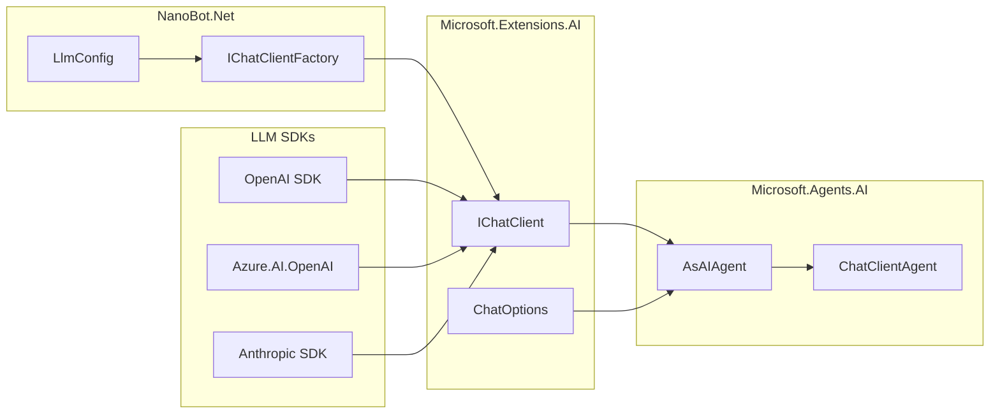

# 提供商层设计

本文档定义 NanoBot.Net 的 LLM 提供商层设计。

**核心原则**：直接使用 `Microsoft.Extensions.AI` 的 `IChatClient` 抽象，**不定义自定义的 Provider 抽象**。

---

## 设计原则

### 为什么不需要自定义 Provider 抽象

Microsoft.Agents.AI 框架已经提供了完整的 LLM 客户端抽象：

1. **`IChatClient` 接口**：统一的 LLM 调用抽象
2. **`AsAIAgent()` 扩展方法**：将任何 `IChatClient` 转换为 `AIAgent`
3. **官方客户端实现**：OpenAI、Azure OpenAI、Anthropic 等

NanoBot.Net 只需：
- 使用官方或社区提供的 `IChatClient` 实现
- 通过配置选择不同的客户端
- 使用 `AsAIAgent()` 创建 Agent

---

## 框架提供的 LLM 客户端

### OpenAI

```csharp
using OpenAI;

// 直接使用 OpenAI SDK 的 ChatClient
var client = new OpenAIClient(apiKey).GetChatClient("gpt-4o");

// 转换为 AIAgent
var agent = client.AsAIAgent(
    name: "NanoBot",
    instructions: "You are a helpful assistant.",
    tools: myTools);
```

### Azure OpenAI

```csharp
using Azure.AI.OpenAI;
using Azure.Identity;

// 使用 Azure 认证
var client = new AzureOpenAIClient(
    new Uri(endpoint),
    new AzureCliCredential())
    .GetChatClient("gpt-4o");

// 转换为 AIAgent
var agent = client.AsAIAgent(instructions: "...");
```

### Anthropic

```csharp
// 使用 Microsoft.Agents.AI.Anthropic 扩展
var agent = new AnthropicClient()
    .AsAIAgent(instructions: "...");
```

### Ollama（本地模型）

```csharp
// 使用 Microsoft.Extensions.AI.Ollama 或自定义 IChatClient
var client = new OllamaChatClient("http://localhost:11434", "llama3.2");
var agent = client.AsAIAgent(instructions: "...");
```

### OpenRouter（多模型聚合）

```csharp
// OpenRouter 兼容 OpenAI API，可使用自定义 IChatClient
var client = new OpenAICompatibleClient(
    "https://openrouter.ai/api/v1",
    apiKey,
    "anthropic/claude-3.5-sonnet");
var agent = client.AsAIAgent(instructions: "...");
```

---

## 配置驱动的客户端创建

### 配置模型

```csharp
namespace NanoBot.Core.Configuration;

public class LlmConfig
{
    public string Provider { get; set; } = "openai";
    public string Model { get; set; } = "gpt-4o";
    public string? ApiKey { get; set; }
    public string? Endpoint { get; set; }
    public double Temperature { get; set; } = 0.7;
    public int MaxTokens { get; set; } = 4096;
}
```

### 客户端工厂

```csharp
namespace NanoBot.Infrastructure.Llm;

public interface IChatClientFactory
{
    IChatClient CreateChatClient(LlmConfig config);
}

public class ChatClientFactory : IChatClientFactory
{
    public IChatClient CreateChatClient(LlmConfig config)
    {
        return config.Provider.ToLowerInvariant() switch
        {
            "openai" => CreateOpenAIClient(config),
            "azure" => CreateAzureClient(config),
            "anthropic" => CreateAnthropicClient(config),
            "ollama" => CreateOllamaClient(config),
            "openrouter" => CreateOpenRouterClient(config),
            "deepseek" => CreateDeepSeekClient(config),
            "groq" => CreateGroqClient(config),
            _ => throw new NotSupportedException($"Provider '{config.Provider}' is not supported")
        };
    }
    
    private IChatClient CreateOpenAIClient(LlmConfig config)
    {
        return new OpenAIClient(config.ApiKey!)
            .GetChatClient(config.Model);
    }
    
    private IChatClient CreateAzureClient(LlmConfig config)
    {
        return new AzureOpenAIClient(
            new Uri(config.Endpoint!),
            new AzureCliCredential())
            .GetChatClient(config.Model);
    }
    
    private IChatClient CreateOpenRouterClient(LlmConfig config)
    {
        return new OpenAICompatibleClient(
            "https://openrouter.ai/api/v1",
            config.ApiKey!,
            config.Model);
    }
    
    // ... 其他提供商实现
}
```

### DI 注册

```csharp
public static class ServiceCollectionExtensions
{
    public static IServiceCollection AddLlmClient(
        this IServiceCollection services,
        LlmConfig config)
    {
        services.AddSingleton<IChatClientFactory, ChatClientFactory>();
        services.AddSingleton(sp => 
            sp.GetRequiredService<IChatClientFactory>().CreateChatClient(config));
        
        return services;
    }
}
```

---

## 预定义提供商配置

| 提供商 | Provider 值 | 默认模型 | API Base |
|--------|-------------|----------|----------|
| **OpenAI** | `openai` | `gpt-4o` | `https://api.openai.com/v1` |
| **Azure OpenAI** | `azure` | - | 用户配置 |
| **Anthropic** | `anthropic` | `claude-3-5-sonnet-20241022` | `https://api.anthropic.com/v1` |
| **OpenRouter** | `openrouter` | `anthropic/claude-3.5-sonnet` | `https://openrouter.ai/api/v1` |
| **DeepSeek** | `deepseek` | `deepseek-chat` | `https://api.deepseek.com/v1` |
| **Groq** | `groq` | `llama-3.3-70b-versatile` | `https://api.groq.com/openai/v1` |
| **Moonshot** | `moonshot` | `moonshot-v1-8k` | `https://api.moonshot.cn/v1` |
| **Zhipu** | `zhipu` | `glm-4` | `https://open.bigmodel.cn/api/paas/v4` |
| **Ollama** | `ollama` | `llama3.2` | `http://localhost:11434/v1` |

---

## 使用示例

### 基本使用

```csharp
// 从配置创建客户端
var factory = new ChatClientFactory();
var chatClient = factory.CreateChatClient(config);

// 创建 Agent
var agent = chatClient.AsAIAgent(
    name: "NanoBot",
    instructions: await BuildInstructionsAsync());

// 运行
var response = await agent.RunAsync("Hello!");
```

### 使用 ChatOptions

```csharp
var options = new ChatOptions
{
    Temperature = 0.7,
    MaxOutputTokens = 4096,
    Tools = myTools,
    Instructions = "You are a helpful assistant."
};

var agent = chatClient.AsAIAgent(options);
```

### 流式响应

```csharp
await foreach (var update in agent.RunStreamingAsync("Tell me a story"))
{
    Console.Write(update.Text);
}
```

---

## OpenAI 兼容客户端

对于兼容 OpenAI API 的提供商，可以实现通用的 `IChatClient`：

```csharp
public class OpenAICompatibleClient : IChatClient
{
    private readonly HttpClient _httpClient;
    private readonly string _model;
    private readonly string _apiKey;
    
    public OpenAICompatibleClient(
        string endpoint,
        string apiKey,
        string model,
        HttpClient? httpClient = null)
    {
        _httpClient = httpClient ?? new HttpClient { BaseAddress = new Uri(endpoint) };
        _apiKey = apiKey;
        _model = model;
        _httpClient.DefaultRequestHeaders.Authorization = 
            new AuthenticationHeaderValue("Bearer", apiKey);
    }
    
    public async Task<ChatResponse> GetResponseAsync(
        IList<ChatMessage> messages,
        ChatOptions? options = null,
        CancellationToken cancellationToken = default)
    {
        // 实现 OpenAI 兼容的 API 调用
        var request = new
        {
            model = _model,
            messages = messages.Select(m => new { role = m.Role.ToString().ToLower(), content = m.Text }),
            temperature = options?.Temperature,
            max_tokens = options?.MaxOutputTokens,
            tools = options?.Tools?.Select(t => t.ToOpenAIFormat())
        };
        
        var response = await _httpClient.PostAsJsonAsync("/chat/completions", request, cancellationToken);
        // ... 解析响应
    }
    
    public async IAsyncEnumerable<ChatResponseUpdate> GetStreamingResponseAsync(
        IList<ChatMessage> messages,
        ChatOptions? options = null,
        [EnumeratorCancellation] CancellationToken cancellationToken = default)
    {
        // 实现流式响应
    }
    
    public object? GetService(Type serviceType, object? serviceKey = null)
    {
        return serviceType == typeof(ChatClientMetadata) 
            ? new ChatClientMetadata("OpenAI-Compatible", new Uri(_httpClient.BaseAddress!, "/"), _model)
            : null;
    }
}
```

---

## 依赖关系



---

## 实现要点

### 1. 不要定义自定义 Provider 接口

❌ **错误做法**：
```csharp
public interface ILLMProvider
{
    Task<LLMResponse> CompleteAsync(LLMRequest request);
}
```

✅ **正确做法**：
```csharp
// 直接使用 IChatClient
IChatClient client = new OpenAIClient(apiKey).GetChatClient("gpt-4o");
var agent = client.AsAIAgent(instructions: "...");
```

### 2. 使用 ChatOptions 传递参数

```csharp
var options = new ChatOptions
{
    Temperature = 0.7,
    MaxOutputTokens = 4096,
    Instructions = systemPrompt,
    Tools = tools
};

var response = await client.GetResponseAsync(messages, options);
```

### 3. 工具通过 ChatOptions.Tools 传递

```csharp
var tools = new List<AITool>
{
    AIFunctionFactory.Create(ReadFileAsync),
    AIFunctionFactory.Create(WriteFileAsync)
};

var options = new ChatOptions { Tools = tools };
```

### 4. 错误处理

```csharp
try
{
    var response = await client.GetResponseAsync(messages, options);
}
catch (HttpRequestException ex)
{
    // 处理 API 错误
    _logger.LogError(ex, "LLM API call failed");
    throw;
}
```

---

## 总结

| 传统做法 | NanoBot.Net 做法 |
|----------|-----------------|
| 定义 `ILLMProvider` 接口 | 直接使用 `IChatClient` |
| 实现 `OpenAIProvider`、`AnthropicProvider` 等 | 使用官方 SDK 或 `OpenAICompatibleClient` |
| 定义 `LLMRequest`/`LLMResponse` | 使用 `ChatMessage`/`ChatResponse` |
| 自定义工具注册 | 使用 `AIFunctionFactory` |

**核心收益**：
- 减少约 500+ 行代码
- 直接使用框架能力
- 更好的互操作性
- 更少的维护负担

---

*返回 [概览文档](./Overview.md)*
