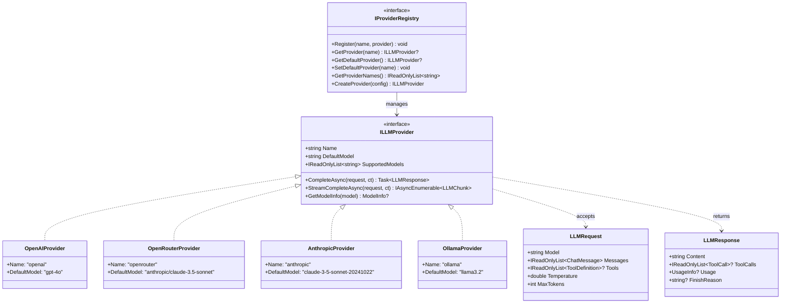

# 提供商层设计

本文档定义 NanoBot.Net 的 LLM 提供商层接口设计，对应 nanobot 的 providers/ 目录。

**依赖关系**：提供商层依赖于基础设施层（Config）。

---

## 模块概览

| 模块 | 接口 | 对应原文件 | 职责 |
|------|------|-----------|------|
| 提供商抽象 | `ILLMProvider` | `nanobot/providers/base.py` | LLM 提供商接口 |
| 提供商注册表 | `IProviderRegistry` | `nanobot/providers/registry.py` | 提供商注册与查找 |
| 提供商规格 | `ProviderSpec` | `nanobot/providers/registry.py` | 预定义提供商配置 |

---

## ILLMProvider 接口

LLM 提供商接口，对应 nanobot/providers/base.py 的 LLMProvider 类。

```csharp
namespace NanoBot.Core.Providers;

/// <summary>
/// LLM 提供商接口
/// </summary>
public interface ILLMProvider
{
    /// <summary>提供商名称</summary>
    string Name { get; }

    /// <summary>默认模型</summary>
    string DefaultModel { get; }

    /// <summary>支持的模型列表</summary>
    IReadOnlyList<string> SupportedModels { get; }

    /// <summary>完成对话</summary>
    Task<LLMResponse> CompleteAsync(
        LLMRequest request,
        CancellationToken cancellationToken = default);

    /// <summary>流式完成对话</summary>
    IAsyncEnumerable<LLMChunk> StreamCompleteAsync(
        LLMRequest request,
        CancellationToken cancellationToken = default);

    /// <summary>获取模型信息</summary>
    ModelInfo? GetModelInfo(string model);
}
```

### LLMRequest

```csharp
namespace NanoBot.Core.Providers;

/// <summary>LLM 请求</summary>
public record LLMRequest
{
    /// <summary>模型名称</summary>
    public required string Model { get; init; }

    /// <summary>消息列表</summary>
    public required IReadOnlyList<ChatMessage> Messages { get; init; }

    /// <summary>工具定义列表</summary>
    public IReadOnlyList<ToolDefinition>? Tools { get; init; }

    /// <summary>温度参数</summary>
    public double Temperature { get; init; } = 0.7;

    /// <summary>最大 Token 数</summary>
    public int MaxTokens { get; init; } = 4096;

    /// <summary>系统提示词</summary>
    public string? SystemPrompt { get; init; }

    /// <summary>停止词</summary>
    public IReadOnlyList<string>? StopSequences { get; init; }
}
```

### LLMResponse

```csharp
namespace NanoBot.Core.Providers;

/// <summary>LLM 响应</summary>
public record LLMResponse
{
    /// <summary>响应内容</summary>
    public required string Content { get; init; }

    /// <summary>工具调用列表</summary>
    public IReadOnlyList<ToolCall>? ToolCalls { get; init; }

    /// <summary>使用统计</summary>
    public UsageInfo? Usage { get; init; }

    /// <summary>完成原因</summary>
    public string? FinishReason { get; init; }

    /// <summary>响应 ID</summary>
    public string? Id { get; init; }
}
```

### LLMChunk

```csharp
namespace NanoBot.Core.Providers;

/// <summary>LLM 流式响应块</summary>
public record LLMChunk
{
    /// <summary>增量内容</summary>
    public string? Delta { get; init; }

    /// <summary>工具调用增量</summary>
    public ToolCallDelta? ToolCallDelta { get; init; }

    /// <summary>是否完成</summary>
    public bool IsComplete { get; init; }
}
```

### UsageInfo

```csharp
namespace NanoBot.Core.Providers;

/// <summary>Token 使用统计</summary>
public record UsageInfo
{
    public int PromptTokens { get; init; }
    public int CompletionTokens { get; init; }
    public int TotalTokens { get; init; }
}
```

### ModelInfo

```csharp
namespace NanoBot.Core.Providers;

/// <summary>模型信息</summary>
public record ModelInfo
{
    public required string Id { get; init; }
    public required string Name { get; init; }
    public int? ContextLength { get; init; }
    public bool SupportsVision { get; init; }
    public bool SupportsTools { get; init; }
    public decimal? InputPricePer1k { get; init; }
    public decimal? OutputPricePer1k { get; init; }
}
```

---

## IProviderRegistry 接口

提供商注册表接口，对应 nanobot/providers/registry.py。

```csharp
namespace NanoBot.Core.Providers;

/// <summary>
/// 提供商注册表接口
/// </summary>
public interface IProviderRegistry
{
    /// <summary>注册提供商</summary>
    void Register(string name, ILLMProvider provider);

    /// <summary>获取提供商</summary>
    ILLMProvider? GetProvider(string name);

    /// <summary>获取默认提供商</summary>
    ILLMProvider? GetDefaultProvider();

    /// <summary>设置默认提供商</summary>
    void SetDefaultProvider(string name);

    /// <summary>获取所有提供商名称</summary>
    IReadOnlyList<string> GetProviderNames();

    /// <summary>根据配置创建提供商</summary>
    ILLMProvider CreateProvider(ProviderConfig config);
}
```

---

## ToolDefinition

```csharp
namespace NanoBot.Core.Providers;

/// <summary>工具定义（用于 LLM 函数调用）</summary>
public record ToolDefinition
{
    /// <summary>工具类型</summary>
    public string Type { get; init; } = "function";

    /// <summary>函数定义</summary>
    public required FunctionDefinition Function { get; init; }
}

/// <summary>函数定义</summary>
public record FunctionDefinition
{
    /// <summary>函数名称</summary>
    public required string Name { get; init; }

    /// <summary>函数描述</summary>
    public required string Description { get; init; }

    /// <summary>参数 Schema</summary>
    public required JsonElement Parameters { get; init; }
}
```

---

## ProviderSpec 提供商规格

预定义的提供商配置，对应 nanobot/providers/registry.py 的 PROVIDERS 字典。

| 提供商 | API Base | 默认模型 | 特点 |
|--------|----------|----------|------|
| **openrouter** | `https://openrouter.ai/api/v1` | `anthropic/claude-3.5-sonnet` | 多模型聚合，支持 100+ 模型 |
| **openai** | `https://api.openai.com/v1` | `gpt-4o` | OpenAI 官方 API |
| **anthropic** | `https://api.anthropic.com/v1` | `claude-3-5-sonnet-20241022` | Anthropic 官方 API |
| **deepseek** | `https://api.deepseek.com/v1` | `deepseek-chat` | DeepSeek API |
| **groq** | `https://api.groq.com/openai/v1` | `llama-3.3-70b-versatile` | 高速推理 |
| **moonshot** | `https://api.moonshot.cn/v1` | `moonshot-v1-8k` | Kimi AI |
| **zhipu** | `https://open.bigmodel.cn/api/paas/v4` | `glm-4` | 智谱 AI |
| **ollama** | `http://localhost:11434/v1` | `llama3.2` | 本地模型 |
| **lmstudio** | `http://localhost:1234/v1` | - | 本地模型 |
| **custom** | 用户自定义 | - | 自定义 API |

---

## 类图



---

## 提供商配置类

```csharp
namespace NanoBot.Core.Configuration;

/// <summary>LLM 配置</summary>
public class LlmConfig
{
    /// <summary>模型名称</summary>
    public string Model { get; set; } = "";

    /// <summary>API 密钥</summary>
    public string? ApiKey { get; set; }

    /// <summary>API Base URL</summary>
    public string? ApiBase { get; set; }

    /// <summary>提供商名称</summary>
    public string? Provider { get; set; }

    /// <summary>温度参数</summary>
    public double Temperature { get; set; } = 0.7;

    /// <summary>最大 Token 数</summary>
    public int MaxTokens { get; set; } = 4096;

    /// <summary>系统提示词</summary>
    public string? SystemPrompt { get; set; }
}
```

---

## 依赖关系

```mermaid
graph LR
    subgraph "提供商层"
        ILLMProvider[ILLMProvider]
        IProviderRegistry[IProviderRegistry]
    end

    subgraph "Agent 核心层"
        IAgent[IAgent]
    end

    subgraph "基础设施层"
        IConfig[IConfiguration]
    end

    IAgent --> ILLMProvider : uses
    IProviderRegistry --> ILLMProvider : manages
    ILLMProvider --> IConfig : reads
```

---

## 实现要点

### OpenAI 兼容 API

大多数提供商支持 OpenAI 兼容的 API 格式：
- 统一的请求/响应结构
- 相同的认证方式（Bearer Token）
- 相同的工具调用格式

### 流式响应

1. 使用 `IAsyncEnumerable<T>` 实现流式输出
2. 支持 SSE (Server-Sent Events) 解析
3. 支持增量工具调用

### 错误处理

1. API 错误重试机制
2. Rate Limit 处理
3. 超时控制

### 模型发现

1. 支持动态获取可用模型列表
2. 缓存模型信息
3. 支持模型别名

---

*返回 [概览文档](./NanoBot.Net-Overview.md)*
