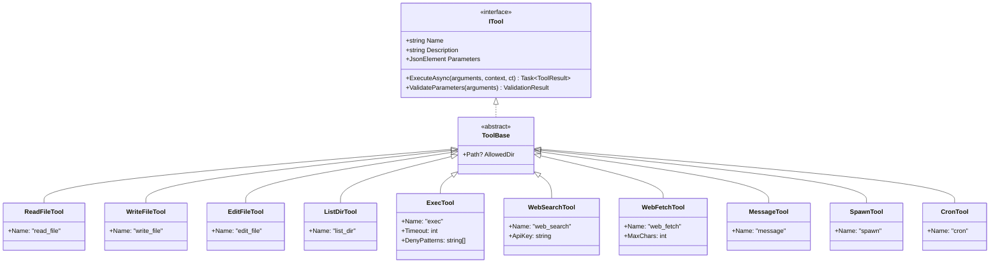

# 工具层设计

本文档定义 NanoBot.Net 的工具层接口设计，对应 nanobot 的 agent/tools/ 目录。

**依赖关系**：工具层依赖于 Agent 核心层（IAgent）和基础设施层（Config）。

---

## 模块概览

| 模块 | 接口 | 对应原文件 | 职责 |
|------|------|-----------|------|
| 工具抽象 | `ITool` | `nanobot/agent/tools/base.py` | 工具接口定义 |
| 工具注册表 | `IToolRegistry` | - | 工具注册与查找 |
| MCP 客户端 | `IMcpClient` | `nanobot/agent/tools/mcp.py` | MCP 协议客户端 |

---

## ITool 接口

工具接口，对应 nanobot/agent/tools/base.py 的 Tool 类，基于 Microsoft.Agents.AI 的 ITool 模式设计。

```csharp
namespace NanoBot.Core.Tools;

/// <summary>
/// 工具接口
/// </summary>
public interface ITool
{
    /// <summary>工具名称（用于函数调用）</summary>
    string Name { get; }

    /// <summary>工具描述</summary>
    string Description { get; }

    /// <summary>参数 JSON Schema</summary>
    JsonElement Parameters { get; }

    /// <summary>执行工具</summary>
    Task<ToolResult> ExecuteAsync(
        JsonElement arguments,
        IToolContext context,
        CancellationToken cancellationToken = default);

    /// <summary>验证参数</summary>
    ValidationResult ValidateParameters(JsonElement arguments);
}
```

### ToolResult

```csharp
namespace NanoBot.Core.Tools;

/// <summary>工具执行结果</summary>
public record ToolResult
{
    /// <summary>输出内容</summary>
    public required string Output { get; init; }

    /// <summary>是否成功</summary>
    public bool IsSuccess { get; init; } = true;

    /// <summary>错误信息</summary>
    public string? ErrorMessage { get; init; }
}
```

### IToolContext

```csharp
namespace NanoBot.Core.Tools;

/// <summary>工具执行上下文</summary>
public interface IToolContext
{
    /// <summary>工作目录</summary>
    string WorkingDirectory { get; }

    /// <summary>当前 Agent</summary>
    IAgent Agent { get; }

    /// <summary>服务提供者</summary>
    IServiceProvider Services { get; }
}
```

### ValidationResult

```csharp
namespace NanoBot.Core.Tools;

/// <summary>参数验证结果</summary>
public record ValidationResult
{
    /// <summary>是否有效</summary>
    public bool IsValid { get; init; }

    /// <summary>错误信息列表</summary>
    public IReadOnlyList<string> Errors { get; init; } = Array.Empty<string>();

    public static ValidationResult Success() => new() { IsValid = true };
    public static ValidationResult Failure(params string[] errors) => new() { IsValid = false, Errors = errors };
}
```

---

## IToolRegistry 接口

工具注册表接口，管理所有可用工具的注册和查找。

```csharp
namespace NanoBot.Core.Tools;

/// <summary>
/// 工具注册表接口
/// </summary>
public interface IToolRegistry
{
    /// <summary>注册工具</summary>
    void Register(ITool tool);

    /// <summary>批量注册工具</summary>
    void RegisterRange(IEnumerable<ITool> tools);

    /// <summary>获取工具</summary>
    ITool? GetTool(string name);

    /// <summary>获取所有工具</summary>
    IReadOnlyList<ITool> GetAllTools();

    /// <summary>获取工具的 OpenAI 函数 Schema</summary>
    IReadOnlyList<JsonElement> GetToolSchemas();

    /// <summary>检查工具是否存在</summary>
    bool HasTool(string name);
}
```

---

## 内置工具清单

| 工具名称 | 功能描述 | 关键参数 | 对应原文件 |
|----------|----------|----------|-----------|
| **read_file** | 读取文件内容 | `path`: 文件路径 | `tools/filesystem.py` |
| **write_file** | 写入文件内容，自动创建父目录 | `path`, `content` | `tools/filesystem.py` |
| **edit_file** | 替换文件中的文本 | `path`, `old_text`, `new_text` | `tools/filesystem.py` |
| **list_dir** | 列出目录内容 | `path`: 目录路径 | `tools/filesystem.py` |
| **exec** | 执行 Shell 命令 | `command`, `timeout`, `deny_patterns` | `tools/shell.py` |
| **web_search** | 使用 Brave Search 搜索网页 | `query`, `api_key` | `tools/web.py` |
| **web_fetch** | 获取网页并提取可读内容 | `url`, `max_chars` | `tools/web.py` |
| **message** | 发送消息到指定通道 | `channel`, `chat_id`, `content` | `tools/spawn.py` |
| **spawn** | 创建子 Agent 执行后台任务 | `task`, `label` | `tools/spawn.py` |
| **cron** | 管理定时任务 | `action`, `name`, `schedule`, `message` | `tools/cron.py` |

---

## 内置工具类图



---

## 文件工具详细设计

### read_file

```csharp
/// <summary>读取文件内容</summary>
public record ReadFileArgs
{
    /// <summary>文件路径（相对于工作目录）</summary>
    public required string Path { get; init; }

    /// <summary>起始行号（可选）</summary>
    public int? StartLine { get; init; }

    /// <summary>结束行号（可选）</summary>
    public int? EndLine { get; init; }
}
```

### write_file

```csharp
/// <summary>写入文件内容</summary>
public record WriteFileArgs
{
    /// <summary>文件路径</summary>
    public required string Path { get; init; }

    /// <summary>文件内容</summary>
    public required string Content { get; init; }

    /// <summary>是否追加模式</summary>
    public bool Append { get; init; } = false;
}
```

### edit_file

```csharp
/// <summary>编辑文件内容</summary>
public record EditFileArgs
{
    /// <summary>文件路径</summary>
    public required string Path { get; init; }

    /// <summary>要替换的文本</summary>
    public required string OldText { get; init; }

    /// <summary>新文本</summary>
    public required string NewText { get; init; }

    /// <summary>是否替换所有匹配</summary>
    public bool ReplaceAll { get; init; } = false;
}
```

### list_dir

```csharp
/// <summary>列出目录内容</summary>
public record ListDirArgs
{
    /// <summary>目录路径</summary>
    public required string Path { get; init; }

    /// <summary>是否递归列出</summary>
    public bool Recursive { get; init; } = false;

    /// <summary>文件名过滤模式</summary>
    public string? Pattern { get; init; }
}
```

---

## Shell 工具详细设计

### exec

```csharp
/// <summary>执行 Shell 命令</summary>
public record ExecArgs
{
    /// <summary>要执行的命令</summary>
    public required string Command { get; init; }

    /// <summary>超时时间（秒）</summary>
    public int Timeout { get; init; } = 60;

    /// <summary>工作目录（可选）</summary>
    public string? WorkingDir { get; init; }

    /// <summary>环境变量（可选）</summary>
    public IDictionary<string, string>? Env { get; init; }
}
```

**安全限制**：
- 禁止执行的命令模式（可在配置中设置）
- 默认限制在工作目录内执行
- 超时自动终止

---

## Web 工具详细设计

### web_search

```csharp
/// <summary>网页搜索</summary>
public record WebSearchArgs
{
    /// <summary>搜索关键词</summary>
    public required string Query { get; init; }

    /// <summary>结果数量限制</summary>
    public int Count { get; init; } = 10;
}
```

### web_fetch

```csharp
/// <summary>获取网页内容</summary>
public record WebFetchArgs
{
    /// <summary>网页 URL</summary>
    public required string Url { get; init; }

    /// <summary>最大字符数</summary>
    public int MaxChars { get; init; } = 10000;

    /// <summary>是否提取可读内容</summary>
    public bool ExtractReadable { get; init; } = true;
}
```

---

## 消息工具详细设计

### message

```csharp
/// <summary>发送消息</summary>
public record MessageArgs
{
    /// <summary>目标通道</summary>
    public required string Channel { get; init; }

    /// <summary>目标聊天 ID</summary>
    public required string ChatId { get; init; }

    /// <summary>消息内容</summary>
    public required string Content { get; init; }
}
```

---

## Spawn 工具详细设计

### spawn

```csharp
/// <summary>创建子 Agent</summary>
public record SpawnArgs
{
    /// <summary>任务描述</summary>
    public required string Task { get; init; }

    /// <summary>任务标签（可选）</summary>
    public string? Label { get; init; }
}
```

---

## Cron 工具详细设计

### cron

```csharp
/// <summary>定时任务管理</summary>
public record CronArgs
{
    /// <summary>操作类型：list, add, remove, enable, disable</summary>
    public required string Action { get; init; }

    /// <summary>任务名称</summary>
    public string? Name { get; init; }

    /// <summary>调度配置</summary>
    public CronSchedule? Schedule { get; init; }

    /// <summary>要发送的消息</summary>
    public string? Message { get; init; }

    /// <summary>目标通道</summary>
    public string? Channel { get; init; }

    /// <summary>目标用户</summary>
    public string? TargetUser { get; init; }
}
```

---

## IMcpClient 接口

MCP 客户端接口，对应 nanobot/agent/tools/mcp.py，Model Context Protocol 客户端。

```csharp
namespace NanoBot.Core.Mcp;

/// <summary>
/// MCP 客户端接口
/// </summary>
public interface IMcpClient
{
    /// <summary>连接到 MCP 服务器</summary>
    Task ConnectAsync(string serverName, McpServerConfig config, CancellationToken cancellationToken = default);

    /// <summary>断开连接</summary>
    Task DisconnectAsync(string serverName, CancellationToken cancellationToken = default);

    /// <summary>获取服务器提供的工具列表</summary>
    Task<IReadOnlyList<McpTool>> ListToolsAsync(string serverName, CancellationToken cancellationToken = default);

    /// <summary>调用 MCP 工具</summary>
    Task<McpToolResult> CallToolAsync(
        string serverName,
        string toolName,
        Dictionary<string, object> arguments,
        CancellationToken cancellationToken = default);

    /// <summary>获取已连接的服务器</summary>
    IReadOnlyList<string> ConnectedServers { get; }

    /// <summary>获取所有可用工具</summary>
    IReadOnlyList<McpTool> GetAllTools();
}
```

### McpServerConfig

```csharp
namespace NanoBot.Core.Mcp;

/// <summary>MCP 服务器配置</summary>
public record McpServerConfig
{
    /// <summary>启动命令</summary>
    public required string Command { get; init; }

    /// <summary>命令参数</summary>
    public IReadOnlyList<string> Args { get; init; } = Array.Empty<string>();

    /// <summary>环境变量</summary>
    public IReadOnlyDictionary<string, string> Env { get; init; } = new Dictionary<string, string>();

    /// <summary>工作目录</summary>
    public string? Cwd { get; init; }
}
```

### McpTool

```csharp
namespace NanoBot.Core.Mcp;

/// <summary>MCP 工具定义</summary>
public record McpTool
{
    /// <summary>所属服务器名称</summary>
    public required string ServerName { get; init; }

    /// <summary>工具名称</summary>
    public required string Name { get; init; }

    /// <summary>工具描述</summary>
    public required string Description { get; init; }

    /// <summary>输入 Schema</summary>
    public required JsonElement InputSchema { get; init; }
}
```

### McpToolResult

```csharp
namespace NanoBot.Core.Mcp;

/// <summary>MCP 工具执行结果</summary>
public record McpToolResult
{
    /// <summary>结果内容</summary>
    public required string Content { get; init; }

    /// <summary>是否为错误</summary>
    public bool IsError { get; init; }
}
```

---

## 依赖关系

```mermaid
graph LR
    subgraph "工具层"
        ITool[ITool]
        IToolRegistry[IToolRegistry]
        IMcpClient[IMcpClient]
    end

    subgraph "Agent 核心层"
        IAgent[IAgent]
    end

    subgraph "基础设施层"
        IMessageBus[IMessageBus]
        ICronService[ICronService]
        ISubagentManager[ISubagentManager]
    end

    ITool --> IAgent : uses
    IToolRegistry --> ITool : manages
    IMcpClient --> ITool : wraps as
    MessageTool --> IMessageBus
    CronTool --> ICronService
    SpawnTool --> ISubagentManager
```

---

## 实现要点

### 工具注册

1. 在 DI 容器中注册所有内置工具
2. 支持动态注册外部工具
3. 工具 Schema 自动生成

### 安全控制

1. 文件操作限制在工作目录
2. Shell 命令黑名单过滤
3. 超时自动终止

### MCP 集成

1. 通过 stdio 与 MCP 服务器通信
2. 自动发现服务器提供的工具
3. 将 MCP 工具包装为 ITool

---

*返回 [概览文档](./NanoBot.Net-Overview.md)*
