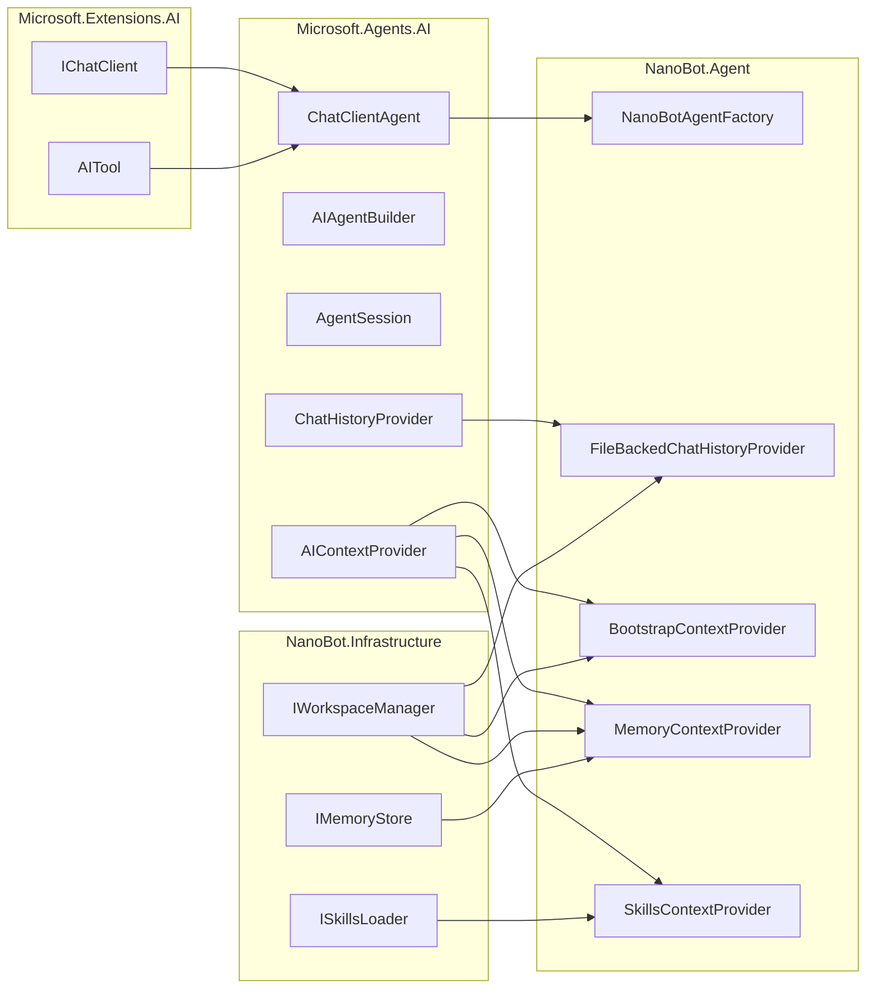

# Agent 核心设计

本文档定义 NanoBot.Net 的 Agent 核心实现。

**核心原则**：直接使用 `ChatClientAgent` 和 `AIContextProvider`，**不重新实现 Agent 循环**。

> **最近更新**（2026-02-27 同步）：
> - 模型临时文本后工具调用重试机制
> - 内存整合重复任务防护（`_consolidating` 集合）
> - 流式中间进度报告（`IProgressReporter`）
> - 默认温度参数调整为 0.1
> - Heartbeat 两阶段决策机制

---

## 设计原则

### 为什么不需要自定义 Agent 基类

Microsoft.Agents.AI 框架已经提供了完整的 Agent 实现：

1. **`ChatClientAgent`**：基于 `IChatClient` 的 Agent 实现，自动处理工具调用循环
2. **`AIAgentBuilder`**：用于构建 Agent 管道，添加中间件
3. **`AgentSession`**：会话状态管理，支持序列化/反序列化
4. **`AIContextProvider`**：上下文注入机制，调用前后均可介入
5. **`ChatHistoryProvider`**：历史消息管理，专门处理对话历史

NanoBot.Net 只需：
- 使用 `ChatClientAgent` 作为 Agent 基础
- 通过 `AIContextProvider` 注入 nanobot 特有上下文（AGENTS.md、SOUL.md、MEMORY.md、Skills）
- 通过 `ChatHistoryProvider` 管理 HISTORY.md
- 使用 `AsAIFunction()` 实现子 Agent 协作

---

## 框架提供的 Agent 类型

### ChatClientAgent（核心实现）

```csharp
using Microsoft.Agents.AI;

// 方式一：简化构造
var agent = new ChatClientAgent(
    chatClient,
    instructions: "You are a helpful assistant.",
    name: "NanoBot",
    tools: myTools);

// 方式二：完整配置
var agent = new ChatClientAgent(
    chatClient,
    new ChatClientAgentOptions
    {
        Name = "NanoBot",
        ChatOptions = new ChatOptions
        {
            Instructions = "You are a helpful assistant.",
            Tools = myTools
        },
        AIContextProviders = contextProviders,
        ChatHistoryProvider = historyProvider
    });

// 运行 Agent
var response = await agent.RunAsync("Hello!");

// 流式运行
await foreach (var update in agent.RunStreamingAsync("Tell me a story"))
{
    Console.Write(update.Text);
}
```

### AIAgentBuilder（中间件管道）

```csharp
// 使用 Builder 模式添加中间件
var agent = new ChatClientAgent(chatClient, options)
    .AsBuilder()
    .Use((inner, _) => new LoggingAgent(inner, logger))
    .Use((messages, session, options, next, ct) =>
    {
        // 前置处理
        Console.WriteLine("Before invocation");
        
        // 调用内部 Agent
        return next(messages, session, options, ct);
    })
    .Build();
```

---

## Provider 职责划分

### ChatHistoryProvider vs AIContextProvider

| Provider 类型 | 职责 | 管理文件 | 框架调用时机 |
|--------------|------|----------|-------------|
| `ChatHistoryProvider` | 对话历史管理 | HISTORY.md | 调用前提供历史，调用后存储新消息 |
| `AIContextProvider` | 额外上下文注入 | AGENTS.md, SOUL.md, MEMORY.md, Skills | 调用前提供上下文，调用后更新状态 |

**关键区别**：
- `ChatHistoryProvider` 专门管理 `ChatMessage` 列表
- `AIContextProvider` 提供 `Instructions`、`Messages`、`Tools`

---

## NanoBot Agent 实现

### 使用 ChatClientAgent（无需封装）

```csharp
namespace NanoBot.Agent;

public static class NanoBotAgentFactory
{
    public static ChatClientAgent Create(
        IChatClient chatClient,
        IWorkspaceManager workspace,
        ISkillsLoader skillsLoader,
        IReadOnlyList<AITool> tools,
        ILoggerFactory loggerFactory)
    {
        var contextProviders = new List<AIContextProvider>
        {
            new BootstrapContextProvider(workspace),
            new MemoryContextProvider(workspace),
            new SkillsContextProvider(skillsLoader)
        };

        var historyProvider = new FileBackedChatHistoryProvider(workspace);

        var instructions = BuildInstructions(workspace);

        return new ChatClientAgent(
            chatClient,
            new ChatClientAgentOptions
            {
                Name = "NanoBot",
                Description = "A personal AI assistant",
                ChatOptions = new ChatOptions
                {
                    Instructions = instructions,
                    Tools = tools
                },
                AIContextProviders = contextProviders,
                ChatHistoryProvider = historyProvider
            },
            loggerFactory);
    }

    private static string BuildInstructions(IWorkspaceManager workspace)
    {
        var sb = new StringBuilder();
        sb.AppendLine("You are NanoBot, a personal AI assistant.");
        sb.AppendLine();
        
        var agentsPath = workspace.GetFilePath("AGENTS.md");
        if (File.Exists(agentsPath))
        {
            sb.AppendLine("## Agent Configuration");
            sb.AppendLine(File.ReadAllText(agentsPath));
            sb.AppendLine();
        }
        
        var soulPath = workspace.GetFilePath("SOUL.md");
        if (File.Exists(soulPath))
        {
            sb.AppendLine("## Personality");
            sb.AppendLine(File.ReadAllText(soulPath));
        }
        
        return sb.ToString();
    }
}
```

---

## ChatHistoryProvider 实现

### FileBackedChatHistoryProvider

管理 HISTORY.md 文件，框架自动调用：

```csharp
namespace NanoBot.Agent.Context;

public class FileBackedChatHistoryProvider : ChatHistoryProvider
{
    private readonly IWorkspaceManager _workspace;
    private readonly int _maxHistoryEntries;

    public FileBackedChatHistoryProvider(
        IWorkspaceManager workspace,
        int maxHistoryEntries = 100)
    {
        _workspace = workspace;
        _maxHistoryEntries = maxHistoryEntries;
    }

    protected override async ValueTask<IEnumerable<ChatMessage>> ProvideChatHistoryAsync(
        InvokingContext context,
        CancellationToken cancellationToken)
    {
        var historyPath = _workspace.GetFilePath("HISTORY.md");
        if (!File.Exists(historyPath))
            return [];

        var lines = await File.ReadAllLinesAsync(historyPath, cancellationToken);
        var recentLines = lines.TakeLast(_maxHistoryEntries).ToList();
        
        return ParseHistoryToMessages(recentLines);
    }

    protected override async ValueTask StoreChatHistoryAsync(
        InvokedContext context,
        CancellationToken cancellationToken)
    {
        var historyPath = _workspace.GetFilePath("HISTORY.md");
        
        var sb = new StringBuilder();
        foreach (var message in context.RequestMessages)
        {
            sb.AppendLine($"[{DateTime.UtcNow:yyyy-MM-dd HH:mm:ss}] {message.Role}: {message.Text}");
        }
        foreach (var message in context.ResponseMessages)
        {
            sb.AppendLine($"[{DateTime.UtcNow:yyyy-MM-dd HH:mm:ss}] {message.Role}: {message.Text}");
        }
        sb.AppendLine();
        
        await File.AppendAllTextAsync(historyPath, sb.ToString(), cancellationToken);
    }

    private IEnumerable<ChatMessage> ParseHistoryToMessages(List<string> lines)
    {
        foreach (var line in lines)
        {
            if (string.IsNullOrWhiteSpace(line)) continue;
            
            if (line.Contains("User:"))
            {
                yield return new ChatMessage(ChatRole.User, line.Split("User:")[1].Trim());
            }
            else if (line.Contains("Assistant:"))
            {
                yield return new ChatMessage(ChatRole.Assistant, line.Split("Assistant:")[1].Trim());
            }
        }
    }
}
```

---

## AIContextProvider 实现

### 正确的 API 签名

```csharp
namespace NanoBot.Agent.Context;

public class BootstrapContextProvider : AIContextProvider
{
    private readonly IWorkspaceManager _workspace;

    public BootstrapContextProvider(IWorkspaceManager workspace)
    {
        _workspace = workspace;
    }

    protected override async ValueTask<AIContext> ProvideAIContextAsync(
        InvokingContext context,
        CancellationToken cancellationToken)
    {
        var instructions = new StringBuilder();

        var agentsPath = _workspace.GetFilePath("AGENTS.md");
        if (File.Exists(agentsPath))
        {
            instructions.AppendLine("## Agent Configuration");
            instructions.AppendLine(await File.ReadAllTextAsync(agentsPath, cancellationToken));
            instructions.AppendLine();
        }

        var soulPath = _workspace.GetFilePath("SOUL.md");
        if (File.Exists(soulPath))
        {
            instructions.AppendLine("## Personality");
            instructions.AppendLine(await File.ReadAllTextAsync(soulPath, cancellationToken));
        }

        return new AIContext
        {
            Instructions = instructions.Length > 0 ? instructions.ToString() : null
        };
    }
}
```

### MemoryContextProvider（带调用后更新）

```csharp
namespace NanoBot.Agent.Context;

public class MemoryContextProvider : AIContextProvider
{
    private readonly IWorkspaceManager _workspace;
    private readonly IMemoryStore _memoryStore;

    public MemoryContextProvider(
        IWorkspaceManager workspace,
        IMemoryStore memoryStore)
    {
        _workspace = workspace;
        _memoryStore = memoryStore;
    }

    protected override async ValueTask<AIContext> ProvideAIContextAsync(
        InvokingContext context,
        CancellationToken cancellationToken)
    {
        var memory = await _memoryStore.LoadAsync(cancellationToken);
        
        if (string.IsNullOrEmpty(memory))
            return new AIContext();

        return new AIContext
        {
            Instructions = $"## Memory\n{memory}"
        };
    }

    protected override async ValueTask StoreAIContextAsync(
        InvokedContext context,
        CancellationToken cancellationToken)
    {
        await _memoryStore.UpdateAsync(
            context.RequestMessages,
            context.ResponseMessages,
            cancellationToken);
    }
}
```

### SkillsContextProvider

```csharp
namespace NanoBot.Agent.Context;

public class SkillsContextProvider : AIContextProvider
{
    private readonly ISkillsLoader _skillsLoader;

    public SkillsContextProvider(ISkillsLoader skillsLoader)
    {
        _skillsLoader = skillsLoader;
    }

    protected override async ValueTask<AIContext> ProvideAIContextAsync(
        InvokingContext context,
        CancellationToken cancellationToken)
    {
        var skills = await _skillsLoader.LoadSkillsAsync(cancellationToken);
        
        if (!skills.Any())
            return new AIContext();

        var sb = new StringBuilder();
        sb.AppendLine("## Available Skills");

        foreach (var skill in skills)
        {
            sb.AppendLine($"### {skill.Name}");
            if (skill.AlwaysLoad)
            {
                sb.AppendLine(skill.Content);
            }
            else
            {
                sb.AppendLine($"Description: {skill.Description}");
            }
            sb.AppendLine();
        }

        return new AIContext
        {
            Instructions = sb.ToString()
        };
    }
}
```

---

## 会话管理

### 使用框架内置能力

```csharp
// 创建新会话
var session = await agent.CreateSessionAsync();

// 运行 Agent
var response = await agent.RunAsync("Hello!", session);

// 持久化会话
var serialized = await agent.SerializeSessionAsync(session);
await File.WriteAllTextAsync("session.json", serialized.GetRawText());

// 恢复会话
var json = await File.ReadAllTextAsync("session.json");
var restored = await agent.DeserializeSessionAsync(JsonDocument.Parse(json).RootElement);

// 继续对话
var response2 = await agent.RunAsync("Continue...", restored);
```

### 使用 AgentSession.StateBag 存储自定义状态

```csharp
public class MyContextProvider : AIContextProvider
{
    protected override async ValueTask<AIContext> ProvideAIContextAsync(
        InvokingContext context,
        CancellationToken cancellationToken)
    {
        // 从 StateBag 读取状态
        if (context.Session?.StateBag.TryGetValue("custom_data", out string? data) == true)
        {
            // 使用存储的状态
        }
        
        return new AIContext();
    }

    protected override ValueTask StoreAIContextAsync(
        InvokedContext context,
        CancellationToken cancellationToken)
    {
        // 存储状态到 StateBag
        context.Session?.StateBag.SetValue("custom_data", "some value");
        return default;
    }
}
```

---

## 中间件

### 使用 AIAgentBuilder

```csharp
var agent = new ChatClientAgent(chatClient, options, loggerFactory)
    .AsBuilder()
    .Use((inner, services) => new LoggingAgent(inner, logger))
    .Use(async (messages, session, options, next, ct) =>
    {
        Console.WriteLine($"[Before] Messages count: {messages.Count()}");
        
        var response = await next(messages, session, options, ct);
        
        Console.WriteLine($"[After] Response: {response.Text?[..Math.Min(50, response.Text.Length)]}...");
        
        return response;
    })
    .Build();
```

### 内置中间件

框架提供：
- `LoggingAgent`：日志记录
- `OpenTelemetryAgent`：遥测

```csharp
var agent = new ChatClientAgent(chatClient, options, loggerFactory)
    .AsBuilder()
    .Use((inner, _) => new LoggingAgent(inner, logger))
    .Use((inner, _) => new OpenTelemetryAgent(inner, telemetrySource))
    .Build();
```

---

## 子 Agent 管理

### 使用 AsAIFunction()

```csharp
public static AITool CreateSpawnTool(
    IChatClient chatClient,
    IWorkspaceManager workspace,
    ILogger logger)
{
    [Description("Create a sub-agent to handle a specific task.")]
    async Task<string> SpawnAsync(
        [Description("The task for the sub-agent to handle")] string task,
        [Description("Optional label for the sub-agent")] string? label = null)
    {
        var subAgentName = label ?? $"subagent_{Guid.NewGuid():N}";
        
        var subAgent = new ChatClientAgent(
            chatClient,
            instructions: $"You are a specialized agent. Task: {task}",
            name: subAgentName);
        
        logger.LogInformation("Spawning sub-agent: {Name}", subAgentName);
        
        var response = await subAgent.RunAsync(task);
        
        return $"Sub-agent {subAgentName} completed:\n{response.Text}";
    }

    return AIFunctionFactory.Create(
        SpawnAsync,
        new AIFunctionFactoryOptions
        {
            Name = "spawn",
            Description = "Create a sub-agent to handle a specific task."
        });
}

// 将 Agent 转换为工具供其他 Agent 调用
var childAgent = new ChatClientAgent(chatClient, instructions: "...", name: "ChildAgent");
var childAgentTool = childAgent.AsAIFunction(
    new AIFunctionFactoryOptions
    {
        Name = "ask_child_agent",
        Description = "Ask the child agent for help"
    });

// 注册到父 Agent 的工具列表
var parentAgent = new ChatClientAgent(
    chatClient,
    new ChatClientAgentOptions
    {
        ChatOptions = new ChatOptions
        {
            Tools = [childAgentTool, ...other tools]
        }
    });
```

---

## DI 注册

```csharp
public static class ServiceCollectionExtensions
{
    public static IServiceCollection AddNanoBotAgent(this IServiceCollection services)
    {
        // 注册 ChatHistoryProvider
        services.AddSingleton<ChatHistoryProvider, FileBackedChatHistoryProvider>();

        // 注册 AIContextProvider
        services.AddSingleton<AIContextProvider, BootstrapContextProvider>();
        services.AddSingleton<AIContextProvider, MemoryContextProvider>();
        services.AddSingleton<AIContextProvider, SkillsContextProvider>();

        // 注册 ChatClientAgent
        services.AddSingleton<ChatClientAgent>(sp =>
        {
            var chatClient = sp.GetRequiredService<IChatClient>();
            var workspace = sp.GetRequiredService<IWorkspaceManager>();
            var skillsLoader = sp.GetRequiredService<ISkillsLoader>();
            var tools = sp.GetServices<AITool>().ToList();
            var loggerFactory = sp.GetRequiredService<ILoggerFactory>();
            var contextProviders = sp.GetServices<AIContextProvider>().ToList();
            var historyProvider = sp.GetRequiredService<ChatHistoryProvider>();

            return NanoBotAgentFactory.Create(
                chatClient, workspace, skillsLoader, tools, loggerFactory);
        });

        return services;
    }
}
```

---

## 依赖关系



---

## 实现要点

### 1. 不要重新实现 Agent 循环

**错误做法**：
```csharp
public class MyAgent
{
    public async Task RunAsync()
    {
        while (true)
        {
            var response = await _llm.CompleteAsync(messages);
            if (response.ToolCalls.Any())
            {
                foreach (var call in response.ToolCalls)
                {
                    var result = await ExecuteToolAsync(call);
                    messages.Add(result);
                }
                continue;
            }
            break;
        }
    }
}
```

**正确做法**：
```csharp
var agent = new ChatClientAgent(chatClient, new ChatClientAgentOptions
{
    ChatOptions = new ChatOptions { Tools = tools }
});
var response = await agent.RunAsync(input);
```

### 2. 正确使用 AIContextProvider

**错误做法**：
```csharp
protected override async Task<AIContext> GetContextAsync(...)  // 方法名错误
protected override async Task<AIContext> ProvideContextAsync(...)  // 方法名错误
```

**正确做法**：
```csharp
protected override async ValueTask<AIContext> ProvideAIContextAsync(
    InvokingContext context,
    CancellationToken cancellationToken)
{
    return new AIContext { Instructions = "..." };
}
```

### 3. 区分 ChatHistoryProvider 和 AIContextProvider

**ChatHistoryProvider**：管理 `ChatMessage` 列表
```csharp
protected override ValueTask<IEnumerable<ChatMessage>> ProvideChatHistoryAsync(...)
protected override ValueTask StoreChatHistoryAsync(...)
```

**AIContextProvider**：提供 `Instructions`、`Messages`、`Tools`
```csharp
protected override ValueTask<AIContext> ProvideAIContextAsync(...)
protected override ValueTask StoreAIContextAsync(...)
```

### 4. 使用 AsAIFunction 实现 Agent 协作

**错误做法**：自定义子 Agent 管理逻辑

**正确做法**：
```csharp
var childTool = childAgent.AsAIFunction();
var parentAgent = new ChatClientAgent(chatClient, new ChatClientAgentOptions
{
    ChatOptions = new ChatOptions { Tools = [childTool] }
});
```

---

## 总结

| 传统做法 | NanoBot.Net 做法 |
|----------|-----------------|
| 定义 `IAgent` 接口 | 直接使用 `ChatClientAgent` |
| 实现 Agent 循环 | 框架自动处理 |
| 自定义会话管理 | 使用 `AgentSession` + 序列化 |
| 手动注入上下文 | 使用 `AIContextProvider` |
| 自定义历史管理 | 使用 `ChatHistoryProvider` |
| 自定义中间件系统 | 使用 `AIAgentBuilder` |
| 自定义子 Agent 管理 | 使用 `AsAIFunction()` |

**核心收益**：
- 减少约 800+ 行代码
- 框架自动处理工具调用循环
- 内置会话管理（序列化/反序列化）
- 标准化的中间件管道
- 标准化的 Agent 协作机制

---

*返回 [概览文档](./Overview.md)*
