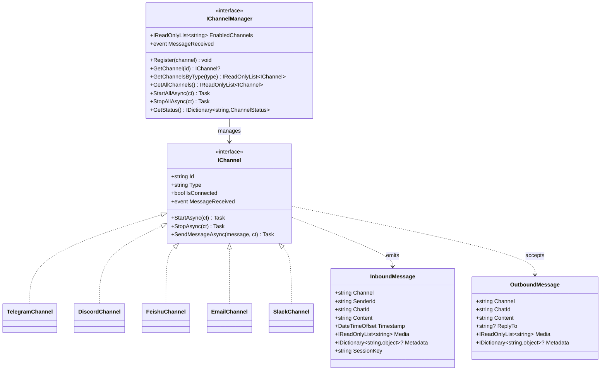

# 通道层设计

本文档定义 NanoBot.Net 的通道层接口设计，对应 nanobot 的 channels/ 目录。

**依赖关系**：通道层依赖于基础设施层（Bus、Config）。

> **最近更新**（2026-02-27 同步）：
> - **Discord 通道修复**：typing 循环错误处理，避免无限重试
> - **Telegram 通道增强**：`reply-to-message` 配置、`/help` ACL 绕过
> - **Feishu 多媒体发送**：支持图片、音频、文件发送
> - **Channel 配置分离**：`send_progress` 和 `send_tool_hints` 独立配置

---

## 模块概览

| 模块 | 接口 | 对应原文件 | 职责 |
|------|------|-----------|------|
| 通道抽象 | `IChannel` | `nanobot/channels/base.py` | 通道接口定义 |
| 通道管理器 | `IChannelManager` | `nanobot/channels/manager.py` | 通道生命周期管理 |
| 消息类型 | `InboundMessage`/`OutboundMessage` | `nanobot/bus/events.py` | 消息数据结构 |

---

## IChannel 接口

通道接口，对应 nanobot/channels/base.py 的 Channel 类，基于 Microsoft.Agents.AI 的 IChannelAdapter 模式设计。

```csharp
namespace NanoBot.Core.Channels;

/// <summary>
/// 通道接口
/// </summary>
public interface IChannel
{
    /// <summary>通道标识</summary>
    string Id { get; }

    /// <summary>通道类型（telegram, discord, feishu 等）</summary>
    string Type { get; }

    /// <summary>通道是否已连接</summary>
    bool IsConnected { get; }

    /// <summary>启动通道</summary>
    Task StartAsync(CancellationToken cancellationToken = default);

    /// <summary>停止通道</summary>
    Task StopAsync(CancellationToken cancellationToken = default);

    /// <summary>发送消息</summary>
    Task SendMessageAsync(
        OutboundMessage message,
        CancellationToken cancellationToken = default);

    /// <summary>接收消息事件</summary>
    event EventHandler<InboundMessage>? MessageReceived;
}
```

---

## 消息类型

### InboundMessage

```csharp
namespace NanoBot.Core.Channels;

/// <summary>
/// 入站消息
/// </summary>
public record InboundMessage
{
    /// <summary>通道类型（telegram, discord, feishu, whatsapp 等）</summary>
    public required string Channel { get; init; }

    /// <summary>发送者标识</summary>
    public required string SenderId { get; init; }

    /// <summary>聊天/会话标识</summary>
    public required string ChatId { get; init; }

    /// <summary>消息文本内容</summary>
    public required string Content { get; init; }

    /// <summary>消息时间戳</summary>
    public DateTimeOffset Timestamp { get; init; } = DateTimeOffset.Now;

    /// <summary>媒体文件路径列表（图片、附件等）</summary>
    public IReadOnlyList<string> Media { get; init; } = Array.Empty<string>();

    /// <summary>通道特定元数据</summary>
    public IDictionary<string, object>? Metadata { get; init; }

    /// <summary>会话键，格式为 "channel:chat_id"</summary>
    public string SessionKey => $"{Channel}:{ChatId}";
}
```

### OutboundMessage

```csharp
namespace NanoBot.Core.Channels;

/// <summary>
/// 出站消息
/// </summary>
public record OutboundMessage
{
    /// <summary>目标通道类型</summary>
    public required string Channel { get; init; }

    /// <summary>目标聊天/会话标识</summary>
    public required string ChatId { get; init; }

    /// <summary>消息文本内容</summary>
    public required string Content { get; init; }

    /// <summary>回复的消息 ID（可选）</summary>
    public string? ReplyTo { get; init; }

    /// <summary>媒体文件路径列表（可选）</summary>
    public IReadOnlyList<string> Media { get; init; } = Array.Empty<string>();

    /// <summary>通道特定元数据</summary>
    public IDictionary<string, object>? Metadata { get; init; }
}
```

---

## IChannelManager 接口

通道管理器接口，对应 nanobot/channels/manager.py，管理多个通道的生命周期。

```csharp
namespace NanoBot.Core.Channels;

/// <summary>
/// 通道管理器接口
/// </summary>
public interface IChannelManager
{
    /// <summary>注册通道</summary>
    void Register(IChannel channel);

    /// <summary>获取通道</summary>
    IChannel? GetChannel(string id);

    /// <summary>获取指定类型的所有通道</summary>
    IReadOnlyList<IChannel> GetChannelsByType(string type);

    /// <summary>获取所有通道</summary>
    IReadOnlyList<IChannel> GetAllChannels();

    /// <summary>启动所有通道</summary>
    Task StartAllAsync(CancellationToken cancellationToken = default);

    /// <summary>停止所有通道</summary>
    Task StopAllAsync(CancellationToken cancellationToken = default);

    /// <summary>消息接收事件（聚合所有通道）</summary>
    event EventHandler<InboundMessage>? MessageReceived;

    /// <summary>获取已启用的通道名称列表</summary>
    IReadOnlyList<string> EnabledChannels { get; }

    /// <summary>获取所有通道状态</summary>
    IDictionary<string, ChannelStatus> GetStatus();
}
```

### ChannelStatus

```csharp
namespace NanoBot.Core.Channels;

/// <summary>通道状态</summary>
public record ChannelStatus
{
    public bool Enabled { get; init; }
    public bool Running { get; init; }
}
```

---

## 支持的通道清单

| 通道 | 配置类 | 实现状态 | 说明 |
|------|--------|----------|------|
| **Telegram** | `TelegramConfig` | ⏳ 待实现 | 通过 Bot API Long Polling 接入，支持代理 |
| **Discord** | `DiscordConfig` | ⏳ 待实现 | 通过 Gateway WebSocket 接入 |
| **Feishu/Lark** | `FeishuConfig` | ⏳ 待实现 | 飞书开放平台 WebSocket 长连接 |
| **WhatsApp** | `WhatsAppConfig` | ⏳ 待实现 | 通过 Node.js Bridge 服务接入 |
| **DingTalk** | `DingTalkConfig` | ⏳ 待实现 | 钉钉 Stream 模式 |
| **Email** | `EmailConfig` | ⏳ 待实现 | IMAP 轮询接收 + SMTP 发送 |
| **Slack** | `SlackConfig` | ⏳ 待实现 | Socket Mode |
| **QQ** | `QQConfig` | ⏳ 待实现 | QQ 机器人 SDK (botpy) |
| **Mochat** | `MochatConfig` | ⏳ 待实现 | Mochat 平台 Socket.IO |

---

## 通道实现方案

### Telegram 通道实现

**技术方案**：
- 使用 Telegram Bot API Long Polling 模式
- 依赖库：`Telegram.Bot` (NuGet)
- 无需公网 IP 或 Webhook

**核心功能**：
| 功能 | 实现要点 |
|------|----------|
| 消息接收 | `GetUpdates` Long Polling，支持文本、图片、语音、文档 |
| 消息发送 | `SendMessage` API，支持 HTML 格式化 |
| Markdown 转换 | 将 Markdown 转换为 Telegram HTML 格式 |
| 语音转录 | 集成 Groq Whisper API 进行语音转文字 |
| 输入指示 | 定期发送 "typing" 动作 |
| 代理支持 | 支持 HTTP/SOCKS5 代理 |

**关键接口**：
```csharp
public interface ITelegramChannel : IChannel
{
    Task SetBotCommandsAsync(IReadOnlyList<BotCommand> commands);
    Task StartTypingAsync(string chatId);
    Task StopTypingAsync(string chatId);
}
```

---

### Discord 通道实现

**技术方案**：
- 使用 Discord Gateway WebSocket 连接
- 依赖库：`Discord.Net` 或原生 WebSocket + REST API
- 需要处理心跳、重连、Rate Limit

**核心功能**：
| 功能 | 实现要点 |
|------|----------|
| Gateway 连接 | WebSocket 连接，处理 Hello/Identify/Heartbeat |
| 消息接收 | 监听 `MESSAGE_CREATE` 事件 |
| 消息发送 | REST API `/channels/{id}/messages` |
| 附件下载 | HTTP 下载附件到本地 |
| 输入指示 | 定期调用 `/channels/{id}/typing` |
| Rate Limit | 处理 429 响应，按 `retry_after` 延迟重试 |

**关键接口**：
```csharp
public interface IDiscordChannel : IChannel
{
    int Intents { get; }
    Task StartTypingAsync(string channelId);
    Task StopTypingAsync(string channelId);
}
```

---

### 飞书 (Feishu/Lark) 通道实现

**技术方案**：
- 使用飞书开放平台 WebSocket 长连接
- 依赖库：官方 SDK 或原生 WebSocket
- 无需公网 IP

**核心功能**：
| 功能 | 实现要点 |
|------|----------|
| WebSocket 连接 | 使用 App ID/Secret 建立长连接 |
| 消息接收 | 监听 `im.message.receive_v1` 事件 |
| 消息发送 | REST API，支持富文本卡片 |
| 消息类型 | 支持文本、富文本(post)、图片、文件等 |
| 反应表情 | 添加 👍 等表情表示已读 |
| 消息去重 | 使用 OrderedDict 缓存已处理消息 ID |

**关键接口**：
```csharp
public interface IFeishuChannel : IChannel
{
    Task AddReactionAsync(string messageId, string emojiType);
    Task SendCardAsync(string chatId, FeishuCard card);
}

public record FeishuCard
{
    public bool WideScreenMode { get; init; } = true;
    public IReadOnlyList<FeishuCardElement> Elements { get; init; } = Array.Empty<FeishuCardElement>();
}
```

---

### WhatsApp 通道实现

**技术方案**：
- 通过 Node.js Bridge 服务接入（使用 @whiskeysockets/baileys）
- Python 与 Bridge 通过 WebSocket 通信
- .NET 移植需保持相同架构

**核心功能**：
| 功能 | 实现要点 |
|------|----------|
| Bridge 连接 | WebSocket 连接到 Bridge 服务 |
| 认证 | 发送 token 进行认证 |
| 消息接收 | 解析 Bridge 转发的消息 |
| 消息发送 | 发送 JSON 指令给 Bridge |
| 状态监听 | 监听连接状态、QR 码等事件 |

**关键接口**：
```csharp
public interface IWhatsAppChannel : IChannel
{
    bool IsConnected { get; }
    event EventHandler<WhatsAppStatusEventArgs>? StatusChanged;
    event EventHandler<string>? QrCodeReceived;
}
```

---

### 钉钉 (DingTalk) 通道实现

**技术方案**：
- 使用钉钉 Stream 模式（WebSocket）
- 依赖库：官方 SDK 或原生实现
- 使用 HTTP API 发送消息

**核心功能**：
| 功能 | 实现要点 |
|------|----------|
| Stream 连接 | WebSocket 接收事件 |
| 消息接收 | 解析 ChatbotMessage |
| 消息发送 | REST API `oToMessages/batchSend` |
| Token 管理 | 自动刷新 Access Token |
| 回调处理 | 实现 CallbackHandler 处理消息 |

**关键接口**：
```csharp
public interface IDingTalkChannel : IChannel
{
    Task<string?> GetAccessTokenAsync();
    Task SendPrivateMessageAsync(string userId, string content);
}
```

---

### Email 通道实现

**技术方案**：
- IMAP 轮询接收邮件
- SMTP 发送回复
- 依赖库：`MailKit` (NuGet)

**核心功能**：
| 功能 | 实现要点 |
|------|----------|
| 邮件接收 | 定期轮询 IMAP UNSEEN 消息 |
| 邮件解析 | 提取发件人、主题、正文（纯文本/HTML） |
| 邮件发送 | SMTP 发送回复，支持 In-Reply-To |
| 历史查询 | 支持按日期范围查询历史邮件 |
| 去重机制 | 缓存已处理的 UID |
| 授权检查 | 需要用户明确授权 (consent_granted) |

**关键接口**：
```csharp
public interface IEmailChannel : IChannel
{
    Task<IReadOnlyList<EmailMessage>> FetchNewMessagesAsync();
    Task<IReadOnlyList<EmailMessage>> FetchMessagesByDateAsync(DateOnly start, DateOnly end, int limit = 20);
    Task SendReplyAsync(string to, string subject, string content, string? inReplyTo = null);
}
```

---

### Slack 通道实现

**技术方案**：
- 使用 Socket Mode（WebSocket）
- 依赖库：`SlackNet` 或 `Slack.SDK`
- 无需公网 IP

**核心功能**：
| 功能 | 实现要点 |
|------|----------|
| Socket 连接 | 使用 App Token 建立 WebSocket |
| 消息接收 | 监听 `message` 和 `app_mention` 事件 |
| 消息发送 | Web API `chat.postMessage` |
| 线程回复 | 支持 thread_ts 参数 |
| 反应表情 | 添加 👀 等表情 |
| 权限控制 | 支持 DM 和群组不同策略 |

**关键接口**：
```csharp
public interface ISlackChannel : IChannel
{
    string? BotUserId { get; }
    Task AddReactionAsync(string channel, string ts, string emoji);
    Task SendThreadReplyAsync(string channel, string threadTs, string content);
}
```

---

### QQ 通道实现

**技术方案**：
- 使用 QQ 机器人 SDK (botpy)
- 依赖库：官方 Python SDK，.NET 需自行实现或封装
- WebSocket 连接

**核心功能**：
| 功能 | 实现要点 |
|------|----------|
| SDK 连接 | 使用 App ID/Secret 连接 |
| 消息接收 | 监听 C2C 私信和群消息 |
| 消息发送 | API `post_c2c_message` |
| 消息去重 | 缓存已处理消息 ID |

**关键接口**：
```csharp
public interface IQQChannel : IChannel
{
    Task SendPrivateMessageAsync(string openId, string content);
}
```

---

### Mochat 通道实现

**技术方案**：
- 使用 Socket.IO 连接
- 支持 HTTP Polling 回退
- 依赖库：`SocketIOClient` (NuGet)

**核心功能**：
| 功能 | 实现要点 |
|------|----------|
| Socket.IO 连接 | 支持 WebSocket 和 HTTP Polling |
| 订阅机制 | 订阅 Session 和 Panel |
| 消息接收 | 监听 `claw.session.events` 和 `claw.panel.events` |
| 消息发送 | REST API `/api/claw/sessions/send` |
| 游标管理 | 持久化消息游标，支持断点续传 |
| 延迟合并 | 群组消息延迟合并发送 |
| 自动发现 | 支持自动发现新 Session/Panel |

**关键接口**：
```csharp
public interface IMochatChannel : IChannel
{
    Task SubscribeSessionsAsync(IReadOnlyList<string> sessionIds);
    Task SubscribePanelsAsync(IReadOnlyList<string> panelIds);
    Task RefreshTargetsAsync();
}
```

---

## 通道配置类

### TelegramConfig

```csharp
namespace NanoBot.Core.Configuration;

/// <summary>Telegram 通道配置</summary>
public class TelegramConfig
{
    public bool Enabled { get; set; }
    public string Token { get; set; } = "";  // Bot Token from @BotFather
    public IReadOnlyList<string> AllowFrom { get; set; } = Array.Empty<string>();
    public string? Proxy { get; set; }  // HTTP/SOCKS5 proxy URL
    
    /// <summary>是否回复原消息（新增）</summary>
    public bool ReplyToMessage { get; set; } = false;
}
```

### DiscordConfig

```csharp
/// <summary>Discord 通道配置</summary>
public class DiscordConfig
{
    public bool Enabled { get; set; }
    public string Token { get; set; } = "";  // Bot token
    public IReadOnlyList<string> AllowFrom { get; set; } = Array.Empty<string>();
    public string GatewayUrl { get; set; } = "wss://gateway.discord.gg/?v=10&encoding=json";
    public int Intents { get; set; } = 37377;
}
```

### FeishuConfig

```csharp
/// <summary>飞书通道配置</summary>
public class FeishuConfig
{
    public bool Enabled { get; set; }
    public string AppId { get; set; } = "";
    public string AppSecret { get; set; } = "";
    public string EncryptKey { get; set; } = "";
    public string VerificationToken { get; set; } = "";
    public IReadOnlyList<string> AllowFrom { get; set; } = Array.Empty<string>();
}
```

### WhatsAppConfig

```csharp
/// <summary>WhatsApp 通道配置</summary>
public class WhatsAppConfig
{
    public bool Enabled { get; set; }
    public string BridgeUrl { get; set; } = "ws://localhost:3001";
    public string BridgeToken { get; set; } = "";
    public IReadOnlyList<string> AllowFrom { get; set; } = Array.Empty<string>();
}
```

### DingTalkConfig

```csharp
/// <summary>钉钉通道配置</summary>
public class DingTalkConfig
{
    public bool Enabled { get; set; }
    public string ClientId { get; set; } = "";  // AppKey
    public string ClientSecret { get; set; } = "";  // AppSecret
    public IReadOnlyList<string> AllowFrom { get; set; } = Array.Empty<string>();
}
```

### EmailConfig

```csharp
/// <summary>Email 通道配置</summary>
public class EmailConfig
{
    public bool Enabled { get; set; }
    public bool ConsentGranted { get; set; }  // 邮箱访问授权

    // IMAP（接收）
    public string ImapHost { get; set; } = "";
    public int ImapPort { get; set; } = 993;
    public string ImapUsername { get; set; } = "";
    public string ImapPassword { get; set; } = "";
    public string ImapMailbox { get; set; } = "INBOX";
    public bool ImapUseSsl { get; set; } = true;

    // SMTP（发送）
    public string SmtpHost { get; set; } = "";
    public int SmtpPort { get; set; } = 587;
    public string SmtpUsername { get; set; } = "";
    public string SmtpPassword { get; set; } = "";
    public bool SmtpUseTls { get; set; } = true;
    public string FromAddress { get; set; } = "";

    // 行为配置
    public bool AutoReplyEnabled { get; set; } = true;
    public int PollIntervalSeconds { get; set; } = 30;
    public bool MarkSeen { get; set; } = true;
    public int MaxBodyChars { get; set; } = 12000;
    public IReadOnlyList<string> AllowFrom { get; set; } = Array.Empty<string>();
}
```

### SlackConfig

```csharp
/// <summary>Slack 通道配置</summary>
public class SlackConfig
{
    public bool Enabled { get; set; }
    public string Mode { get; set; } = "socket";
    public string BotToken { get; set; } = "";  // xoxb-...
    public string AppToken { get; set; } = "";  // xapp-...
    public string GroupPolicy { get; set; } = "mention";  // mention, open, allowlist
    public IReadOnlyList<string> GroupAllowFrom { get; set; } = Array.Empty<string>();
    public SlackDmConfig Dm { get; set; } = new();
}

public class SlackDmConfig
{
    public bool Enabled { get; set; } = true;
    public string Policy { get; set; } = "open";  // open, allowlist
    public IReadOnlyList<string> AllowFrom { get; set; } = Array.Empty<string>();
}
```

### QQConfig

```csharp
/// <summary>QQ 通道配置</summary>
public class QQConfig
{
    public bool Enabled { get; set; }
    public string AppId { get; set; } = "";  // 机器人 ID
    public string Secret { get; set; } = "";  // 机器人密钥
    public IReadOnlyList<string> AllowFrom { get; set; } = Array.Empty<string>();
}
```

### MochatConfig

```csharp
/// <summary>Mochat 通道配置</summary>
public class MochatConfig
{
    public bool Enabled { get; set; }
    public string BaseUrl { get; set; } = "https://mochat.io";
    public string SocketUrl { get; set; } = "";
    public string SocketPath { get; set; } = "/socket.io";
    public string ClawToken { get; set; } = "";
    public string AgentUserId { get; set; } = "";
    public IReadOnlyList<string> Sessions { get; set; } = Array.Empty<string>();
    public IReadOnlyList<string> Panels { get; set; } = Array.Empty<string>();
    public IReadOnlyList<string> AllowFrom { get; set; } = Array.Empty<string>();
    public MochatMentionConfig Mention { get; set; } = new();
    public string ReplyDelayMode { get; set; } = "non-mention";
    public int ReplyDelayMs { get; set; } = 120000;
}

public class MochatMentionConfig
{
    public bool RequireInGroups { get; set; }
}
```

---

## 类图



---

## 依赖关系

```mermaid
graph LR
    subgraph "通道层"
        IChannel[IChannel]
        IChannelManager[IChannelManager]
    end

    subgraph "基础设施层"
        IMessageBus[IMessageBus]
        IConfig[IConfiguration]
    end

    IChannel --> IMessageBus : publishes to
    IChannelManager --> IChannel : manages
    IChannel --> IConfig : reads
```

---

## 实现要点

### 通道生命周期

1. 从配置加载通道设置
2. 创建并注册通道实例
3. 启动通道连接
4. 监听消息并转发到 Bus
5. 从 Bus 接收出站消息并发送

### 消息转换

1. 将通道特定消息格式转换为统一的 InboundMessage
2. 将 OutboundMessage 转换为通道特定格式
3. 处理媒体文件（下载、上传）

### 错误处理

1. 连接断开自动重连
2. Rate Limit 处理
3. 消息发送失败重试

---

*返回 [概览文档](./NanoBot.Net-Overview.md)*
