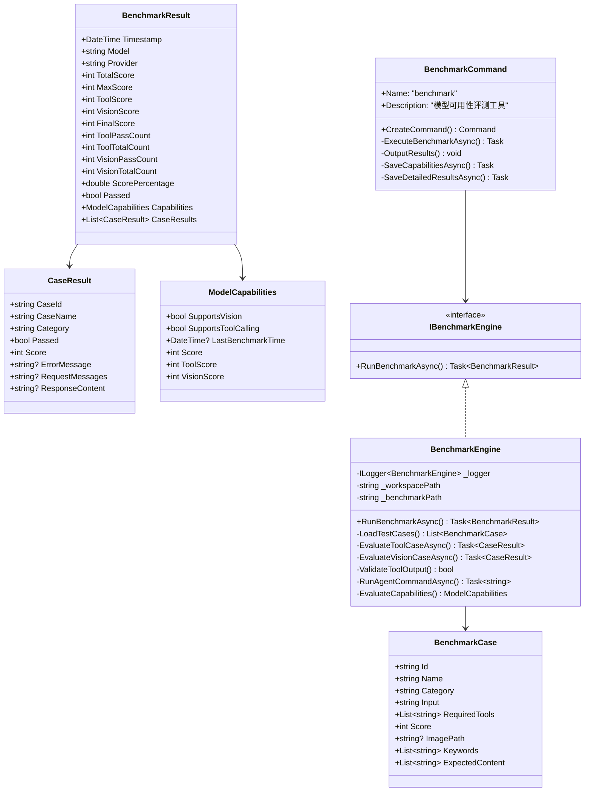
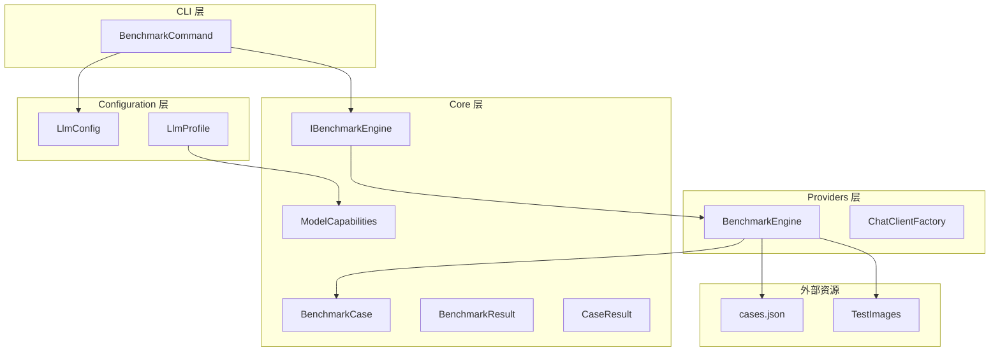

# 模型可用性评测工具设计

本文档定义 NanoBot.Net 的模型可用性评测工具设计，用于验证配置的新模型是否满足工具调用的基本要求。

**依赖关系**：评测工具依赖于 Providers 层（ChatClientFactory）、Configuration 层（LlmConfig）。

---

## 1. 背景与目标

### 1.1 问题背景

用户可能配置任意一个模型，该模型的工具调用能力如何用户自己并不知道。能够正常使用 NanoBot.Net 需要满足以下基本要求：

- 能够正确理解用户意图（识别需要调用哪些工具）
- 能够正确调用工具（选择正确的工具和参数）
- 是否支持（视觉）图像处理能力

### 1.2 设计目标

- 提供一个命令行工具，用于评测模型的"可用性"
- 评测基于工具调用能力，而非泛化的问答能力
- 将评测结果（能力属性）写入 LLM 配置中
- 简化配置，不需要复杂的参数选择

---

## 2. 模块概览

| 模块 | 职责 |
|------|------|
| `BenchmarkCommand` | CLI 命令入口 |
| `IBenchmarkEngine` | 评测引擎接口 |
| `BenchmarkEngine` | 评测引擎实现 |
| `BenchmarkCase` | 测试用例定义 |
| `BenchmarkResult` | 评测结果模型 |
| `CaseResult` | 单个用例结果 |
| `ModelCapabilities` | 模型能力属性定义 |

---

## 3. 数据模型

### 3.1 测试用例模型

```csharp
namespace NanoBot.Core.Benchmark;

public class BenchmarkCase
{
    public string Id { get; set; } = string.Empty;
    public string Name { get; set; } = string.Empty;
    public string Category { get; set; } = "tool";  // "tool" or "vision"
    public string Input { get; set; } = string.Empty;
    public List<string> RequiredTools { get; set; } = new();
    public int Score { get; set; } = 10;
    public string? ImagePath { get; set; }  // For vision tests

    // Tool validation: keywords that should appear in output
    public List<string> Keywords { get; set; } = new();

    // Vision validation: expected content in response
    public List<string> ExpectedContent { get; set; } = new();
}
```

### 3.2 评测结果模型

```csharp
namespace NanoBot.Core.Benchmark;

public class BenchmarkResult
{
    public DateTime Timestamp { get; set; } = DateTime.UtcNow;
    public string Model { get; set; } = string.Empty;
    public string Provider { get; set; } = string.Empty;

    // 原始分数（用例分数总和）
    public int TotalScore { get; set; }
    public int MaxScore { get; set; }

    // 100分制分数
    public int ToolScore { get; set; }       // 工具得分 (0-80)
    public int VisionScore { get; set; }      // 视觉得分 (0-20)
    public int FinalScore => ToolScore + VisionScore;  // 总分 (0-100)

    // 通过统计
    public int ToolPassCount { get; set; }
    public int ToolTotalCount { get; set; };
    public int VisionPassCount { get; set; }
    public int VisionTotalCount { get; set; }

    public double ScorePercentage => MaxScore > 0 ? (double)TotalScore / MaxScore * 100 : 0;
    public bool Passed => FinalScore >= 60;

    public ModelCapabilities Capabilities { get; set; } = new();
    public List<CaseResult> CaseResults { get; set; } = new();
}

public class CaseResult
{
    public string CaseId { get; set; } = string.Empty;
    public string CaseName { get; set; } = string.Empty;
    public string Category { get; set; } = "tool";  // "tool" or "vision"
    public bool Passed { get; set; }
    public int Score { get; set; }
    public string? ErrorMessage { get; set; }

    // 请求和响应内容（用于调试日志）
    public string? RequestMessages { get; set; }
    public string? ResponseContent { get; set; }
}

public class ModelCapabilities
{
    public bool SupportsVision { get; set; }
    public bool SupportsToolCalling { get; set; }
    public DateTime? LastBenchmarkTime { get; set; }

    // 评分（100分制）
    public int Score { get; set; }
    public int ToolScore { get; set; }
    public int VisionScore { get; set; }
}
```

### 3.3 扩展 LlmProfile

```csharp
namespace NanoBot.Core.Configuration;

public class LlmProfile
{
    // ... 现有属性 ...

    /// <summary>
    /// 模型能力属性（JSON序列化）
    /// </summary>
    public ModelCapabilities? Capabilities { get; set; }
}
```

---

## 4. 配置文件设计

### 4.1 LlmProfile 中的评测配置

```json
{
  "Name": "OpenAI GPT-4 Mini",
  "Provider": "openai",
  "Model": "gpt-4o-mini",
  "ApiKey": "${OPENAI_API_KEY}",
  "Capabilities": {
    "supportsVision": false,
    "supportsToolCalling": true,
    "lastBenchmarkTime": "2026-03-10T10:30:00Z",
    "score": 85,
    "toolScore": 70,
    "visionScore": 15
  }
}
```

---

## 5. 测试用例设计

测试用例存储在 `src/benchmark/cases.json` 文件中，分为 `tool` 和 `vision` 两类。

### 5.1 工具测试用例

| 用例ID | 名称 | 测试输入 | 期望关键词 | 分值 |
|--------|------|----------|------------|------|
| tool_file_read | 文件读取 | "List files in /tmp directory" | ls, tmp, list, dir | 10 |
| tool_file_write | 文件写入 | "Create a file at /tmp/test.txt with content 'hello'" | write, file, create, hello | 10 |
| tool_shell | Shell命令 | "Execute pwd command" | pwd, exec | 10 |
| tool_web_search | 网页搜索 | "Search for today's weather in Beijing" | search, weather, google | 10 |
| tool_multi | 多工具调用 | "First list /tmp directory, then create a file there" | list, write, tmp, file | 15 |
| browser_navigate | 浏览器导航 | "Open https://example.com webpage" | example.com, browser, open | 10 |
| browser_click | 浏览器点击 | "Click the search button on the page" | click, button, browser | 10 |
| browser_type | 浏览器输入 | "Type 'hello world' in the search box" | type, input, hello | 10 |

### 5.2 视觉测试用例

| 用例ID | 名称 | 测试输入 | 图像文件 | 期望内容 | 分值 |
|--------|------|----------|----------|----------|------|
| vision_desc | 图像描述 | "Describe what you see in this image" | vision_things_v1.jpg | circle, square, cube, mug, phone, apple | 10 |
| vision_ocr | 文字识别 | "Extract all text from this image" | vison_ocr_v1.jpg | AI Image Recognition Test, bar chart, line graph | 10 |

### 5.3 测试用例验证方式

**工具测试**：通过运行 `nbot agent -m "{input}"` 命令，检查输出中是否包含预期的关键词（至少匹配50%的关键词视为通过）。

**视觉测试**：通过发送带图片的聊天消息，检查响应中是否包含预期的内容（目前为占位实现，需要 IChatClient 支持图像输入）。

---

## 6. 核心接口设计

### 6.1 评测引擎接口

```csharp
namespace NanoBot.Core.Benchmark;

public interface IBenchmarkEngine
{
    Task<BenchmarkResult> RunBenchmarkAsync(
        object chatClient,
        IReadOnlyList<object> tools,
        CancellationToken cancellationToken = default);
}
```

### 6.2 评测引擎实现

```csharp
namespace NanoBot.Providers.Benchmark;

public class BenchmarkEngine : IBenchmarkEngine
{
    private readonly ILogger<BenchmarkEngine> _logger;
    private readonly string _workspacePath;
    private readonly string _benchmarkPath;

    private const int ToolMaxScore = 80;
    private const int VisionMaxScore = 20;

    public BenchmarkEngine(ILogger<BenchmarkEngine> logger)
    {
        _logger = logger;
        _workspacePath = Path.Combine(
            Environment.GetFolderPath(Environment.SpecialFolder.UserProfile),
            ".nbot", "workspace");
        _benchmarkPath = Path.Combine(
            AppDomain.CurrentDomain.BaseDirectory, "..", "..", "..", "..",
            "benchmark");
        _benchmarkPath = Path.GetFullPath(_benchmarkPath);
    }

    public async Task<BenchmarkResult> RunBenchmarkAsync(
        object chatClient,
        IReadOnlyList<object> tools,
        CancellationToken cancellationToken = default)
    {
        // 加载测试用例
        // 运行工具测试和视觉测试
        // 计算分数（ToolScore: 0-80, VisionScore: 0-20）
        // 评估能力并返回结果
    }
}
```

---

## 7. CLI 命令设计

### 7.1 BenchmarkCommand

```csharp
namespace NanoBot.Cli.Commands;

public class BenchmarkCommand : NanoBotCommandBase
{
    public override string Name => "benchmark";
    public override string Description => "模型可用性评测工具";

    public override Command CreateCommand()
    {
        var profileOption = new Option<string>(
            name: "--profile",
            description: "LLM 配置 profile 名称",
            getDefaultValue: () => "default");

        var command = new Command(Name, Description)
        {
            profileOption
        };

        command.SetHandler(async (context) =>
        {
            var profile = context.ParseResult.GetValueForOption(profileOption);
            var cancellationToken = context.GetCancellationToken();
            await ExecuteBenchmarkAsync(profile, cancellationToken);
        });

        return command;
    }
}
```

### 7.2 命令参数

| 参数 | 类型 | 说明 | 默认值 |
|------|------|------|--------|
| `--profile` | string | LLM 配置 profile 名称 | "default" |

### 7.3 命令使用示例

```bash
# 评测默认 profile
nbot benchmark

# 评测指定 profile
nbot benchmark --profile ollama_local
```

---

## 8. 输出格式设计

### 8.1 终端输出

```
------------------------------------------------------------
                    评测结果
------------------------------------------------------------

  总分: 85 / 100 (85分)
  状态: ✅ 通过

    - 工具调用: 70/80 (7/8 通过)
    - 图像处理: 15/20 (1/2 通过)

  详细结果:
    ✅ tool_file_read       文件读取        [tool]
    ✅ tool_file_write      文件写入        [tool]
    ✅ tool_shell           Shell命令       [tool]
    ✅ tool_web_search      网页搜索        [tool]
    ✅ tool_multi           多工具调用      [tool]
    ✅ browser_navigate     浏览器导航      [tool]
    ✅ browser_click        浏览器点击      [tool]
    ❌ browser_type         浏览器输入      [tool]
    ✅ vision_desc          图像描述        [vision]
    ❌ vision_ocr           文字识别        [vision]

------------------------------------------------------------
                    能力评估
------------------------------------------------------------

  工具调用 : ✅ 支持
  图像处理 : ❌ 不支持
  评分     : 85/100
```

### 8.2 配置文件中的能力属性

```json
{
  "capabilities": {
    "supportsVision": false,
    "supportsToolCalling": true,
    "lastBenchmarkTime": "2026-03-10T10:30:00Z",
    "score": 85,
    "toolScore": 70,
    "visionScore": 15
  }
}
```

### 8.3 详细结果文件

评测完成后，详细结果保存到 `workspace/.benchmark/{timestamp}/` 目录：

```
workspace/.benchmark/2026-03-10_10-30-00/
├── summary.json          # 评测摘要
├── tool_file_read/
│   ├── input.json        # 用例输入
│   └── output.json       # 用例输出
├── tool_file_write/
│   ├── input.json
│   └── output.json
└── ...
```

---

## 9. 服务注册

```csharp
namespace NanoBot.Cli;

public static class BenchmarkServiceCollectionExtensions
{
    public static IServiceCollection AddBenchmarkServices(
        this IServiceCollection services)
    {
        services.AddSingleton<IBenchmarkEngine, BenchmarkEngine>();
        return services;
    }
}
```

---

## 10. 类图



---

## 11. 依赖关系



---

## 12. 实现说明

### 12.1 工具测试实现

工具测试通过实际运行 `nbot agent -m "{input}"` 命令来验证模型的工具调用能力。测试用例定义了期望在输出中出现的关键词，通过检查输出中是否包含至少50%的关键词来判断测试是否通过。

### 12.2 视觉测试实现

视觉测试使用 `IChatClient` 和 `DataContent` 实现图像输入支持：

1. 读取测试图像文件为字节数组
2. 创建 `DataContent` 对象（包含图像数据和 MIME 类型）
3. 构建包含图像和文本的 `ChatMessage`
4. 调用 `IChatClient.GetResponseAsync()` 发送请求
5. 验证响应中是否包含期望的内容关键词

```csharp
// 加载图像数据
var imageBytes = await File.ReadAllBytesAsync(imagePath, cancellationToken);
var mediaType = GetImageMediaType(imagePath); // image/jpeg, image/png, etc.

// 构建消息内容
var contents = new List<AIContent>
{
    new DataContent(imageBytes, mediaType),
    new TextContent(testCase.Input)
};

var messages = new List<ChatMessage>
{
    new(ChatRole.System, "You are an AI assistant..."),
    new(ChatRole.User, contents)
};

// 发送请求
var response = await chatClient.GetResponseAsync(messages, cancellationToken);
```

### 12.3 评分算法

- **工具得分** (0-80分)：基于通过的用例比例计算
  - `ToolScore = (ToolPassCount / ToolTotalCount) * 80`
- **视觉得分** (0-20分)：基于通过的用例比例计算
  - `VisionScore = (VisionPassCount / VisionTotalCount) * 20`
- **总分**：`FinalScore = ToolScore + VisionScore`
- **通过标准**：`FinalScore >= 60`

### 12.4 能力评估

- **SupportsToolCalling**：`ToolPassCount > 0`
- **SupportsVision**：`VisionPassCount > 0`

---

## 13. 实现状态

### 13.1 已完成 ✅

- [x] 评测引擎核心实现 (`BenchmarkEngine`)
- [x] CLI 命令 (`BenchmarkCommand`)
- [x] 工具测试用例（8个）
- [x] 视觉测试用例（2个，使用 `IChatClient` + `DataContent` 实现）
- [x] 评分算法（百分制：工具0-80分，视觉0-20分）
- [x] 结果保存到配置文件
- [x] 详细结果保存到工作目录

### 13.2 待补充项

- [ ] 设计 MCP 工具的测试用例
- [ ] 添加性能基准测试（响应时间）
- [ ] 优化工具测试的验证逻辑（当前基于关键词匹配）

---

*返回 [概览文档](./Overview.md)*
