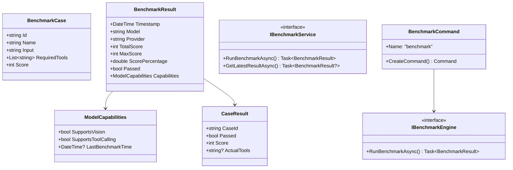
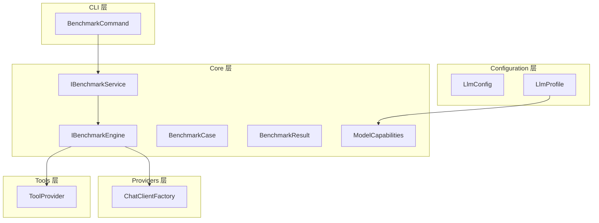

# 模型可用性评测工具设计

本文档定义 NanoBot.Net 的模型可用性评测工具设计，用于验证配置的新模型是否满足工具调用的基本要求。

**依赖关系**：评测工具依赖于 Providers 层（ChatClientFactory）、Tools 层（ToolProvider）、Configuration 层（LlmConfig）。

---

## 1. 背景与目标

### 1.1 问题背景

用户可能配置任意一个模型，该模型的工具调用能力如何用户自己并不知道。能够正常使用 NanoBot.Net 需要满足以下基本要求：

- 能够正确理解用户意图（识别需要调用哪些工具）
- 能够正确调用工具（选择正确的工具和参数）
- 是否支持（视觉）图像处理能力

### 1.2 设计目标

- 提供一个命令行工具，用于评测模型的"可用性"
- 评测基于工具调用能力，而非泛化的问答能力
- 将评测结果（能力属性）写入 LLM 配置中
- 简化配置，不需要复杂的参数选择

---

## 2. 模块概览

| 模块 | 职责 |
|------|------|
| `BenchmarkCommand` | CLI 命令入口 |
| `IBenchmarkEngine` | 评测引擎接口 |
| `BenchmarkCase` | 测试用例定义 |
| `BenchmarkResult` | 评测结果模型 |
| `ModelCapabilities` | 模型能力属性定义 |

---

## 3. 数据模型

### 3.1 测试用例模型

```csharp
namespace NanoBot.Core.Benchmark;

public class BenchmarkCase
{
    public string Id { get; set; }
    public string Name { get; set; }
    public string Input { get; set; }
    public List<string> RequiredTools { get; set; }
    public int Score { get; set; }
}
```

### 3.2 评测结果模型

```csharp
namespace NanoBot.Core.Benchmark;

public class BenchmarkResult
{
    public DateTime Timestamp { get; set; }
    public string Model { get; set; }
    public string Provider { get; set; }
    public int TotalScore { get; set; }
    public int MaxScore { get; set; }
    public double ScorePercentage { get; }
    public bool Passed { get; }
    public ModelCapabilities Capabilities { get; set; }
    public List<CaseResult> CaseResults { get; set; }
}

public class CaseResult
{
    public string CaseId { get; set; }
    public bool Passed { get; set; }
    public int Score { get; set; }
    public string? ActualTools { get; set; }
}

public class ModelCapabilities
{
    public bool SupportsVision { get; set; }
    public bool SupportsToolCalling { get; set; }
    public DateTime? LastBenchmarkTime { get; set; }
}
```

### 3.3 扩展 LlmProfile

```csharp
namespace NanoBot.Core.Configuration;

public class LlmProfile
{
    // ... 现有属性 ...

    /// <summary>
    /// 模型能力属性（JSON序列化）
    /// </summary>
    public ModelCapabilities? Capabilities { get; set; }
}
```

---

## 4. 配置文件设计

### 4.1 LlmProfile 中的评测配置

```json
{
  "Name": "OpenAI GPT-4 Mini",
  "Provider": "openai",
  "Model": "gpt-4o-mini",
  "ApiKey": "${OPENAI_API_KEY}",
  "Capabilities": {
    "supportsToolCalling": true,
    "supportsVision": false,
    "lastBenchmarkTime": "2026-03-10T10:30:00Z"
  }
}
```

### 4.2 全局默认评测配置（可选）

在 AgentConfig 中可配置全局评测参数：

```json
{
  "Benchmark": {
    "Enabled": true,
    "AutoRunOnConfig": true,
    "TimeoutPerCase": 30
  }
}
```

---

## 5. 测试用例设计

所有测试用例都基于工具调用能力评估。

### 5.1 基础工具测试用例

| 用例ID | 测试输入 | 期望调用的工具 | 分值 |
|--------|----------|----------------|------|
| tool_file_read | "帮我看看 /tmp 目录里有什么" | list_dir | 10 |
| tool_file_write | "在 /tmp 目录创建 test.txt，内容为 'hello'" | write_file | 10 |
| tool_shell | "执行 pwd 命令" | exec | 10 |
| tool_web_search | "搜索今天的天气" | web_search | 10 |
| tool_multi | "先列出 /tmp 目录，然后在那里创建 test.txt" | list_dir, write_file | 15 |
| tool_all | "在 /tmp 创建一个文件，记录当前目录" | exec, write_file | 15 |

### 5.2 浏览器工具测试用例

浏览器工具通过 Playwright 控制浏览器执行自动化操作。

| 用例ID | 测试输入 | 期望调用的工具 | 分值 |
|--------|----------|----------------|------|
| browser_navigate | "打开 https://example.com 网页" | browser_navigate | 10 |
| browser_click | "点击页面上的搜索按钮" | browser_click | 10 |
| browser_type | "在搜索框输入 'hello world'" | browser_type | 10 |
| browser_screenshot | "截取当前页面" | browser_screenshot | 10 |
| browser_content | "获取当前页面的内容" | browser_get_content | 10 |
| browser_automation | "打开百度，搜索 'NanoBot'，然后截图" | browser_navigate, browser_type, browser_screenshot | 15 |

### 5.3 视觉测试用例（可选）

| 用例ID | 测试输入 | 期望行为 | 分值 |
|--------|----------|----------|------|
| vision_desc | [图像] "描述这张图片的内容" | 能识别图像 | 15 |
| vision_ocr | [图像] "提取图片中的文字" | 能提取文字 | 15 |

### 5.4 工具清单与评测关联

| 工具名称 | 工具说明 | 关联用例 |
|----------|----------|----------|
| `list_dir` | 列出目录内容 | tool_file_read |
| `write_file` | 写入文件内容 | tool_file_write |
| `read_file` | 读取文件内容 | - |
| `exec` | 执行 Shell 命令 | tool_shell |
| `web_search` | 网页搜索 | tool_web_search |
| `web_fetch` | 获取网页内容 | - |
| `browser_navigate` | 浏览器导航 | browser_navigate, browser_automation |
| `browser_click` | 浏览器点击 | browser_click |
| `browser_type` | 浏览器输入 | browser_type, browser_automation |
| `browser_screenshot` | 浏览器截图 | browser_screenshot, browser_automation |
| `browser_get_content` | 获取页面内容 | browser_content |
| `message` | 发送消息 | - |
| `cron` | 定时任务 | - |
| `spawn` | 创建子 Agent | - |

---

## 6. 核心接口设计

### 6.1 评测引擎接口

```csharp
namespace NanoBot.Core.Benchmark;

public interface IBenchmarkEngine
{
    Task<BenchmarkResult> RunBenchmarkAsync(
        IChatClient chatClient,
        IReadOnlyList<AITool> tools,
        CancellationToken cancellationToken = default);
}
```

### 6.2 评测服务接口（供 WebUI 使用）

```csharp
namespace NanoBot.Core.Benchmark;

public interface IBenchmarkService
{
    Task<BenchmarkResult> RunBenchmarkAsync(
        string profileName,
        CancellationToken cancellationToken = default);

    Task<BenchmarkResult?> GetLatestResultAsync(
        string profileName);

    Task<IReadOnlyList<string>> GetAvailableToolsAsync(
        string profileName,
        CancellationToken cancellationToken = default);
}
```

---

## 7. CLI 命令设计

### 7.1 BenchmarkCommand

```csharp
namespace NanoBot.Cli.Commands;

public class BenchmarkCommand : ICliCommand
{
    public string Name { get; }
    public string Description { get; }
    public Command CreateCommand();
}
```

### 7.2 命令参数

| 参数 | 类型 | 说明 | 默认值 |
|------|------|------|--------|
| `--profile` | string | LLM 配置 profile 名称 | "default" |
| `--config` | string? | 配置文件路径 | null |

### 7.3 命令使用示例

```bash
# 评测默认 profile
nbot benchmark

# 评测指定 profile
nbot benchmark --profile ollama_local
```

---

## 8. 输出格式设计

### 8.1 终端输出

```
============================================================
           模型可用性评测报告
============================================================

模型: gpt-4o-mini
提供商: openai
评测时间: 2026-03-10 10:30:00 UTC

------------------------------------------------------------
                    评测结果
------------------------------------------------------------

  总分: 60 / 70 (85%)
  状态: ✅ 通过

  工具调用   : 45/50 (6/6 通过)
  图像处理   : 15/20 (1/2 通过)

------------------------------------------------------------
                    能力评估
------------------------------------------------------------

  工具调用 : ✅ 支持
  图像处理 : ❌ 不支持

============================================================
```

### 8.2 JSON 输出

```json
{
  "timestamp": "2026-03-10T10:30:00Z",
  "model": "gpt-4o-mini",
  "provider": "openai",
  "totalScore": 60,
  "maxScore": 70,
  "scorePercentage": 85,
  "passed": true,
  "capabilities": {
    "supportsToolCalling": true,
    "supportsVision": false,
    "lastBenchmarkTime": "2026-03-10T10:30:00Z"
  }
}
```

---

## 9. 服务注册

```csharp
namespace NanoBot.Cli;

public static class BenchmarkServiceCollectionExtensions
{
    public static IServiceCollection AddBenchmarkServices(
        this IServiceCollection services);
}
```

---

## 10. 类图



---

## 11. 依赖关系



---

## 12. 待补充项

- [ ] 设计 MCP 工具的测试用例
- [x] 设计浏览器工具的测试用例
- [ ] 添加性能基准测试（响应时间）

---

*返回 [概览文档](./Overview.md)*