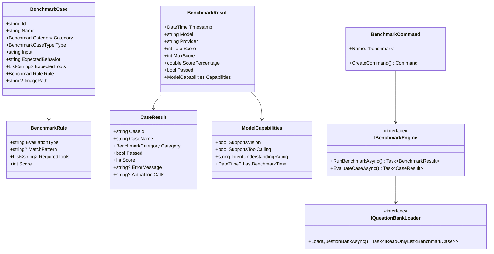
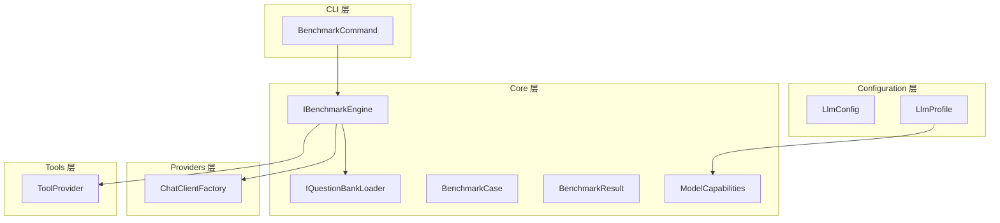

# 模型可用性评测工具设计

本文档定义 NanoBot.Net 的模型可用性评测工具设计，用于验证配置的新模型是否满足基本使用要求。

**依赖关系**：评测工具依赖于 Providers 层（ChatClientFactory）、Tools 层（ToolProvider）、Configuration 层（LlmConfig）。

---

## 1. 背景与目标

### 1.1 问题背景

用户可能配置任意一个模型，该模型的性能如何用户自己并不知道。能够正常使用 NanoBot.Net 需要满足以下基本要求：

- 能够正常调用所有工具
- 能够正常理解用户意图（特别与工具相关）
- 是否支持（视觉）图像处理能力

### 1.2 设计目标

- 提供一个命令行工具，用于评测模型的"可用性"
- 支持可配置的测试题库和测试规则
- 测试模型的意图理解能力、工具调用能力、图像处理能力
- 将评测结果（得分和属性）写入 LLM 配置中

---

## 2. 模块概览

| 模块 | 职责 |
|------|------|
| `BenchmarkCommand` | CLI 命令入口 |
| `IBenchmarkEngine` | 评测引擎接口，执行测试并计算得分 |
| `BenchmarkCase` | 测试用例定义 |
| `BenchmarkResult` | 评测结果模型 |
| `IQuestionBankLoader` | 测试题库加载器接口 |
| `ModelCapabilities` | 模型能力属性定义 |

---

## 3. 数据模型

### 3.1 枚举定义

```csharp
namespace NanoBot.Core.Benchmark;

public enum BenchmarkCategory
{
    IntentUnderstanding,   // 意图理解测试
    ToolInvocation,       // 工具调用测试
    Vision,               // 图像处理测试
    Comprehensive         // 综合能力测试
}

public enum BenchmarkCaseType
{
    Text,        // 文本输入测试
    ToolCall,    // 需要工具调用的测试
    VisionInput  // 需要图像输入的测试
}
```

### 3.2 测试用例模型

```csharp
namespace NanoBot.Core.Benchmark;

public class BenchmarkCase
{
    public string Id { get; set; }
    public string Name { get; set; }
    public BenchmarkCategory Category { get; set; }
    public BenchmarkCaseType Type { get; set; }
    public string Input { get; set; }
    public string ExpectedBehavior { get; set; }
    public List<string> ExpectedTools { get; set; }
    public BenchmarkRule Rule { get; set; }
    public string? ImagePath { get; set; }
}

public class BenchmarkRule
{
    public string EvaluationType { get; set; }  // tool_called, contains, exact_match, regex
    public string? MatchPattern { get; set; }
    public List<string> RequiredTools { get; set; }
    public int Score { get; set; }
}

public class BenchmarkConfig
{
    public string QuestionBankPath { get; set; }
    public List<string>? CaseIds { get; set; }
    public List<BenchmarkCategory>? Categories { get; set; }
    public int TimeoutPerCase { get; set; }
    public bool SaveToConfig { get; set; }
}
```

### 3.3 评测结果模型

```csharp
namespace NanoBot.Core.Benchmark;

public class BenchmarkResult
{
    public DateTime Timestamp { get; set; }
    public string Model { get; set; }
    public string Provider { get; set; }
    public int TotalScore { get; set; }
    public int MaxScore { get; set; }
    public double ScorePercentage { get; }
    public bool Passed { get; }
    public ModelCapabilities Capabilities { get; set; }
    public Dictionary<BenchmarkCategory, CategoryScore> CategoryScores { get; set; }
    public List<CaseResult> CaseResults { get; set; }
}

public class CategoryScore
{
    public int Score { get; set; }
    public int MaxScore { get; set; }
    public int PassedCount { get; set; }
    public int TotalCount { get; set; }
}

public class CaseResult
{
    public string CaseId { get; set; }
    public string CaseName { get; set; }
    public BenchmarkCategory Category { get; set; }
    public bool Passed { get; set; }
    public int Score { get; set; }
    public string? ErrorMessage { get; set; }
    public string? ActualToolCalls { get; set; }
    public string? ModelResponse { get; set; }
}

public class ModelCapabilities
{
    public bool SupportsVision { get; set; }
    public bool SupportsToolCalling { get; set; }
    public bool SupportsFunctionCalling { get; }
    public string IntentUnderstandingRating { get; set; }
    public DateTime? LastBenchmarkTime { get; set; }
    public List<HistoricalScore> ScoreHistory { get; set; }
}

public class HistoricalScore
{
    public DateTime Timestamp { get; set; }
    public int Score { get; set; }
    public int MaxScore { get; set; }
}
```

### 3.4 扩展 LlmProfile

```csharp
namespace NanoBot.Core.Configuration;

public class LlmProfile
{
    // ... 现有属性 ...

    /// <summary>
    /// 模型能力属性（JSON序列化）
    /// </summary>
    public ModelCapabilities? Capabilities { get; set; }

    /// <summary>
    /// 获取显示名称
    /// </summary>
    public string GetDisplayName();
}
```

---

## 4. 测试题库设计

### 4.1 默认测试用例清单

| 用例ID | 类别 | 类型 | 测试输入 | 期望行为 | 必需工具 | 分值 |
|--------|------|------|----------|----------|----------|------|
| intent_file_read | 意图理解 | Text | "帮我看看这个文件里有什么" | 理解用户想读取文件 | read_file | 10 |
| intent_file_write | 意图理解 | Text | "帮我写一个 hello world 到 test.txt" | 理解用户想写入文件 | write_file | 10 |
| intent_shell | 意图理解 | Text | "列出当前目录的文件" | 理解用户想执行Shell命令 | exec | 10 |
| tool_call_file | 工具调用 | ToolCall | "在 /tmp 目录下创建 test.txt" | 正确调用工具 | write_file | 15 |
| tool_call_shell | 工具调用 | ToolCall | "执行 pwd 命令" | 正确调用工具 | exec | 10 |
| tool_call_web | 工具调用 | ToolCall | "搜索今天的天气" | 正确调用工具 | web_search | 15 |
| tool_call_multiple | 工具调用 | ToolCall | "列出 /tmp 并创建 test.txt" | 正确调用多个工具 | list_dir, write_file | 15 |
| vision_basic | 图像处理 | VisionInput | 图像文件 | 能够识别图像内容 | - | 10 |
| vision_ocr | 图像处理 | VisionInput | 图像文件 | 能够提取图像中的文字 | - | 10 |
| comprehensive_basic | 综合 | ToolCall | "创建 README.md" | 综合调用工具 | write_file, list_dir | 10 |

### 4.2 题库配置文件格式

```json
{
  "version": "1.0",
  "name": "string",
  "description": "string",
  "cases": [
    {
      "id": "string",
      "name": "string",
      "category": "IntentUnderstanding|ToolInvocation|Vision|Comprehensive",
      "type": "Text|ToolCall|VisionInput",
      "input": "string",
      "expectedBehavior": "string",
      "expectedTools": ["string"],
      "rule": {
        "evaluationType": "tool_called|contains|exact_match|regex",
        "matchPattern": "string",
        "requiredTools": ["string"],
        "score": 10
      },
      "imagePath": "string"
    }
  ]
}
```

### 4.3 评分规则

| 评估类型 | 说明 | 评分逻辑 |
|----------|------|----------|
| `tool_called` | 检查是否调用了指定的工具 | 正确调用所有必需工具 = 满分 |
| `contains` | 检查响应是否包含关键词 | 包含关键词 = 满分 |
| `exact_match` | 完全匹配响应 | 完全匹配 = 满分 |
| `regex` | 正则表达式匹配 | 匹配成功 = 满分 |

### 4.4 评分标准与能力判定

| 评级 | 分数要求 |
|------|----------|
| excellent | >= 90 |
| good | >= 75 |
| acceptable | >= 60 |
| poor | < 60 |

**能力判定规则**：

- 调用任意工具成功：`SupportsToolCalling = true`
- 视觉测试通过：`SupportsVision = true`
- 意图理解测试 >= 60%：对应评级

---

## 5. 核心接口设计

### 5.1 评测引擎接口

```csharp
namespace NanoBot.Core.Benchmark;

public interface IBenchmarkEngine
{
    Task<BenchmarkResult> RunBenchmarkAsync(
        IChatClient chatClient,
        IReadOnlyList<AITool> tools,
        BenchmarkConfig config,
        CancellationToken cancellationToken = default);

    Task<CaseResult> EvaluateCaseAsync(
        IChatClient chatClient,
        IReadOnlyList<AITool> tools,
        BenchmarkCase benchmarkCase,
        CancellationToken cancellationToken = default);
}
```

### 5.2 题库加载器接口

```csharp
namespace NanoBot.Core.Benchmark;

public interface IQuestionBankLoader
{
    Task<IReadOnlyList<BenchmarkCase>> LoadQuestionBankAsync(
        string path,
        CancellationToken cancellationToken = default);
}
```

### 5.3 题库配置模型

```csharp
namespace NanoBot.Core.Benchmark;

public class QuestionBankConfig
{
    public string Version { get; set; }
    public string Name { get; set; }
    public string? Description { get; set; }
    public List<BenchmarkCase> Cases { get; set; }
}
```

---

## 6. CLI 命令设计

### 6.1 BenchmarkCommand

```csharp
namespace NanoBot.Cli.Commands;

public class BenchmarkCommand : ICliCommand
{
    public string Name { get; }
    public string Description { get; }
    public Command CreateCommand();
}
```

### 6.2 命令参数

| 参数 | 类型 | 说明 | 默认值 |
|------|------|------|--------|
| `--profile` | string | LLM 配置 profile 名称 | "default" |
| `--question-bank` | string | 测试题库路径或名称 | "default" |
| `--cases` | string[] | 指定测试用例ID (可多个) | null |
| `--categories` | string[] | 指定测试类别 | null |
| `--timeout` | int | 每道题的超时时间(秒) | 30 |
| `--save` | bool | 保存结果到配置文件 | true |
| `--config` | string? | 配置文件路径 | null |
| `--list-cases` | bool | 列出所有可用测试用例 | false |

### 6.3 命令使用示例

```bash
# 列出所有可用测试用例
nbot benchmark --list-cases

# 使用默认题库评测默认 profile
nbot benchmark

# 评测指定 profile
nbot benchmark --profile my-profile

# 使用自定义题库
nbot benchmark --question-bank /path/to/custom-benchmark.json

# 只测试特定用例
nbot benchmark --cases intent_file_read tool_call_file

# 只测试特定类别
nbot benchmark --categories ToolInvocation Vision
```

---

## 7. 输出格式设计

### 7.1 终端输出

```
============================================================
           模型可用性评测报告
============================================================

模型: {model}
提供商: {provider}
评测时间: {timestamp}

------------------------------------------------------------
                    得分概况
------------------------------------------------------------

  总分: {totalScore} / {maxScore} ({percentage}%)
  状态: {passed|failed}

------------------------------------------------------------
                    分类得分
------------------------------------------------------------

  意图理解   : {score} / {maxScore} ({percentage}%) | {passed}/{total} 通过
  工具调用   : {score} / {maxScore} ({percentage}%) | {passed}/{total} 通过
  图像处理   : {score} / {maxScore} ({percentage}%) | {passed}/{total} 通过
  综合能力   : {score} / {maxScore} ({percentage}%) | {passed}/{total} 通过

------------------------------------------------------------
                    能力评估
------------------------------------------------------------

  工具调用 : {supported|not_supported}
  图像处理 : {supported|not_supported}
  意图理解 : {rating}

============================================================
结果已保存到配置文件: {configPath}
============================================================
```

### 7.2 JSON 输出

```json
{
  "timestamp": "ISO8601",
  "model": "string",
  "provider": "string",
  "totalScore": 0,
  "maxScore": 0,
  "scorePercentage": 0.0,
  "passed": true,
  "capabilities": {
    "supportsVision": true,
    "supportsToolCalling": true,
    "intentUnderstandingRating": "string",
    "lastBenchmarkTime": "ISO8601"
  },
  "categoryScores": {
    "IntentUnderstanding": { "score": 0, "maxScore": 0, "passedCount": 0, "totalCount": 0 },
    "ToolInvocation": { "score": 0, "maxScore": 0, "passedCount": 0, "totalCount": 0 },
    "Vision": { "score": 0, "maxScore": 0, "passedCount": 0, "totalCount": 0 },
    "Comprehensive": { "score": 0, "maxScore": 0, "passedCount": 0, "totalCount": 0 }
  }
}
```

---

## 8. 服务注册

```csharp
namespace NanoBot.Cli;

public static class BenchmarkServiceCollectionExtensions
{
    public static IServiceCollection AddBenchmarkServices(
        this IServiceCollection services);
}
```

---

## 9. 类图



---

## 10. 依赖关系



---

## 11. 待补充项

- [ ] 设计 MCP 工具的测试用例
- [ ] 设计浏览器工具的测试用例
- [ ] 实现实时进度输出
- [ ] 支持 CI/CD 集成（无交互模式）
- [ ] 添加性能基准测试（响应时间、Token消耗）

---

*返回 [概览文档](./Overview.md)*