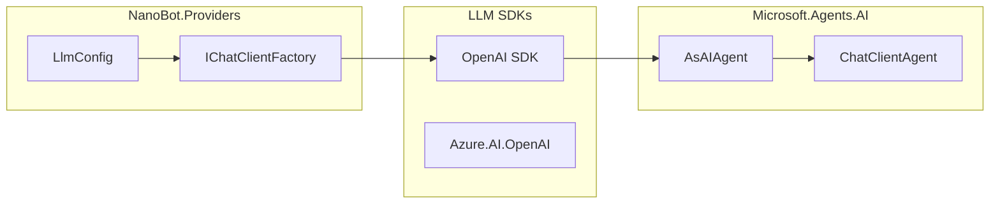

# 提供商层设计

本文档定义 NanoBot.Net 的 LLM 提供商层设计。

**核心原则**：直接使用 `Microsoft.Agents.AI` 框架提供的 `ChatClientAgent`，无需自行封装 `IChatClient`。

> **最近更新**（2026-02-27 同步）：
> - **消息清理机制**：`SanitizingChatClient` 过滤空内容，防止 API 400 错误
> - **空 reasoning_content 标准化**：在 provider 级别将空的 `reasoning_content` 标准化为 null
> - **Anthropic Prompt Caching**：支持 `cache_control` 进行提示缓存
> - **新增 Provider**：VolcEngine、SiliconFlow

---

## 设计原则

### 为什么不需要自定义 Provider 抽象

Microsoft.Agents.AI 框架已经提供了完整的 Agent 封装：

1. **`ChatClientAgent`**：基于任意 `IChatClient` 的 Agent，自动处理工具调用循环
2. **`AsAIAgent()` 扩展方法**：一键将 `IChatClient` 转换为 `AIAgent`
3. **官方 SDK 支持**：OpenAI、Azure OpenAI、Anthropic 等

NanoBot.Net 只需：
- 使用官方 SDK 创建 `IChatClient`
- 通过 `AsAIAgent()` 创建 Agent
- 直接使用框架的 Agent 能力（多模态、会话管理等）

---

## 框架提供的使用方式

### 基本使用

```csharp
using Microsoft.Agents.AI;

// 创建 OpenAI ChatClient
var chatClient = new OpenAI.OpenAIClient(apiKey)
    .GetChatClient("gpt-4o")
    .AsIChatClient();

// 转换为 Agent
var agent = chatClient.AsAIAgent(
    name: "NanoBot",
    instructions: "You are a helpful assistant.",
    tools: myTools);

// 运行 Agent
var response = await agent.RunAsync("Hello!");
```

### Azure OpenAI

```csharp
using Azure.AI.OpenAI;
using Azure.Identity;

var client = new AzureOpenAIClient(
    new Uri(endpoint),
    new AzureCliCredential())
    .GetChatClient("gpt-4o");

var agent = client.AsAIAgent(instructions: "...");
```

### Anthropic

```csharp
// 使用 Anthropic SDK
var client = new AnthropicClient();
var agent = client.AsAIAgent(instructions: "...");
```

### Ollama（本地模型）

```csharp
// 使用 Ollama IChatClient 实现
var client = new OllamaChatClient("http://localhost:11434", "llama3.2");
var agent = client.AsAIAgent(instructions: "...");
```

---

## 多模态支持

框架原生支持多模态消息，无需额外处理：

### 图像输入

```csharp
// 使用 URI 内容
var message = new ChatMessage(ChatRole.User, [
    new TextContent("What do you see in this image?"),
    new UriContent("https://example.com/image.jpg", "image/jpeg")
]);

var response = await agent.RunAsync(message);

// 使用本地图像（BinaryContent）
var imageBytes = await File.ReadAllBytesAsync("photo.jpg");
var message2 = new ChatMessage(ChatRole.User, [
    new TextContent("Describe this image:"),
    new BinaryContent(imageBytes, "image/jpeg")
]);

var response2 = await agent.RunAsync(message2);
```

### 流式响应

```csharp
await foreach (var update in agent.RunStreamingAsync("Tell me a story"))
{
    Console.Write(update.Text);
}
```

---

## 配置驱动的客户端创建

### 配置模型

```csharp
namespace NanoBot.Core.Configuration;

public class LlmConfig
{
    public string Provider { get; set; } = "openai";
    public string Model { get; set; } = "gpt-4o";
    public string? ApiKey { get; set; }
    public string? Endpoint { get; set; }
    public double Temperature { get; set; } = 0.7;
    public int MaxTokens { get; set; } = 4096;
}
```

### 客户端工厂（简化版）

```csharp
namespace NanoBot.Providers;

public interface IChatClientFactory
{
    IChatClient CreateChatClient(LlmConfig config);
}

public class ChatClientFactory : IChatClientFactory
{
    private static readonly Dictionary<string, ProviderSpec> ProviderSpecs = new(StringComparer.OrdinalIgnoreCase)
    {
        ["openai"] = new ProviderSpec("OPENAI_API_KEY", "https://api.openai.com/v1"),
        ["openrouter"] = new ProviderSpec("OPENROUTER_API_KEY", "https://openrouter.ai/api/v1"),
        ["anthropic"] = new ProviderSpec("ANTHROPIC_API_KEY", "https://api.anthropic.com/v1"),
        ["deepseek"] = new ProviderSpec("DEEPSEEK_API_KEY", "https://api.deepseek.com/v1"),
        ["groq"] = new ProviderSpec("GROQ_API_KEY", "https://api.groq.com/openai/v1"),
        ["ollama"] = new ProviderSpec("", "http://localhost:11434/v1", isLocal: true)
    };

    public IChatClient CreateChatClient(LlmConfig config)
    {
        var provider = config.Provider ?? "openai";
        if (!ProviderSpecs.TryGetValue(provider, out var spec))
            throw new NotSupportedException($"Provider '{provider}' not supported");

        var apiKey = config.ApiKey ?? Environment.GetEnvironmentVariable(spec.EnvKey) ?? "";
        var apiBase = config.ApiBase ?? spec.DefaultApiBase;

        var client = new OpenAI.OpenAIClient(
            new System.ClientModel.ApiKeyCredential(apiKey),
            new OpenAI.OpenAIClientOptions { Endpoint = new Uri(apiBase) });

        return client.GetChatClient(config.Model).AsIChatClient();
    }

    private record ProviderSpec(string EnvKey, string DefaultApiBase, bool IsLocal = false);
}
```

---

## DI 注册

```csharp
public static class ServiceCollectionExtensions
{
    public static IServiceCollection AddLlmClient(
        this IServiceCollection services,
        LlmConfig config)
    {
        services.AddSingleton<IChatClientFactory, ChatClientFactory>();
        services.AddSingleton(sp =>
            sp.GetRequiredService<IChatClientFactory>().CreateChatClient(config));
        
        return services;
    }
}
```

---

## Agent 创建（推荐方式）

```csharp
public static class NanoBotAgentFactory
{
    public static ChatClientAgent Create(
        IChatClient chatClient,
        string instructions,
        IList<AITool>? tools = null)
    {
        return chatClient.AsAIAgent(
            name: "NanoBot",
            instructions: instructions,
            tools: tools);
    }
}
```

---

## 预定义提供商配置

| 提供商 | Provider 值 | 默认模型 |
|--------|-------------|----------|
| **OpenAI** | `openai` | `gpt-4o` |
| **OpenRouter** | `openrouter` | `anthropic/claude-3.5-sonnet` |
| **Anthropic** | `anthropic` | `claude-3-5-sonnet-20241022` |
| **DeepSeek** | `deepseek` | `deepseek-chat` |
| **Groq** | `groq` | `llama-3.3-70b-versatile` |
| **Ollama** | `ollama` | `llama3.2` |

---

## 依赖关系



---

## 总结

| 传统做法 | NanoBot.Net 做法 |
|----------|-----------------|
| 定义 `ILLMProvider` 接口 | 直接使用框架的 `ChatClientAgent` |
| 实现 Provider 类 | 使用官方 SDK 的 `IChatClient` |
| 手动处理工具调用循环 | 框架自动处理 |
| 自行实现多模态 | 框架内置支持 |

**核心收益**：
- 减少约 500+ 行代码
- 直接使用框架的完整功能（多模态、会话管理等）
- 更少的维护负担

---

*返回 [概览文档](./Overview.md)*
