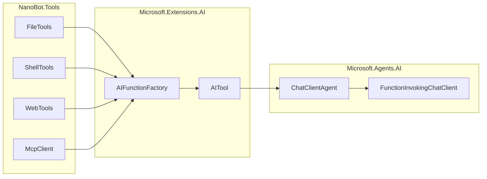

# 工具层设计

本文档定义 NanoBot.Net 的工具层设计。

**核心原则**：直接使用 `Microsoft.Extensions.AI` 的 `AITool`/`AIFunction` 抽象，**不定义自定义的工具接口**。

> **最近更新**（2026-02-27 同步）：
> - **Shell 工具安全增强**：进程超时后等待终止（防止 FD 泄漏）、增强安全守卫
> - **MCP 工具超时配置**：支持按服务器配置超时时间
> - **Browser Tool**：新增浏览器自动化工具（基于 Playwright）

---

## 设计原则

### 为什么不需要自定义工具接口

Microsoft.Agents.AI 框架已经提供了完整的工具系统：

1. **`AITool` 抽象**：工具基类
2. **`AIFunction`**：函数工具实现
3. **`AIFunctionFactory`**：工具创建工厂
4. **`FunctionInvokingChatClient`**：自动处理函数调用

NanoBot.Net 只需：
- 使用 `AIFunctionFactory.Create()` 创建工具
- 将工具传递给 `ChatOptions.Tools`
- 框架自动处理工具调用循环

---

## 框架提供的工具创建方式

### 使用 AIFunctionFactory

```csharp
using Microsoft.Extensions.AI;

// 方式 1：从委托创建
AITool readTool = AIFunctionFactory.Create(
    (string path) => File.ReadAllText(path),
    new AIFunctionFactoryOptions
    {
        Name = "read_file",
        Description = "Read the contents of a file"
    });

// 方式 2：从方法创建
AITool writeTool = AIFunctionFactory.Create(
    WriteFileAsync,
    new AIFunctionFactoryOptions
    {
        Name = "write_file",
        Description = "Write content to a file"
    });

// 方式 3：带复杂参数
AITool execTool = AIFunctionFactory.Create(
    (string command, int timeout = 60) => ExecuteCommandAsync(command, timeout),
    new AIFunctionFactoryOptions
    {
        Name = "exec",
        Description = "Execute a shell command"
    });
```

### 将工具传递给 Agent

```csharp
var tools = new List<AITool>
{
    AIFunctionFactory.Create(ReadFileAsync, new() { Name = "read_file", Description = "..." }),
    AIFunctionFactory.Create(WriteFileAsync, new() { Name = "write_file", Description = "..." }),
    AIFunctionFactory.Create(ExecAsync, new() { Name = "exec", Description = "..." })
};

var agent = chatClient.AsAIAgent(
    instructions: "You are a helpful assistant.",
    tools: tools);
```

---

## 内置工具实现

### 文件工具

```csharp
namespace NanoBot.Tools.FileSystem;

public static class FileTools
{
    public static AITool CreateReadFileTool(string? workspacePath = null)
    {
        return AIFunctionFactory.Create(
            (string path, int? startLine = null, int? endLine = null) =>
            {
                var fullPath = ResolvePath(path, workspacePath);
                if (!File.Exists(fullPath))
                    return $"Error: File not found: {path}";
                
                var lines = File.ReadAllLines(fullPath);
                if (startLine.HasValue || endLine.HasValue)
                {
                    var start = startLine ?? 0;
                    var end = endLine ?? lines.Length;
                    lines = lines.Skip(start).Take(end - start).ToArray();
                }
                
                return string.Join("\n", lines.Select((l, i) => $"{i + 1}→{l}"));
            },
            new AIFunctionFactoryOptions
            {
                Name = "read_file",
                Description = "Read the contents of a file. Returns the file content with line numbers."
            });
    }
    
    public static AITool CreateWriteFileTool(string? workspacePath = null)
    {
        return AIFunctionFactory.Create(
            (string path, string content) =>
            {
                var fullPath = ResolvePath(path, workspacePath);
                Directory.CreateDirectory(Path.GetDirectoryName(fullPath)!);
                File.WriteAllText(fullPath, content);
                return $"Successfully wrote to {path}";
            },
            new AIFunctionFactoryOptions
            {
                Name = "write_file",
                Description = "Write content to a file. Creates parent directories if needed."
            });
    }
    
    public static AITool CreateEditFileTool(string? workspacePath = null)
    {
        return AIFunctionFactory.Create(
            (string path, string oldText, string newText) =>
            {
                var fullPath = ResolvePath(path, workspacePath);
                if (!File.Exists(fullPath))
                    return $"Error: File not found: {path}";
                
                var content = File.ReadAllText(fullPath);
                if (!content.Contains(oldText))
                    return $"Error: Text not found in file: {oldText[..Math.Min(50, oldText.Length)]}...";
                
                content = content.Replace(oldText, newText);
                File.WriteAllText(fullPath, content);
                return $"Successfully edited {path}";
            },
            new AIFunctionFactoryOptions
            {
                Name = "edit_file",
                Description = "Edit a file by replacing specific text."
            });
    }
    
    public static AITool CreateListDirTool(string? workspacePath = null)
    {
        return AIFunctionFactory.Create(
            (string path, bool recursive = false) =>
            {
                var fullPath = ResolvePath(path, workspacePath);
                if (!Directory.Exists(fullPath))
                    return $"Error: Directory not found: {path}";
                
                var entries = recursive
                    ? Directory.GetFileSystemEntries(fullPath, "*", SearchOption.AllDirectories)
                    : Directory.GetFileSystemEntries(fullPath);
                
                return string.Join("\n", entries.Select(e =>
                {
                    var isDir = Directory.Exists(e);
                    return isDir ? $"[DIR] {Path.GetFileName(e)}/" : $"[FILE] {Path.GetFileName(e)}";
                }));
            },
            new AIFunctionFactoryOptions
            {
                Name = "list_dir",
                Description = "List contents of a directory."
            });
    }
    
    private static string ResolvePath(string path, string? workspacePath)
    {
        if (Path.IsPathRooted(path))
            return path;
        return Path.Combine(workspacePath ?? Directory.GetCurrentDirectory(), path);
    }
}
```

### Shell 工具

```csharp
namespace NanoBot.Tools.Shell;

public static class ShellTools
{
    private static readonly string[] DeniedPatterns = 
    {
        "rm -rf /", "format", "dd if=", "shutdown", "reboot", "mkfs"
    };
    
    public static AITool CreateExecTool(
        string? workspacePath = null,
        int defaultTimeout = 60,
        IEnumerable<string>? additionalDeniedPatterns = null)
    {
        var denied = DeniedPatterns.Concat(additionalDeniedPatterns ?? []).ToHashSet();
        
        return AIFunctionFactory.Create(
            async (string command, int timeout = 60, string? workingDir = null) =>
            {
                if (denied.Any(p => command.Contains(p, StringComparison.OrdinalIgnoreCase)))
                    return $"Error: Command contains blocked pattern";
                
                var startInfo = new ProcessStartInfo
                {
                    FileName = "/bin/bash",
                    Arguments = $"-c \"{command.Replace("\"", "\\\"")}\"",
                    WorkingDirectory = workingDir ?? workspacePath ?? Directory.GetCurrentDirectory(),
                    RedirectStandardOutput = true,
                    RedirectStandardError = true,
                    UseShellExecute = false
                };
                
                using var cts = new CancellationTokenSource(TimeSpan.FromSeconds(timeout));
                using var process = new Process { StartInfo = startInfo };
                
                process.Start();
                
                var outputTask = process.StandardOutput.ReadToEndAsync(cts.Token);
                var errorTask = process.StandardError.ReadToEndAsync(cts.Token);
                
                await process.WaitForExitAsync(cts.Token);
                
                var output = await outputTask;
                var error = await errorTask;
                
                if (!string.IsNullOrEmpty(error))
                    return $"Error: {error}\nOutput: {output}";
                
                return output.Length > 10000 ? output[..10000] + "\n... (truncated)" : output;
            },
            new AIFunctionFactoryOptions
            {
                Name = "exec",
                Description = "Execute a shell command. Use with caution."
            });
    }
}
```

### Web 工具

```csharp
namespace NanoBot.Tools.Web;

public static class WebTools
{
    public static AITool CreateWebSearchTool(string? apiKey = null)
    {
        return AIFunctionFactory.Create(
            async (string query, int count = 5) =>
            {
                var key = apiKey ?? Environment.GetEnvironmentVariable("BRAVE_API_KEY");
                if (string.IsNullOrEmpty(key))
                    return "Error: BRAVE_API_KEY not configured";
                
                using var http = new HttpClient();
                http.DefaultRequestHeaders.Add("X-Subscription-Token", key);
                
                var url = $"https://api.search.brave.com/res/v1/web/search?q={Uri.EscapeDataString(query)}&count={count}";
                var response = await http.GetStringAsync(url);
                
                // Parse and format results...
                return FormatSearchResults(response);
            },
            new AIFunctionFactoryOptions
            {
                Name = "web_search",
                Description = "Search the web using Brave Search API."
            });
    }
    
    public static AITool CreateWebFetchTool()
    {
        return AIFunctionFactory.Create(
            async (string url, int maxChars = 50000) =>
            {
                using var http = new HttpClient();
                var html = await http.GetStringAsync(url);
                
                // Extract readable content using readability...
                var content = ExtractReadableContent(html);
                
                return content.Length > maxChars 
                    ? content[..maxChars] + "\n... (truncated)" 
                    : content;
            },
            new AIFunctionFactoryOptions
            {
                Name = "web_fetch",
                Description = "Fetch and extract main content from a URL."
            });
    }
}
```

### 消息工具

```csharp
namespace NanoBot.Tools.Messaging;

public static class MessageTools
{
    public static AITool CreateMessageTool(IMessageBus messageBus)
    {
        return AIFunctionFactory.Create(
            async (string content, string? channel = null, string? chatId = null) =>
            {
                var message = new OutboundMessage
                {
                    Content = content,
                    ChannelId = channel,
                    ChatId = chatId
                };
                
                await messageBus.PublishOutboundAsync(message);
                return "Message sent successfully";
            },
            new AIFunctionFactoryOptions
            {
                Name = "message",
                Description = "Send a message to a specific channel and chat."
            });
    }
}
```

---

## MCP 客户端

**重要更新**：Microsoft.Agents.AI 框架现在通过 `ModelContextProtocol` 包提供官方 MCP 支持。NanoBot.Net 直接使用官方 SDK。

### 使用官方 MCP SDK

```csharp
using ModelContextProtocol.Client;

// 创建 MCP 客户端连接
await using var mcpClient = await McpClient.CreateAsync(new StdioClientTransport(new()
{
    Name = "filesystem",
    Command = "npx",
    Arguments = ["-y", "@modelcontextprotocol/server-filesystem", "/tmp"]
}));

// 获取工具列表（McpClientTool 继承自 AIFunction，可直接作为 AITool 使用）
IList<McpClientTool> mcpTools = await mcpClient.ListToolsAsync();

// 将 MCP 工具转换为 AITool
var allTools = builtinTools.Concat(mcpTools.Cast<AITool>()).ToList();

// 创建 Agent 时使用
var agent = chatClient.AsAIAgent(
    instructions: "You are a helpful assistant.",
    tools: [.. allTools]);
```

### NanoBot.Net 的 MCP 客户端封装

```csharp
namespace NanoBot.Tools.Mcp;

public interface IMcpClient : IAsyncDisposable
{
    IReadOnlyList<string> ConnectedServers { get; }
    Task<IList<McpClientTool>> ListToolsAsync(string serverName, CancellationToken ct = default);
    Task<IReadOnlyList<AITool>> GetAllAIToolsAsync(CancellationToken ct = default);
    Task ConnectAsync(string serverName, McpServerConfig config, CancellationToken ct = default);
    Task DisconnectAsync(string serverName, CancellationToken ct = default);
}

public class NanoBotMcpClient : IMcpClient
{
    // 使用官方 ModelContextProtocol.Client.McpClient 实现
    // ...
}
```

### 配置示例

```json
{
  "Tools": {
    "McpServers": {
      "filesystem": {
        "Command": "npx",
        "Args": ["-y", "@modelcontextprotocol/server-filesystem", "/path/to/dir"]
      },
      "github": {
        "Command": "npx",
        "Args": ["-y", "@modelcontextprotocol/server-github"],
        "Env": {
          "GITHUB_TOKEN": "your-token"
        }
      }
    }
  }
}
```

---

## 工具注册与 DI

### 服务注册

```csharp
public static class ServiceCollectionExtensions
{
    public static IServiceCollection AddNanoBotTools(
        this IServiceCollection services,
        string? workspacePath = null)
    {
        // 注册工具工厂
        services.AddSingleton(sp =>
        {
            var workspace = workspacePath ?? sp.GetRequiredService<IWorkspaceManager>().GetWorkspacePath();
            var messageBus = sp.GetService<IMessageBus>();
            
            var tools = new List<AITool>
            {
                FileTools.CreateReadFileTool(workspace),
                FileTools.CreateWriteFileTool(workspace),
                FileTools.CreateEditFileTool(workspace),
                FileTools.CreateListDirTool(workspace),
                ShellTools.CreateExecTool(workspace),
                WebTools.CreateWebSearchTool(),
                WebTools.CreateWebFetchTool()
            };
            
            if (messageBus != null)
            {
                tools.Add(MessageTools.CreateMessageTool(messageBus));
            }
            
            return tools.AsReadOnly();
        });
        
        return services;
    }
}
```

---

## 工具调用上下文

### 访问当前上下文

```csharp
public static AITool CreateContextAwareTool()
{
    return AIFunctionFactory.Create(
        (string path) =>
        {
            // 访问当前 Agent 运行上下文
            var context = AIAgent.CurrentRunContext;
            if (context != null)
            {
                var sessionId = context.Session?.Id;
                var agentId = context.Agent?.Id;
                // 使用上下文信息...
            }
            
            return File.ReadAllText(path);
        },
        new AIFunctionFactoryOptions { Name = "read_file", Description = "..." });
}
```

### 使用 FunctionInvocationContext

```csharp
// 通过 AIAgentBuilder 添加函数调用中间件
var agent = chatClient.AsAIAgent(tools: tools)
    .AsBuilder()
    .Use((agent, context, next, ct) =>
    {
        // 记录工具调用
        _logger.LogInformation("Tool called: {ToolName}", context.Function.Name);
        
        // 调用下一个中间件
        return next(context, ct);
    })
    .Build();
```

---

## 内置工具清单

| 工具名称 | 功能描述 | 关键参数 |
|----------|----------|----------|
| **read_file** | 读取文件内容 | `path`, `startLine`, `endLine` |
| **write_file** | 写入文件内容 | `path`, `content` |
| **edit_file** | 替换文件中的文本 | `path`, `oldText`, `newText` |
| **list_dir** | 列出目录内容 | `path`, `recursive` |
| **exec** | 执行 Shell 命令 | `command`, `timeout`, `workingDir` |
| **web_search** | 搜索网页 | `query`, `count` |
| **web_fetch** | 获取网页内容 | `url`, `maxChars` |
| **message** | 发送消息 | `content`, `channel`, `chatId` |
| **spawn** | 创建子 Agent | `task`, `label` |
| **cron** | 管理定时任务 | `action`, `name`, `schedule`, `message` |

---

## 依赖关系



---

## 实现要点

### 1. 不要定义自定义工具接口

❌ **错误做法**：
```csharp
public interface ITool
{
    string Name { get; }
    string Description { get; }
    Task<ToolResult> ExecuteAsync(JsonElement args);
}
```

✅ **正确做法**：
```csharp
AITool tool = AIFunctionFactory.Create(MyFunctionAsync, new()
{
    Name = "my_tool",
    Description = "Tool description"
});
```

### 2. 使用强类型参数

```csharp
// 框架自动处理 JSON 序列化
AITool tool = AIFunctionFactory.Create(
    (string path, int line, bool recursive) => DoSomething(path, line, recursive),
    new() { Name = "my_tool" });
```

### 3. 安全控制

```csharp
public static AITool CreateSafeExecTool(string workspacePath)
{
    return AIFunctionFactory.Create(
        (string command) =>
        {
            // 检查危险命令
            if (IsDangerousCommand(command))
                return "Error: Command blocked for security reasons";
            
            // 限制在工作目录内
            // ...
            
            return ExecuteCommand(command);
        },
        new() { Name = "exec" });
}
```

---

## 总结

| 传统做法 | NanoBot.Net 做法 |
|----------|-----------------|
| 定义 `ITool` 接口 | 直接使用 `AITool` |
| 实现 `ToolBase` 基类 | 使用 `AIFunctionFactory.Create()` |
| 自定义 `ToolRegistry` | 使用 `List<AITool>` |
| 手动处理工具调用循环 | 框架自动处理 |

**核心收益**：
- 减少约 300+ 行代码
- 框架自动处理函数调用循环
- 类型安全的参数处理
- 自动生成 JSON Schema

---

*返回 [概览文档](./Overview.md)*
