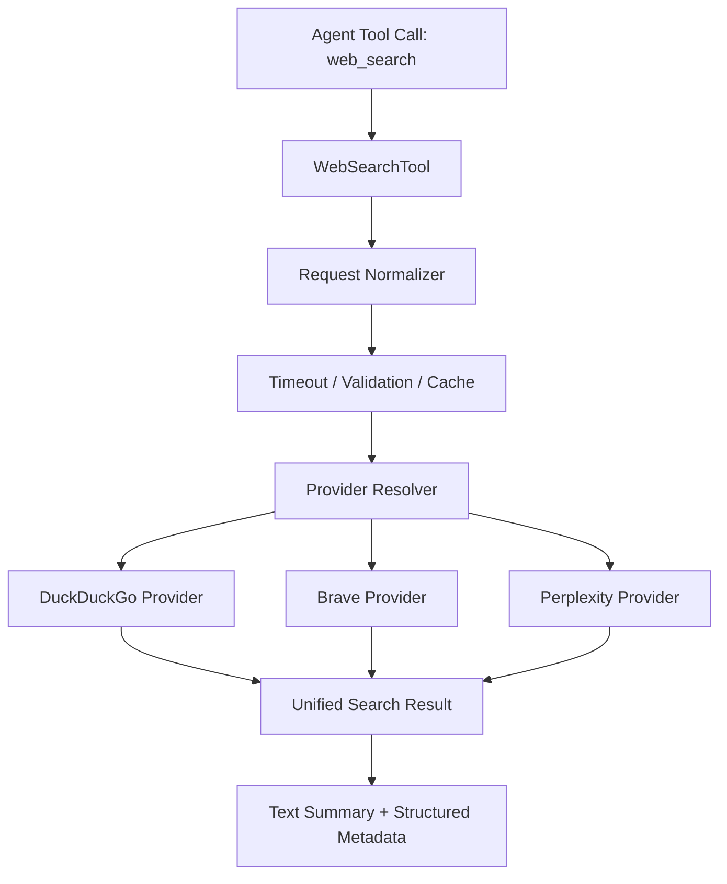

# Web Search 增强方案设计

## 1. 背景

当前 NanoBot.Net 的 `web_search` 工具具备以下特点：

- 基于 DuckDuckGo，默认零配置可用
- 通过 `AIFunctionFactory` 直接暴露为内置工具
- 实现简单，适合快速启动和原型场景

但从 `NanoBot.Net`、`OpenCode`、`OpenClaw` 三个项目的对比来看，当前实现仍存在明显短板：

- 缺少显式参数约束与输入规范化
- 缺少超时控制与取消机制
- 缺少缓存，重复查询成本较高
- 缺少结构化响应，不利于模型稳定消费
- 缺少多搜索提供商扩展能力
- 缺少结构化错误模型与配置化策略

因此，`web_search` 的增强目标不是简单复制 OpenClaw 或 OpenCode 的复杂实现，而是在保持 NanoBot.Net “默认可用、实现简洁、易于集成”优势的前提下，逐步补齐生产可用性能力。

---

## 2. 设计目标

### 2.1 总体目标

为 NanoBot.Net 构建一个 **分层增强、默认兼容、可渐进演进** 的 `web_search` 方案。

### 2.2 具体目标

1. **保持零配置可用**
   - 默认仍使用 DuckDuckGo
   - 未配置 API Key 时不影响基础能力

2. **增强稳定性**
   - 引入超时、取消、结果数量限制、输入校验
   - 避免工具长时间阻塞或返回不可控内容

3. **增强可维护性**
   - 将“工具定义”和“搜索提供商实现”解耦
   - 为后续接入 Brave、Perplexity、Exa 预留扩展点

4. **增强模型可消费性**
   - 从纯文本拼接升级为结构化响应
   - 保留摘要文本，同时附带来源、耗时、提供商等元数据

5. **增强生产可用性**
   - 引入缓存、错误分级、配置优先级和测试覆盖

---

## 3. 设计原则

### 3.1 默认简单，按需增强

默认用户无需配置即可使用 `web_search`。只有在需要更强搜索能力时，才启用额外提供商和高级参数。

### 3.2 工具接口稳定，内部实现可扩展

对 Agent 暴露的工具名仍为 `web_search`，避免影响现有提示词、工具路由和调用习惯；内部通过 Provider 抽象演进。

### 3.3 先补齐基础能力，再增加高级能力

优先顺序应为：

1. 参数校验
2. 超时控制
3. 结构化结果
4. 缓存
5. 多 Provider
6. 高级过滤参数

### 3.4 面向失败设计

网络搜索天然存在超时、限流、空结果、提供商异常等问题，因此必须提供明确的失败语义，而不是仅返回字符串错误。

---

## 4. 推荐增强方向

## 4.1 第一阶段：基础可靠性增强

这是最值得立即实施的一层，改动成本低，收益最高。

### 建议内容

- 为 `query` 增加空值、空白、长度上限校验
- 为 `maxResults` 增加最小值和最大值约束
- 引入 `CancellationTokenSource` 超时控制
- 区分超时错误、网络错误、解析错误
- 对搜索词、结果数量进行规范化处理

### 预期收益

- 降低工具异常率
- 避免长时间阻塞 Agent 回合
- 让模型获得更稳定的错误反馈

### 建议默认值

- 默认超时：`15s` 到 `30s`
- 默认结果数：`5`
- 最大结果数：`10`

---

## 4.2 第二阶段：结构化响应增强

当前纯文本拼接虽然简单，但不利于上层 Agent 做稳定消费、裁剪和追踪。

### 建议响应模型

`web_search` 内部应统一产出结构化对象，再根据调用场景决定是否序列化为文本。

建议包含以下字段：

- `query`
- `provider`
- `count`
- `tookMs`
- `results`
  - `title`
  - `url`
  - `snippet`
  - `siteName`
  - `publishedAt`
- `summaryText`

### 输出策略建议

- **对模型展示**：保留简洁可读文本摘要
- **对系统内部**：保留结构化字段，便于日志、测试、缓存和后续 UI 展示

### 预期收益

- 提高搜索结果的一致性
- 为后续接入不同 Provider 提供统一适配层
- 便于后续做结果重排、引用展示和性能分析

---

## 4.3 第三阶段：缓存机制增强

对比项目中，OpenClaw 的本地缓存是最值得 NanoBot.Net 借鉴的能力之一。

### 建议方案

优先使用 .NET 原生能力，例如：

- `IMemoryCache`：单机场景，实施成本最低
- 后续如有需要再扩展为分布式缓存

### 缓存键建议

缓存键应包含影响结果的核心参数：

- `provider`
- `query`
- `maxResults`
- `country`
- `searchLanguage`
- `freshness`

### TTL 建议

- 默认 TTL：`5min` 到 `15min`
- 对时效性强的查询可缩短 TTL
- 对相同查询高频命中场景可显著减少外部请求

### 预期收益

- 降低重复查询成本
- 改善响应延迟
- 提高在第三方搜索服务不稳定时的韧性

---

## 4.4 第四阶段：Provider 抽象与多引擎支持

这是中期最关键的架构升级。

### 当前问题

目前 `web_search` 逻辑直接内嵌在工具层，导致以下问题：

- Provider 切换困难
- 配置扩展不自然
- 测试粒度偏粗
- 无法根据场景选择不同搜索能力

### 建议抽象

建议将工具层与搜索实现拆分为两层：

1. **Tool 层**
   - 负责参数接收、默认值处理、结果包装
   - 保持 `AIFunctionFactory.Create()` 方式不变

2. **Provider 层**
   - 负责具体搜索引擎调用
   - 统一返回标准化搜索结果

### 建议接口草案

```csharp
public interface IWebSearchProvider
{
    string Name { get; }
    Task<WebSearchResult> SearchAsync(WebSearchRequest request, CancellationToken cancellationToken = default);
}
```

```csharp
public sealed class WebSearchRequest
{
    public string Query { get; set; } = string.Empty;
    public int MaxResults { get; set; } = 5;
    public string? Country { get; set; }
    public string? SearchLanguage { get; set; }
    public string? UiLanguage { get; set; }
    public string? Freshness { get; set; }
    public string? Provider { get; set; }
}
```

### Provider 优先级建议

1. 显式配置的 Provider
2. 根据可用 API Key 自动选择高级 Provider
3. 回退到 DuckDuckGo

### 推荐支持顺序

1. `DuckDuckGo`：默认保底
2. `Brave Search`：增强网页检索和过滤能力
3. `Perplexity`：增强答案合成与引用能力

### 预期收益

- 兼顾零配置与高级能力
- 降低未来接入新 Provider 的成本
- 让 `web_search` 从“单实现工具”升级为“搜索能力入口” 

---

## 4.5 第五阶段：高级搜索参数增强

OpenClaw 在搜索过滤维度上更完整，这部分很适合作为 NanoBot.Net 的可选增强项。

### 推荐新增参数

- `country`
- `searchLanguage`
- `uiLanguage`
- `freshness`
- `provider`

### 参数策略建议

- 不是所有 Provider 都支持所有参数
- Tool 层接收统一参数
- Provider 层自行判断支持情况
- 对不支持的参数采用以下策略之一：
  - 忽略并记录日志
  - 返回明确提示
  - 在严格模式下抛出参数不支持错误

### 兼容性建议

为了避免破坏当前体验，新增参数应全部为可选项。

---

## 4.6 第六阶段：结构化错误模型

当前返回 `Error searching web: ...` 的方式对模型和调用方都不够友好。

### 建议错误分类

- `timeout`
- `network_error`
- `provider_error`
- `invalid_argument`
- `unauthorized`
- `rate_limited`
- `empty_result`

### 建议错误载荷

```json
{
  "error": "timeout",
  "message": "Web search request timed out.",
  "provider": "duckduckgo",
  "retryable": true
}
```

### 预期收益

- 便于模型判断是否重试
- 便于前端或调用链做更细粒度处理
- 便于日志聚合和问题定位

---

## 5. 推荐目标架构



### 分层职责

- **WebSearchTool**
  - 对外暴露统一工具
  - 保持当前工具注册方式不变

- **Request Normalizer**
  - 默认值填充
  - 参数裁剪与格式规范化

- **Timeout / Validation / Cache**
  - 横切能力统一收口

- **Provider Resolver**
  - 根据配置与运行时参数选择引擎

- **Provider Implementations**
  - 负责调用外部搜索 API 并做响应映射

---

## 6. 配置设计建议

建议将配置收敛到 `WebToolsConfig` 中，并支持分层优先级。

### 建议配置项

- `DefaultProvider`
- `TimeoutSeconds`
- `DefaultMaxResults`
- `MaxAllowedResults`
- `EnableCache`
- `CacheTtlSeconds`
- `BraveApiKey`
- `PerplexityApiKey`
- `AllowProviderFallback`

### 配置优先级

1. 运行时参数
2. 应用配置文件
3. 环境变量
4. 内置默认值

### 配置原则

- 默认值必须可直接运行
- API Key 只用于增强能力，不应成为基础能力前置条件

---

## 7. 实施路线建议

### Phase 1：低风险增强

目标：不改变外部工具名和基本使用方式。

实施内容：

- 参数校验
- 超时控制
- 结构化错误
- 基础结果对象

### Phase 2：性能与可观测性增强

实施内容：

- `IMemoryCache`
- `tookMs`
- Provider 名称透出
- 更完善的日志字段

### Phase 3：架构解耦

实施内容：

- 提取 `IWebSearchProvider`
- 增加 `DuckDuckGoProvider`
- 增加 `ProviderResolver`

### Phase 4：高级能力接入

实施内容：

- Brave Search Provider
- Perplexity Provider
- 地区/语言/时效性过滤

### Phase 5：面向生产场景完善

实施内容：

- 更细粒度缓存策略
- 限流与重试策略
- 集成测试与契约测试扩展

---

## 8. 测试建议

对比结果表明，NanoBot.Net 当前更偏向集成测试，后续应补充更细粒度覆盖。

### 推荐测试层次

1. **请求规范化测试**
   - 空 query
   - 过长 query
   - 非法 `maxResults`

2. **Provider 单元测试**
   - 正常结果映射
   - 外部接口异常映射
   - 空结果处理

3. **缓存测试**
   - 相同参数命中缓存
   - 参数变化时缓存失效
   - TTL 到期后重新请求

4. **工具集成测试**
   - 默认 DuckDuckGo 路径
   - 指定 Provider 路径
   - 超时路径
   - Provider 回退路径

---

## 9. 最终建议

结合当前项目定位，`web_search` 的最佳增强策略不是一次性做成“复杂搜索平台”，而是采用以下路线：

### 建议结论

- **短期**：优先补齐参数校验、超时、结构化响应、错误模型
- **中期**：引入缓存与 Provider 抽象
- **长期**：接入 Brave / Perplexity，形成“零配置保底 + 高级 Provider 增强”的双层能力模型

### 核心判断

NanoBot.Net 最有价值的竞争力不是“功能最多”，而是：

- 默认可用
- 接入简单
- 架构清晰
- 能逐步演进到生产级

因此，`web_search` 的优化方向应当定义为：

> **以 DuckDuckGo 保持开箱即用，以 Provider 抽象承接高级能力，以结构化结果和可靠性机制支撑生产可用性。**

---

## 10. 推荐落地项

如果只选择一批最值得优先落地的改进，建议按以下顺序推进：

1. 为 `web_search` 增加参数校验与超时控制
2. 将返回结果升级为统一结构化模型
3. 引入 `IMemoryCache` 缓存重复查询
4. 提取 `IWebSearchProvider`，将 DuckDuckGo 实现从工具层拆出
5. 增加 Brave Provider 作为首个高级搜索后端

---

*返回 [工具层设计](./Tools.md)*
